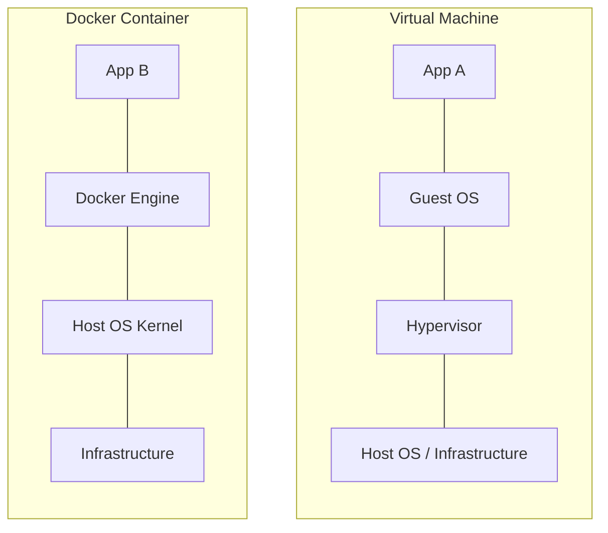
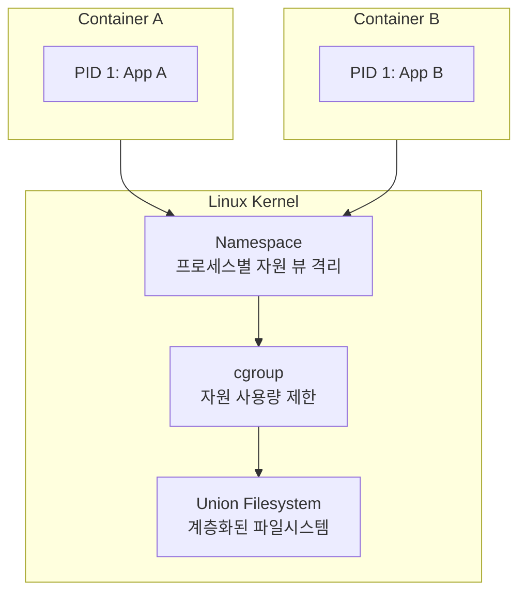

도커는 인프라 환경에 구애받지 않고 일관된 실행 환경을 보장하는 것을 목적으로, 애플리케이션을 컨테이너라는 표준화된 유닛으로 패키징하여 개발, 배포, 실행을 자동화하는 오픈소스 플랫폼이다.

## 도커가 해결하는 핵심 문제

소프트웨어 배포 과정에서 발생하는 다양한 환경적 제약 사항을 해결하고 있다.

- 개발, 테스트, 운영 서버 간의 라이브러리 버전 및 OS 설정 차이로 발생하는 환경 불일치 문제를 통합 패키징을 통해 해소
- 애플리케이션과 그 실행 환경을 이미지화하여 인프라 구축 시간을 단축하고 서비스의 신속한 스케일 아웃 지원
- 각 서비스를 독립적인 컨테이너로 분리하여 마이크로서비스 아키텍처(MSA)를 구현하고 관리하는 데 최적화된 구조 제공

## 컨테이너와 가상 머신의 비교

가상화의 주체가 무엇인지에 따라 컨테이너와 가상 머신(VM)은 구조적 차이를 보인다.

```mermaid
flowchart TD
    subgraph VM_Structure [Virtual Machine]
        direction TB
        App1[App A] --- GuestOS[Guest OS]
        GuestOS --- Hypervisor[Hypervisor]
        Hypervisor --- HostOS1[Host OS / Infrastructure]
    end

    subgraph Container_Structure [Docker Container]
        direction TB
        App2[App B] --- DockerEngine[Docker Engine]
        DockerEngine --- HostKernel[Host OS Kernel]
        HostKernel --- Infrastructure[Infrastructure]
    end

```

### 기술적 차이 및 영향

가상 머신과 컨테이너의 기술적 차이는 인프라의 효율성과 운영 방식에 직접적인 영향을 미친다.

| 비교 항목  |     가상 머신(VM)     |  도커 컨테이너(Container)   |
|:------:|:-----------------:|:---------------------:|
| 가상화 수준 |  하드웨어 수준(HW 가상화)  |    운영체제 수준(OS 가상화)    |
| 커널 공유  | 독립적인 게스트 OS 커널 사용 |     호스트 OS 커널 공유      |
| 자원 효율  | OS 실행을 위한 오버헤드 큼  | 필요한 프로세스만 실행하여 매우 효율적 |
| 시작 속도  |    OS 부팅 시간 필요    |      프로세스 시작 시간       |
|  보안 성  |  하드웨어 격리로 보안성 높음  |  커널 공유로 인해 보안 설정 필요   |

- 아키텍처 구조적 차이
    - 가상 머신은 각 VM마다 커널을 포함한 전체 OS를 실행해야 하므로 시스템 오버헤드가 크고 부팅 속도가 느림
    - 컨테이너는 커널을 공유하기 때문에 별도의 OS 부팅 과정이 없으며 실행 속도가 수 초 내외로 매우 빠름
    - 컨테이너는 게스트 OS 라이브러리가 제외되어 용량이 작고 리소스 할당이 유연하여 고밀도 배포에 유리
- 격리 수준 및 보안 성능
    - 가상 머신은 하드웨어 수준에서 격리되므로 하나의 VM이 침해당해도 다른 VM이나 호스트에 미치는 영향이 적어 보안성이 상대적으로 높음
    - 컨테이너는 OS 커널을 공유하기 때문에 커널 취약점을 통한 권한 탈취 발생 시 호스트 전체에 위협이 될 수 있어 보안 설정 필요

## 컨테이너가 VM 없이 격리를 달성하는 원리

가상 머신은 하드웨어를 에뮬레이션하고 그 위에 게스트 OS 전체를 부팅하여 격리를 달성하지만, 컨테이너는 Linux 커널이 이미 제공하는 격리 기능을 직접 활용하기 때문에 별도의 OS가 필요하지 않다.

```mermaid
flowchart TD
    subgraph Kernel ["Linux Kernel"]
        direction TB
        NS["Namespace\n프로세스별 자원 뷰 격리"]
        CG["cgroup\n자원 사용량 제한"]
        UFS["Union Filesystem\n계층화된 파일시스템"]
    end

    subgraph ContainerA ["Container A"]
        direction TB
        PA["PID 1: App A"]
    end

    subgraph ContainerB ["Container B"]
        direction TB
        PB["PID 1: App B"]
    end

    ContainerA --> NS
    ContainerB --> NS
    NS --> CG
    CG --> UFS
```

### Namespace - 프로세스별 자원 뷰 격리

namespace는 커널 자원을 프로세스 단위로 분리하여, 각 컨테이너가 독립된 시스템 위에서 실행되는 것처럼 보이게 하는 커널 기능이다.

- 각 컨테이너는 자신만의 PID 트리, 네트워크 스택, 마운트 포인트 등을 가지며, 다른 컨테이너의 자원은 보이지 않음
- VM이 하드웨어 수준에서 격리하는 것과 달리, namespace는 동일 커널 위에서 논리적으로 뷰를 분리하여 격리를 달성

| namespace |       격리 대상        |                   효과                   |
|:---------:|:------------------:|:--------------------------------------:|
|    PID    |      프로세스 ID       | 컨테이너 내부에서 PID 1부터 시작하는 독립적인 프로세스 트리 구성 |
|  Network  | 네트워크 인터페이스, IP, 포트 |       컨테이너별 독립적인 IP 주소와 포트 공간 할당       |
|   Mount   |   파일시스템 마운트 포인트    |         컨테이너별 독립적인 파일시스템 트리 구성         |
|    UTS    |     호스트명, 도메인명     |           컨테이너별 고유한 호스트명 설정            |
|    IPC    |    프로세스 간 통신 자원    |       공유 메모리, 세마포어 등 IPC 자원의 격리        |
|   User    |     사용자/그룹 ID      |    컨테이너 내부의 root를 호스트의 비특권 사용자로 매핑     |

### cgroup - 자원 사용량 제한

cgroup(Control Group)은 프로세스 그룹이 사용할 수 있는 물리 자원의 상한을 설정하는 커널 기능이다.

- namespace가 "무엇이 보이는가"를 제어한다면, cgroup은 "얼마나 쓸 수 있는가"를 제어
- VM에서 게스트 OS에 CPU / 메모리를 할당하는 것과 유사한 역할을 커널 레벨에서 직접 수행

|    자원     |           제어 내용            |
|:---------:|:--------------------------:|
|    CPU    |    사용 시간 비율 또는 코어 수 제한     |
|  Memory   | 최대 메모리 사용량 제한, 초과 시 OOM 발생 |
| Block I/O |      디스크 읽기/쓰기 대역폭 제한      |
|  Network  |      네트워크 대역폭 우선순위 설정      |

### Union Filesystem - 계층화된 파일시스템

컨테이너는 Union Filesystem(OverlayFS 등)을 통해 이미지 레이어를 읽기 전용으로 공유하고, 컨테이너별 변경 사항만 별도의 쓰기 레이어에 기록한다.

- VM이 게스트 OS마다 독립된 가상 디스크를 할당하는 것과 달리, 동일 이미지를 사용하는 컨테이너는 읽기 전용 레이어를 공유하여 디스크 사용량을 절감
- 컨테이너 삭제 시 쓰기 레이어만 제거되므로 원본 이미지는 영향을 받지 않음

### VM과의 격리 메커니즘 비교

위 기능들의 조합으로 컨테이너는 게스트 OS 없이도 VM 수준에 근접한 격리를 달성한다.

| 격리 영역  |        VM 방식        |            컨테이너 방식            |
|:------:|:-------------------:|:-----------------------------:|
|  프로세스  |  게스트 OS가 독립적으로 관리   |   PID namespace로 프로세스 트리 분리   |
|  네트워크  |   가상 NIC + 가상 스위치   | Network namespace + veth pair |
| 파일시스템  | 가상 디스크(VMDK, qcow2) |  Mount namespace + OverlayFS  |
| 자원 제한  | 하이퍼바이저가 CPU·메모리 할당  |     cgroup이 커널 레벨에서 직접 제한     |
| 사용자 권한 | 게스트 OS의 독립된 사용자 체계  |  User namespace로 UID/GID 매핑   |
