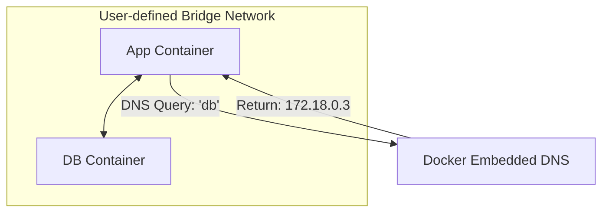

도커 네트워킹은 격리된 컨테이너들이 서로 통신하거나 외부 세계와 연결될 수 있도록 지원하는 메커니즘으로, 도커는 드라이버 기반의 네트워크 모델을 사용하여 다양한 환경에 맞는 통신 방식을 제공한다.

## 컨테이너 네트워크 모델

도커 네트워킹의 추상화된 설계 구조로, 인프라와 상관없이 동일한 네트워크 환경을 제공하기 위해 세 가지 구성 요소를 정의한다.

- Sandbox: 컨테이너 내부의 네트워크 설정(IP 주소, 라우팅 테이블 등)이 담긴 격리된 영역
- Endpoint: Sandbox와 네트워크를 연결하는 지점으로, 일반적인 네트워크의 VETH(Virtual Ethernet) 인터페이스와 유사
- Network: 서로 통신할 수 있는 Endpoint들의 논리적 집합

## 기본 네트워크 드라이버 종류

도커 설치 시 기본적으로 제공되는 드라이버들은 목적에 따라 컨테이너의 통신 범위를 결정한다.

### bridge(기본 설정)

- 컨테이너 생성 시 드라이버를 지정하지 않으면 적용되는 기본 모드
- 호스트의 `docker0`라는 가상 브리지를 통해 컨테이너끼리 연결되며, 각 컨테이너는 고유한 사설 IP를 할당받음
- 외부 환경과 통신하려면 NAT(Network Address Translation) 기술을 이용한 포트 포워딩(`-p`) 필수

### host

- 컨테이너가 호스트의 네트워크 환경을 공유하여 격리 없이 직접 통신하는 방식
- 별도의 IP 할당이나 포트 포워딩 없이 호스트의 포트를 그대로 사용하므로 네트워크 오버헤드가 거의 없음
- 특정 포트를 점유하므로 동일한 포트를 쓰는 컨테이너를 여러 개 띄울 경우 포트 충돌 발생

### none

- 네트워크 인터페이스를 아예 생성하지 않는 방식(루프백 인터페이스만 존재)
- 외부와의 연결을 완벽히 차단해야 하는 보안 작업이나 오프라인 계산 작업에 사용

### overlay

- 서로 다른 물리적 호스트에 존재하는 컨테이너들을 하나의 가상 네트워크로 묶어주는 방식
- 도커 스웜(Swarm) 모드에서 필수적으로 사용되며, 멀티 호스트 환경에서의 서비스 통신을 가능하게 함

## 사용자 정의 네트워크(User-defined Networks)

기본 `bridge` 네트워크의 한계를 극복하기 위해 실무에서는 직접 네트워크를 생성하여 사용하는 방식이 권장된다.

### 주요 장점 및 차별점

- 자동 DNS 해석: 기본 브리지와 달리 컨테이너 이름을 호스트 이름으로 사용하여 IP 주소 없이도 서로 통신 가능
- 네트워크 격리: 서로 다른 사용자 정의 네트워크에 소속된 컨테이너들은 논리적으로 완전히 분리되어 보안성 강화
- 유연성: 컨테이너 실행 중에도 특정 네트워크에 연결하거나 연결을 끊는 작업이 동적으로 가능
