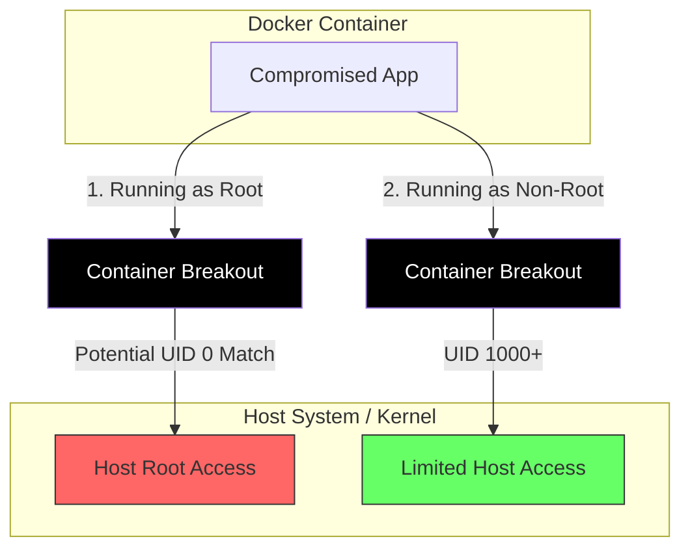

도커는 이미지 빌드부터 컨테이너 실행, 데이터 관리 전 과정에 걸쳐 시스템의 공격 표면을 최소화하는 것이 중요하다.

## 이미지 취약점 스캔(Image Scanning)

이미지에 포함된 OS 패키지나 애플리케이션 라이브러리에 존재하는 알려진 보안 취약점(CVE)을 사전에 탐지하여 침해 사고를 예방한다.

- 베이스 이미지의 레이어를 분석하여 설치된 패키지 버전을 식별하고 보안 데이터베이스와 대조 수행
- CI/CD 파이프라인의 빌드 단계에서 스캔 과정을 자동화하여 취약점이 발견된 이미지의 배포를 원천 차단
- 주요 도구: Trivy(오픈소스), Snyk(개발자 중심 플랫폼), Docker Scout(도커 기본 제공 도구) 등

## non-root 사용자로 컨테이너 실행

최소 권한 원칙(Principle of Least Privilege)에 따라 컨테이너 내부 프로세스가 호스트 시스템에 미칠 수 있는 영향력을 제한한다.

- 컨테이너 내부에서 root 사용자로 프로세스를 실행할 경우, 호스트 운영체제의 루트 권한을 탈취당할 위험이 존재
- Dockerfile 내부에서 `USER` 명령어를 명시하여 일반 사용자 계정으로 애플리케이션이 구동되도록 설정

### 보안 위협과 격리 원리

도커 컨테이너는 별도의 설정이 없으면 내부 프로세스를 root(UID 0) 권한으로 구동하며, 이 권한이 호스트 OS에 미치는 실질적인 영향은 커널의 격리 및 매핑 정책에 따라 결정된다.

- 권한 식별의 동일성: 컨테이너는 호스트의 커널을 공유하므로 내부의 root(UID 0)는 호스트 커널에서도 최상위 관리자 권한으로 인식되며, 호스트 자원에 직접 접근할 수 있는 보안 취약점 발생
- 구조적 격리 한계: 네임스페이스를 통해 자원을 논리적으로 분리하더라도 컨테이너 탈출(Escape) 사고 위험 존재
- 사용자 네임스페이스 해결책: 이를 방지하기 위해 사용자 네임스페이스를 활성화하여 컨테이너의 root를 호스트의 권한 없는 일반 사용자 UID로 매핑하여, 탈출 시에도 호스트 관리자 권한 획득 방지

- 컨테이너 탈출(Container Escape): 애플리케이션의 취약점을 통해 컨테이너 외부인 호스트 환경에 접근하는 공격 방식
- 루트 실행의 위험성: 공격자가 컨테이너 탈출에 성공했을 때, 컨테이너가 루트로 구동 중이었다면 호스트 운영체제의 제어권에 접근할 위험 존재
- 권한 제한의 효과: 일반 사용자(non-root)로 구동 중인 경우, 탈출에 성공하더라도 호스트 내에서 제한된 권한만 가지게 되어 2차 피해를 최소화 가능

## 시크릿(Secret) 관리

DB 비밀번호, API 키 등 민감 정보가 이미지 레이어나 환경 변수에 평문으로 노출되지 않도록 관리한다.

- 환경 변수(ENV)의 위험성: `docker inspect` 명령어나 `/proc` 파일 시스템 조회를 통해 민감 정보가 쉽게 노출될 수 있음
- Docker Secrets: 시크릿 데이터를 암호화하여 관리하며, 필요한 컨테이너의 `/run/secrets/` 경로에 메모리 기반(tmpfs) 파일 형태로 임시 마운트하여 제공
- 외부 전문 솔루션: HashiCorp Vault, AWS Secrets Manager 등 전문 관리 도구를 연동하여 런타임에 민감 정보를 동적으로 주입받는 방식을 권장

## 보안 체크리스트

운영 환경 배포 전 면접이나 실무에서 반드시 점검해야 할 보안 요소들은 다음과 같다.

- 읽기 전용 파일 시스템: `--read-only` 옵션을 사용하여 컨테이너 실행 중 파일 시스템 변조를 원천 차단
- 리소스 제한: 특정 컨테이너가 호스트의 자원을 독점하여 시스템을 마비시키는 것을 방지하기 위해 CPU 및 메모리 할당량 제한(Resource Limit) 설정
- 신뢰할 수 있는 이미지 사용: Docker Content Trust(DCT)를 활성화하여 디지털 서명이 완료된 검증된 이미지만 배포
