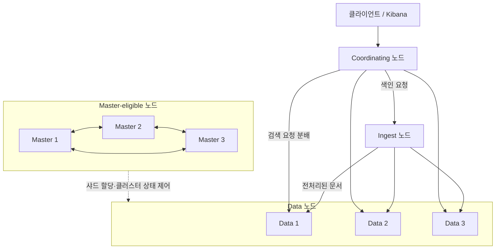
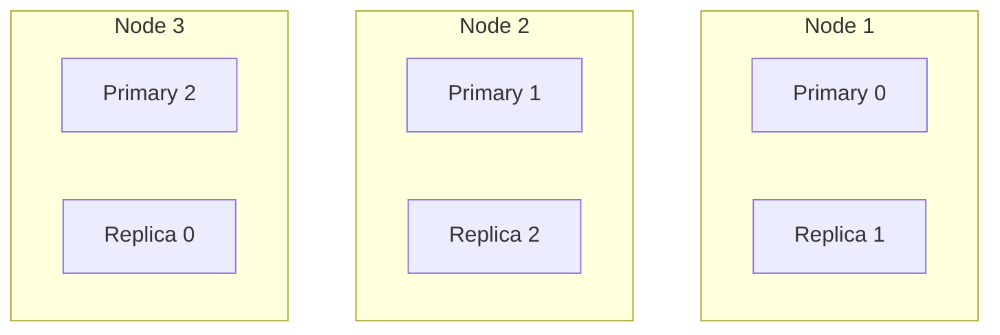

Elasticsearch 클러스터는 여러 노드가 네트워크로 묶여 데이터와 메타데이터를 공유하는 논리적 단위이며, 데이터가 어떻게 분산·복제되는지를 그려둬야 인덱스 설계와 장애 진단을 풀어나갈 수 있다.

## Cluster와 Node

클러스터는 논리적 그룹, 노드는 그 안에서 실제 데이터를 처리하는 프로세스 인스턴스다.

- Cluster: 동일한 `cluster.name`을 공유하는 노드 집합, 고유 이름으로 식별
- Node: 실행 중인 Elasticsearch 프로세스 하나이며 `node.name`으로 구별
- Cluster State: 인덱스·매핑·샤드 할당 정보 등 전역 메타데이터로, Master 노드만 변경 권한 보유
- 노드 탐색: `discovery.seed_hosts`로 초기 시드 노드를 지정하고 `cluster.initial_master_nodes`로 최초 부트스트랩 수행

## Node 역할

노드의 책임은 `elasticsearch.yml`의 `node.roles` 설정으로 결정되며, 하나의 노드가 여러 역할을 겸할 수 있다.

|      역할      |                책임                |
|:------------:|:--------------------------------:|
|    master    |    클러스터 상태 관리·샤드 할당·노드 추가/제거     |
|     data     |      문서 색인·검색·집계 수행, 샤드 보관       |
|    ingest    |     색인 전 Ingest Pipeline 실행      |
| coordinating | 클라이언트 요청 라우팅과 결과 병합(모든 노드 기본 수행) |

### Master Node

클러스터 상태를 변경할 수 있는 유일한 주체로, 스택의 두뇌 역할을 담당한다.

- 인덱스 생성·삭제, 매핑 변경, 샤드 할당 같은 메타데이터 작업 수행
- `node.roles`에 `master`를 가진 노드만 Master 후보(master-eligible)
- 보통 3개의 Master 전용 노드를 두어 장애 상황에서도 과반수 투표 가능하도록 구성

### Data Node

실제 문서를 저장하고 검색·집계 부하를 담당하는 노드로, CPU·메모리·디스크 I/O 자원의 대부분을 소비한다.

- CRUD·검색·집계 요청이 실행되는 계층
- Data 역할은 부하가 크므로 Master와 겸하지 않는 전용 구성이 권장
- Master-eligible 노드는 서로 다른 호스트·랙·AZ에 분산 배치해 단일 물리 장애로 과반수를 잃지 않도록 확보

### Coordinating Node

클라이언트 요청을 받아 적절한 샤드로 라우팅하고 결과를 병합해 반환하는 계층이다.

- 모든 노드가 기본적으로 coordinating 동작을 수행하므로 별도 role 값은 존재하지 않음
- `node.roles: []`로 설정하면 Coordinating 전용 노드가 되어 API 게이트웨이 역할 수행
- 대규모 집계·검색 결과 병합이 많다면 전용 노드로 분리해 Data Node 부담 경감

### Ingest Node

색인 전에 문서를 변환하는 Ingest Pipeline을 실행하는 노드다.

- `grok`, `date`, `rename`, `set` 등 프로세서로 가벼운 변환을 Elasticsearch 내부에서 처리
- Logstash 없이도 기본 파싱이 가능하므로 Beats → Ingest Node 구성이 일반화됨
- 멀티라인 스택트레이스·복잡한 정규식은 여전히 Logstash가 우세

### 노드 간 관계도

각 역할의 노드가 하나의 요청을 어떻게 협업해 처리하는지 흐름으로 정리하면 다음과 같다.

- 클라이언트 요청은 Coordinating 노드가 수신해 목적(색인·검색)에 따라 라우팅 담당
- 색인 요청은 Ingest 노드의 파이프라인 처리 후 라우팅 수식에 맞는 Data 노드로 전달
- 검색 요청은 관련 샤드를 가진 Data 노드들에 분배되고 Coordinating 노드가 결과를 병합해 응답
- Master-eligible 노드는 서로 과반수 합의로 Master를 유지하며 Data 노드의 샤드 할당과 클러스터 상태를 제어
- 데이터 경로(Coordinating ↔ Data)와 제어 경로(Master → Data)가 분리되어 있어 각 계층을 독립적으로 스케일 아웃 가능

## Shard와 Replica

Elasticsearch는 인덱스를 여러 샤드로 쪼개 노드에 분산 저장하고, 각 샤드를 복제(Replica)해 고가용성을 확보한다.

### Primary Shard

문서가 처음 색인되는 원본 샤드로, 인덱스 생성 시 `number_of_shards`로 개수가 확정된다.

- 문서 라우팅 수식: `shard_id = hash(_routing) % number_of_shards` (기본 `_routing = _id`)
- 한 번 지정된 Primary 개수는 변경 불가이며 조정하려면 `_split`·`_shrink`·`_reindex` 중 하나 필요
- 샤드가 너무 많으면 오버헤드, 너무 적으면 스케일 아웃 제약이 생기므로 데이터량·노드 수 기반 설계가 필수

### Replica Shard

Primary Shard의 복제본으로, 장애 복구와 읽기 부하 분산을 담당한다.

- `number_of_replicas`로 개수 지정하며 런타임에 변경 가능
- Primary와 동일 노드에는 배치되지 않아 단일 노드 장애 시에도 데이터 유실 방지
- 검색 요청은 Primary와 Replica 중 하나에서 처리되므로 읽기 스케일 아웃 효과 확보

### 샤드 배치 예시

샤드 3개·복제본 1개로 구성된 인덱스에서 각 Primary와 Replica는 서로 다른 노드에 배치되어 단일 노드 장애에도 데이터 접근이 유지된다.

## Cluster Health

클러스터 상태는 샤드 할당 현황에 따라 Green/Yellow/Red 세 단계로 표현된다.

|   상태   |              의미               |      발생 원인 예시       |
|:------:|:-----------------------------:|:-------------------:|
| Green  |   모든 Primary와 Replica 정상 할당   |      정상 운영 상태       |
| Yellow | Primary는 정상이지만 일부 Replica 미할당 | 단일 노드 구성, 노드 재기동 중  |
|  Red   |        일부 Primary가 미할당        | 디스크 장애, 필수 노드 영구 소실 |

장애 진단 시 다음 순서로 원인 범위를 좁히는 흐름이 일반적이다.

- `GET _cluster/health`로 전체 상태 확인
- `GET _cat/shards?v`로 문제 샤드 특정
- `GET _cluster/allocation/explain`로 할당 실패 원인 조회
