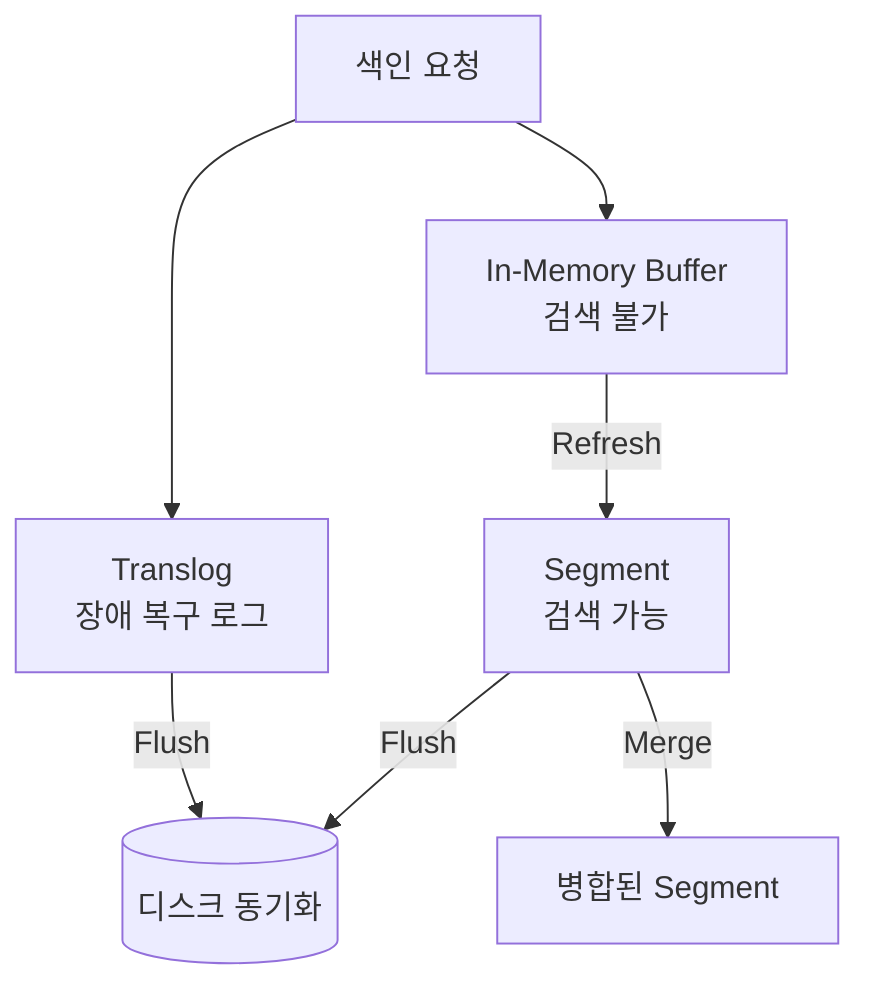

Elasticsearch는 RDB와 달리 행·열 단위의 고정된 테이블이 아니라 JSON 문서를 추가하는 방식으로 저장한다.

## Index·Document·Field 데이터 모델

ES의 저장 단위는 Index > Document > Field 3단 계층이며, 물리적으로는 Index가 다시 Shard(Lucene Segment의 모음)로 쪼개진다.

|    계층    |              설명              | RDB 비유 |
|:--------:|:----------------------------:|:------:|
|  Index   | 동일한 매핑을 공유하는 문서 집합, 샤드 분산 단위 | Table  |
| Document |   하나의 JSON 객체, 검색·색인 최소 단위   |  Row   |
|  Field   | 문서의 key-value 쌍, 매핑상의 타입 보유  | Column |

- Index 이름은 소문자와 `-`·`_`만 허용되며 날짜 패턴(`logs-2026.04`)이나 Data Stream 뒷단 인덱스로 주로 사용
- Document는 스키마리스처럼 보이지만 최초 색인 시 Dynamic Mapping으로 타입이 자동 고정되므로 사실상 스키마 존재
- Field는 한 값이 여러 타입으로 동시 색인 가능 (`text` + `keyword` multi-field)

### Document 예시

ES에 저장되는 문서는 REST로 보낸 JSON 본문이 그대로가 아니라 메타필드와 함께 관리된다.

```json
PUT /products/_doc/1
{
  "name": "Mechanical Keyboard",
  "price": 129000,
  "tags": [
    "keyboard",
    "mechanical"
  ],
  "created_at": "2026-04-17T09:00:00Z"
}
```

위 요청 후 `GET /products/_doc/1`로 조회하면 다음과 같이 메타필드가 덧붙어 반환된다.

```json
{
  "_index": "products",
  "_id": "1",
  "_version": 1,
  "_seq_no": 0,
  "_primary_term": 1,
  "found": true,
  "_source": {
    "name": "Mechanical Keyboard",
    "price": 129000,
    "tags": [
      "keyboard",
      "mechanical"
    ],
    "created_at": "2026-04-17T09:00:00Z"
  }
}
```

## 메타필드

문서에 붙는 `_`로 시작하는 필드들은 검색·버저닝·라우팅을 위해 ES가 내부적으로 관리한다.

|       필드        |           역할            |
|:---------------:|:-----------------------:|
|    `_index`     |      문서가 속한 인덱스 이름      |
|      `_id`      |      인덱스 내 고유 식별자       |
|    `_source`    | 원본 JSON 본문 (Disable 가능) |
|   `_version`    |    문서 수정 횟수 (1부터 증가)    |
|    `_seq_no`    | Primary Shard 기준 순차 번호  |
| `_primary_term` |    Primary 교체 세대 번호     |
|   `_routing`    |  샤드 라우팅 키 (기본값 `_id`)   |

### `_id`

문서를 유일하게 식별하는 키로, 생략하면 ES가 자동 생성한다.

- `PUT /<index>/_doc/<id>`로 직접 지정 가능하며 지정 시 덮어쓰기
- `POST /<index>/_doc` 사용 시 Base64-encoded UUID 자동 부여, 로그처럼 append-only 적재에 적합
- `_id`가 샤드 라우팅(`hash(_routing) % number_of_shards`)의 기본 키로 쓰이므로 무작위성이 높을수록 샤드 분포 균일

### `_source`

색인 시 받은 원본 JSON을 그대로 보관하는 필드로, 문서 조회·Update·Reindex의 근원이 된다.

- `_source`를 꺼두면 저장 공간은 줄지만 단건 조회·Update·Reindex·Highlight 기능이 함께 비활성
- 로그처럼 원문이 크고 불변인 경우에만 제한적으로 Disable 검토
- 일부 필드만 제외하려면 전체 Disable 대신 `includes`·`excludes` 옵션 사용이 안전

## 색인 라이프사이클

디스크 쓰기는 느리고 Lucene Segment는 한번 만들면 수정할 수 없다는 두 가지 제약이 전체 설계의 출발점이다.

- 매 요청마다 디스크에 직접 쓰면 처리량이 무너짐
- 매 요청마다 Segment를 새로 만들면 작은 파일이 폭증해 검색 성능 저하

ES는 이 제약을 피하기 위해 색인 요청을 즉시 디스크에 반영하지 않고 메모리 → Segment → 디스크 순으로 단계화한다.



### 데이터가 머무는 3단계 저장소

색인된 문서는 Buffer → Segment → 디스크 순서로 이동하며, Translog가 이 흐름의 안전망 역할을 한다.

- In-Memory Buffer: 색인 요청 직후 문서가 쌓이는 JVM 힙 내 임시 공간, 아직 검색 대상이 아님
- Translog: 디스크에 즉시 append되는 선행 로그(Write-Ahead Log)로 노드 장애 시 Buffer를 재생하기 위한 원본
- Segment: 역색인·Doc Values를 담은 Lucene의 불변 파일 단위, 이 단계부터 검색 결과에 등장

### 단계를 전환하는 3가지 이벤트

저장소 사이의 상태 전환은 Refresh·Flush·Merge 세 이벤트가 담당한다.

- Refresh: Buffer의 문서를 새 Segment로 내리는 작업(기본 1초 주기), 이 시점부터 문서가 검색 가능
- Flush: Segment와 Translog를 디스크에 fsync하여 내구성을 확정하고 Translog를 비우는 체크포인트
- Merge: 불변 Segment가 누적되는 문제를 해소하기 위해 작은 Segment를 합치고 tombstone을 정리하는 백그라운드 작업

## Update와 Delete의 실제 비용

한 번 저장된 Segment는 수정할 수 없기 때문에, ES의 수정·삭제는 파일을 고치는 대신 삭제됐다는 표시(tombstone)만 남기는 Soft Delete 방식으로 동작한다.


- Update: `_source`에서 기존 문서를 읽어 JSON 병합 후 새 문서를 색인하고 이전 문서는 tombstone 표시 (Delete + Insert와 동일 비용)
- Delete: tombstone만 표시하여 검색 결과에서 즉시 제외, 실제 공간 반환은 Merge 시점
- `_source`가 Disable된 인덱스는 Update 자체가 불가능하므로 Reindex 경로만 남음
- 갱신이 잦은 도메인 데이터는 단건 Update 반복보다 Bulk·`_update_by_query`·`_reindex`가 Refresh·Merge 부하 관점에서 유리

### 동시성 충돌 예시

이미 수정된 문서를 과거 시점 기준으로 다시 수정하려 하면 `if_seq_no` 조건 불일치로 409 Conflict가 발생한다.

```json
POST /products/_update/1?if_seq_no=0&if_primary_term=1
{
"doc": {"price": 119000}
}

# 응답
{
"error": {
"type": "version_conflict_engine_exception",
"reason": "[1]: version conflict, required seqNo [0], primary term [1]. current document has seqNo [2] and primary term [1]"
},
"status": 409
}
```

- Conflict 응답을 받은 호출자는 최신 문서를 다시 조회 → 병합 로직 재실행 → 새 `_seq_no`·`_primary_term`으로 재시도하는 Retry 루프가 표준
- 단순 Counter형 필드는 Retry 루프 대신 `retry_on_conflict` 파라미터로 ES 내부 재시도를 위임 가능
