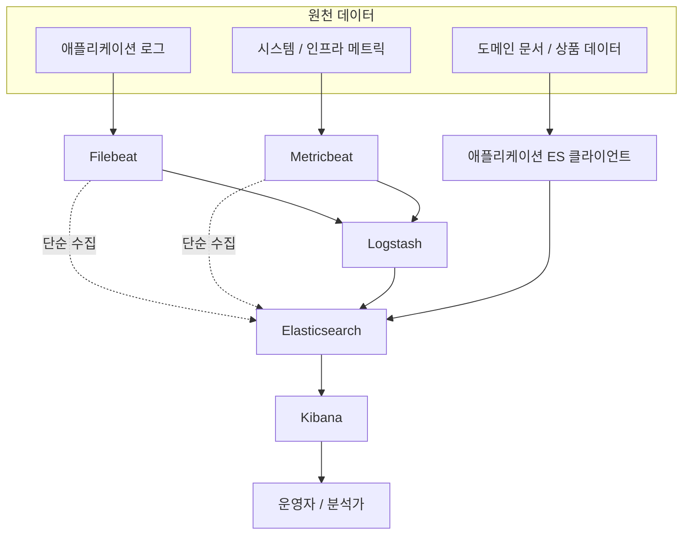

ELK는 Elasticsearch, Logstash, Kibana 세 개의 오픈소스를 묶어 부르던 명칭에서 출발했으며, 이후 경량 수집기인 Beats가 추가되면서 Elastic Stack으로 부르고 있다.

## 데이터 수집부터 시각화까지의 흐름

각 호스트에서 발생한 원천 데이터는 수집 → 전처리 → 저장·색인 → 탐색·시각화의 네 단계를 거쳐 운영자 화면에 도달한다.

각 단계에서 일어나는 일을 짧게 정리하면 다음과 같다.

- 수집(Beats): 각 호스트에 상주하는 Filebeat·Metricbeat가 파일과 메트릭을 읽어 전송 오프셋을 Registry에 기록하고 백프레셔를 처리
- 전처리(Logstash): `grok`·`date`·`mutate` 필터로 비정형 로그를 구조화 문서로 변환, 멀티라인 스택트레이스 병합 등 복잡한 파싱 담당
- 저장·색인(Elasticsearch): 분석기가 토큰화·정규화를 수행해 역색인을 구축하고 샤드 단위로 클러스터에 분산 저장
- 탐색·시각화(Kibana): KQL 검색·대시보드·Alerting을 통해 적재된 데이터를 사용자 화면과 알림으로 노출
- 우회 경로: 파싱이 단순하면 Beats가 Logstash를 거치지 않고 Elasticsearch로 직접 전송, 도메인 데이터는 애플리케이션의 ES 클라이언트가 색인에 직접 적재

## Elastic Stack의 구성 요소

Elastic Stack은 데이터의 흐름을 따라 수집(Beats·Logstash) → 저장·검색(Elasticsearch) → 시각화(Kibana)의 세 단계로 구성된다.

- Elasticsearch: Apache Lucene 기반의 분산 검색·분석 엔진으로, 역색인을 통해 대용량 데이터에 대한 전문(Full-text) 검색과 집계를 빠르게 수행
- Logstash: 다양한 입력 소스로부터 데이터를 받아 파싱·변환한 뒤 Elasticsearch 등 출력 대상으로 전송하는 서버 사이드 데이터 처리 파이프라인
- Kibana: Elasticsearch에 적재된 데이터를 탐색·시각화·대시보드화하는 웹 UI로, 운영 모니터링과 데이터 분석의 진입점 역할 수행
- Beats: 각 호스트에 설치되어 특정 종류의 데이터를 수집·전송하는 경량 에이전트 모음(Filebeat, Metricbeat 등)

## 컴포넌트별 책임 분담

같은 스택 안에서도 각 컴포넌트가 담당하는 계층이 명확히 분리되어 있어, 어떤 작업을 어디에서 처리할지 결정하는 것이 도입 설계의 출발점이다.

### Elasticsearch

저장소이자 검색 엔진으로, 스택의 단일 진실 원천(Single Source of Truth) 역할을 한다.

- 색인(Index)에 적재된 문서(Document)를 역색인(Inverted Index) 자료구조로 보관하여 텍스트 검색 최적화
- 클러스터·노드·샤드 단위로 데이터를 분산 저장하여 수평 확장과 고가용성 확보
- REST API와 Query DSL을 통해 검색·집계(Aggregation)를 동시에 제공

### Logstash

데이터 수집과 변환을 담당하는 ETL 파이프라인이다.

- Input 플러그인으로 파일·Beats·Kafka·JDBC 등 다양한 소스의 데이터 수집
- Filter 플러그인(`grok`, `mutate`, `date` 등)으로 비정형 텍스트 로그를 구조화된 필드로 변환
- Output 플러그인으로 Elasticsearch 외에도 S3·Kafka·다른 저장소로 동시에 전송 가능
- JVM 위에서 동작하기 때문에 자원 사용량이 크며, 단순 수집만 필요하면 Beats 단독 구성이 더 가벼움

### Kibana

Elasticsearch 데이터를 사람이 읽고 다루기 위한 UI 계층이다.

- Discover에서 KQL(Kibana Query Language) 기반으로 로그 탐색과 필드 필터링 수행
- Visualize·Dashboard·Lens로 시계열·집계 결과를 차트·지도 형태로 시각화
- Index Lifecycle Management(ILM), 보안, 알림(Alerting) 등 클러스터 운영 기능의 관리 콘솔 역할도 겸함

### Beats

호스트에 상주하며 특정 카테고리의 데이터를 수집해 보내는 경량 에이전트 제품군이다.

- Filebeat: 로그 파일을 추적(tail)하여 전송하며 회전된 파일 추적과 전송 위치 기록(Registry) 기능 제공
- Metricbeat: CPU·메모리·디스크 등 시스템 메트릭과 미들웨어 메트릭 수집
- Logstash 대비 자원 사용량이 매우 적어 모든 노드에 사이드카 형태로 배포 가능
- 수집한 데이터를 Logstash 또는 Elasticsearch로 직접 전송 가능

## 두 가지 대표 사용 시나리오

백엔드 개발자가 ELK를 도입하는 동기는 대부분 두 갈래 중 하나로 수렴하며, 어떤 시나리오인지에 따라 필요한 컴포넌트와 설계가 달라진다.

### 시나리오 1 - 로그 중앙화와 운영 분석

여러 서버에 흩어진 애플리케이션 로그를 한 곳에 모아 검색·시각화함으로써 장애 추적과 운영 분석의 단일 창구를 제공하는 시나리오다.

- 데이터 흐름: 애플리케이션 → 파일 로그 → Filebeat → (Logstash) → Elasticsearch → Kibana
- 데이터 특성: 시계열적이고 한 번 적재된 후 갱신되지 않는 append-only 패턴
- 핵심 관심사: 수집 안정성, 파싱 정확도(traceId·level·message 분리), 보존 기간(ILM)
- Elasticsearch 사용 패턴: 시간 범위 필터 + 키워드 검색 + 단순 집계 위주

### 시나리오 2 - 도메인 검색 엔진

상품·게시글·문서 등 비즈니스 데이터를 빠르게 검색하기 위해 RDB 보조 인덱스 또는 별도 검색 백엔드로 Elasticsearch를 사용하는 시나리오다.

- 데이터 흐름: 애플리케이션이 RDB 변경 시 ES 클라이언트 또는 CDC(Change Data Capture)로 동기화
- 데이터 특성: 갱신·삭제가 빈번하고, 정확한 매핑 설계와 분석기(Analyzer) 선택이 검색 품질을 좌우
- 핵심 관심사: 한국어 형태소 분석(nori), 동의어·오타 보정, 관련도 스코어링(BM25), 정렬·페이징 비용
- Kibana는 운영 모니터링용으로만 사용되거나 아예 사용하지 않기도 함

## 백엔드 입장에서의 컴포넌트 선택 기준

모든 컴포넌트를 항상 함께 도입할 필요는 없으며, 시나리오와 운영 비용을 기준으로 필요한 만큼만 선택하는 것이 일반적이다.

|      구분       |      로그 중앙화      | 도메인 검색 엔진 |
|:-------------:|:----------------:|:---------:|
| Elasticsearch |        필수        |    필수     |
|    Kibana     |        필수        |  선택(운영용)  |
|     Beats     | 필수(Filebeat 중심)  | 보통 사용 안 함 |
|   Logstash    | 선택(파싱 복잡도가 높을 때) | 보통 사용 안 함 |

선택 시 고려할 트레이드오프는 다음과 같다.

- Logstash 도입 여부: Filebeat의 내장 프로세서로 처리 가능한 단순 파싱이라면 Logstash를 생략하여 운영 부담 감소
    - 멀티라인 스택트레이스·복잡한 정규식·다중 출력이 필요하면 Logstash 도입
- 검색 엔진 단독 사용: 운영 모니터링 수단이 별도로 있다면 Kibana 없이 ES만 운용하는 구성도 유효
- ES를 RDB 대체로 쓰지 않기: 트랜잭션·정합성 보장이 약하므로 원본은 RDB에 두고 ES는 검색용 보조 인덱스로 사용하는 것이 안전한 기본 패턴
