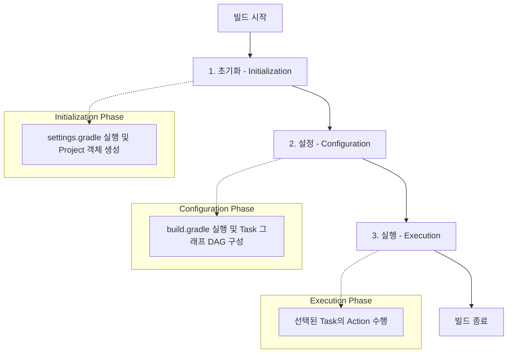

Gradle은 JVM 기반의 유연한 빌드 자동화 도구로, 단순한 스크립트 실행기가 아닌 고도로 설계된 객체 모델(Object Model)을 기반으로 동작한다.

## Gradle vs Maven

Gradle은 Maven의 정적인 XML 기반 설정을 탈피하여, 동적인 DSL(Domain Specific Language)과 유연한 객체 모델을 제공한다.

| 비교 항목  |        Maven         |                Gradle                |
|:------:|:--------------------:|:------------------------------------:|
| 설정 방식  |  고정된 XML (pom.xml)   | 유연한 Groovy/Kotlin DSL (build.gradle) |
| 빌드 성능  |      선형적 단계 실행       |        증분 빌드 및 빌드 캐시 기반 빠른 속도        |
| 의존성 해결 | 가까운 의존성 우선 (Nearest) |        가장 높은 버전 우선 (Highest)         |
| 커스터마이징 |   플러그인 개발 중심 (복잡함)   |          스크립트 내 직접 로직 구현 가능          |

- 유연성: Gradle은 빌드 스크립트 자체가 하나의 프로그램이므로, 조건문이나 루프를 활용한 복잡한 빌드 로직 처리 가능
- 성능 최적화: 데몬 프로세스를 상주시키고 변경된 파일만 다시 빌드하는 증분 빌드(Incremental Build) 방식을 통해 빠른 빌드 속도 제공

## Build Lifecycle

Gradle 빌드는 초기화, 설정, 실행의 세 가지 명확한 단계를 거치며, 각 단계는 고유한 책임과 범위를 가진다.

### 1. Initialization (초기화)

빌드에 참여하는 프로젝트를 결정하고 각 프로젝트에 대응하는 `Project` 인스턴스를 생성하는 단계이다.

- settings.gradle 실행: 멀티 프로젝트 구성에서 어떤 하위 프로젝트가 포함될지 정의한 설정 파일 조회
- 계층 구조 파악: 루트 프로젝트와 서브 프로젝트 간의 관계 설정
- 인스턴스화: 빌드 스크립트가 실행되기 전, API 접근을 위한 핵심 객체들을 메모리에 로드

### 2. Configuration (설정)

생성된 `Project` 객체를 대상으로 빌드 스크립트(`build.gradle`)를 실행하여 구체적인 빌드 모델을 구성하는 단계이다.

- Task 그래프 구축: Task 간의 의존 관계를 분석하여 유향 비순환 그래프(Directed Acyclic Graph) 생성
- 주의 사항: Task 내부에 정의된 액션(`doLast`, `doFirst`) 외의 모든 코드가 이 단계에서 실행되므로, 네트워크 통신이나 무거운 로직을 배치할 경우 빌드 준비 시간 크게 증가할 수 있음
- 플러그인 적용: 선언된 플러그인들이 프로젝트 객체에 주입되어 추가적인 Task와 설정 확장

### 3. Execution (실행)

설정 단계에서 구성된 Task 그래프 중 실제 실행할 Task들을 결정하고 수행하는 단계이다.

- 순서 보장: DAG를 기반으로 의존성이 있는 선행 Task부터 순차적으로 실행
- Action 수행: Task에 등록된 실제 비즈니스 로직(컴파일, 테스트, 패키징 등)이 실행되는 시점
- 최적화: UP-TO-DATE 체크를 통해 변경 사항이 없는 Task는 실행을 건너뛰어 효율 향상

## Core Objects

Gradle은 빌드 스크립트를 객체 모델로 매핑하여 관리한다.

### Project 객체

빌드 스크립트와 1:1로 대응되는 가장 핵심적인 객체이다.

- 범위: 각 `build.gradle` 파일은 하나의 `Project` 인스턴스를 대변하며, 해당 객체의 속성과 메서드에 접근 가능
- 구성: 여러 개의 Task를 소유하며, 프로젝트 이름, 버전, 그룹 등의 메타데이터 관리
- 확장성: `extensions`를 통해 외부 설정(예: `android { ... }`, `springBoot { ... }`)을 받아들임

### Task 객체

빌드에서 수행하는 작업의 최소 단위이다.

- Action: Task가 수행할 로직의 집합으로 `doFirst`와 `doLast`를 통해 순서 제어
- Property: Task 실행에 필요한 입력(Inputs)과 결과물(Outputs)을 정의
- LifeCycle: Task는 개별적으로 실행되거나 다른 Task의 결과물에 의존하여 유기적으로 연결
