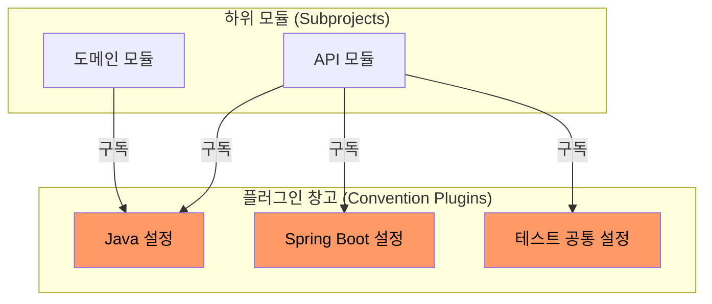

멀티 프로젝트 빌드에서 발생하는 중복 설정을 모듈화하여 관리하는 방식으로, 각 모듈은 필요한 기능만 선택해서 사용하도록 설계하는 것이 핵심이다.

## subprojects 방식의 한계: 비대해지는 루트 빌드

가장 쉬운 방식인 `subprojects` 블록은 루트 빌드 파일에서 모든 하위 모듈에 설정을 강제로 주입한다.

### 안 좋은 예시 - 지저분한 루트 build.gradle

하지만 프로젝트가 커지면 루트 `build.gradle`이 비대해지고 관리하기 힘들어진다.

```gradle
// root/build.gradle
subprojects {
    apply plugin: 'java'
    
    // 특정 모듈에만 적용할 설정을 위해 조건문이 늘어남
    if (project.name.contains('api')) {
        apply plugin: 'org.springframework.boot'
        dependencies {
            implementation 'org.springframework.boot:spring-boot-starter-web'
        }
    }
    
    if (project.name.contains('domain')) {
        dependencies {
            implementation 'org.springframework.boot:spring-boot-starter-data-jpa'
        }
    }
}
```

- 가독성 저하: 모든 모듈의 예외 케이스가 루트 파일 하나에 모여 읽기 힘듦
- 강한 결합: 루트 설정이 바뀌면 관련 없는 모듈까지 빌드 캐시가 깨져 성능이 떨어짐

## Convention Plugins - 조립식 빌드 관리

컨벤션 플러그인은 공통 설정을 관심사별로 나누어 정의하고, 각 모듈은 자신이 필요한 것만 골라서 사용하는 아키텍처다.



### 올바른 예시 - 깔끔해진 하위 모듈 build.gradle

하위 모듈은 이제 무엇을 할지가 아닌 어떤 종류의 모듈인지만 정의한다.

```gradle
// api-module/build.gradle
plugins {
    id 'my.java-convention'
    id 'my.spring-boot-convention'
}

dependencies {
    // 이 모듈만의 특수한 의존성만 작성
    implementation project(':domain-module')
}
```

## 구현 방법

보통 `buildSrc` 디렉토리 안에 플러그인 로직을 작성한다.

### 1. 플러그인 로직 정의 (buildSrc)

```java
// buildSrc/src/main/java/my/JavaConventionPlugin.java
public class JavaConventionPlugin implements Plugin<Project> {

    public void apply(Project project) {
        project.getPlugins().apply("java-library");
        project.getTasks()
                .withType(JavaCompile.class)
                .configureEach(task -> task.getOptions().setEncoding("UTF-8"));
    }
}
```

### 2. 플러그인 ID 등록 (buildSrc/build.gradle)

```gradle
gradlePlugin {
    plugins {
        javaConvention {
            id = 'my.java-convention'
            implementationClass = 'my.JavaConventionPlugin'
        }
    }
}
```

## 핵심 설계 원칙

1. 상속보다는 조합: 'Java용', 'Spring용'처럼 작게 쪼개서 필요한 곳에 조합하여 사용
2. 방어적인 설정: 플러그인이 적용될 때 이미 다른 설정이 있는지 확인하여 충돌 방지
3. Version Catalog 활용: 라이브러리 버전 정보는 `libs.versions.toml`에 모으고 플러그인은 이를 참조만 함
