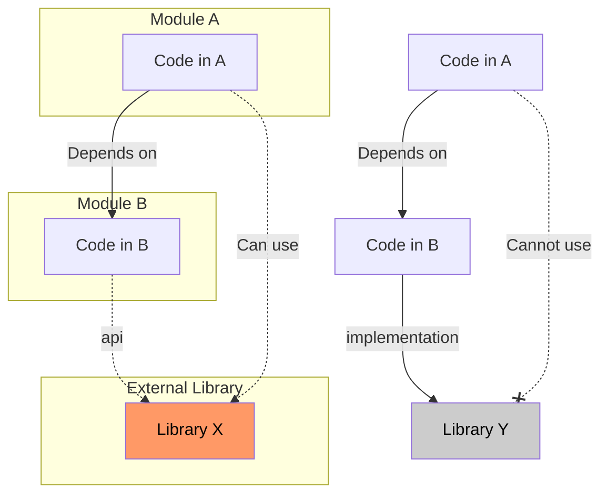

Gradle은 빌드 과정에서 의존성을 관리하기 위해 용도에 따른 다양한 구성(Configuration)을 제공하며, 이를 통해 컴파일 타임과 런타임의 클래스패스를 정밀하게 제어할 수 있다.

## implementation vs api

두 설정의 핵심 차이는 의존성 노출(Leakage) 여부에 있다.

### implementation

현재 모듈의 내부 구현에만 사용되는 의존성을 선언한다.

- 캡슐화: 해당 의존성이 상위 모듈로 노출되지 않아 의존성 전파 방지
- 빌드 속도 향상: 내부 구현이 변경되어도 이를 사용하는 상위 모듈들은 다시 컴파일할 필요가 없어 재컴파일 범위 감소
- 권장 사항: 라이브러리의 클래스가 공용 API(Public Method의 파라미터나 리턴 타입)로 노출되지 않는다면 항상 `implementation` 사용

### api

현재 모듈을 의존하는 다른 모듈에서도 해당 라이브러리를 직접 사용할 수 있게 한다.

- 의존성 전파: 하위 모듈에서 `api`로 선언한 의존성은 이를 참조하는 모든 상위 모듈의 컴파일 클래스패스에 포함
- 사용 시점: 라이브러리의 타입이 모듈의 인터페이스나 공용 메서드에 직접적으로 사용되어야 할 때만 제한적으로 사용
- 주의 사항: 불필요한 `api` 사용은 컴파일 시간 증가와 의존성 지옥(Dependency Hell)의 원인



## compileOnly and runtimeOnly

컴파일 시점과 실행 시점에 필요한 자원을 분리하여 빌드 결과물을 가볍게 유지할 수 있다.

### compileOnly

컴파일 시점에만 필요하고, 실행 시점에는 외부 환경(WAS 등)에서 제공받거나 불필요한 경우 사용한다.

- 용도: Lombok과 같은 어노테이션 프로세서, 또는 Servlet API처럼 런타임 환경에 이미 포함된 라이브러리
- 장점: 최종 결과물(JAR/WAR)에 포함되지 않아 파일 크기를 줄이고 클래스 로딩 충돌 방지

### runtimeOnly

컴파일 시점에는 필요하지 않지만, 애플리케이션 실행 시점에 반드시 존재해야 하는 의존성이다.

- 용도: JDBC 드라이버 구현체(MySQL Connector 등), 로깅 라이브러리의 실제 바인딩(Logback 등)
- 장점: 컴파일 클래스패스를 깨끗하게 유지하여 개발 중 구현체 클래스에 직접 의존하는 실수를 방지

## 구성별 클래스패스 포함 여부

각 설정이 최종 빌드 결과와 개발 환경에 미치는 영향을 비교하면 다음과 같다.

| Configuration  | Compile Classpath | Runtime Classpath | Transitive (Exported) |
|:--------------:|:-----------------:|:-----------------:|:---------------------:|
|      api       |         O         |         O         |           O           |
| implementation |         O         |         O         |           X           |
|  compileOnly   |         O         |         X         |           X           |
|  runtimeOnly   |         X         |         O         |           X           |

## 실무 적용 예시

Spring Boot 프로젝트에서 흔히 볼 수 있는 의존성 구성의 전형적인 모습이다.(`api` 구성은 `java-library` 플러그인을 적용한 모듈에서만 사용 가능)

```gradle
plugins {
    id 'java-library' // api 구성을 사용하기 위해 필요
}

dependencies {
    // 공용 인터페이스 노출이 필요한 경우 (멀티 모듈의 core 등)
    api 'org.apache.commons:commons-lang3:3.12.0'

    // 일반적인 비즈니스 로직 라이브러리
    implementation 'org.springframework.boot:spring-boot-starter-web'

    // 컴파일 시점에만 필요한 도구
    compileOnly 'org.projectlombok:lombok'
    annotationProcessor 'org.projectlombok:lombok'

    // 실행 시점에만 주입되어야 하는 드라이버
    runtimeOnly 'com.mysql:mysql-connector-j'

    // 테스트 환경에서만 사용
    testImplementation 'org.springframework.boot:spring-boot-starter-test'
}
```
