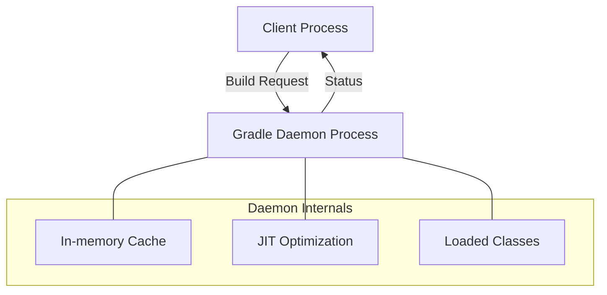

Gradle은 빌드 속도를 높이고 실행 환경의 일관성을 유지하기 위해 Daemon 프로세스와 Wrapper라는 두 가지 핵심 메커니즘을 제공한다.

## Gradle Daemon

Gradle Daemon은 백그라운드에서 실행되는 장기 생존(Long-lived) 프로세스로, 빌드 요청이 올 때까지 대기하며 성능을 최적화한다.

### 동작 원리 및 이점

매번 새로운 JVM을 띄우는 오버헤드를 줄여 빌드 시간을 단축한다.

- 메모리 캐싱: 프로젝트 구조, 파일 시스템 정보, 빌드 스크립트의 컴파일 결과 등을 메모리에 유지하여 재사용
- JIT(Just-In-Time) 최적화: JVM의 JIT 컴파일러가 반복되는 빌드 코드를 분석하여 최적화된 기계어로 변환하므로 실행될수록 속도 향상
- 클래스 로딩 단축: 필요한 라이브러리와 클래스들을 미리 로드하여 초기 구동 시간 절감

### 메모리 및 생명주기 관리

Daemon은 `gradle.properties`를 통해 설정하거나 명령행 옵션으로 제어 가능하다.

- 메모리 설정: `org.gradle.jvmargs=-Xmx2048m -XX:MaxMetaspaceSize=512m`와 같이 JVM 인자 지정 가능
- 자동 종료: 3시간 동안 활동이 없으면 자원을 반납하기 위해 자동으로 종료
- 수동 종료: `gradle --stop` 명령을 통해 실행 중인 모든 Daemon 프로세스 정지

### CI/CD 환경에서의 주의사항

리소스가 제한된 CI 서버에서는 Daemon 사용이 오히려 문제가 될 수 있다.

- 자원 경합: 여러 빌드가 동시에 돌아가는 CI 환경에서 Daemon이 메모리를 점유하면 OOM(Out Of Memory) 발생 위험 증가
- 상태 오염: 이전 빌드의 부산물이 남을 수 있어 깨끗한 환경에서의 빌드를 보장하기 위해 `--no-daemon` 옵션 권장
- 일회성 실행: CI 환경은 빌드 후 컨테이너나 인스턴스가 파기되므로 Daemon의 웜업(Warm-up) 효과를 기대하기 어려움

## Gradle Wrapper

특정 버전의 Gradle을 로컬에 설치하지 않고도 빌드 환경을 프로젝트 단위로 고정하는 도구이다.

### 구성 요소 및 구조

프로젝트 빌드에 필요한 모든 정보를 파일로 관리하여 환경에 구애받지 않는 실행을 지원한다.

|            파일명            |                  역할                   |
|:-------------------------:|:-------------------------------------:|
|   gradlew, gradlew.bat    | 실행 스크립트로, 시스템에 Gradle이 없으면 다운로드 후 실행  |
|    gradle-wrapper.jar     |   Gradle 배포판을 다운로드하고 로드하는 핵심 로직 포함    |
| gradle-wrapper.properties | Gradle 버전, 다운로드 URL, 저장 경로 등 설정 정보 관리 |

### 활용 및 유지보수

동일한 명령어를 사용하여 어디서나 일관된 빌드 방식을 유지하는 것이 권장된다.

- 일관성 보장: 로컬이나 서버 환경에 관계없이 프로젝트가 지정한 정확한 Gradle 버전 사용
- 자동 설치: 별도의 수동 설치 과정 없이 스크립트 실행만으로 빌드 환경 구성 완료
- 버전 업그레이드: `./gradlew wrapper` 명령을 통해 설정 파일 갱신 및 버전 관리 용이

### 최적화 팁

Wrapper 사용 시 다운로드 속도와 캐시 관리를 고려해야 한다.

- 배포판 타입: `distributionType=bin`은 실행 파일만 포함하여 가볍고, `all`은 소스 코드와 문서까지 포함하여 IDE 지원에 유리함
- 로컬 캐시: 다운로드된 배포판은 `~/.gradle/wrapper/dists`에 저장되어 여러 프로젝트에서 공유됨
