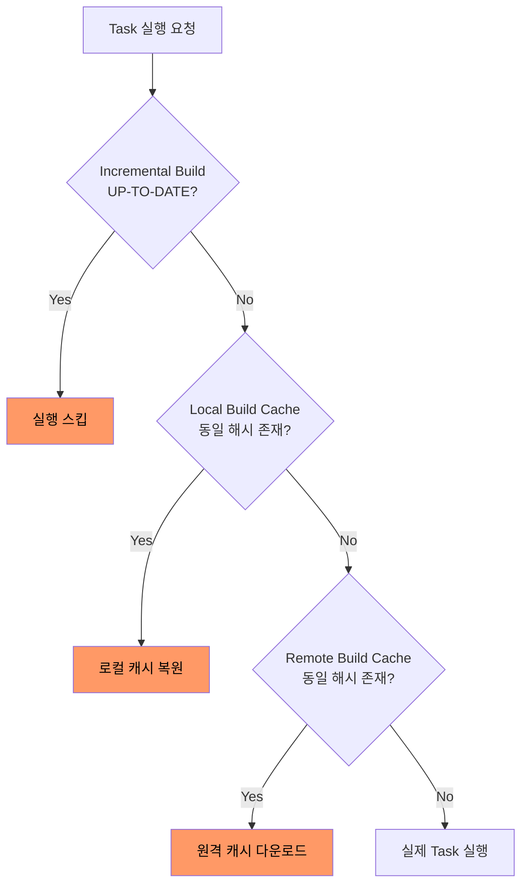

Gradle이 Maven 대비 빠른 빌드 속도를 보이는 이유는 모든 Task의 입력과 출력을 추적하여 불필요한 재실행을 적극적으로 회피하는 메커니즘에 있다.

## Task Avoidance 3단계 모델

Gradle은 동일한 결과를 만드는 Task를 다시 실행하지 않기 위해 세 가지 레벨의 회피 전략을 단계적으로 적용한다.



- Incremental Build: 같은 디렉토리에서 직전 빌드와 입력이 동일한지 확인
- Local Build Cache: 다른 브랜치·다른 디렉토리에서 만든 결과물도 재사용 가능
- Remote Build Cache: 팀 전체가 결과물을 공유하여 CI에서 만든 산출물을 로컬에서 복원

## Incremental Build의 원리

Task는 자신의 입력(Inputs)과 출력(Outputs)을 명시적으로 선언하고, Gradle은 이를 해시 값으로 변환하여 디스크에 저장한다.

### UP-TO-DATE 판정 기준

다음 두 가지 조건이 모두 만족되어야 Task를 건너뛴다.

- 입력 해시 일치: 소스 파일, 의존성, Task 프로퍼티의 해시 값이 직전 실행과 동일
- 출력 무결성: 직전 실행이 생성한 출력 파일이 그대로 존재하며 변조되지 않음

`./gradlew build --info` 실행 시 각 Task 옆에 `UP-TO-DATE`, `FROM-CACHE`, `(executed)` 등의 상태가 표시되어 어떤 회피 전략이 적용되었는지 확인 가능하다.

### 커스텀 Task의 Inputs/Outputs 선언

빌드 스크립트에 직접 작성한 Task는 입출력을 명시해야 증분 빌드의 혜택을 받는다.

```gradle
tasks.register('generateVersionFile') {
    def versionFile = layout.buildDirectory.file('generated/version.txt')

    inputs.property('appVersion', project.version)
    outputs.file(versionFile)

    doLast {
        versionFile.get().asFile.text = "Version: ${project.version}"
    }
}
```

- 입력 누락 시: 소스가 바뀌어도 항상 UP-TO-DATE로 판정되어 잘못된 결과 발생
- 출력 누락 시: 매번 실행되어 증분 빌드의 이점 상실

## Build Cache

증분 빌드가 같은 위치의 직전 빌드만 인식한다면, 빌드 캐시는 입력 해시가 같으면 어디서 만든 결과물이든 재사용한다.

### 로컬 빌드 캐시 활성화

`gradle.properties` 파일에 한 줄을 추가하는 것만으로 활성화된다.

```properties
# gradle.properties
org.gradle.caching=true
org.gradle.parallel=true
org.gradle.configuration-cache=true
```

- 캐시 저장 위치: `~/.gradle/caches/build-cache-1/`
- 키 구성: Task 클래스명 + 입력 해시 + Gradle 버전을 조합한 해시 값
- 효과: `git switch`로 브랜치를 자주 바꾸는 환경에서 동일 커밋의 컴파일 결과 즉시 복원

## Configuration Cache

Gradle 8.1부터 안정화된 기능으로, 설정 단계(Configuration Phase)의 결과 자체를 직렬화하여 재사용한다.

```bash
# 활성화 후 빌드
./gradlew build --configuration-cache
```

기존 증분 빌드가 실행 단계(Execution Phase)만 최적화했다면, Configuration Cache는 그 이전 단계인 Task 그래프 구축 과정도 스킵한다.

- 1차 빌드: 설정 결과를 `.gradle/configuration-cache/`에 직렬화하여 저장
- 2차 빌드: `build.gradle`이 변경되지 않았다면 설정 단계를 통째로 스킵
- 체감 효과: 작은 변경에 대한 빌드 응답 시간이 절반 이하로 감소
- 제약 사항: Task 액션 내부에서 `project` 객체 직접 참조 시 캐시 무효화 발생

## 캐시 무효화 트러블슈팅

빌드 결과가 의심스러운 경우 강제로 캐시를 무효화하여 깨끗한 빌드를 수행한다.

```bash
# 캐시 무시하고 강제 재실행
./gradlew build --rerun-tasks

# 로컬 빌드 캐시 디렉토리 정리
./gradlew --stop && rm -rf ~/.gradle/caches/build-cache-1/

# 빌드 스캔으로 캐시 미스 원인 분석
./gradlew build --scan
```

- `--rerun-tasks`: 모든 Task의 UP-TO-DATE 체크를 무시하지만 Build Cache는 여전히 활용
- `--no-build-cache`: 캐시 자체를 끄고 실행하여 캐시 오염 의심 시 사용
- Build Scan: `scans.gradle.com`에 빌드 리포트를 업로드하여 각 Task의 캐시 적중 여부를 시각적으로 분석

## 빠른 빌드를 위한 권장 설정

`gradle.properties`에 다음 설정을 적용하면 별도 코드 변경 없이도 로컬 빌드 속도를 크게 개선할 수 있다.

```properties
# 데몬 활성화: JVM 워밍업 비용 절감
org.gradle.daemon=true
# 빌드 캐시 활성화
org.gradle.caching=true
# 병렬 실행 (서브 프로젝트 단위)
org.gradle.parallel=true
# 설정 캐시 활성화 (Gradle 8.1+)
org.gradle.configuration-cache=true
# Task 구체화 지연 (Configuration on Demand)
org.gradle.configureondemand=true
# 데몬 JVM 메모리 확장 (대규모 프로젝트)
org.gradle.jvmargs=-Xmx4g -XX:MaxMetaspaceSize=1g
```

- 메모리 부족 경고: `OutOfMemoryError`가 발생하면 `org.gradle.jvmargs`를 우선 점검
- 캐시는 누적되므로 가끔씩 `~/.gradle/caches/` 디렉토리 용량 점검 필요
