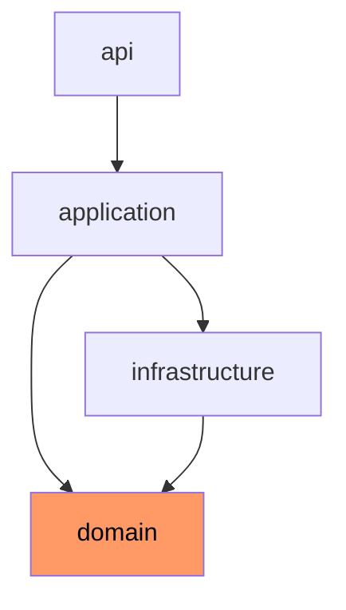

Gradle은 `settings.gradle`을 기반으로 여러 하위 프로젝트를 하나의 빌드 단위로 묶는 멀티 프로젝트 빌드를 제공한다.

## 멀티 모듈의 필요성

모놀리식 단일 모듈 구조는 초기 개발 속도에는 유리하지만, 규모가 커질수록 아키텍처 경계의 침식과 빌드 비효율을 유발한다.

- 경계 강제: 패키지 단위 컨벤션만으로는 막을 수 없는 계층 간 역참조를 컴파일 단계에서 차단
- 재사용성 확보: 공통 도메인 모델이나 유틸리티를 별도 모듈로 분리하여 여러 서비스에서 참조 가능
- 빌드 최적화: 변경되지 않은 모듈은 캐시를 통해 재컴파일을 건너뛰어 전체 빌드 시간 단축
- 팀 분리: 모듈별 소유권 분리로 독립적인 변경 주기와 배포 전략 수립 가능

## settings.gradle 구성

멀티 프로젝트 빌드의 진입점은 루트 디렉토리의 `settings.gradle` 파일이며, 이곳에서 빌드에 참여할 하위 모듈을 선언한다.

```gradle
rootProject.name = 'my-service'

include 'api'
include 'application'
include 'domain'
include 'infrastructure'
```

- `rootProject.name`: 루트 프로젝트의 공식 이름으로 IDE 및 아티팩트 식별자에 반영
- `include`: 포함할 하위 프로젝트를 선언하며, 콜론(`:`)으로 깊이 표현 가능 (예: `include 'modules:api'`)
- 빌드 시점: Initialization Phase에서 실행되어 각 모듈에 대응하는 `Project` 인스턴스 생성

## 디렉토리 구조

관례적으로 루트 아래 각 모듈 디렉토리가 자신의 `build.gradle`을 보유한다.

```text
my-service/
├── settings.gradle              # 전체 모듈 포함 선언
├── build.gradle                 # 루트: 공통 설정
├── api/
│   └── build.gradle             # 웹 계층 모듈
├── application/
│   └── build.gradle             # 유스케이스 계층 모듈
├── domain/
│   └── build.gradle             # 순수 도메인 모델 모듈
└── infrastructure/
    └── build.gradle             # 외부 시스템 연동 모듈
```

- 루트 `build.gradle`: 모든 하위 모듈이 공유하는 플러그인과 설정 정의
- 하위 `build.gradle`: 해당 모듈에 고유한 의존성과 설정만 기술
- 물리적 분리: 디렉토리 구조 자체가 아키텍처의 청사진 역할 수행

## 공통 설정 분리

루트 `build.gradle`에서 `subprojects` 또는 `allprojects` 블록을 활용하여 반복을 제거한다.

```gradle
// 루트 build.gradle
plugins {
    id 'org.springframework.boot' version '3.2.0' apply false
    id 'io.spring.dependency-management' version '1.1.4' apply false
}

subprojects {
    apply plugin: 'java'
    apply plugin: 'io.spring.dependency-management'

    group = 'com.example'
    version = '0.0.1-SNAPSHOT'

    java {
        toolchain {
            languageVersion = JavaLanguageVersion.of(21)
        }
    }

    repositories {
        mavenCentral()
    }

    dependencies {
        implementation platform('org.springframework.boot:spring-boot-dependencies:3.2.0')
        testImplementation 'org.springframework.boot:spring-boot-starter-test'
    }
}
```

- `apply false`: 루트에는 플러그인을 적용하지 않고 하위 모듈에서 선택적으로 적용할 수 있도록 선언만 수행
- `subprojects`: 모든 하위 모듈에 동일하게 적용할 설정을 선언하는 블록
- `allprojects`: 루트를 포함한 전체 모듈에 적용되며, 루트에 소스 코드가 없는 경우 `subprojects`가 더 안전

## 모듈 간 의존성 연결

하위 모듈이 다른 모듈을 참조할 때는 `project(':모듈명')` 표기를 사용한다.

```gradle
// api/build.gradle
dependencies {
    implementation project(':application')
    implementation 'org.springframework.boot:spring-boot-starter-web'
}

// application/build.gradle
dependencies {
    implementation project(':domain')
    implementation project(':infrastructure')
}

// domain/build.gradle — 외부 의존성 없음, 순수 자바
dependencies {
    // 의도적으로 비어있음
}

// infrastructure/build.gradle
dependencies {
    implementation project(':domain')
    implementation 'org.springframework.boot:spring-boot-starter-data-jpa'
    runtimeOnly 'com.mysql:mysql-connector-j'
}
```

- 단방향 흐름: `api → application → domain`, `infrastructure → domain` 방향으로만 참조하여 순환 참조 방지
- `domain` 모듈의 순결성: 외부 프레임워크 의존성을 제거하여 도메인 로직의 재사용성과 테스트 용이성 확보
- Gradle 체크: 순환 의존성이 발생하면 Configuration Phase에서 빌드 실패 처리



## project() vs 외부 라이브러리 의존성

내부 모듈 참조와 외부 라이브러리 참조는 선언 방식이 다르지만 동일한 `implementation`, `api` 구성을 따른다.

|        구분        | 선언 방식                                      |        용도        |
|:----------------:|:-------------------------------------------|:----------------:|
|     내부 모듈 참조     | `implementation project(':domain')`        |   같은 빌드 내 모듈 간   |
|   외부 라이브러리 참조    | `implementation 'org.springframework:...'` | Maven 저장소에서 다운로드 |
| 내부 모듈의 API 노출 필요 | `api project(':common-api')`               |   공용 인터페이스 전파    |

- `implementation project()`: 해당 모듈의 컴파일 클래스패스만 현재 모듈에 포함, 전이되지 않음
- `api project()`: 모듈이 노출하는 공용 타입이 상위 모듈로 전파되어야 할 때 사용
- 캡슐화 원칙: 기본적으로 `implementation`을 사용하고, 인터페이스 공유가 명확한 경우에만 `api` 선택

## 아키텍처 예시

계층형 아키텍처(Layered Architecture)를 물리적 모듈로 분리한 전형적인 구성은 다음과 같다.

```text
api              → HTTP 어댑터, Controller, DTO
application      → Use Case, Service, Transaction 경계
domain           → Entity, Value Object, Domain Service
infrastructure   → JPA Repository 구현, 외부 API Client
```

- `api` 모듈은 `application`만 알고, `domain`을 직접 참조하지 않음으로써 계층 역전 방지
- `domain`은 어떤 모듈에도 의존하지 않는 가장 안쪽 계층
- `infrastructure`는 `domain`이 정의한 포트(인터페이스)를 구현하는 어댑터 역할 수행
- 새로운 진입점(배치, 메시지 컨슈머)이 추가되어도 `domain`과 `application`을 재사용 가능

이러한 모듈 분리는 아키텍처의 의도를 코드 구조에 고정시키는 강력한 수단이 된다.
