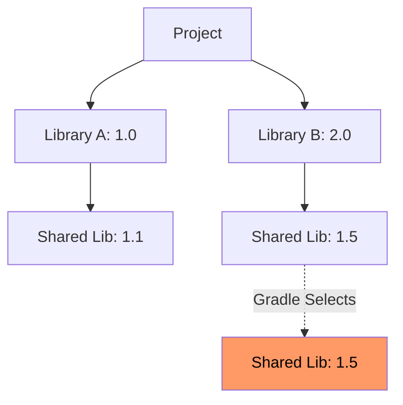

Gradle은 버전 충돌을 자동으로 해결하는 강력한 엔진을 갖추고 있지만, 자동 해결 방식이 예상치 못한 런타임 오류를 유발하므로, 이를 명시적으로 제어하는 전략이 필요하다.

## 의존성 충돌 파악

문제를 해결하기 전, 현재 프로젝트의 의존성 관계를 정확히 파악하는 것이 우선이다.

### dependencies 태스크 활용

터미널에서 다음 명령어를 실행하여 의존성 트리를 확인한다.

```bash
./gradlew dependencies --configuration compileClasspath
```

- `(*)` 표시: 이미 다른 곳에서 상위 버전이 선택되어 생략된 의존성
- `->` 표시: 버전 충돌로 인해 Gradle이 강제로 변경한 버전

### Gradle의 기본 전략: Highest Version

Gradle은 동일한 라이브러리의 여러 버전이 발견되면 기본적으로 가장 높은 버전을 선택한다. (Maven은 가까운 의존성을 선택하는 전략 사용)



## Resolution Strategy 설정

`build.gradle`의 `configurations` 블록 내에서 빌드 전체의 의존성 해결 규칙을 정의할 수 있다.

```gradle
// 충돌 발생 시 빌드 실패 처리: 가장 높은 버전을 자동으로 선택하는 대신, 버전이 다르면 빌드를 중단시켜 개발자가 인지
configurations.all {
    resolutionStrategy {
        failOnVersionConflict()
    }
}

// 특정 버전 강제 고정 (force): 전이적 의존성으로 인해 원치 않는 상위 버전이 들어오는 경우, 특정 버전을 강제로 사용하도록 지정
configurations.all {
    resolutionStrategy {
        force 'org.slf4j:slf4j-api:1.7.32'
    }
}
```

## 의존성 제외 (Exclude)

특정 의존성을 트리에서 완전히 제거하여 충돌을 원천 차단하는 방법이다.

```gradle
// 특정 선언에서 제외: 특정 라이브러리를 가져올 때 그 라이브러리가 끌어오는 전이적 의존성만 제거
dependencies {
    implementation('org.springframework.boot:spring-boot-starter-web') {
        exclude group: 'org.springframework.boot', module: 'spring-boot-starter-tomcat'
    }
    implementation 'org.springframework.boot:spring-boot-starter-jetty'
}


// 전역 제외: 프로젝트 전체에서 특정 라이브러리가 포함되지 않도록 설정(주로 로깅 프레임워크 충돌 해결 시 사용)
configurations.all {
    exclude group: 'org.apache.logging.log4j', module: 'log4j-core'
}
```

## 트러블슈팅 사례

스프링 부트 환경에서 자주 발생하는 호환성 문제를 해결하는 베스트 프랙티스이다.

### 버전 결정 방식 비교

|         방식         | 적용 범위 | 강제성 |      추천 상황      |
|:------------------:|:-----:|:---:|:---------------:|
|  version catalog   |  전역   | 낮음  | 팀 내 표준 버전 공유 시  |
| resolutionStrategy |  전역   | 높음  | 심각한 충돌 해결 필요 시  |
|      exclude       | 국소/전역 | 절대적 | 호환되지 않는 모듈 제거 시 |

### Spring Boot Bom 활용

스프링 부트가 검증한 안정적인 버전 조합을 유지하기 위해, 가급적 버전을 직접 명시하지 않고 `platform` 또는 `enforcedPlatform`을 활용하는 것이 권장된다.

```gradle
dependencies {
    // 스프링 부트가 관리하는 버전 세트를 기준으로 결정
    implementation platform('org.springframework.boot:spring-boot-dependencies:3.2.0')
    
    // 강제성이 필요한 경우
    implementation enforcedPlatform('org.springframework.boot:spring-boot-dependencies:3.2.0')
}
```

- platform: 권장 버전을 제시하며 필요시 오버라이드 가능
- enforcedPlatform: 하위 의존성들의 버전을 무시하고 지정된 버전 강제
