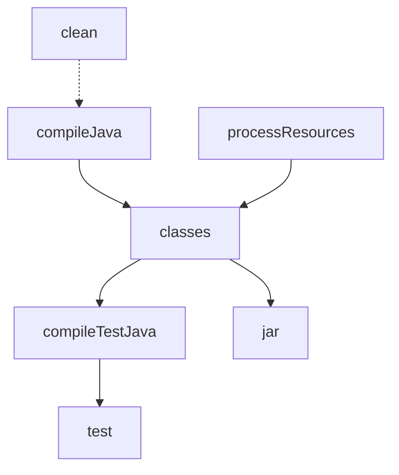

설정(Configuration) 단계에서 구축되는 Task 그래프는 빌드의 정확성과 성능을 결정짓는 설계도 역할을 한다.

## Directed Acyclic Graph (DAG)

Gradle은 Task 간의 의존성을 분석하여 유향 비순환 그래프(DAG)를 생성한다.

- 방향성(Directed): 한 Task가 다른 Task에 의존하는 명확한 방향이 존재
- 비순환성(Acyclic): 순환 의존성(Circular Dependency)이 발생할 경우 빌드 오류를 발생시켜 무한 루프 방지
- 불변성(Immutability): 실행 단계가 시작되면 Task 그래프는 변경되지 않으며, 확정된 순서에 따라 작업 수행

## Task Dependency (의존성 정의)

Task 간의 실행 순서를 제어하기 위해 Gradle은 여러 가지 선언 방식을 제공한다.

### Hard Dependency (강한 의존성)

한 Task가 실행되기 위해 반드시 다른 Task가 성공적으로 완료되어야 하는 관계이다.

- dependsOn: 가장 일반적인 방식으로, 선행 Task가 실패하면 후속 Task는 실행되지 않음
- finalizedBy: 특정 Task 실행 후 반드시 실행되어야 하는 정리 작업을 정의 (예: 테스트 후 리포트 생성)

### Soft Ordering (순서 제어)

의존성은 없으나 실행될 경우의 선후 관계만을 정의하는 방식이다.

- mustRunAfter: 두 Task가 모두 실행될 때만 순서를 보장하며, 서로 독립적으로 실행 가능
- shouldRunAfter: `mustRunAfter`와 유사하나, 순환 의존성이 발생할 경우 순서 규약을 무시하여 빌드 중단을 방지

## Parallel Execution (병렬 실행)

Task 그래프가 DAG 구조를 가지기 때문에, 서로 의존 관계가 없는 Task들은 동시에 실행될 수 있다.

- 최적화 원리: 그래프 상에서 독립적인 경로에 있는 Task들을 별도의 워커 스레드(Worker Thread)에서 병렬로 수행
- 설정 방식: `--parallel` 옵션 또는 `gradle.properties`의 `org.gradle.parallel=true` 설정을 통해 활성화
- 설계 원칙: Task 간의 공유 상태를 지양하고 입력(Input)과 출력(Output)을 명확히 정의해야 안전한 병렬 빌드 가능

## Task Avoidance and Incremental

Task 그래프는 빌드 효율을 극대화하기 위해 실행 여부를 지능적으로 판단한다.

- UP-TO-DATE 체크: Task의 입력값과 이전 실행의 출력값을 비교하여 변경이 없으면 실행 스킵(Skip)
- Task Avoidance API: 모든 Task를 메모리에 올리지 않고, 실제 실행에 필요한 Task만 구체화하여 설정 단계의 부하 절감
- Lifecycle Tasks: `build`, `check`와 같이 실제 로직은 없으나 다른 Task들을 묶어주는 논리적 단위로 그래프 구조화
