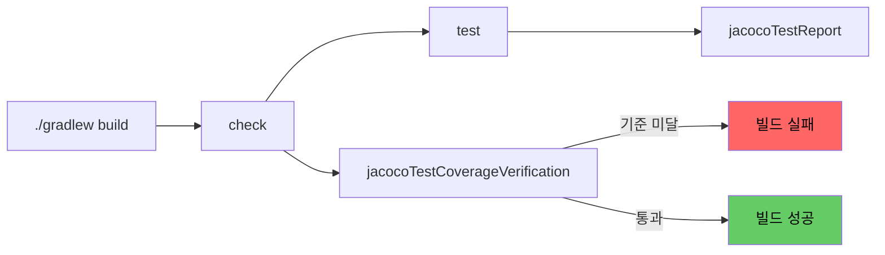

Gradle은 JVM 포크 단위의 병렬 실행과 입출력 추적 기반 캐시를 통해 테스트 속도와 신뢰도를 동시에 확보하고, JaCoCo 연동으로 최소 커버리지 기준을 빌드 단계에서 강제할 수 있다.

## JUnit 5 연동

JUnit 5로 테스트를 실행하려면 두 가지 조건이 모두 필요하다.

1. JUnit 5(Jupiter) 라이브러리가 의존성에 포함
    - `spring-boot-starter-test`만 추가하면 자동으로 해결(Spring Boot 2.2부터 Jupiter를 기본 포함, 2.4부터 Vintage 엔진 제거)
2. Gradle `test` Task가 JUnit Platform 방식으로 동작하도록 설정
    - 자동화되어 있지 않아 `useJUnitPlatform()`을 직접 호출하여 명시적으로 활성화

```gradle
dependencies {
    testImplementation 'org.springframework.boot:spring-boot-starter-test'
}

tasks.named('test') {
    useJUnitPlatform()
}
```

### Test 결과 로깅

기본 콘솔 출력은 실패 메시지가 잘려 원인 파악이 어려우므로 `testLogging`으로 가시성을 보강하는 것이 일반적이다.

```gradle
tasks.named('test') {
    useJUnitPlatform()
    testLogging {
        events 'passed', 'skipped', 'failed'
        exceptionFormat = 'full'
        showStandardStreams = false
    }
}
```

- `exceptionFormat = 'full'`: 스택 트레이스 전체를 출력하여 CI 로그만으로 원인 추적 가능
- `showStandardStreams`: 통합 테스트에서 `System.out`이 많을 경우 false로 두어 로그 잡음 방지

## 병렬 테스트로 빌드 시간 단축

테스트는 빌드에서 긴 시간을 차지하기 때문에 병렬화 효과가 큰데, Gradle은 두 가지 레벨의 병렬 처리를 제공한다.

### maxParallelForks - JVM 프로세스 병렬화

`maxParallelForks`는 테스트를 실행할 JVM을 몇 개까지 동시에 띄울지 결정하는 값으로, 각 JVM은 완전히 격리되어 정적 상태 공유 문제가 없다.

```gradle
tasks.named('test') {
    useJUnitPlatform()
    // CPU 코어 절반이 안전한 출발점
    maxParallelForks = Runtime.runtime.availableProcessors().intdiv(2) ?: 1
}
```

- 메모리 사용량 = `maxParallelForks` × 단일 JVM 힙: 무작정 늘리면 OOM 발생
- DB 자원 경쟁: Testcontainers나 인메모리 H2 사용 시 포트·스키마 충돌 가능, 포크별 격리 구성 필요
- CI 환경: 코어 수 대비 메모리가 부족한 러너가 많아 로컬보다 보수적으로 설정

### forkEvery - 메모리 누수 방어

장시간 실행되는 테스트 슈트에서는 단일 JVM에 메모리가 누적되어 OOM이 발생할 수 있어, `forkEvery`는 N개의 테스트 클래스마다 JVM을 재시작하여 힙을 비운다.

```gradle
tasks.named('test') {
    forkEvery = 100  // 100개 클래스마다 JVM 재기동
}
```

워밍업 비용이 누적되므로 보통 100 이상의 큰 값을 사용하며, OOM이 의심될 때만 도입한다.

## JaCoCo 커버리지 측정

JaCoCo는 JVM 인스트루멘테이션을 이용해 실제 실행된 라인과 분기를 추적하여 커버리지 리포트를 생성하는 도구로, Gradle 공식 플러그인으로 제공된다.

```gradle
plugins {
    id 'java'
    id 'jacoco'
}

jacoco {
    toolVersion = '0.8.11'
}

tasks.named('test') {
    useJUnitPlatform()
    finalizedBy 'jacocoTestReport'  // 테스트 후 항상 리포트 생성
}

tasks.named('jacocoTestReport') {
    dependsOn 'test'
    reports {
        xml.required = true   // CI 연동용 (Codecov, SonarQube)
        html.required = true  // 사람이 보는 용도
    }
}
```

- 리포트 위치: `build/reports/jacoco/test/html/index.html`
- `finalizedBy`: `test`가 실패해도 부분 리포트는 생성되어 어디까지 실행되었는지 확인 가능
- XML 리포트: 외부 정적 분석 도구가 파싱하기 위한 표준 포맷

### 커버리지 측정 제외 대상

DTO, 설정 클래스, 자동 생성 코드처럼 의미 있는 로직이 없는 클래스는 커버리지 평균을 왜곡하므로 제외하는 것이 일반적이다.

```gradle
tasks.named('jacocoTestReport') {
    afterEvaluate {
        classDirectories.setFrom(
            files(classDirectories.files.collect {
                fileTree(dir: it, exclude: [
                    '**/dto/**',
                    '**/config/**',
                    '**/*Application.class',
                    '**/Q*.class'  // QueryDSL 자동 생성 클래스
                ])
            })
        )
    }
}
```

`afterEvaluate` 블록 안에서 처리하는 이유는 `classDirectories`가 평가 단계 종료 후 확정되기 때문이다.

## 빌드 파이프라인에서 품질 기준 강제

리포트만 생성하는 것을 넘어 일정 기준 미달 시 빌드를 실패시키는 단계를 추가할 수 있다.

```gradle
tasks.named('jacocoTestCoverageVerification') {
    violationRules {
        rule {
            element = 'BUNDLE'
            limit {
                counter = 'LINE'
                value = 'COVERED_RATIO'
                minimum = 0.70  // 모듈 전체 라인 커버리지 70% 미만이면 실패
            }
        }
        rule {
            element = 'CLASS'
            limit {
                counter = 'BRANCH'
                value = 'COVERED_RATIO'
                minimum = 0.50
            }
            excludes = ['*.dto.*', '*.config.*']
        }
    }
}

tasks.named('check') {
    dependsOn 'jacocoTestCoverageVerification'
}
```

- `check` Task에 의존성 연결: `./gradlew build` 실행 시 자동으로 검증이 트리거
- `BUNDLE` 단위: 모듈 평균이라 일부 파일이 낮아도 보정되지만, 전체 추세 관리에 적합
- `CLASS` 단위: 개별 클래스의 최소 기준을 강제하여 핵심 도메인 코드의 누락을 방지

## 전체 워크플로우

테스트 실행과 커버리지 검증을 빌드 라이프사이클에 연결하면 별도 명령 없이도 품질이 유지되며, CI 파이프라인에서 `./gradlew check` 호출만으로 자동으로 검증이 수행된다.



- 일반 빌드 명령으로 검증까지 자동 수행되어 개발자 운영 부담이 없음
- 신규 코드만 별도 기준 강제: `differentialReport` 같은 외부 도구나 `Codecov`의 patch coverage 설정으로 보완
- 커버리지 수치는 절대값 자체보다 추세 관리가 중요하며, 점진적으로 기준선을 끌어올리는 운영 방식이 권장됨
