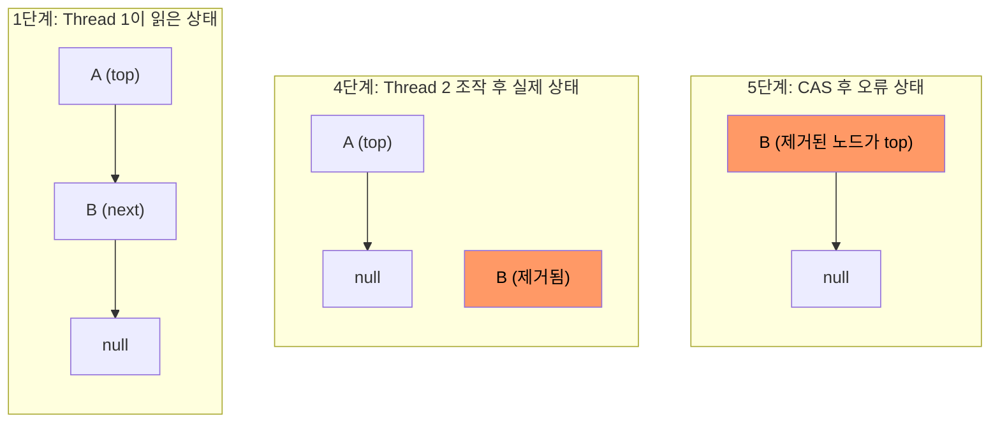

CAS는 '비교 후 교체'를 의미하며, 특정 메모리 위치의 값을 예상되는 값과 비교하여, 일치할 경우에만 새로운 값으로 교체하는 원자적(atomic) 연산이다.

- 연산에 필요한 인자
    - 예상되는 현재 값
    - 새로운 값
    - 실제 메모리 주소
- 연산 방식
    1. 메모리의 현재 값이 예상 값과 일치하는지 비교
    2. 일치하면 메모리 값을 새로운 값으로 교체
    3. 일치하지 않으면 교체를 수행하지 않음
    4. 이 모든 과정의 성공 여부 반환

비교와 교체 두 단계로 보이지만, 이 과정은 CPU의 특별한 명령어(instruction)를 통해 하드웨어 수준에서 하나의 원자적 연산으로 처리된다.

## Java에서의 CAS

자바는 `java.util.concurrent.atomic` 패키지를 통해 CAS 연산을 지원한다.

- CAS 연산을 Atomic 클래스의 메서드로 구현
- 각 타입에 대응하는 클래스가 제공(AtomicInteger, AtomicLong, AtomicBoolean 등)
- `compareAndSet(expectedValue, newValue)` 메서드를 통해 CAS 연산 수행

```java
void example() {
    AtomicInteger atomicInt = new AtomicInteger(0);

    int expectedValue = 0;
    int newValue = 1;

    // 현재 값이 0(expectedValue)이면 1(newValue)로 교체
    boolean success = atomicInt.compareAndSet(expectedValue, newValue);

    System.out.println("CAS 성공 여부: " + success); // true
    System.out.println("현재 값: " + atomicInt.get()); // 1
}
```

### Atomic과 volatile

Atomic 클래스는 내부적으로 `volatile` 키워드를 사용하여 멤버 변수를 선언한다.

```java
public class AtomicInteger extends Number implements java.io.Serializable {

    private static final long serialVersionUID = 6214790243416807050L;

    // ...

    private volatile int value;

    // ...
}
```

volatile 키워드는 메모리 가시성을 보장하기 위해 사용되는데, 이는 CAS 연산이 올바르게 동작하기 위한 필수 조건이다.

- volatile 키워드 사용 시 변수의 값을 읽을 때 CPU 캐시가 아닌 메인 메모리에서 조회
- 멀티스레드 환경에서 모든 스레드가 항상 최신 값을 읽을 수 있도록 보장
- CAS 연산은 비교와 교체를 하는 동안 메모리 값이 정확해야 하므로, 메모리 가시성 보장 필요

### vs 락 기반 동기화

여러 스레드가 공유 자원에 접근할 때, 동기화 방식은 크게 락(Lock) 기반 방식과 CAS 기반 방식으로 비교해볼 수 있다.

|     특징     |    락(Lock) 방식    | CAS(Compare-And-Swap) 방식 |
|:----------:|:----------------:|:------------------------:|
|   접근 방식    | 비관적(pessimistic) |     낙관적(optimistic)      |
|   동작 원리    |  락 획득 후 데이터 접근   |    값 비교 후 조건 만족 시 교체     |
| 복잡한 동기화 처리 |        적합        |           부적합            |
|  충돌 시 처리   |        대기        |           재시도            |

두 방식은 충돌 빈도와 연산 복잡도에 따라 적합한 환경이 달라진다.

- CAS가 유리한 환경
    - 충돌이 드문 환경(저경합): 대부분의 CAS가 한 번에 성공하므로 락 획득·해제 오버헤드 없이 고성능 달성
    - 단일 변수 연산: 카운터 증감, 상태 플래그 전환 등 단일 변수를 조작하는 간단한 연산
- 락 기반이 유리한 환경
    - 충돌이 잦은 환경(고경합): 반복 재시도로 CPU 사이클 낭비가 심해지므로, 대기 전환(blocking)이 가능한 락이 더 효율적
    - 복잡한 동기화 로직: 여러 변수를 일관성 있게 변경하거나 복합 연산을 원자적으로 처리해야 하는 경우

## CAS의 한계 - ABA 문제

CAS는 메모리의 현재 값만 비교하므로, 그 사이에 값이 변경되었다가 되돌아온 경우를 감지하지 못한다.

- 값이 A → B → A로 변경되어도, CAS 시점에 A이면 "변경 없음"으로 판단
- 값이 같다는 것(동일성)과 그 사이에 변경이 없었다는 것(연속성)은 다른 개념

### 발생 과정 - 락프리 스택 예시

초기 스택 상태가 `top → A → B → null`일 때, 두 스레드가 동시에 pop을 시도하는 상황이다.

| 단계 |        Thread 1         |    Thread 2     |    스택 상태     |
|:--:|:-----------------------:|:---------------:|:------------:|
| 1  | top(=A) 읽기, next(=B) 저장 |        -        | A → B → null |
| 2  |          (선점됨)          |  pop() → A 제거   |   B → null   |
| 3  |         (대기 중)          |  pop() → B 제거   |   (비어 있음)    |
| 4  |         (대기 중)          | push(A) → A 재삽입 |   A → null   |
| 5  |    CAS(top, A, B) 성공    |        -        |   B → null   |

Thread 1은 1단계에서 `top = A, next = B`를 저장한 뒤, 5단계에서 top을 B로 교체한다.

- CAS 성공 이유: top이 여전히 A이므로 예상 값과 일치
- 실제 문제: B는 이미 3단계에서 스택에서 제거된 노드
- 결과: 해제된 노드 B가 스택의 top이 되어 논리적 불일치 발생



핵심은 CAS가 비교하는 것이 값(A) 뿐이라는 점이다.

- 1단계의 A: next가 B를 가리키는 노드
- 4단계의 A: next가 null인 노드 (B와의 연결이 끊어진 상태)
- 같은 A라도 내부 상태가 달라졌으므로, 1단계에서 저장한 next(=B)는 더 이상 유효하지 않음

### 방지 - AtomicStampedReference

`AtomicStampedReference`는 참조값과 정수형 버전 번호(stamp)를 쌍으로 관리한다.

```java
void example() {
    AtomicStampedReference<String> ref = new AtomicStampedReference<>("A", 0);

    int[] stampHolder = new int[1];
    String current = ref.get(stampHolder); // current = "A", stamp = 0

    // 값(current)과 stamp가 모두 일치할 때만 교체
    ref.compareAndSet(current, "C", stampHolder[0], stampHolder[0] + 1);
}
```

매 연산마다 stamp를 증가시키므로, 동일 노드가 재삽입되더라도 stamp 불일치로 ABA를 감지할 수 있다.
