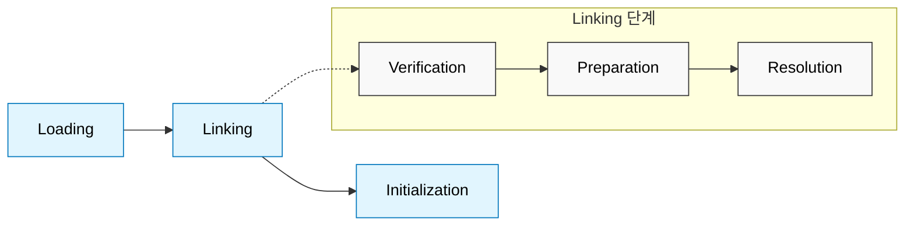
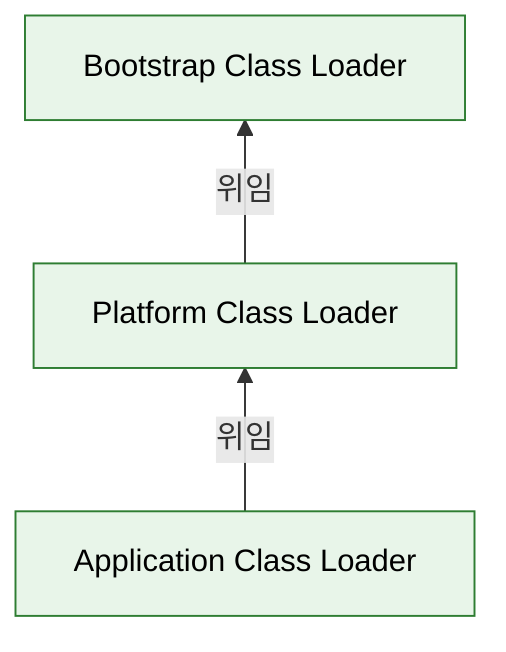

Java 코드가 실행되려면 바이트코드 (`.class` 파일)가 JVM 메모리 위에 로드되어야 하는데, 클래스로더는 실행 시점에 필요한 클래스를 동적으로 찾아 메모리에 적재하는 역할을 수행한다.

## 클래스 로딩 절차

클래스로더는 세 가지 주요 단계를 거쳐 클래스를 런타임 데이터 영역 (Runtime Data Area)에 적재한다.

1. 로딩 (Loading)
    - 바이트코드 (`.class`)를 읽어 Method Area에 저장
    - 클래스 이름, 부모 클래스, 메서드와 변수 정보 등을 메타데이터 형태로 로드
2. 링크 (Linking)
    - 검증 (Verification): 로드된 코드가 Java 언어 명세와 JVM 스펙을 준수하는지 확인
    - 준비 (Preparation): 정적 (static) 변수에 메모리를 할당하고 기본값 (디폴트값)으로 초기화
    - 분석 (Resolution): 심볼릭 레퍼런스 (Symbolic Reference)를 다이렉트 레퍼런스 (Direct Reference)로 변환
        - 심볼릭 레퍼런스: 컴파일 시점에는 참조 대상의 실제 메모리 주소를 알 수 없으므로 바이트코드에 기록해 둔 논리적 이름 (문자열)
        - 다이렉트 레퍼런스: JVM 메모리 공간 (Method Area)에 적재된 대상의 실제 물리적 메모리 주소 (포인터)
        - 런타임에 Constant Pool을 검색하여 문자열 기반의 참조를 JVM이 즉각 접근할 수 있는 물리적 주소로 치환하는 과정
3. 초기화 (Initialization)
    - 클래스의 정적 블록 (`static {}`)을 실행하고 정적 변수를 실제 정의된 값으로 할당

## 위임 모델 (Delegation Model)

JVM은 단일 클래스로더를 사용하지 않고, 계층화된 여러 클래스로더가 책임을 위임하는 방식으로 동작한다.

- 부트스트랩 클래스로더 (Bootstrap Class Loader): 최상위 로더로, `java.lang.Object` 등 핵심 자바 표준 라이브러리 로드
- 플랫폼 클래스로더 (Platform Class Loader): 자바 확장 API 및 플랫폼 관련 클래스 로드 (Java 9 이전의 Extension Class Loader)
- 애플리케이션 클래스로더 (Application Class Loader): 개발자가 작성한 애플리케이션 클래스 패스 (`classpath`)의 클래스 로드

이러한 위임 계층은 핵심 라이브러리의 보안을 보장하고 동일한 클래스가 중복 로드되는 것을 방지한다.

### 가시성 원칙 (Visibility Principle)

하위 로더는 상위 로더가 로드한 클래스를 참조할 수 있지만, 반대로 상위 로더는 하위 로더가 로드한 클래스를 볼 수 없다.

- 애플리케이션 클래스에서 `java.lang.String` 참조 가능
- JVM 핵심 라이브러리 내부에서 애플리케이션 클래스로더에 위치한 커스텀 객체 참조 불가능
