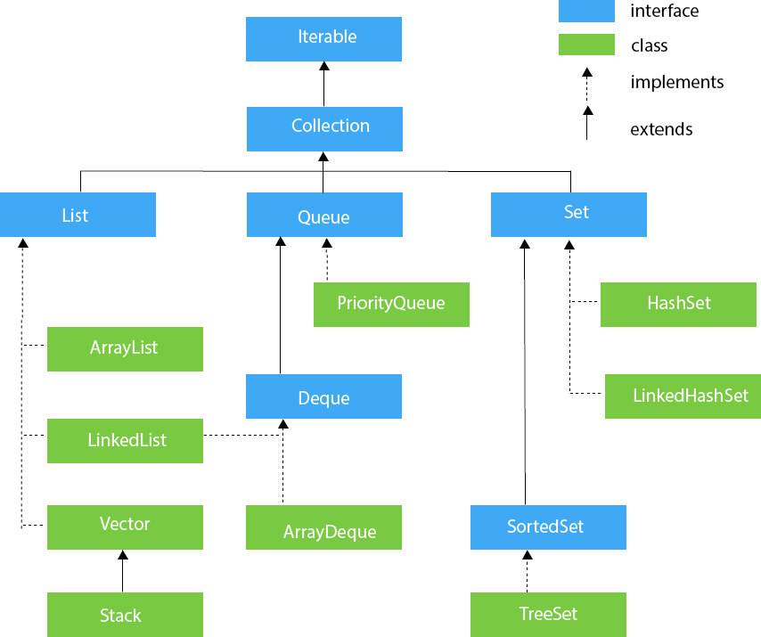

컬렉션은 객체 그룹을 저장하고 조작하기 위한 표준화된 프레임워크를 제공한다.



## Collection Interface

Iterator 인터페이스를 상속한 가장 기본이 되는 인터페이스로 add, remove, contains, isEmpty, size, toArray 등의 메소드를 가지고 있다.

### Collections vs Collection

- `Collection`: `List`, `Set` 등 모든 컬렉션 구현체의 조상이 되는 기본 인터페이스
- `Collections`: `Collection` 구현체들을 조작하는 유틸리티(utility) 메서드를 `static`으로 제공하는 클래스

[제공 메서드](https://docs.oracle.com/javase/8/docs/api/java/util/Collections.html)

## Collection 하위 Class 특징

|     Class     |       Base Class       | Base Interface | Duplicate | Order | Sort |         Description         |
|:-------------:|:----------------------:|:--------------:|:---------:|:-----:|:----:|:---------------------------:|
|   ArrayList   |      AbstractList      |      List      |     O     |   O   |  X   |         배열 기반의 리스트          |
|    Vector     |      AbstractList      |      List      |     O     |   O   |  X   |    동기화를 지원하는 배열 기반의 리스트     |
|     Stack     |         Vector         |      List      |     O     |   O   |  X   | Vector의 하위 클래스로 LIFO 구조의 스택 |
|  LinkedList   | AbstractSequentialList |  List, Deque   |     O     |   O   |  X   |       연결 리스트 기반의 리스트        |
|  ArrayDeque   |   AbstractCollection   |     Deque      |     O     |   O   |  X   |          배열 기반의 덱           |
| PriorityQueue |     AbstractQueue      |     Queue      |     O     |   O   |  O   |           우선순위 큐            |
|    HashSet    |      AbstractSet       |      Set       |     X     |   X   |  X   |        해시 테이블 기반의 집합        |
| LinkedHashSet |        HashSet         |      Set       |     X     |   O   |  X   |    해시 테이블과 연결 리스트 기반의 집합    |
|    TreeSet    |      AbstractSet       |   SortedSet    |     X     |   O   |  O   |       이진 검색 트리 기반의 집합       |

## Vector & Stack 사용하지 않는 이유

`Vector`와 `Stack`은 자바 초창기 버전부터 존재했던 클래스로, 현재는 하위 호환성을 위해서만 존재하며, 새로운 코드에서는 사용이 권장되지 않는다.

### 1. `synchronized`로 인한 성능 저하

`Vector`와 `Stack`의 거의 모든 메서드(예: `add()`, `remove()`)에는 `synchronized` 키워드가 적용되어 있다.

- 멀티스레드 환경에서 데이터의 일관성을 보장하지만(스레드 안전성), 메서드를 호출할 때마다 락(lock)을 획득하고 해제하는 오버헤드가 발생
- 단일 스레드 환경은 물론, 멀티스레드 환경에서도 `ArrayList`에 비해 심각한 성능 저하를 유발
- `Vector`의 동기화는 메서드 단위로만 동작하여, 여러 메서드를 조합하여 사용할 때는 여전히 스레드 안전성을 보장하지 못함

```java
public static void main(String[] args) {
    Vector<Integer> vector = new Vector<>();
    // ...
    if (!vector.isEmpty()) { // (1)
        // ...
        // 이 시점(1)과 (2) 사이에서 다른 스레드가 마지막 요소를 제거(remove) 가능
        // ...
        vector.remove(0); // (2)
    }
}
```

최근의 자바에서는 `synchronized` 대신 `CAS(Compare-And-Swap)` 알고리즘을 사용하는  `ConcurrentHashMap`와 같은 동시성 컬렉션을 사용하여 동기화 문제를 해결하고 있다.

### 2. 후입선출 구조 위반

Stack에는 후입선출을 위한 메서드만 존재하지만, Vector는 List 인터페이스를 구현하고 있어 get, add, remove 등의 메서드를 사용할 수 있다.

```java
public static void main(String[] args) {
    Stack<Integer> stack = new Stack<>();
    stack.push(1);
    stack.push(2);
    stack.push(3);

    stack.add(1, 4); // Stack의 후입선출 구조를 위반
    stack.remove(1); // Stack의 후입선출 구조를 위반
}
```

이는 Stack의 후입선출 구조를 위반하여 원하는 위치에 자유롭게 접근할 수 있게 만들어, Stack의 본래 목적에 맞지 않다.

###### 참고자료

- [java T point](https://www.javatpoint.com/collections-in-java)
- [Oracle Docs](https://docs.oracle.com/javase/8/docs/api/)
