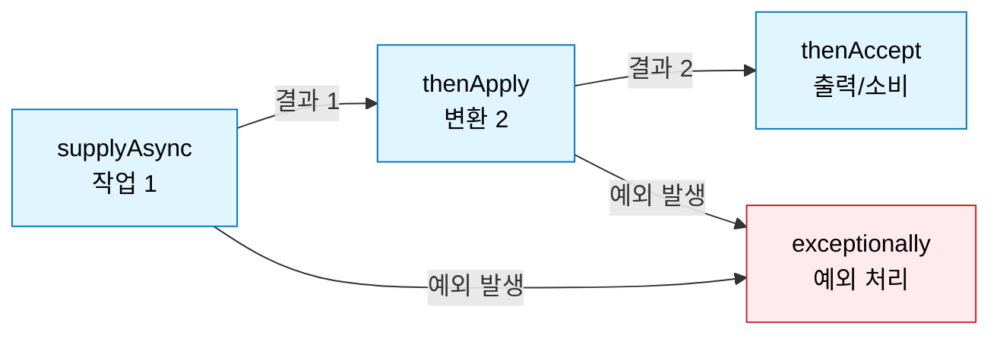

`CompletableFuture`는 자바 8에 도입된 비동기 처리 클래스로, 작업 결과를 대기 (Blocking)하지 않고 완료 시점에 콜백 메커니즘과 파이프라인 처리를 지원하는 핵심 도구다.

## 기존 Future의 한계

`ExecutorService`가 반환하는 `Future`는 비동기 결과를 조회하는 기능을 제공하지만, 완전한 논블로킹 (Non-blocking)을 구현하기에는 구조적 단점이 있다.

### 1. 결과 조회 시 블로킹 (Blocking)

`get()` 메서드를 호출하면 비동기 작업이 완료되어 결과가 반환될 때까지 현재 스레드가 대기 (Waiting) 상태에 빠진다.

- 스레드가 다른 유용한 작업을 수행하지 못하게 만들어 성능 저하를 일으킬 수 있음
- `isDone()`을 활용한 폴링 (Polling) 방식도 가능하지만 지속적인 CPU 자원 낭비를 유발함

```java
void example() {
    ExecutorService executor = Executors.newFixedThreadPool(2);
    Future<String> future = executor.submit(() -> {
        Thread.sleep(1000); // 1초 소요되는 긴 작업
        return "Result";
    });

    // 비동기 작업이 끝날 때까지 메인 스레드는 멈춰서 기다려야 함 (블로킹 발생)
    String result = future.get();
    System.out.println(result);
}
```

### 2. 작업 체이닝 (Chaining) 불가

비동기 작업 A가 끝난 후, 그 결과를 입력받아 비동기 작업 B를 실행하는 콜백 형태의 파이프라인 구성이 불가능하다.

- 결과를 활용하기 위해서는 결국 `get()`으로 블로킹하여 값을 꺼낸 뒤 다음 작업을 진행해야 함
- 결과적으로 연속적인 논블로킹 흐름이 끊기게 됨

### 3. 다중 작업 제어의 한계

여러 비동기 작업이 모두 완료되기를 기다리거나, 가장 빨리 끝난 결과 하나만 처리하는 로직을 구현하기 매우 번거롭다.

```java
void example() {
    Future<String> future1 = executor.submit(() -> "Task 1");
    Future<String> future2 = executor.submit(() -> "Task 2");

    // 두 작업이 모두 끝날 때까지 기다리려면 각각 블로킹 메서드를 호출해야 함
    String result1 = future1.get(); // Blocking
    String result2 = future2.get(); // Blocking
}
```

자바 8은 이러한 문제들을 해결하고 콜백 기반의 유연한 비동기 파이프라인을 구축할 수 있도록 `CompletableFuture`를 도입했다.

## CompletableFuture

`CompletableFuture`는 자체적인 정적 팩토리 메서드를 제공하므로, 기존처럼 `ExecutorService`를 거치거나 `Future`를 직접 제어할 필요 없이 논블로킹 파이프라인을 시작할 수 있다.

### 1. 작업 생성 메서드

작업의 결과 반환 여부에 따라 다음 두 가지 메서드를 선택하여 사용한다.

- `runAsync(Runnable)`: 반환값이 없는 비동기 작업을 실행할 때 사용한다.
- `supplyAsync(Supplier<U>)`: 연산 결과를 반환하는 비동기 작업을 실행할 때 사용한다.

### 2. 스레드 풀 (Executor) 지정 전략

팩토리 메서드 호출 시 사용할 스레드 풀을 생략할 수도, 명시할 수도 있다.

- 기본 스레드 풀 사용: 파라미터로 스레드 풀을 넘기지 않으면 내부적으로 전역 `ForkJoinPool.commonPool()`을 사용
- 커스텀 스레드 풀 명시 (권장): I/O 바운드 작업 (DB 접근, API 호출 등)의 경우 공용 풀 스레드가 고갈되면 애플리케이션 전체의 비동기 로직이 지연될 위험 존재
    - 용도에 맞는 커스텀 스레드 풀을 명시적으로 전달하는 것이 안전

## 비동기 콜백 체이닝 (Chaining)

비동기 작업이 완료되면, 스레드를 블로킹하지 않고 그 결과를 넘겨받아 후속 작업을 연속적으로 처리할 수 있다.



|  체이닝 메서드  |            매개변수 타입            |     반환(Return) 타입     |                                 용도 및 특징                                  |
|:---------------:|:-----------------------------------:|:-------------------------:|:-----------------------------------------------------------------------------:|
|  `thenApply()`  |          `Function<T, R>`           |  `CompletableFuture<R>`   |         이전 단계의 결과를 받아 다른 타입이나 값으로 변환 연산을 수행         |
| `thenAccept()`  |            `Consumer<T>`            | `CompletableFuture<Void>` | 이전 단계의 결과를 소비하여 출력이나 DB 로깅 등을 수행하고 값은 반환하지 않음 |
| `thenCompose()` | `Function<T, CompletableFuture<R>>` |  `CompletableFuture<R>`   |            이전 결과를 받아 또 다른 독립적인 비동기 퓨처 객체 반환            |

비동기 작업의 결과를 변환하고 소비하는 체이닝 흐름은 외부 결제 연동, 데이터베이스 조회 등에서 사용할 수 있다.

```java
public void processPayment(String orderId) {
    // 1. 주문 조회 (비동기)
    CompletableFuture.supplyAsync(() -> orderRepository.findById(orderId))
            // 2. 결과가 없으면 예외 발생, 있으면 반환 (타입 유지)
            .thenApply(orderOptional -> orderOptional.orElseThrow(OrderNotFoundException::new))
            // 3. 주문 정보를 받아 외부 결제 API 호출 (타입 변환: Order -> PaymentResult)
            .thenApply(order -> pgClient.requestPayment(order))
            // 4. 결제 성공 시 로그 출력 (결과 소비)
            .thenAccept(paymentResult -> log.info("결제 승인 완료: txId={}", paymentResult.getTxId()))
            // 5. 체이닝 도중 발생한 모든 예외 처리
            .exceptionally(ex -> {
                log.error("결제 처리 실패: orderId={}", orderId, ex);
                return null;
            });
}
```

## 다중 작업 병합

독립적으로 실행되는 복수의 비동기 작업을 조합하여 논리적 흐름을 제어한다.

### 1. allOf ()

매개변수로 전달된 여러 개의 퓨처가 모두 완료될 때까지 기다리는 새로운 퓨처를 반환한다.

- 여러 개의 독립적인 작업 (예: 다건의 이미지 업로드, 알림 발송 등)이 모두 무사히 끝났는지 대기할 때 주로 사용
- 반환 타입이 `CompletableFuture<Void>`이므로 각각의 결과값을 자동으로 리스트에 묶어주지 않음
- 결과를 취합하려면 `allOf()` 완료 이후 각각의 원본 퓨처에 `.join()`을 호출해 수동으로 취합 필요

```java
public CompletableFuture<List<String>> uploadImagesAsync(List<MultipartFile> files) {
    // 1. N개의 비동기 업로드 작업 퓨처 리스트 생성
    List<CompletableFuture<String>> uploadFutures = files.stream()
            .map(file -> CompletableFuture.supplyAsync(() -> s3Uploader.upload(file), customExecutor))
            .collect(Collectors.toList());

    // 2. 리스트를 배열로 변환하여 allOf에 전달
    CompletableFuture<Void> allFutures = CompletableFuture.allOf(
            uploadFutures.toArray(new CompletableFuture[0])
    );

    // 3. 모든 업로드가 완료되면 각 퓨처에서 이미지 URL을 추출하여 리스트로 반환
    return allFutures.thenApply(v ->
            uploadFutures.stream()
                    .map(CompletableFuture::join) // allOf 이후이므로 블로킹 대기 없음
                    .collect(Collectors.toList())
    );
}
```

### 2. anyOf ()

여러 작업 중 가장 먼저 완료된 작업의 결과값을 반환하는 새로운 퓨처를 생성한다.

- 빠른 응답 속도를 확보하기 위해 동일한 데이터를 조회하는 복제 서버 두 곳에 동시에 요청을 보내고, 먼저 도착하는 최초 응답만 사용할 때 유용

```java
public CompletableFuture<ExchangeRate> getFastestExchangeRate(String currencyCode) {
    // A, B 두 개의 환율 제공 API에 동시 요청
    CompletableFuture<ExchangeRate> providerA = CompletableFuture.supplyAsync(
            () -> exchangeRateClientA.fetchRate(currencyCode), customExecutor);

    CompletableFuture<ExchangeRate> providerB = CompletableFuture.supplyAsync(
            () -> exchangeRateClientB.fetchRate(currencyCode), customExecutor);

    // 가장 먼저 응답이 온(Latency가 가장 짧은) 제공자의 결과를 반환
    return CompletableFuture.anyOf(providerA, providerB)
            .thenApply(result -> (ExchangeRate) result) // anyOf는 Object를 반환하므로 캐스팅 필요
            .exceptionally(ex -> {
                log.error("모든 환율 조회 실패: {}", currencyCode, ex);
                return ExchangeRate.fallback();
            });
}
```

## 예외 처리

비동기 체이닝 도중 예외가 발생하면 그 예외는 파이프라인의 하위 단계로 전파된다. `CompletableFuture`는 이러한 예외를 우아하게 복구하거나 로깅할 수 있는 전용 메서드를 제공한다.

- `exceptionally(Function)`: 파이프라인 중간에 예외가 발생했을 때 호출되며, 오류 로그를 남기거나 기본 (Fallback) 값을 반환하여 체인을 정상화함
- `handle(BiFunction)`: 성공 시의 결과값과 실패 시의 예외 객체를 매개변수로 동시에 받아, 정상 흐름과 예외 흐름을 하나의 분기문에서 처리

## 활용 예시

`CompletableFuture`는 외부 API 병렬 호출, 메시지 큐 비동기 통신 등 실무의 다양한 I/O 바운드 병목 지점을 해소하는 데 유용하게 쓰인다.

### 1. 외부 API 병렬 호출 및 결과 조합 (순수 비즈니스 로직)

여러 외부 API를 순차적으로 호출하면 응답 시간이 누적되지만, `CompletableFuture`를 활용하면 여러 API를 병렬로 호출한 뒤 결과를 조합하여 성능을 크게 개선할 수 있다.

```java

@Service
@RequiredArgsConstructor
public class UserDashboardService {

    private final UserProfileClient userProfileClient;
    private final OrderHistoryClient orderHistoryClient;
    private final Executor customExecutor; // I/O 바운드 전용 커스텀 스레드 풀

    public CompletableFuture<UserDashboardResponse> getUserDashboard(Long userId) {
        // 1. 유저 프로필 조회 (비동기)
        CompletableFuture<UserProfile> profileFuture = CompletableFuture.supplyAsync(
                () -> userProfileClient.getProfile(userId),
                customExecutor
        );

        // 2. 유저 주문 내역 조회 (비동기)
        CompletableFuture<List<Order>> ordersFuture = CompletableFuture.supplyAsync(
                () -> orderHistoryClient.getOrders(userId),
                customExecutor
        );

        // 3. 두 작업이 모두 완료되면 thenCombine으로 결과를 조합 (스레드 풀 명시 권장)
        return profileFuture.thenCombineAsync(ordersFuture, (profile, orders) -> {
                    return new UserDashboardResponse(profile, orders);
                }, customExecutor)
                .exceptionally(ex -> {
                    log.error("대시보드 데이터 조회 실패 (userId: {})", userId, ex);
                    // 장애 격리를 위해 오류 발생 시 기본(Fallback) 객체 반환
                    return UserDashboardResponse.empty();
                });
    }
}
```

### 2. Kafka 메시지 비동기 발행 및 콜백 처리

스프링 카프카 (Spring Kafka)의 `KafkaTemplate`은 결과로 `CompletableFuture`를 반환하는데, 메인 스레드의 블로킹 없이 메시지 전송 성공 여부에 따른 콜백을 처리할 수 있다.

```java

@Service
@RequiredArgsConstructor
public class NotificationEventPublisher {

    private final KafkaTemplate<String, NotificationEvent> kafkaTemplate;

    public void publishNotification(NotificationEvent event) {
        String topic = "notification-topic";

        // 메시지 전송 후 CompletableFuture 반환
        CompletableFuture<SendResult<String, NotificationEvent>> future =
                kafkaTemplate.send(topic, event.getUserId(), event);

        // 결과를 기다리지 않고 콜백 체이닝으로 성공/실패 분기 처리
        future.whenComplete((result, ex) -> {
            if (ex == null) {
                // 정상 발행 시 메타데이터 로깅 등 후속 처리
                RecordMetadata metadata = result.getRecordMetadata();
                log.info("이벤트 발행 완료: topic={}, partition={}, offset={}",
                        metadata.topic(), metadata.partition(), metadata.offset());
            } else {
                // 실패 시 Dead Letter Queue 적재, 알림 발송 등 예외 복구 로직
                log.error("이벤트 발행 실패: event={}", event, ex);
                saveToDeadLetterQueue(event);
            }
        });
    }

    private void saveToDeadLetterQueue(NotificationEvent event) {
        // 재시도 또는 수동 처리를 위한 실패 이벤트 보관 로직
    }
}
```
