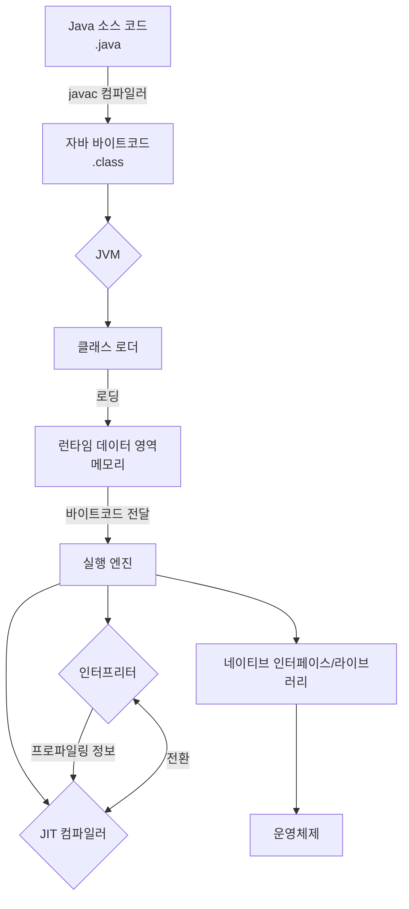
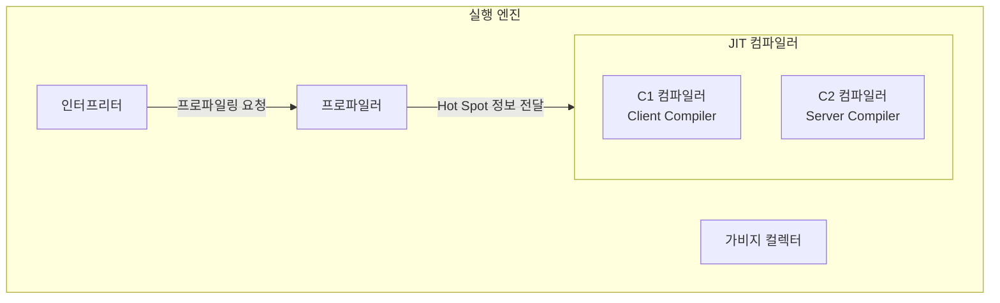
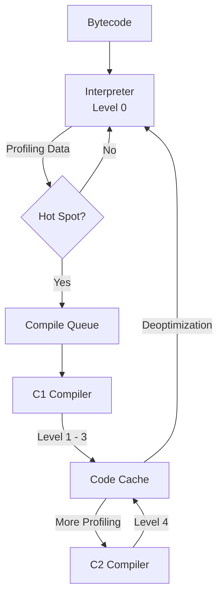

자바 소스 코드는 자바 컴파일러(`javac`)에 의해 바이트코드(`.class`)로 변환된 후, JVM 위에서 실행된다.

- JVM은 바이트코드를 단순히 한 줄씩 실행하는 것이 아니라, 런타임에 동적으로 코드를 분석하고 최적화하는 JIT(Just-In-Time) 컴파일러 활용
- 인터프리터와 JIT 컴파일러의 협업을 통해 런타임에 코드를 분석하고 최적화하여 높은 성능 달성

## 전체 실행 흐름

JVM의 전체적인 실행 흐름은 클래스 로딩, 메모리 배치, 실행 엔진 가동으로 요약할 수 있다.



## 프로그램 실행의 시작과 Mixed Mode

자바 실행 환경인 HotSpot JVM은 기본적으로 인터프리터와 JIT 컴파일러 방식을 혼합한 `-Xmixed` 모드로 동작한다.

- 초기 실행: JVM은 바이트코드를 인터프리터 방식으로 즉시 한 줄씩 실행하여, 컴파일을 기다리지 않고 애플리케이션의 구동 속도 확보
- 백그라운드 최적화: 코드가 실행되는 동안, JIT 컴파일러는 별도의 컴파일러 스레드에서 비동기적으로 핫스팟 코드를 찾아 네이티브 코드로 변환하는 최적화 작업 수행

## Hot Method Detection 및 OSR

JVM은 한 번에 모든 코드를 컴파일하지 않고, 실행 빈도가 높은 핫스팟(Hot Spot)을 효율적으로 찾아내어 최적화한다.

- 감지 메커니즘
    - `Invocation Counter`: 메소드가 호출된 누적 횟수를 기록
    - `Backedge Counter`: 루프 본문의 반복 횟수(정확히는 루프 끝에서 시작점으로 돌아가는 분기 횟수) 기록
    - 두 카운터의 합이 JVM이 설정한 임계치(Threshold)를 초과하면 해당 코드는 컴파일 대상 큐에 등록
- On-Stack Replacement(OSR)
    - 메소드 전체 호출 횟수는 낮더라도 특정 루프가 매우 길게 실행되는 경우에 적용되는 특수한 최적화 기법
    - 인터프리터로 루프를 실행하던 도중, 해당 루프가 포함된 메소드의 컴파일이 완료되면 즉시 실행 지점을 컴파일된 네이티브 코드로 교체하여 성능 향상

## 실행 엔진의 구조와 JIT 컴파일러

실행 엔진은 바이트코드를 실행하는 주체이며, 크게 다음과 같은 요소로 구성된다.



- 인터프리터(Interpreter): 바이트코드를 한 줄씩 해석하고 실행
- JIT 컴파일러(Just-In-Time Compiler): 인터프리터가 수집한 프로파일링 정보를 바탕으로 Hot Spot 코드를 찾아 네이티브 코드로 컴파일
    - C1 컴파일러: 빠른 컴파일 속도에 중점
    - C2 컴파일러: 최종 코드의 실행 성능을 극대화하는 데 중점
- 프로파일러(Profiler): 코드의 실행 빈도, 분기 예측 등 최적화에 필요한 정보를 수집
- 가비지 컬렉터(Garbage Collector, GC): 더 이상 사용되지 않는 객체를 메모리에서 해제하는 역할

C1과 C2 컴파일러는 실행 엔진 내 JIT 컴파일러의 일부로서, 인터프리터 및 프로파일러와 상호작용하며 계층적 컴파일을 수행한다.

### C1 vs C2 컴파일러

- C1(Client) 컴파일러
    - 빠른 컴파일 속도와 낮은 응답 지연 시간
    - 코드 최적화는 덜 정교하지만, 빠른 컴파일로 초기 실행 성능 향상
    - 즉시 실행해야 하는 애플리케이션에 적합
- C2(Server) 컴파일러
    - 컴파일 비용이 높더라도 최종 실행 성능의 극대화
    - 실행 속도는 느리지만, 높은 최적화 수준으로 warm-up 시간이 지난 후 빠른 성능 제공
    - 장기 실행되는 애플리케이션에 적합

## 계층적 컴파일 구조

현대 JVM은 빠른 응답성과 최종 성능을 모두 만족시키기 위해 5단계의 계층형 컴파일 체계를 활용하며, 각 레벨은 컴파일 속도와 최적화 수준의 트레이드오프 관계를 가진다.

|   레벨    |          명칭           |                       상세 특징                       |
|:-------:|:---------------------:|:-------------------------------------------------:|
| Level 0 |      Interpreter      |             프로파일링 데이터를 수집하며 바이트코드 실행              |
| Level 1 |      C1(Simple)       |      최적화나 프로파일링 없이 가장 단순하게 C1으로 컴파일하여 속도 향상       |
| Level 2 |  C1(Limited Profile)  |           낮은 수준의 카운터 정보만 포함하여 C1으로 컴파일            |
| Level 3 |   C1(Full Profile)    |   분기 예측, 타입 정보 등 상세 데이터를 수집하며 C1으로 컴파일(C2 최적화용)   |
| Level 4 | C2(Full Optimization) | 수집된 모든 데이터를 바탕으로 C2 컴파일러가 고도의 최적화를 적용한 네이티브 코드 생성 |

계층적 컴파일의 전체 흐름은 다음과 같다.



## Code Cache 및 Sweeper 관리

컴파일된 네이티브 코드는 `Code Cache`라는 JVM 내 전용 메모리 영역에 저장된다.

- 코드 상태 변화
    1. `Active`: 현재 활발히 실행 중인 상태
    2. `Not-Entrant`: 역최적화 등으로 인해 새로운 진입은 차단되었으나, 기존 실행 스레드는 남아있는 상태
    3. `Zombie`: 어떤 스레드도 참조하지 않는 완전한 폐기 대상 상태
- CodeHeap Sweeper: JVM 내부의 스위퍼가 주기적으로 메모리를 검사하여 `Zombie` 상태의 코드를 찾아 저장 공간을 해제(Free)
    - `Code Cache`가 가득 차면 JIT 컴파일이 중단되어 시스템 성능이 급격히 저하
    - `-XX:ReservedCodeCacheSize` 옵션을 통해 적절한 크기를 설정하는 것이 중요

## 주요 JIT 최적화 기법

JIT 컴파일러는 다양한 최적화 기법을 활용하여 실행 성능을 극대화한다.

### Method Inlining(메소드 인라이닝)

호출 빈도가 높고 크기가 작은 메소드의 코드를 호출 지점에 직접 삽입하는 기법으로, 함수 호출에 필요한 비용을 제거하여 성능을 향상시킨다.

```java
// 최적화 전 Java 코드
public int calculate() {
    int result = 0;
    for (int i = 0; i < 1000; i++) {
        result = add(result, i); // add 메소드를 반복 호출
    }
    return result;
}

private int add(int a, int b) {
    return a + b;
}

// JIT 컴파일러 최적화 후
public int calculate() {
    int result = 0;
    for (int i = 0; i < 1000; i++) {
        result = result + i; // 메소드 호출 없이 연산이 직접 수행
    }
    return result;
}

```

위처럼 `add` 메소드는 크기가 작고 자주 호출되므로 인라이닝 대상이 되어, 호출 오버헤드가 제거되고 루프 내에서 추가적인 최적화가 가능해진다.

### Escape Analysis(탈출 분석)

객체의 사용 범위를 분석하여 특정 객체가 메소드나 스레드의 경계를 벗어나는지(escape) 확인하는 기법으로, 탈출하지 않는 객체에 대해 여러 최적화를 적용한다.

#### Scalar Replacement(스칼라 대체)

객체를 힙에 할당하는 대신, 객체의 필드들을 각각의 지역 변수(스칼라 값)로 분해하여 스택이나 레지스터에 할당한다.

```java
// 최적화 전 Java 코드
// Point 객체는 이 메소드 내에서만 생성되고 사용된 후 사라짐(탈출하지 않음)
public void getPointDistance() {
    Point p = new Point(10, 20);
    double distance = Math.sqrt(p.x * p.x + p.y * p.y);
    // ...Point 객체 미사용
}

// JIT 컴파일러의 최적화 후
// JIT 컴파일러는 Point 객체가 힙에 할당될 필요가 없다고 판단하고, 필드 x와 y를 지역 변수로 대체
public void getPointDistance() {
    int x = 10;
    int y = 20;
    double distance = Math.sqrt(x * x + y * y);
    // ...Point 객체 미사용
}
```

#### Lock Elision(락 제거)

탈출 분석을 통해 특정 객체(Lock)가 단일 스레드에서만 사용되는 것을 확인하면, 해당 객체에 대한 동기화 구문(`synchronized`)을 불필요하다고 판단하여 제거한다.

```java
// 최적화 전 Java 코드
// 아래 getSafeCount 메소드 내의 'counter' 객체는 이 메소드 안에서만 생성되고 사용
class Counter {

    private int count = 0;

    // 동기화된 메소드
    public synchronized void increment() {
        count++;
    }

    public int getCount() {
        return count;
    }
}

public int getSafeCount() {
    Counter counter = new Counter(); // counter 객체는 이 메소드를 탈출하지 않음
    counter.increment();
    counter.increment();
    return counter.getCount();
}

// JIT 컴파일러의 최적화 후 
// JIT은 'counter' 객체가 스레드 로컬임을 인지하고, increment() 메소드를 호출할 때 동기화(락) 비용을 제거
class Counter {

    private int count = 0;

    // 락이 제거된 메소드 (개념적 표현)
    public void increment() {
        count++;
    }

    public int getCount() {
        return count;
    }
}

public int getSafeCount() {
    Counter counter = new Counter();
    counter.increment(); // 동기화 없이 호출
    counter.increment(); // 동기화 없이 호출
    return counter.getCount();
}
```

### Loop Optimization(루프 최적화)

루프는 프로그램 성능에 큰 영향을 미치므로 JIT 컴파일러는 다양한 루프 관련 최적화를 수행한다.

#### Loop Unrolling(루프 펼치기)

루프의 반복 횟수를 줄이기 위해 루프 본문을 여러 번 복제하는 기법이다. 이는 루프 제어에 드는 분기 예측 비용을 감소시킨다.

```java
// 최적화 전 Java 코드
public void exampleLoop() {
    for (int i = 0; i < 4; i++) {
        process(i);
    }
}

// JIT 컴파일러의 최적화 후
// JIT은 루프 제어에 드는 비용(분기 예측)을 줄이기 위해 루프 본문을 펼침
public void exampleLoop() {
    process(0);
    process(1);
    process(2);
    process(3);
}
```

#### Lock Coarsening(락 병합)

루프 내부에서 동일한 락 객체에 대한 `lock-unlock` 작업이 반복될 경우, 이를 루프 바깥으로 빼내어 락의 범위를 확장하고 락 획득/해제 횟수를 줄인다.

```java
// 최적화 전 Java 코드
public void synchronizedLoop() {
    for (int i = 0; i < 1000; i++) {
        synchronized (this) {
            // do something
        }
    }
}

// JIT 컴파일러의 최적화 후
// JIT은 여러 번의 락 연산을 하나의 큰 락으로 병합하여 오버헤드를 줄임
public void synchronizedLoop() {
    synchronized (this) {
        for (int i = 0; i < 1000; i++) {
            // do something
        }
    }
}
```

## 9. Graal 및 JVMCI(Modern JIT)

최근에는 자바 언어 자체로 작성된 고성능 컴파일러가 도입되어 확장성과 성능을 높이고 있다.

- JVMCI(JVM Compiler Interface): 자바 가상 머신과 외부 컴파일러를 연결하는 표준 인터페이스로, 외부 컴파일러를 플러그인처럼 교체하여 사용할 수 있게 해줌
- Graal Compiler
    - JVMCI를 통해 HotSpot JVM에 연결되는 차세대 고성능 JIT 컴파일러
    - Partial Escape Analysis 등 C2보다 더 정교하고 공격적인 분석 및 최적화 기법 제공
    - 컴파일러 자체가 자바로 작성되어, 컴파일러 실행 코드 또한 JIT 최적화의 대상이 되는 자기 참조적 특징 보유
