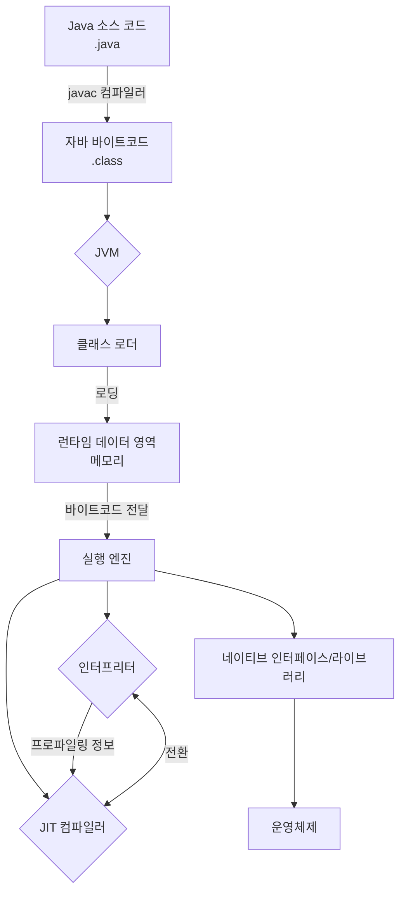
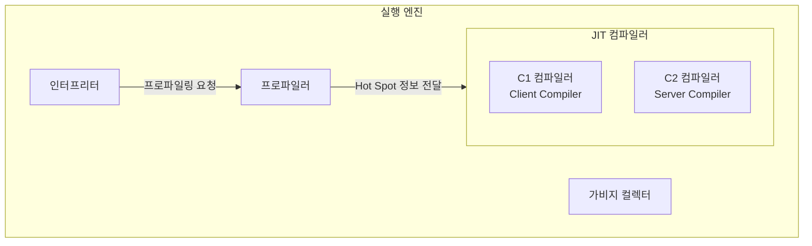
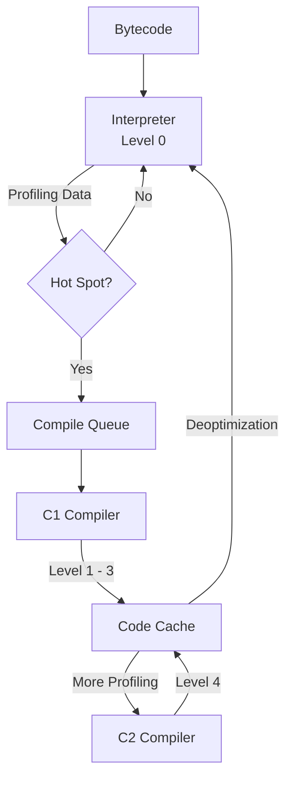

자바는 플랫폼 독립성을 위해 바이트코드 사용하며, 실행 시점에 기계어로 번역하는 2단계 컴파일 구조를 가진다.

- 초기 자바는 인터프리터의 느린 속도가 단점이었으나, JIT 컴파일러의 도입으로 성능 확보
- AOT를 통해 클라우드 네이티브 환경의 효율성 확보

## 전체 실행 흐름

JVM의 실행 흐름은 소스 코드의 바이트코드 변환, 클래스 로딩, 실행 엔진의 최적화 가동으로 요약된다.


```mermaid
flowchart TD
    A[Java 소스 코드<br>.java] -->|javac 컴파일러| B[자바 바이트코드<br>.class]
    B --> C{JVM}
    C --> D[클래스 로더]
    D -- 로딩 --> E[런타임 데이터 영역<br>메모리]
    E -- 바이트코드 전달 --> F[실행 엔진]
    F --> G{인터프리터}
    F --> H{JIT 컴파일러}
    G -- 프로파일링 정보 --> H
    G <-->|전환| H
    F --> I[네이티브 인터페이스/라이브러리]
    I --> J[운영체제]
```

## 바이트코드와 인터프리터 채택 배경 - 플랫폼 독립성 vs 실행 성능

당시 C/C++과 같은 언어는 특정 CPU와 OS에 맞춘 네이티브 바이너리를 생성하여 배포해야 했으므로, 기기마다 코드를 재컴파일해야 하는 번거로움이 있었다.

- Write Once, Run Anywhere (WORA): 한 번 작성한 코드를 모든 장치에서 실행하는 것을 최우선 가치로 설정
- 중간 형태의 도입: 특정 하드웨어에 종속되지 않는 가상의 명령어 집합인 바이트코드를 고안
- JVM의 역할: 운영체제별로 다르게 구현된 JVM이 동일한 바이트코드를 읽어 각 환경의 기계어로 실시간 번역

결과적으로 자바는 실행 속도의 손실을 감수하더라도, 하나의 바이트코드 파일로 전 세계 모든 장치에 배포 가능한 범용성을 확보했다.

## JIT 컴파일러의 개념과 필요성

JIT(Just-In-Time) 컴파일러는 프로그램을 실행하는 시점에 바이트코드를 해당 플랫폼의 네이티브 기계어로 번역하는 역할을 수행한다.

- 하이브리드 실행 모델: 초기 구동 시에는 인터프리터로 즉시 실행하고, 핫스팟 코드는 JIT로 컴파일하여 실행 성능 극대화
- 런타임 최적화: 실행 중 수집된 프로파일링 데이터를 기반으로 실제 사용 패턴에 최적화된 기계어 생성
- 지연 컴파일: 모든 코드를 미리 컴파일하지 않고 필요한 시점에만 수행하여 메모리와 CPU 자원 효율화

인터프리터 방식의 특성상 네이티브 언어 대비 성능이 낮은 한계가 있어, JIT 컴파일러로 실행 중 반복되는 코드를 탐지하고 기계어로 최적화하여 이러한 성능 제약을 해결한다.

### JIT와 AOT의 비교

현대 자바는 실행 환경에 따라 실시간 컴파일(JIT)과 사전 컴파일(AOT) 방식을 선택하여 사용할 수 있다.

|   구분   |  JIT (Just-In-Time)   |     AOT (Ahead-Of-Time)     |
|:------:|:---------------------:|:---------------------------:|
| 컴파일 시점 |    런타임 (프로그램 실행 중)    |        빌드 타임 (실행 전)         |
| 최고 성능  | 매우 높음 (실행 데이터 기반 최적화) |      높음 (정적 분석 기반 최적화)      |
| 기동 속도  |     느림 (예열 시간 필요)     |      매우 빠름 (즉시 실행 가능)       |
| 메모리 사용 | 높음 (JVM 엔진 및 컴파일러 포함) |     매우 낮음 (필수 바이너리만 포함)     |
| 적합한 환경 | 장기 실행 대규모 서버, 복잡한 로직  | AWS Lambda, 마이크로서비스, CLI 도구 |

- AOT 방식: 빌드 시점에 특정 OS용 바이너리를 직접 생성하므로 기동 속도가 즉각적이며 메모리 점유율이 낮음
- JIT 방식: 프로그램이 동작하는 환경과 실제 데이터 흐름을 분석하므로, 특정 조건에서 AOT보다 더 높은 수준의 성능 최적화 가능

## 프로그램 실행의 시작과 Mixed Mode

자바 실행 환경인 HotSpot JVM은 기본적으로 인터프리터와 JIT 컴파일러 방식을 혼합한 `-Xmixed` 모드로 동작한다.

- 초기 실행: JVM은 바이트코드를 인터프리터 방식으로 즉시 한 줄씩 실행하여, 컴파일을 기다리지 않고 애플리케이션의 구동 속도 확보
- 백그라운드 최적화: 코드가 실행되는 동안, JIT 컴파일러는 별도의 컴파일러 스레드에서 비동기적으로 핫스팟 코드를 찾아 네이티브 코드로 변환하는 최적화 작업 수행

## Hot Method Detection 및 OSR

JVM은 한 번에 모든 코드를 컴파일하지 않고, 실행 빈도가 높은 핫스팟(Hot Spot)을 효율적으로 찾아내어 최적화한다.

- 감지 메커니즘
    - `Invocation Counter`: 메소드가 호출된 누적 횟수를 기록
    - `Backedge Counter`: 루프 본문의 반복 횟수(정확히는 루프 끝에서 시작점으로 돌아가는 분기 횟수) 기록
    - 두 카운터의 합이 JVM이 설정한 임계치(Threshold)를 초과하면 해당 코드는 컴파일 대상 큐에 등록
- On-Stack Replacement(OSR)
    - 메소드 전체 호출 횟수는 낮더라도 특정 루프가 매우 길게 실행되는 경우에 적용되는 특수한 최적화 기법
    - 인터프리터로 루프를 실행하던 도중, 해당 루프가 포함된 메소드의 컴파일이 완료되면 즉시 실행 지점을 컴파일된 네이티브 코드로 교체하여 성능 향상

## 실행 엔진의 구조와 JIT 컴파일러

실행 엔진은 바이트코드를 실행하는 주체이며, 크게 다음과 같은 요소로 구성된다.


```mermaid
graph TD
    subgraph 실행 엔진
        Interpreter[인터프리터]

        subgraph JIT_Compiler [JIT 컴파일러]
            direction TB
            C1[C1 컴파일러<br>Client Compiler]
            C2[C2 컴파일러<br>Server Compiler]
        end

        Profiler[프로파일러]
        GC[가비지 컬렉터]
    end

    Interpreter -- 프로파일링 요청 --> Profiler
    Profiler -- Hot Spot 정보 전달 --> JIT_Compiler
```

- 인터프리터(Interpreter): 바이트코드를 한 줄씩 해석하고 실행
- JIT 컴파일러(Just-In-Time Compiler): 인터프리터가 수집한 프로파일링 정보를 바탕으로 Hot Spot 코드를 찾아 네이티브 코드로 컴파일
    - C1 컴파일러: 빠른 컴파일 속도에 중점
    - C2 컴파일러: 최종 코드의 실행 성능을 극대화하는 데 중점
- 프로파일러(Profiler): 코드의 실행 빈도, 분기 예측 등 최적화에 필요한 정보를 수집
- 가비지 컬렉터(Garbage Collector, GC): 더 이상 사용되지 않는 객체를 메모리에서 해제하는 역할

C1과 C2 컴파일러는 실행 엔진 내 JIT 컴파일러의 일부로서, 인터프리터 및 프로파일러와 상호작용하며 계층적 컴파일을 수행한다.

### C1 vs C2 컴파일러

- C1(Client) 컴파일러
    - 빠른 컴파일 속도와 낮은 응답 지연 시간
    - 코드 최적화는 덜 정교하지만, 빠른 컴파일로 초기 실행 성능 향상
    - 즉시 실행해야 하는 애플리케이션에 적합
- C2(Server) 컴파일러
    - 컴파일 비용이 높더라도 최종 실행 성능의 극대화
    - 실행 속도는 느리지만, 높은 최적화 수준으로 warm-up 시간이 지난 후 빠른 성능 제공
    - 장기 실행되는 애플리케이션에 적합

## 계층적 컴파일 구조

현대 JVM은 빠른 응답성과 최종 성능을 모두 만족시키기 위해 5단계의 계층형 컴파일 체계를 활용하며, 각 레벨은 컴파일 속도와 최적화 수준의 트레이드오프 관계를 가진다.

|   레벨    |          명칭           |                       상세 특징                       |
|:-------:|:---------------------:|:-------------------------------------------------:|
| Level 0 |      Interpreter      |             프로파일링 데이터를 수집하며 바이트코드 실행              |
| Level 1 |      C1(Simple)       |      최적화나 프로파일링 없이 가장 단순하게 C1으로 컴파일하여 속도 향상       |
| Level 2 |  C1(Limited Profile)  |           낮은 수준의 카운터 정보만 포함하여 C1으로 컴파일            |
| Level 3 |   C1(Full Profile)    |   분기 예측, 타입 정보 등 상세 데이터를 수집하며 C1으로 컴파일(C2 최적화용)   |
| Level 4 | C2(Full Optimization) | 수집된 모든 데이터를 바탕으로 C2 컴파일러가 고도의 최적화를 적용한 네이티브 코드 생성 |

계층적 컴파일의 전체 흐름은 다음과 같다.


```mermaid
graph TD
    A[Bytecode] --> B[Interpreter<br>Level 0]
    B -->|Profiling Data| C{Hot Spot?}
    C -- No --> B
    C -- Yes --> D[Compile Queue]
    D --> E[C1 Compiler]
    E -->|Level 1 - 3| F[Code Cache]
    F -->|More Profiling| G[C2 Compiler]
    G -->|Level 4| F
    F -->|Deoptimization| B
```

## Code Cache 및 Sweeper 관리

컴파일된 네이티브 코드는 `Code Cache`라는 JVM 내 전용 메모리 영역에 저장된다.

- 코드 상태 변화
    1. `Active`: 현재 활발히 실행 중인 상태
    2. `Not-Entrant`: 역최적화 등으로 인해 새로운 진입은 차단되었으나, 기존 실행 스레드는 남아있는 상태
    3. `Zombie`: 어떤 스레드도 참조하지 않는 완전한 폐기 대상 상태
- CodeHeap Sweeper: JVM 내부의 스위퍼가 주기적으로 메모리를 검사하여 `Zombie` 상태의 코드를 찾아 저장 공간을 해제(Free)
    - `Code Cache`가 가득 차면 JIT 컴파일이 중단되어 시스템 성능이 급격히 저하
    - `-XX:ReservedCodeCacheSize` 옵션을 통해 적절한 크기를 설정하는 것이 중요

## 주요 JIT 최적화 기법

JIT 컴파일러는 다양한 최적화 기법을 활용하여 실행 성능을 극대화한다.

### Method Inlining(메소드 인라이닝)

호출 빈도가 높고 크기가 작은 메소드의 코드를 호출 지점에 직접 삽입하는 기법으로, 함수 호출에 필요한 비용을 제거하여 성능을 향상시킨다.

```java
// 최적화 전 Java 코드
public int calculate() {
    int result = 0;
    for (int i = 0; i < 1000; i++) {
        result = add(result, i); // add 메소드를 반복 호출
    }
    return result;
}

private int add(int a, int b) {
    return a + b;
}

// JIT 컴파일러 최적화 후
public int calculate() {
    int result = 0;
    for (int i = 0; i < 1000; i++) {
        result = result + i; // 메소드 호출 없이 연산이 직접 수행
    }
    return result;
}

```

위처럼 `add` 메소드는 크기가 작고 자주 호출되므로 인라이닝 대상이 되어, 호출 오버헤드가 제거되고 루프 내에서 추가적인 최적화가 가능해진다.

### Escape Analysis(탈출 분석)

객체의 사용 범위를 분석하여 특정 객체가 메소드나 스레드의 경계를 벗어나는지(escape) 확인하는 기법으로, 탈출하지 않는 객체에 대해 여러 최적화를 적용한다.

#### Scalar Replacement(스칼라 대체)

객체를 힙에 할당하는 대신, 객체의 필드들을 각각의 지역 변수(스칼라 값)로 분해하여 스택이나 레지스터에 할당한다.

```java
// 최적화 전 Java 코드
// Point 객체는 이 메소드 내에서만 생성되고 사용된 후 사라짐(탈출하지 않음)
public void getPointDistance() {
    Point p = new Point(10, 20);
    double distance = Math.sqrt(p.x * p.x + p.y * p.y);
    // ...Point 객체 미사용
}

// JIT 컴파일러의 최적화 후
// JIT 컴파일러는 Point 객체가 힙에 할당될 필요가 없다고 판단하고, 필드 x와 y를 지역 변수로 대체
public void getPointDistance() {
    int x = 10;
    int y = 20;
    double distance = Math.sqrt(x * x + y * y);
    // ...Point 객체 미사용
}
```

#### Lock Elision(락 제거)

탈출 분석을 통해 특정 객체(Lock)가 단일 스레드에서만 사용되는 것을 확인하면, 해당 객체에 대한 동기화 구문(`synchronized`)을 불필요하다고 판단하여 제거한다.

```java
// 최적화 전 Java 코드
// 아래 getSafeCount 메소드 내의 'counter' 객체는 이 메소드 안에서만 생성되고 사용
class Counter {

    private int count = 0;

    // 동기화된 메소드
    public synchronized void increment() {
        count++;
    }

    public int getCount() {
        return count;
    }
}

public int getSafeCount() {
    Counter counter = new Counter(); // counter 객체는 이 메소드를 탈출하지 않음
    counter.increment();
    counter.increment();
    return counter.getCount();
}

// JIT 컴파일러의 최적화 후 
// JIT은 'counter' 객체가 스레드 로컬임을 인지하고, increment() 메소드를 호출할 때 동기화(락) 비용을 제거
class Counter {

    private int count = 0;

    // 락이 제거된 메소드 (개념적 표현)
    public void increment() {
        count++;
    }

    public int getCount() {
        return count;
    }
}

public int getSafeCount() {
    Counter counter = new Counter();
    counter.increment(); // 동기화 없이 호출
    counter.increment(); // 동기화 없이 호출
    return counter.getCount();
}
```

### Loop Optimization(루프 최적화)

루프는 프로그램 성능에 큰 영향을 미치므로 JIT 컴파일러는 다양한 루프 관련 최적화를 수행한다.

#### Loop Unrolling(루프 펼치기)

루프의 반복 횟수를 줄이기 위해 루프 본문을 여러 번 복제하는 기법이다. 이는 루프 제어에 드는 분기 예측 비용을 감소시킨다.

```java
// 최적화 전 Java 코드
public void exampleLoop() {
    for (int i = 0; i < 4; i++) {
        process(i);
    }
}

// JIT 컴파일러의 최적화 후
// JIT은 루프 제어에 드는 비용(분기 예측)을 줄이기 위해 루프 본문을 펼침
public void exampleLoop() {
    process(0);
    process(1);
    process(2);
    process(3);
}
```

#### Lock Coarsening(락 병합)

루프 내부에서 동일한 락 객체에 대한 `lock-unlock` 작업이 반복될 경우, 이를 루프 바깥으로 빼내어 락의 범위를 확장하고 락 획득/해제 횟수를 줄인다.

```java
// 최적화 전 Java 코드
public void synchronizedLoop() {
    for (int i = 0; i < 1000; i++) {
        synchronized (this) {
            // do something
        }
    }
}

// JIT 컴파일러의 최적화 후
// JIT은 여러 번의 락 연산을 하나의 큰 락으로 병합하여 오버헤드를 줄임
public void synchronizedLoop() {
    synchronized (this) {
        for (int i = 0; i < 1000; i++) {
            // do something
        }
    }
}
```

## Graal 및 JVMCI(Modern JIT)

최근 자바는 자바 언어 자체로 작성된 고성능 컴파일러를 도입하여 확장성과 효율성을 높이고 있다.

- JVMCI(JVM Compiler Interface): JVM과 외부 컴파일러를 연결하는 표준 인터페이스로, 컴파일러를 플러그인처럼 교체할 수 있도록 지원
- Graal Compiler: JVMCI를 통해 HotSpot JVM에 연결되는 차세대 컴파일러로, 정교한 탈출 분석 등 C2보다 공격적인 최적화 제공

### GraalVM Native Image (AOT)

클라우드 네이티브 환경에 대응하기 위해 GraalVM은 바이트코드를 실행 파일로 직접 변환하는 네이티브 이미지 기능을 제공한다.

- 정적 분석: 빌드 시점에 애플리케이션의 모든 경로를 분석하여 필요한 코드만 추출
- 즉시 실행: JVM 구동과 JIT 예열 과정이 생략되므로 밀리초 단위의 기동 속도 확보
- 제약 사항: 리플렉션, 동적 프록시 등 자바의 동적 기능을 사용하려면 별도의 정적 설정 파일 필요
- 플랫폼 종속성: 빌드 시점의 운영체제와 CPU 아키텍처에 종속된 바이너리가 생성

## JVM Warm-up

JIT 컴파일과 클래스 로딩의 지연 특성으로 인해, JVM 기반 애플리케이션은 배포 직후 첫 요청들의 처리 시간이 정상 상태 대비 수십~수백 배 느려질 수 있다.

- 클래스 로딩 지연: JVM은 모든 클래스를 기동 시점에 로딩하지 않고, 실제 코드 경로가 실행될 때 해당 클래스를 동적으로 로딩
- JIT 컴파일 대기: 첫 요청은 인터프리터 모드로 실행되며, 핫스팟으로 감지되어 네이티브 코드로 컴파일되기까지 반복 실행이 필요
- 복합 지연: 클래스 로딩과 인터프리터 실행이 동시에 발생하여 CPU 사용률이 급증하고, 이 시간 동안 점유된 자원(DB 커넥션, 스레드 등)이 반환되지 않아 후속 요청에 연쇄 지연 유발

### 웜업의 목적

실제 트래픽이 유입되기 전에 주요 코드 경로를 미리 실행하여, 클래스 로딩과 JIT 컴파일을 사전에 완료하는 전략이다.

- 클래스 로딩 완료: 비즈니스 로직에 필요한 클래스(ORM, JSON 파서, 쿼리 빌더 등)를 메모리에 미리 적재
- Code Cache 축적: 반복 실행을 통해 핫스팟 코드가 C1/C2 컴파일러를 거쳐 네이티브 코드로 변환되고 Code Cache에 저장

### 웜업 구현 방식

Spring Boot 환경에서는 `ApplicationRunner` 인터페이스를 활용하여 애플리케이션 구동 직후 핵심 서비스 로직을 반복 실행하는 방식이 존재한다.

- 대상 선정: 호출 빈도가 높고 외부 라이브러리(JPA, Jackson 등) 의존성이 큰 조회 로직
- 반복 횟수: 클래스 로딩이 주 목적이면 수십 회로도 초기 지연을 감소시킬 수 있으며, JIT 최적화까지 목표로 하면 계층적 컴파일의 임계치(C1 Level 3 → C2 Level 4 승격 기준)를 고려하여 설정
- 부작용 방지: DB 쓰기 작업이나 외부 API 호출이 포함된 경우 조회 전용 로직을 선정하거나 별도 격리 필요

### 트래픽 유입 제어

웜업이 완료되기 전에 실제 트래픽이 유입되면 웜업의 효과가 상쇄된다.

- Kubernetes 환경에서는 `startupProbe`를 활용하여 웜업 완료 전까지 `readinessProbe`를 비활성화하고, 로드밸런서가 해당 Pod로 트래픽을 라우팅하지 않도록 제어

```yaml
# startupProbe 설정 예시
startupProbe:
  httpGet:
    path: /api/warmup
    port: 8080
  failureThreshold: 30
  periodSeconds: 10
```

## 실행 전략 선택 가이드

애플리케이션의 특성과 운영 환경에 따라 적절한 실행 방식을 선택해야 한다.

- 표준 JVM (JIT 방식): 장기간 실행되는 대규모 모놀리식 서버나 복잡한 비즈니스 로직을 가진 서비스에 적합하며, 런타임 최적화를 통해 최고 성능을 발휘
- 네이티브 이미지 (AOT 방식): 서버리스(AWS Lambda), 마이크로서비스, CLI 도구 등 빠른 기동과 적은 메모리 점유율이 중요한 환경에 필수

자바는 바이트코드를 통해 자유를 얻고 JIT를 통해 속도를 확보했으며, 이제 AOT를 통해 현대적인 클라우드 효율성까지 진화하고 있다.
