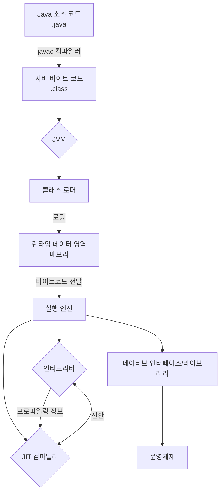
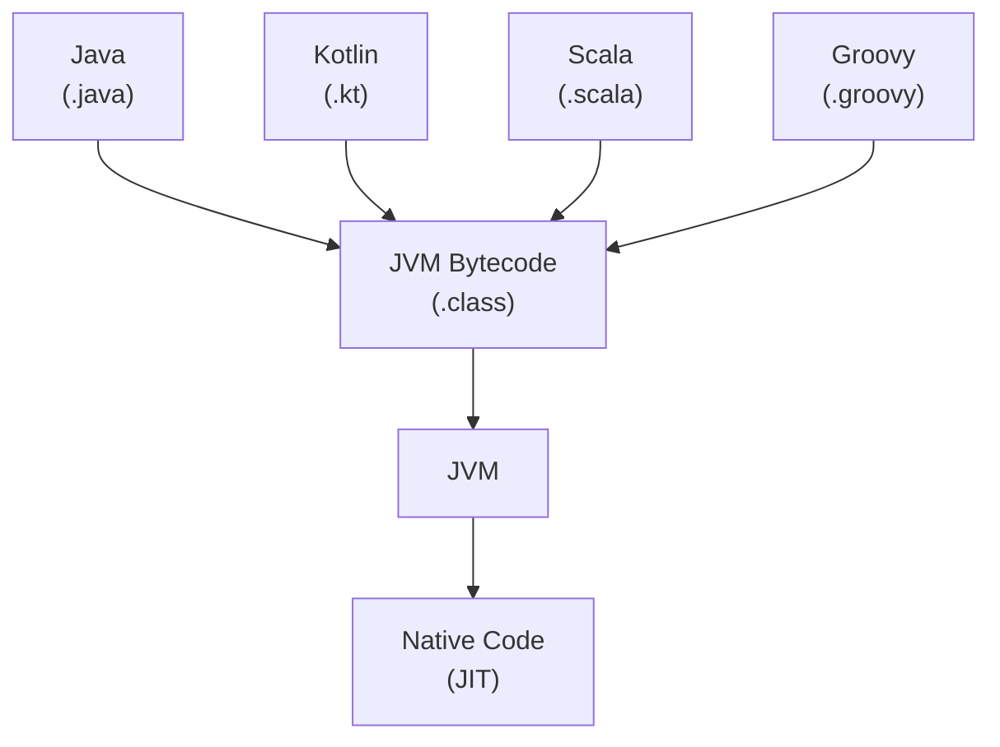

자바는 플랫폼 독립성을 위해 바이트 코드를 사용하며, 실행 시점에 기계어로 번역하는 2단계 컴파일 구조를 가진다.

- 초기 자바는 인터프리터의 느린 속도가 단점이었으나, JIT 컴파일러의 도입으로 성능 확보
- AOT를 통해 클라우드 네이티브 환경의 효율성 확보

## 전체 실행 흐름

JVM의 실행 흐름은 소스 코드의 바이트 코드 변환, 클래스 로딩, 실행 엔진의 최적화 가동으로 요약된다.

```mermaid
flowchart TD
    A[Java 소스 코드<br>.java] -->|javac 컴파일러| B[자바 바이트 코드<br>.class]
    B --> C{JVM}
    C --> D[클래스 로더]
    D -- 로딩 --> E[런타임 데이터 영역<br>메모리]
    E -- 바이트코드 전달 --> F[실행 엔진]
    F --> G{인터프리터}
    F --> H{JIT 컴파일러}
    G -- 프로파일링 정보 --> H
    G <-->|전환| H
    F --> I[네이티브 인터페이스/라이브러리]
    I --> J[운영체제]
```

## 바이트 코드와 인터프리터 채택 배경 - 플랫폼 독립성 vs 실행 성능

당시 C/C++과 같은 언어는 특정 CPU와 OS에 맞춘 네이티브 바이너리를 생성하여 배포해야 했으므로, 기기마다 코드를 재컴파일해야 하는 번거로움이 있었다.

- Write Once, Run Anywhere (WORA): 한 번 작성한 코드를 모든 장치에서 실행하는 것을 최우선 가치로 설정
- 중간 형태의 도입: 특정 하드웨어에 종속되지 않는 가상의 명령어 집합인 바이트 코드를 고안
- JVM의 역할: 운영체제별로 다르게 구현된 JVM이 동일한 바이트 코드를 읽어 각 환경의 기계어로 실시간 번역

결과적으로 자바는 실행 속도의 손실을 감수하더라도, 하나의 바이트 코드 파일로 전 세계 모든 장치에 배포 가능한 범용성을 확보했다.

## JVM 언어 생태계

JVM은 자바 언어 전용 가상 머신이 아니며, JVM 명세를 따르는 바이트 코드(`.class`)라면 어떤 언어로 작성되었든 실행 가능하다.

- JVM 위에서 실행 가능한 언어: Kotlin, Scala, Groovy, Clojure 등 — 자체 컴파일러로 자바 바이트 코드 생성
- 자바 컴파일러(`javac`)는 자바 소스를 바이트 코드로 만드는 여러 도구 중 하나일 뿐, JVM은 입력 언어를 알지 못하고 명세를 만족하는 바이트 코드만 받아 실행

```mermaid
flowchart TD
    Java["Java<br/>(.java)"] --> Bytecode
    Kotlin["Kotlin<br/>(.kt)"] --> Bytecode
    Scala["Scala<br/>(.scala)"] --> Bytecode
    Groovy["Groovy<br/>(.groovy)"] --> Bytecode
    Bytecode["JVM Bytecode<br/>(.class)"] --> JVM
    JVM["JVM"] --> Native["Native Code<br/>(JIT)"]
```

이들은 모두 동일한 `.class` 형식으로 컴파일되므로 자바 코드와 같은 클래스패스에 두고 서로 호출할 수 있어, Spring Boot 프로젝트에서 자바·코틀린을 한 모듈에 섞어 쓸 수 있다.

## JIT vs AOT 비교

현대 자바는 실행 환경에 따라 실시간 컴파일(JIT)과 사전 컴파일(AOT) 방식을 선택하여 사용할 수 있다.

|   구분   |  JIT (Just-In-Time)   |     AOT (Ahead-Of-Time)     |
|:------:|:---------------------:|:---------------------------:|
| 컴파일 시점 |    런타임 (프로그램 실행 중)    |        빌드 타임 (실행 전)         |
| 최고 성능  | 매우 높음 (실행 데이터 기반 최적화) |      높음 (정적 분석 기반 최적화)      |
| 기동 속도  |     느림 (예열 시간 필요)     |      매우 빠름 (즉시 실행 가능)       |
| 메모리 사용 | 높음 (JVM 엔진 및 컴파일러 포함) |     매우 낮음 (필수 바이너리만 포함)     |
| 적합한 환경 | 장기 실행 대규모 서버, 복잡한 로직  | AWS Lambda, 마이크로서비스, CLI 도구 |

- AOT 방식: 빌드 시점에 특정 OS용 바이너리를 직접 생성하므로 기동 속도가 즉각적이며 메모리 점유율이 낮음
- JIT 방식: 프로그램이 동작하는 환경과 실제 데이터 흐름을 분석하므로, 특정 조건에서 AOT보다 더 높은 수준의 성능 최적화 가능

## GraalVM Native Image

클라우드 네이티브 환경에 대응하기 위해 GraalVM은 바이트 코드를 실행 파일로 직접 변환하는 네이티브 이미지 기능을 제공한다.

- 정적 분석: 빌드 시점에 애플리케이션의 모든 경로를 분석하여 필요한 코드만 추출 (Closed-World Assumption)
- 즉시 실행: JVM 구동과 JIT 예열 과정이 생략되므로 밀리초 단위의 기동 속도 확보
- 메모리 점유: JVM 엔진과 컴파일러 자체가 빠져 매우 낮음
- 제약 사항: 리플렉션, 동적 프록시, JNI 사용 시 별도의 메타데이터 설정 파일 필요
- 플랫폼 종속성: 빌드 시점의 운영체제와 CPU 아키텍처에 종속된 바이너리가 생성
- 빌드 비용: 정적 분석과 네이티브 컴파일을 모두 수행하므로 빌드 시간이 길어, 작은 앱도 수십 초·Spring Boot 기준 수 분 단위 소요

## AOT 친화 프레임워크

전통적인 자바 프레임워크는 런타임 리플렉션과 동적 프록시에 강하게 의존하여 Native Image와 궁합이 좋지 않았으나, 빌드 시점에 메타데이터를 생성하는 방향으로 설계된 프레임워크가 등장하며 격차가 좁혀졌다.

|      프레임워크      |                                특징                                 |
|:---------------:|:-----------------------------------------------------------------:|
| Spring Boot 3.x | Spring AOT 엔진으로 빌드 시점 reflection metadata 자동 생성, 기존 Spring 자산 재활용 |
|     Quarkus     |            GraalVM 네이티브 빌드를 1차 타겟으로 설계, 컴파일 타임 의존성 처리             |
|    Micronaut    |           어노테이션 처리 단계에서 DI/AOP 메타데이터 생성, 런타임 리플렉션 의존 제거           |

- Spring Boot 3.x: 별도의 Spring Native 인큐베이터 프로젝트는 종료
    - Spring Boot 3.0부터 GraalVM 네이티브 이미지 지원이 Spring AOT 형태로 본 프레임워크에 통합
- Quarkus: 시작 단계부터 GraalVM 친화적으로 설계되어 컴파일 타임에 의존성·설정 처리
- Micronaut: 어노테이션 프로세서 기반의 컴파일 시점 DI/AOP로 런타임 리플렉션 의존도 제거

## AOT 채택 시 트레이드오프

AOT는 시작 시간과 메모리 점유라는 약점을 줄이는 대신, 표준 JVM이 제공하던 동적 유연성의 상당 부분을 포기해야 한다.

- 빌드 시점에 "이 프로그램이 실행 중 도달할 수 있는 모든 클래스"를 미리 확정 (Closed-World Assumption)
- 그것들만 골라 네이티브 바이너리에 로드 → 런타임에 새 코드가 들어올 자리가 처음부터 없는 모델

|     기능     |  표준 JVM  |  AOT (native-image)  |
|:----------:|:--------:|:--------------------:|
| 동적 플러그인 로드 |    O     |          X           |
|   핫 리로딩    |    O     |          X           |
| Reflection | O (자유로움) |    △ (빌드 타임 등록분만)    |
| 런타임 프록시 생성 |    O     | △ (빌드 타임에 미리 생성해 우회) |

- 런타임에 새 클래스를 등록하는 통로가 닫힘 → 동적 플러그인 로딩 불가
- 살아있는 클래스를 교체하는 통로가 빠짐 → 핫 리로딩 불가
- Reflection·동적 프록시는 빌드 타임에 미리 선언한 대상만 동작 → 어떤 클래스를 reflective하게 쓸지 메타데이터로 명시 필요

## 실행 전략 선택 가이드

애플리케이션의 특성과 운영 환경에 따라 적절한 실행 방식을 선택해야 한다.

- 표준 JVM (JIT 방식): 장기간 실행되는 대규모 모놀리식 서버나 복잡한 비즈니스 로직을 가진 서비스에 적합하며, 런타임 최적화를 통해 최고 성능을 발휘
- 네이티브 이미지 (AOT 방식): 서버리스(AWS Lambda), 마이크로서비스, CLI 도구 등 빠른 기동과 적은 메모리 점유율이 중요한 환경에 필수

자바는 바이트 코드를 통해 자유를 얻고 JIT를 통해 속도를 확보했으며, 이제 AOT를 통해 현대적인 클라우드 효율성까지 진화하고 있다.
