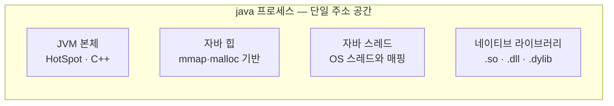
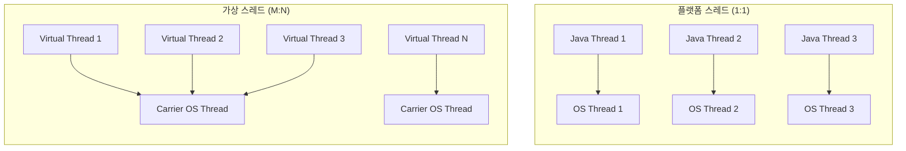

JVM이 호스트 OS 위에서 어떻게 자리 잡고 자원과 상호작용하는지, 그리고 가상 머신 한 계층을 두는 대가로 무엇을 얻고 잃는지를 정리한다.

- 단일 프로세스 모델: `java`는 OS가 보는 단 하나의 프로세스
- 주소 공간 공유: JVM 본체·자바 힙·네이티브 라이브러리가 한 메모리 공간에 공존
- 트레이드오프: 메모리·시작 시간을 지불하는 대신 이식성·동적성·안전성을 얻음

## JVM과 호스트 OS의 프로세스 관계

"JVM 위에서 자바 프로그램이 실행된다"는 표현은 부모-자식 프로세스가 쌓여 있는 모습을 떠올리게 하지만, OS가 실제로 보는 것은 `java`라는 단일 프로세스다.

- 표면적 모델: JVM(부모) → 자바 프로그램(자식)으로 보이는 컨테이너 비유
- 실제 OS 모델: 단일 `java` 프로세스 내부에서 JVM이 자바 바이트 코드를 해석·실행

### 셸에서 java 명령 실행 시 일어나는 일

시간 순서대로 따라가면 JVM과 애플리케이션이 한 프로세스에 있다는 것이 확인된다.

1. 셸이 `fork`/`exec` 시스템 콜로 `java` 네이티브 실행 파일을 새 프로세스로 기동
2. 생성된 프로세스 내부에서 JVM 본체(HotSpot 등) 부트스트랩
3. 클래스 로더가 애플리케이션 `.class` 파일(또는 JAR 내부 바이트 코드)을 같은 프로세스 메모리로 로드
4. JVM 인터프리터/JIT가 그 바이트 코드를 해석·실행

핵심은 3번 단계에서 새 프로세스가 추가로 만들어지지 않는다는 점이다.

- `.class` 파일은 디스크 바이트의 묶음이며, 실행 주체는 이미 떠 있는 `java` 프로세스
- `ps`·`htop`에서 잡히는 것도 단 하나의 `java` 프로세스
- 자바 코드 안에서 별도 프로세스를 만들려면 `Runtime.exec()`나 `ProcessBuilder`로 자식 프로세스를 명시적으로 fork 필요

### 단일 주소 공간에 함께 놓이는 것들

`java` 프로세스 하나의 주소 공간에는 JVM 본체부터 네이티브 라이브러리까지 모두 함께 놓이며, 그 결과 장애 격리와 관측이 OS 프로세스가 아닌 JVM 단위로 묶인다.



- JVM 본체: HotSpot 등 C++로 작성된 네이티브 코드 — 클래스 로딩, 바이트 코드 해석, JIT 컴파일, GC 수행
- 자바 힙: JVM이 OS로부터 큰 메모리 블록을 한 번에 받아 자체 관리(mmap·malloc 기반)
- 자바 스레드: JVM이 내부적으로 `pthread_create` 등을 호출해 만든 OS 스레드와 매핑
- 네이티브 라이브러리: JNI로 로드된 `.so`·`.dll`·`.dylib` 파일도 같은 주소 공간에 매핑

주소 공간을 공유한다는 사실에서 다음 결과가 따라온다.

- 자바 힙 부족으로 발생한 미처리 `OutOfMemoryError`는 JVM 전체를 종료시킴 — 별도 프로세스 단위로 격리되지 않음
- JNI 네이티브 코드가 잘못된 포인터를 건드리면 JVM이 통째로 죽으며, 자바 `try/catch`로 차단 불가
- 스레드 덤프 한 번에 애플리케이션 스레드와 GC 스레드가 같은 프로세스에서 동시에 관측

### 자바 스레드와 OS 스레드의 매핑

자바의 `Thread` 객체는 결국 OS 스레드를 감싼 래퍼이며, 어떤 모델을 쓰더라도 모든 스레드는 같은 `java` 프로세스 안에 묶인다.

- 플랫폼 스레드(전통적 자바 스레드): OS 스레드와 1:1 매핑
    - 자바 스레드 1만 개 생성 시 OS 스레드 1만 개 생성 (커널 자원 소모)
    - 컨텍스트 스위칭 비용도 OS 스레드와 동일
- 가상 스레드(Java 21+ 정식): JVM이 캐리어 OS 스레드 위에서 다중화
    - 수백만 개의 가상 스레드를 수십 개의 OS 스레드로 처리
    - JVM이 직접 스케줄링 — OS 입장에서는 캐리어 스레드만 보임



### Runtime.exec()로 자식 프로세스 생성

JVM 안에서 외부 명령을 실행할 때 명시적으로 자식 프로세스를 만들면, 그 시점에 비로소 부모-자식 프로세스 관계가 성립한다.

```java
void main() {
    Process p = new ProcessBuilder("ls", "-l").start();
    p.waitFor();
}
```

- 내부적으로 OS의 `fork`/`exec` 시스템 콜 호출
- 자식 프로세스는 별도 PID, 별도 주소 공간 보유
- 자바 코드와는 표준 입출력 스트림(stdin/stdout/stderr)으로만 통신
- 부모 JVM이 죽어도 자식 프로세스는 살아남을 수 있음

|                 관점                 |  동일 프로세스   | 부모-자식 프로세스 |
|:----------------------------------:|:----------:|:----------:|
|          JVM ↔ 자바 애플리케이션           |     O      |     X      |
|        JVM ↔ JVM이 만든 자바 스레드        | O (스레드 단위) |     X      |
| JVM ↔ `Runtime.exec()`로 띄운 외부 프로그램 |     X      |     O      |

## JNI와 네이티브 프레임

자바는 JVM 위에서 실행되지만, OS 저수준 기능에 접근하거나 기존에 작성된 C/C++ 라이브러리를 활용할 때 가능하게 해주는 표준 인터페이스인 JNI가 존재한다.

### JNI(Java Native Interface)

JNI는 자바 코드에서 C/C++ 같은 네이티브 언어로 작성된 함수를 호출할 수 있도록 해주는 표준 인터페이스이다.

- 사용 배경
    - 자바 언어만으로는 OS 커널 기능(파일 I/O, 네트워크 소켓, 시스템 시간 등 저수준 연산) 직접 접근 불가
    - 성능이 중요하거나 이미 존재하는 C/C++ 라이브러리(암호화, 이미지 처리, 압축 등) 재사용 필요
    - JDK 내부에서도 OS와 상호작용하는 대부분의 코드가 JNI 호출 기반
- 호출 방식
    - 자바 측에서는 메서드에 `native` 키워드를 붙여 시그니처만 선언하고, 실제 구현은 별도의 공유 라이브러리 파일(`.dll` / `.so` / `.dylib`)로 제공
    - 애플리케이션이 해당 메서드를 호출하면 JVM이 공유 라이브러리를 찾아 실제 C/C++ 함수로 실행 흐름 전달
- 표준 라이브러리 내 대표적 사용 예
    - `FileInputStream.read()` 등 파일 시스템 호출
    - `Object.hashCode()`, `System.currentTimeMillis()` 등 기본 메서드
    - `java.util.zip` 압축·해제 시 내부적으로 zlib 네이티브 라이브러리 호출

### 네이티브 프레임 (Native Frame)

자바 메서드를 호출하면 Java Stack에 자바 프레임이 쌓이는 것과 마찬가지로, JNI를 통해 네이티브 메서드를 호출하면 Native Method Stack에 네이티브 프레임이 쌓인다.

|    구분    |      자바 프레임 (Java Frame)      |  네이티브 프레임 (Native Frame)  |
|:--------:|:-----------------------------:|:-------------------------:|
|  생성 시점   |          자바 메서드 호출 시          |     JNI 네이티브 메서드 호출 시     |
|  저장 영역   |          Java Stack           |    Native Method Stack    |
|  관리 주체   |              JVM              |            OS             |
|  내부 데이터  |  자바 지역 변수, 매개 변수, 바이트 코드 포인터  | C 지역 변수, 포인터, 네이티브 명령어 주소 |
| 힙 복사 가능성 | JVM이 포맷을 알고 있어 힙으로 안전하게 복사 가능 | OS 스택 주소·레지스터에 종속되어 복사 불가 |

- 자바 프레임: JVM이 직접 설계한 포맷이므로 내용 전체를 파악하고 조작 가능
- 네이티브 프레임: OS가 관리하는 일반 C 함수 스택이므로 JVM 입장에서는 내부 구조를 알 수 없는 불투명 메모리 블록

이 차이는 평소에는 드러나지 않지만, 스택을 힙으로 옮겨야 하는 특수한 상황에서 제약으로 작용한다.

### 가상 스레드 피닝과의 연관성

가상 스레드는 I/O 블로킹 시 현재 스택을 힙으로 옮겨 캐리어 스레드(실제 OS 스레드)에서 내려오는 방식으로 동작하는데, 이때 네이티브 프레임이 문제가 된다.

- 자바 프레임만으로 이루어진 스택: 힙으로 안전하게 복사되어 가상 스레드가 캐리어에서 내려옴
- 네이티브 프레임이 포함된 스택: OS 의존 데이터 때문에 복사 불가로 캐리어 스레드에 고정(Pinning)
- 결과: 해당 가상 스레드가 I/O 대기 중에도 캐리어 스레드를 점유하여 다른 가상 스레드의 실행 기회 상실

## VM 추상화의 트레이드오프

자바가 OS 위에 직접 동작하지 않고 JVM이라는 가상 머신 한 단계를 더 거치는 구조는, 플랫폼 독립성과 같은 본질적 이점을 제공하는 동시에 메모리·실행 성능 측면의 비용을 발생시킨다.

- VM 추상화에서 직접 얻는 것: 플랫폼 독립성, 동적 로딩, 런타임 프로파일 기반 최적화(JIT)
- VM 모델 위에 함께 따라온 것: 바이트 코드 검증(안전성), 자동 메모리 관리(GC)
- 잃은 것: 추가 메모리 점유, 시작 지연(JIT 워밍업), 일부 저수준 제어 포기

### 동적 로딩과 런타임 메타프로그래밍

표준화된 바이트 코드를 런타임에 다룰 수 있다는 점에서, 클래스를 실행 시점에 로드하고 변형 가능하다.

- 메타데이터 보존: `.class` 안에 클래스 구조 정보(이름·메서드·어노테이션 등)가 그대로 남아 런타임 활용 가능
- 클래스 등록 통로 개방: 메모리에 있는 임의의 바이트를 새 클래스로 JVM에 등록할 수 있는 표준 API 제공
- 바이트 코드 생성 도구: 런타임에 바이트 코드를 즉석으로 만들어 등록하는 라이브러리 생태계가 표준 API 위에 형성
- 살아있는 클래스 교체 가능: 이미 로드된 클래스의 바이트를 새 버전으로 변경하는 표준 통로 존재

|     기능 예시     |         JVM이 제공하는 메커니즘         |
|:-------------:|:------------------------------:|
|   Spring DI   | 클래스 메타데이터를 읽어 객체를 동적으로 생성하고 연결 |
| JPA 지연 로딩 프록시 | 런타임에 엔티티의 서브클래스 바이트 코드를 생성·등록  |
|     핫 리로딩     |    살아있는 클래스의 바이트를 새 버전으로 교체    |
|    플러그인 로딩    |    외부 JAR을 런타임에 클래스로 동적 로드     |

C/C++ 같은 정적 컴파일 언어는 빌드 산출물에 메타데이터가 거의 남지 않으며, "런타임에 새 클래스를 끼워 넣는" 표준 통로 자체가 존재하지 않아 같은 일을 흉내 내기 매우 어렵다.

### 바이트 코드 검증

표준 바이트 코드 명세 위에서 동작하기 때문에, 클래스 로더의 Verify 단계에서 명세 위반을 사전 차단할 수 있다.

- 잘못된 타입 캐스팅, 스택 오버/언더플로우, 잘못된 메모리 접근 등을 사전 차단
- C/C++의 메모리 손상 같은 문제를 언어 레벨에서 방지

### 메모리 점유 오버헤드

같은 작업을 수행하는 프로그램이라도 자바는 네이티브 언어 대비 메모리 사용량이 크다.

- JVM 엔진 자체가 메모리에 상주(인터프리터, JIT 컴파일러, GC 모듈 등)
- 객체마다 헤더 12~16바이트가 붙어 데이터가 작을수록 오버헤드 비율이 증가
    - Compressed OOPs 활성(힙 32GB 미만 기본): 12바이트 (mark word 8 + class pointer 4)
    - Compressed OOPs 비활성(힙 32GB 이상): 16바이트
- Code Cache, Metaspace, JIT 컴파일된 코드 등 부가 영역 필요
- 결과: 컨테이너 환경에서 작은 메모리 한도(예: 128MB Lambda)는 자바에 불리

### 시작 지연과 첫 요청 성능

JVM 기동 → 클래스 로딩 → JIT 워밍업까지 걸리는 시간이 누적된다.

- 짧게는 수백 ms, Spring Boot 같은 큰 프레임워크는 수 초 단위까지 소요
- JIT가 핫스팟을 컴파일하기 전까지는 같은 코드도 인터프리터로 느리게 실행 — 첫 요청 응답 시간이 정상 대비 수십~수백 배 느려질 수 있음
- 점유된 자원(DB 커넥션, 스레드)이 반환되지 않아 후속 요청에 연쇄 지연 유발
- 짧은 작업을 자주 띄우는 환경(서버리스, CLI)에서는 작업 시간보다 시작 시간이 더 큰 경우 발생 — AOT(Native Image)가 등장한 핵심 동기

### 저수준 제어의 어려움

GC, 메모리 레이아웃, OS 시스템 콜 등을 직접 다루기 어렵다.

- 메모리 정렬 최적화, SIMD(Single Instruction Multiple Data) 활용 등은 JNI나 외부 라이브러리(Project Panama)에 의존
- GC 정지 시간 보장 불가로 임베디드·하드 리얼타임 환경에는 부적합

### 트레이드오프 요약

|   항목   |            VM 추상화의 효과            |
|:------:|:--------------------------------:|
|  이식성   |     OS·CPU 독립적인 단일 산출물 (얻음)      |
|  동적성   |      리플렉션, 핫 리로딩, 플러그인 (얻음)      |
| 최고 성능  | JIT 워밍업 후 네이티브 수준 (얻음, 단 워밍업 필요) |
|  안전성   | 바이트 코드 검증으로 명세 위반 사전 차단 (부수적 이점) |
|  관리성   |  GC 모델 표준화 (부수적 이점, VM 본질은 아님)   |
| 메모리 점유 |             추가 (잃음)              |
| 시작 시간  |             추가 (잃음)              |
| 저수준 제어 |             제약 (잃음)              |

이 약점을 메우기 위한 답이 GraalVM Native Image 같은 AOT 컴파일이다.
