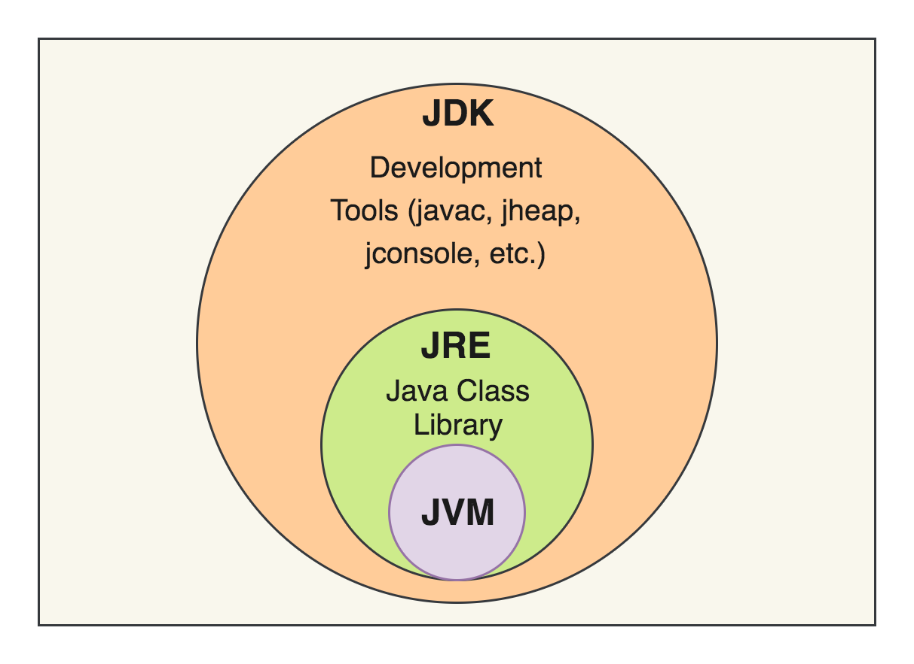

자바 가상 머신(JVM)은 자바 애플리케이션을 실행하기 위한 런타임 엔진이다.

|    Java Application    |
|:----------------------:|
| JVM(Windows/Mac/Linux) |
| OS(Windows/Mac/Linux)  |
|   Computer(Hardware)   |

자바 코드는 이 JVM 위에서 동작하며, 전체 실행 환경은 '하드웨어 - 운영체제(OS) - JVM - 자바 애플리케이션' 순서의 계층 구조를 가진다.

## JVM의 주요 특징

JVM의 존재는 자바 언어의 다음과 같은 특징을 결정한다.

- 플랫폼 독립성
    - 자바 소스 코드는 특정 OS를 대상으로 컴파일되지 않고, JVM을 목적지로 하는 '자바 바이트 코드(*.class)'로 변환
    - 이 바이트 코드는 해당 OS에 맞는 JVM이 설치되어 있기만 하면, 어떤 플랫폼(Windows, Mac, Linux 등)에서든 수정 없이 동일하게 실행 가능
- JVM 실행 필수
    - 플랫폼 독립성을 얻는 대신, 자바 코드를 실행하기 위해서는 반드시 대상 플랫폼에 JVM 설치 필요
- 성능 최적화
    - 과거에는 OS 위에서 가상 머신을 한 단계 더 거치기 때문에 네이티브 코드(C/C++) 대비 실행 속도가 느리다는 단점 존재
    - 현재는 JIT(Just-In-Time) 컴파일러와 같은 최적화 기술의 발전으로, 런타임 중에 자주 사용되는 코드를 네이티브 기계어로 변환하여 실행 속도 향상

## Java 실행 과정

- Java Compiler: Java Source Code를 Java Byte Code로 변환
- Class Loader: 바이트 코드 로딩 / 검증 / 링킹 등 수행
- Runtime Data Area: 앱 실행을 위해 사용되는 JVM 메모리 영역
- Execution Engine: 메모리 영역에 있는 데이터를 가져와 해당하는 작업 수행

1. 작성된 Java Source를 Java Compiler를 통해 Java Byte Code로 변환
2. 컴파일 된 Byte Code를 JVM의 Class Loader에 전달
3. Class Loader는 Dynamic Loading을 통해 필요한 클래스들을 로딩 및 링크하여 Runtime Data Area(JVM Memory)로 전달
4. Execution Engine이 올라온 Byte Code들을 명령어 단위로 하나씩 가져와서 실행

### Class Loader

클래스 로더는 컴파일된 자바 클래스 파일(*.class)을 메모리로 로드하고, Runtime Data Area에 배치하는 역할을 한다.

- 로딩 단계
    1. 로딩(Loading): 클래스 파일을 찾아 바이트 코드를 메모리에 로드
        - 한 번에 모든 클래스를 로드하는 것이 아니라, 필요할 때 동적으로 로드
        - static 멤버들 또한 전부 메모리에 올라가는 것이 아니라, 클래스 내의 static 멤버를 호출하게 되면 클래스가 동적으로 메모리에 로드
    2. 링크(Linking): 읽어온 코드를 실행 가능하도록 준비
        - 검증(Verify): 바이트 코드가 자바 언어 명세 및 JVM 명세를 준수하는지 확인(보안)
        - 준비(Prepare): 클래스의 정적(static) 변수들을 위한 메모리를 할당하고 기본값(0, false, null 등)으로 초기화
        - 분석(Resolve): 코드 내의 기호 참조(Symbolic Reference)를 실제 메모리 주소(Direct Reference)로 변경
    3. 초기화(Initialization): '준비' 단계에서 기본값으로 초기화했던 정적 변수들을 실제 코드에 명시된 값(static 블록 포함)으로 초기화

- 클래스 로더 위임 모델(Delegation Model): 클래스 로더는 계층 구조를 가지며, 클래스 로드 요청 시 하위 로더가 상위 로더에게 책임을 위임하는 방식으로 동작
    - 부트스트랩(Bootstrap) 로더: 최상위 로더. JVM 핵심 라이브러리(JAVA_HOME/lib의 rt.jar 등)를 로드
    - 확장(Extension) 로더: `lib/ext` 폴더의 클래스 로드
    - 애플리케이션(Application/System) 로더: 사용자가 지정한 클래스패스(Classpath)의 클래스 로드
    - 이 구조는 이미 로드된 클래스의 중복 로드를 방지하고, 핵심 라이브러리의 보안을 유지하는 역할

### Execution Engine

클래스 로더가 메모리에 적재한 바이트 코드를 실제 기계어로 변환하고 실행하는 역할을 한다.

- 인터프리터 (Interpreter)
    - 바이트 코드를 한 줄씩 읽어서 해석하고(interpret) 바로 실행
    - 초기 실행 속도는 빠르지만, 동일한 코드가 반복 호출될 때도 매번 해석해야 하므로 비효율적일 수 있음
- JIT 컴파일러 (Just-In-Time Compiler)
    - 인터프리터의 단점을 보완하기 위해 도입
    - 애플리케이션 실행 중에(Just-In-Time) 반복적으로 실행되는 '핫스팟(hotspot)' 코드 감지
    - '핫스팟' 코드를 네이티브 기계어로 컴파일하여 캐시에 저장
    - 이후 해당 코드가 호출되면, 인터프리트 방식이 아닌 캐시된 네이티브 코드를 직접 실행하여 성능 향상
- 가비지 컬렉터 (Garbage Collector, GC)
    - 실행 엔진의 일부로 동작하며, 힙(Heap) 메모리 영역에서 더 이상 참조되지 않는 객체(가비지)를 찾아 제거하고 메모리 회수

## JDK & JRE & JVM

- JVM(Java Virtual Machine): 자바 바이트 코드를 실행시키기 위한 가상 머신
- JRE(Java Runtime Environment): 자바 애플리케이션을 실행하기 위한 도구(필요한 라이브러리 및 필수 파일)가 포함된 실행 환경(JRE = JVM + Standard Libraries)
- JDK(Java Development Kit): 자바로 개발하기 위한 필요 요소(javac 등)를 포함한 개발 키트(JDK = JRE + Development Tools)

위와 같은 구조로 인해 자바 애플리케이션을 배포하여 실행만 할 서버에는 JRE만 설치하고, 개발자의 로컬 장비에는 JDK를 설치한다.

## JVM 메모리 구조

JVM은 OS로부터 실행에 필요한 메모리를 할당받으며, 이 영역을 Runtime Data Area라고 부른다.

|   영역   |                    용도                    |           생명 주기            | 스레드 공유 여부 |
|:------:|:----------------------------------------:|:--------------------------:|:---------:|
| Method |    클래스 정보, 클래스(static) 변수, 상수, 메소드 코드    |        JVM 시작 ~ 종료         |     O     |
|  Heap  |             객체 인스턴스, 인스턴스 변수             | `Gabage Collection`에 의해 관리 |     O     |
| Stack  | 스레드 별로 런타임에 호출 된 메서드, 지역 변수, 매개 변수, 리턴 값 |          메서드 종료 시          |     X     |

### 스레드 공유 영역 (모든 스레드가 공유)

- 힙 (Heap Area)
    - `new` 키워드로 생성된 객체 인스턴스와 배열이 저장되는 공간
    - 가비지 컬렉션(GC)의 주된 대상
    - 성능 최적화를 위해 내부적으로 Young Generation(Eden, Survivor 0/1)과 Old Generation 영역으로 나뉘어 관리
    - 이 영역의 메모리가 부족하면 `OutOfMemoryError`가 발생
- 메소드 영역 (Method Area)
    - 클래스의 메타데이터(구조, 필드, 메소드 정보), 정적(static) 변수, 상수 풀(Runtime Constant Pool), 메소드 코드 등 저장
    - 자바 8 이전에는 이 영역을 힙의 일부로 취급
    - 자바 8부터는 힙이 아닌 네이티브 메모리 영역(OS가 직접 관리)을 사용하도록 변경(`OutOfMemoryError` 문제가 크게 개선)

### 스레드 독립 영역 (스레드별 개별 생성)

각 스레드는 생성될 때마다 이 영역들을 개별적으로 할당받는다.

- 스택 (Stack Area)
    - 메소드 호출 정보를 저장하는 영역
    - 메소드가 호출될 때마다 해당 메소드의 정보(지역 변수, 매개 변수, 리턴 주소 등)를 담은 스택 프레임(Stack Frame)이 생성되어 스택에 쌓이고, 메소드 실행이 완료되면 제거
    - 스택 영역의 한계를 초과하면 `StackOverflowError`가 발생
- PC 레지스터 (PC Register)
    - 현재 스레드가 실행 중인 JVM 명령어의 주소 저장
    - 스레드가 컨텍스트 스위칭을 할 때, 다음에 실행할 명령어를 기억하기 위해 사용
- 네이티브 메소드 스택 (Native Method Stack)
    - 자바 코드(바이트 코드)가 아닌 C/C++ 등 네이티브 코드로 작성된 JNI(Java Native Interface) 메소드를 호출할 때 사용되는 스택 영역
