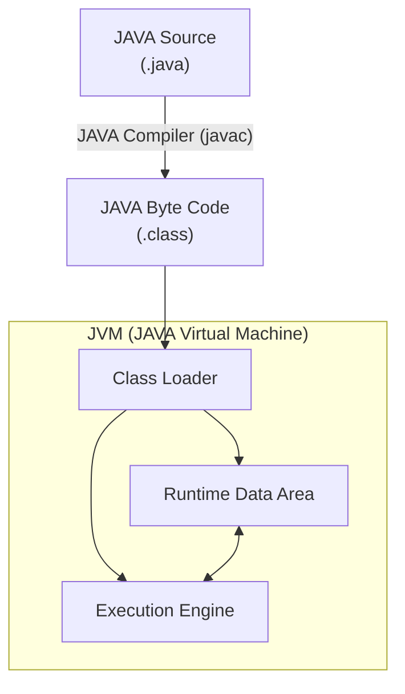
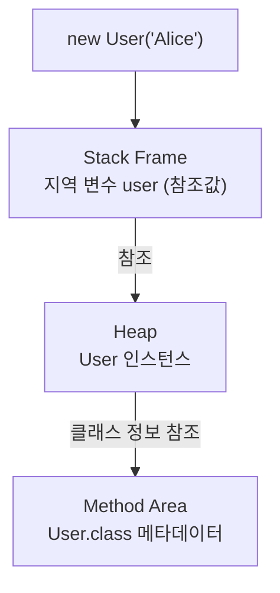

자바 가상 머신(JVM)은 자바 애플리케이션을 실행하기 위한 런타임 엔진이다.

|    Java Application    |
|:----------------------:|
| JVM(Windows/Mac/Linux) |
| OS(Windows/Mac/Linux)  |
|   Computer(Hardware)   |

자바 코드는 이 JVM 위에서 동작하며, 전체 실행 환경은 '하드웨어 - 운영체제(OS) - JVM - 자바 애플리케이션' 순서의 계층 구조를 가진다.

## JVM의 주요 특징

JVM의 존재는 자바 언어의 다음과 같은 특징을 결정한다.

- 플랫폼 독립성
    - 자바 소스 코드는 특정 OS를 대상으로 컴파일되지 않고, JVM을 목적지로 하는 '자바 바이트 코드(*.class)'로 변환
    - 이 바이트 코드는 해당 OS에 맞는 JVM이 설치되어 있기만 하면, 어떤 플랫폼(Windows, Mac, Linux 등)에서든 수정 없이 동일하게 실행 가능
- JVM 실행 필수
    - 플랫폼 독립성을 얻는 대신, 자바 코드를 실행하기 위해서는 반드시 대상 플랫폼에 JVM 설치 필요
- 성능 최적화
    - 과거에는 OS 위에서 가상 머신을 한 단계 더 거치기 때문에 네이티브 코드(C/C++) 대비 실행 속도가 느리다는 단점 존재
    - 현재는 JIT(Just-In-Time) 컴파일러와 같은 최적화 기술의 발전으로, 런타임 중에 자주 사용되는 코드를 네이티브 기계어로 변환하여 실행 속도 향상

## Java 실행 과정

```mermaid
flowchart TD
    SRC["JAVA Source<br/>(.java)"] -->|" JAVA Compiler (javac) "| BC["JAVA Byte Code<br/>(.class)"]
    BC --> CL

    subgraph JVM["JVM (JAVA Virtual Machine)"]
        CL[Class Loader]
        RDA[Runtime Data Area]
        EE[Execution Engine]
        CL --> RDA
        CL --> EE
        RDA <--> EE
    end
```

- Java Compiler: Java Source Code를 Java Byte Code로 변환
- Class Loader: 바이트 코드 로딩 / 검증 / 링킹 등 수행
- Runtime Data Area: 앱 실행을 위해 사용되는 JVM 메모리 영역
- Execution Engine: 메모리 영역에 있는 데이터를 가져와 해당하는 작업 수행

1. 작성된 Java Source를 Java Compiler를 통해 Java Byte Code로 변환
2. 컴파일 된 Byte Code를 JVM의 Class Loader에 전달
3. Class Loader는 Dynamic Loading을 통해 필요한 클래스들을 로딩 및 링크하여 Runtime Data Area(JVM Memory)로 전달
4. Execution Engine이 올라온 Byte Code들을 명령어 단위로 하나씩 가져와서 실행

### Class Loader

클래스 로더는 컴파일된 자바 클래스 파일(*.class)을 메모리로 로드하고, Runtime Data Area에 배치하는 역할을 한다.

- 로딩 단계
    1. 로딩(Loading): 클래스 파일을 찾아 바이트 코드를 메모리에 로드
        - 한 번에 모든 클래스를 로드하는 것이 아니라, 필요할 때 동적으로 로드
        - static 멤버들 또한 전부 메모리에 올라가는 것이 아니라, 클래스 내의 static 멤버를 호출하게 되면 클래스가 동적으로 메모리에 로드
    2. 링크(Linking): 읽어온 코드를 실행 가능하도록 준비
        - 검증(Verify): 바이트 코드가 자바 언어 명세 및 JVM 명세를 준수하는지 확인(보안)
        - 준비(Prepare): 클래스의 정적(static) 변수들을 위한 메모리를 할당하고 기본값(0, false, null 등)으로 초기화
        - 분석(Resolve): 코드 내의 기호 참조(Symbolic Reference)를 실제 메모리 주소(Direct Reference)로 변경
    3. 초기화(Initialization): '준비' 단계에서 기본값으로 초기화했던 정적 변수들을 실제 코드에 명시된 값(static 블록 포함)으로 초기화

- 클래스 로더 위임 모델(Delegation Model): 클래스 로더는 계층 구조를 가지며, 클래스 로드 요청 시 하위 로더가 상위 로더에게 책임을 위임하는 방식으로 동작
    - 부트스트랩(Bootstrap) 로더: 최상위 로더. JVM 핵심 라이브러리(JAVA_HOME/lib의 rt.jar 등)를 로드
    - 확장(Extension) 로더: `lib/ext` 폴더의 클래스 로드
    - 애플리케이션(Application/System) 로더: 사용자가 지정한 클래스패스(Classpath)의 클래스 로드
    - 이 구조는 이미 로드된 클래스의 중복 로드를 방지하고, 핵심 라이브러리의 보안을 유지하는 역할

#### 동적 로딩과 첫 호출 비용

로딩, 링크(검증·준비·분석), 초기화 단계는 빌드 시점이 아니라 실행 중 클래스가 처음 참조되는 순간 lazy 하게 수행된다.

- 첫 사용 시: 디스크 I/O → Verify → Prepare → Resolve → Initialize가 한꺼번에 발생하므로 호출 지연 누적
- 두 번째부터: 이미 메모리에 적재되어 있고 Resolve 결과도 캐시되어 있어 즉시 실행
- JVM Warm-up이 필요한 근본 원인 중 하나로, 트래픽 유입 직후 첫 요청은 클래스 로딩 비용까지 함께 부담

### Execution Engine

클래스 로더가 메모리에 적재한 바이트 코드를 실제 기계어로 변환하고 실행하는 역할을 한다.

- 인터프리터 (Interpreter)
    - 바이트 코드를 한 줄씩 읽어서 해석하고(interpret) 바로 실행
    - 초기 실행 속도는 빠르지만, 동일한 코드가 반복 호출될 때도 매번 해석해야 하므로 비효율적일 수 있음
- JIT 컴파일러 (Just-In-Time Compiler)
    - 인터프리터의 단점을 보완하기 위해 도입
    - 애플리케이션 실행 중에(Just-In-Time) 반복적으로 실행되는 '핫스팟(hotspot)' 코드 감지
    - '핫스팟' 코드를 네이티브 기계어로 컴파일하여 캐시에 저장
    - 이후 해당 코드가 호출되면, 인터프리트 방식이 아닌 캐시된 네이티브 코드를 직접 실행하여 성능 향상
- 가비지 컬렉터 (Garbage Collector, GC)
    - 실행 엔진의 일부로 동작하며, 힙(Heap) 메모리 영역에서 더 이상 참조되지 않는 객체(가비지)를 찾아 제거하고 메모리 회수

## JDK & JRE & JVM

- JVM(Java Virtual Machine): 자바 바이트 코드를 실행시키기 위한 가상 머신
- JRE(Java Runtime Environment): 자바 애플리케이션을 실행하기 위한 도구(필요한 라이브러리 및 필수 파일)가 포함된 실행 환경(JRE = JVM + Standard Libraries)
- JDK(Java Development Kit): 자바로 개발하기 위한 필요 요소(javac 등)를 포함한 개발 키트(JDK = JRE + Development Tools)

위와 같은 구조로 인해 자바 애플리케이션을 배포하여 실행만 할 서버에는 JRE만 설치하고, 개발자의 로컬 장비에는 JDK를 설치한다.

## JVM 메모리 구조

JVM은 OS로부터 실행에 필요한 Runtime Data Area 메모리 영역을 할당받으며, 이 영역을 영역을 용도별로 분할하는 이유는 세 가지다.

- 스레드 격리: 메서드 호출 컨텍스트는 스레드마다 다르므로 Stack을 스레드별로 두어 락 없이 안전하게 접근
- 단일 진실 원천: 클래스 메타데이터·바이트 코드는 모든 스레드가 동일한 정의를 봐야 하므로 Method Area 한 곳에 두고 공유
- GC 대상 분리: 객체 인스턴스를 별도 영역(Heap)에 모아두고 가비지 컬렉터가 회수

|   영역   |                    용도                    |            생명 주기            | 스레드 공유 여부 |
|:------:|:----------------------------------------:|:---------------------------:|:---------:|
| Method |    클래스 정보, 클래스(static) 변수, 상수, 메소드 코드    |         JVM 시작 ~ 종료         |     O     |
|  Heap  |             객체 인스턴스, 인스턴스 변수             | `Garbage Collection`에 의해 관리 |     O     |
| Stack  | 스레드 별로 런타임에 호출 된 메서드, 지역 변수, 매개 변수, 리턴 값 |          메서드 종료 시           |     X     |

### 스레드 공유 영역 (모든 스레드가 공유)

- 힙 (Heap Area)
    - `new` 키워드로 생성된 객체 인스턴스와 배열이 저장되는 공간
    - 가비지 컬렉션(GC)의 주된 대상
    - 성능 최적화를 위해 내부적으로 Young Generation(Eden, Survivor 0/1)과 Old Generation 영역으로 나뉘어 관리
    - 이 영역의 메모리가 부족하면 `OutOfMemoryError`가 발생
- 메소드 영역 (Method Area)
    - 클래스의 메타데이터(구조, 필드, 메소드 정보), 정적(static) 변수, 상수 풀(Runtime Constant Pool), 메소드 코드 등 저장
    - 자바 8 이전에는 이 영역을 힙의 일부(PermGen)로 취급
        - 고정 한도 때문에 클래스 로딩이 많은 환경에서 `OutOfMemoryError: PermGen space` 발생
    - 자바 8부터 힙 바깥의 네이티브 메모리 영역(Metaspace)으로 분리되어 OS 메모리 한도 내에서 동적 확장
    - 한도 초과 시 `OutOfMemoryError: Metaspace` 발생, `-XX:MaxMetaspaceSize`로 상한 설정

### 스레드 독립 영역 (스레드별 개별 생성)

각 스레드는 생성될 때마다 이 영역들을 개별적으로 할당받는다.

- 스택 (Stack Area)
    - 메소드 호출 정보를 저장하는 영역
    - 메소드가 호출될 때마다 해당 메소드의 정보(지역 변수, 매개 변수, 리턴 주소 등)를 담은 스택 프레임(Stack Frame)이 생성되어 스택에 쌓이고, 메소드 실행이 완료되면 제거
    - 스택 영역의 한계(스레드당 기본 512KB ~ 1MB)를 초과하면 `StackOverflowError`가 발생
    - 각 Stack Frame은 세 영역으로 구성
        - Local Variable Array: 매개변수·지역 변수·`this` 참조를 슬롯 번호 기반으로 저장하는 배열
        - Operand Stack: `iadd`, `invokevirtual` 등 바이트 코드 명령어가 피연산자를 push/pop 하며 계산하는 작업 공간
        - Frame Data: 현재 메서드의 상수 풀 참조와 정상·예외 종료 시 호출자에게 돌아갈 복귀 정보
- PC 레지스터 (PC Register)
    - 현재 스레드가 실행 중인 JVM 명령어의 주소 저장
    - 스레드가 컨텍스트 스위칭을 할 때, 다음에 실행할 명령어를 기억하기 위해 사용
    - 네이티브 메서드 실행 중에는 정의되지 않음 (네이티브 코드 흐름은 JVM이 아닌, OS가 직접 추적)
- 네이티브 메소드 스택 (Native Method Stack)
    - 자바 코드(바이트 코드)가 아닌 C/C++ 등 네이티브 코드로 작성된 메소드를 호출할 때 사용되는 별도의 스택 영역
    - 각 자바 스레드는 Java Stack과 Native Method Stack을 함께 보유하며, 실행 중인 코드의 종류에 따라 해당 스택에 프레임이 쌓임
    - 표준 라이브러리도 내부적으로 JNI를 다수 사용 (`FileInputStream.read()`, `Object.hashCode()`, `System.currentTimeMillis()` 등)

### 객체 생성 시 메모리 동작

`User user = new User("Alice")` 한 줄이 실행될 때 영역별로 어떤 일이 일어나는지 추적해 보면 구조가 분명해진다.

```mermaid
flowchart TD
    Code["new User('Alice')"] --> Stack["Stack Frame<br/>지역 변수 user (참조값)"]
    Stack -->|참조| HeapObj["Heap<br/>User 인스턴스"]
    HeapObj -->|클래스 정보 참조| Method["Method Area<br/>User.class 메타데이터"]
```

1. Heap에 User 인스턴스용 메모리 할당
2. 인스턴스의 클래스 메타데이터는 Method Area에 이미 로드된 정보를 참조
3. Stack 프레임의 지역 변수 `user`에는 인스턴스 자체가 아닌 Heap 주소(참조값)를 저장

### 메모리 영역 크기 설정 옵션

각 메모리 영역의 크기는 JVM 실행 시 옵션으로 지정할 수 있으며, 워크로드 특성에 맞게 튜닝하는 것이 운영 환경의 기본이다.

|           옵션           |      대상 영역       |              설명               |
|:----------------------:|:----------------:|:-----------------------------:|
|         `-Xms`         |       Heap       |      초기 힙 크기 (시작 시 할당량)       |
|         `-Xmx`         |       Heap       |        최대 힙 크기 (확장 한계)        |
|         `-Xmn`         | Young Generation | Young 영역 크기 (Eden + Survivor) |
|         `-Xss`         |   Thread Stack   |          스레드별 스택 크기           |
|  `-XX:MetaspaceSize`   |    Metaspace     |   첫 GC가 발생하는 Metaspace 임계값    |
| `-XX:MaxMetaspaceSize` |    Metaspace     |        Metaspace 최대 크기        |

- `-Xms`와 `-Xmx`를 같은 값으로 설정 시 런타임에 힙이 확장되며 발생하는 일시 정지 비용 제거 가능, 부하가 일정한 서버에서 자주 사용
- `-Xmn` 명시 시 Young 영역만 고정되어 Old 영역은 `-Xmx - -Xmn`으로 자동 산정, 짧은 수명 객체 비율이 높은 워크로드의 GC 빈도 조절에 활용
- `-Xss`는 스레드를 다수 생성하는 환경에서 메모리 사용량을 줄이기 위해 기본값(보통 1MB)보다 작게 설정하기도 함
- Metaspace는 기본적으로 OS 메모리 한도까지 확장되므로, 클래스 로딩이 비정상적으로 늘어나는 상황을 막기 위해 `-XX:MaxMetaspaceSize`로 상한을 두는 것이 권장
