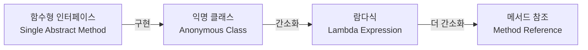

메서드를 하나의 식(Expression)으로 표현한 것으로, 자바는 객체지향 언어이지만 람다식을 통해 함수형 프로그래밍의 특징을 부분적으로 지원한다.



## 함수형 인터페이스(Functional Interface)

람다식은 함수형 인터페이스의 인스턴스를 생성하는 방식으로, 함수형 인터페이스는 단 하나의 추상 메서드만을 가지는 인터페이스를 의미한다.

- 조건
    - 오직 하나의 추상 메서드만 존재해야 함
    - `static` 메서드나 `default` 메서드는 개수에 제한 없음
    - `java.lang.Object`의 메서드(toString, equals 등)를 오버라이딩한 추상 메서드는 카운트에서 제외
- `@FunctionalInterface`
    - 컴파일러에게 해당 인터페이스가 함수형 인터페이스의 조건을 충족하는지 검사하도록 요청하는 어노테이션
    - 유지보수 과정에서 추상 메서드가 추가되는 실수 방지

```java

@FunctionalInterface
interface MyFunction {

    int max(int a, int b);
    // int min(int a, int b); // 주석 해제 시 컴파일 에러 발생
}

class Main {

    public static void main(String[] args) {
        // 1. 익명 클래스 사용
        MyFunction f1 = new MyFunction() {
            public int max(int a, int b) {
                return a > b ? a : b;
            }
        };

        // 2. 람다식 사용 (익명 객체를 대체)
        MyFunction f2 = (a, b) -> a > b ? a : b;
    }
}
```

## 익명 클래스와의 차이점

람다식은 익명 클래스와 비슷해 보이지만 스코프(Scope) 처리 방식에서 차이가 있다.

- 익명 클래스
    - 새로운 클래스 스코프를 생성함
    - 내부에서 `this`를 호출하면 익명 클래스 자신의 인스턴스를 가리킴
- 람다식
    - 새로운 스코프를 생성하지 않음(run-time에 별도의 클래스 파일을 생성하지 않음)
    - 내부에서 `this`를 호출하면 람다식을 감싸고 있는 외부 클래스의 인스턴스를 가리킴

## java.util.function 패키지

자바에서 자주 사용되는 함수형 인터페이스 패턴을 미리 정의해 둔 패키지로, 매개변수와 반환값의 유무에 따라 구분된다.

| 인터페이스               | 메서드                   | 매개변수 |    반환값    | 설명                      |
|:--------------------|:----------------------|:----:|:---------:|:------------------------|
| `Runnable`          | `void run()`          |  X   |     X     | 실행만 하는 경우               |
| `Supplier<T>`       | `T get()`             |  X   |     O     | 값을 공급(반환)만 하는 경우        |
| `Consumer<T>`       | `void accept(T t)`    |  O   |     X     | 값을 받아 소비만 하는 경우         |
| `Function<T, R>`    | `R apply(T t)`        |  O   |     O     | 값을 받아 변환하여 반환하는 경우      |
| `Predicate<T>`      | `boolean test(T t)`   |  O   | `boolean` | 조건식을 확인하여 참/거짓 반환       |
| `UnaryOperator<T>`  | `T apply(T t)`        |  O   |     O     | 단항 연산(입력과 출력 타입이 같음)    |
| `BinaryOperator<T>` | `T apply(T t1, T t2)` | O, O |     O     | 이항 연산(입력 2개와 출력 타입이 같음) |

## 메서드 참조(Method Reference)

람다식이 하나의 메서드만 호출하는 경우, 이를 더 간결하게 표현할 수 있는 문법이다.

|        종류         |            람다식 예시            |       메서드 참조        |
|:-----------------:|:----------------------------:|:-------------------:|
| 정적(Static) 메서드 참조 | `(x) -> ClassName.method(x)` | `ClassName::method` |
|    인스턴스 메서드 참조    | `(obj, x) -> obj.method(x)`  | `ClassName::method` |
|   특정 객체 메서드 참조    |    `(x) -> obj.method(x)`    |    `obj::method`    |
|      생성자 참조       |   `() -> new ClassName()`    |  `ClassName::new`   |
|     배열 생성자 참조     |     `(x) -> new int[x]`      |    `int[]::new`     |

```java
// 1. Static 메서드 참조
Function<String, Integer> f1 = (s) -> Integer.parseInt(s);
Function<String, Integer> f2 = Integer::parseInt;

// 2. 임의 객체의 인스턴스 메서드 참조 (첫 번째 인자가 메서드의 수신자가 됨)
BiPredicate<String, String> p1 = (s1, s2) -> s1.equals(s2);
BiPredicate<String, String> p2 = String::equals;

// 3. 생성자 참조
Supplier<MyClass> s1 = () -> new MyClass();
Supplier<MyClass> s2 = MyClass::new;
```

###### 참고자료

- [Java의 정석](https://kobic.net/book/bookInfo/view.do?isbn=9788994492032)
