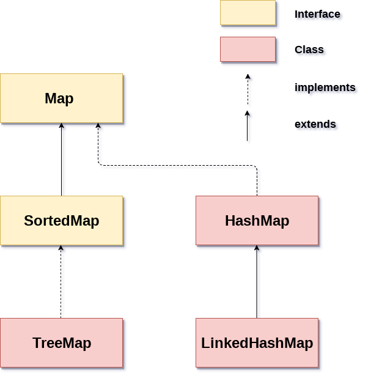

키(Key)와 값(Value)을 하나의 쌍으로 묶어 저장하는 자료 구조로, 키를 통해 값을 빠르게 탐색하는 데 최적화되어 있다.

## Map Interface

`Map` 인터페이스는 `List`나 `Set`과는 달리 `Collection` 인터페이스를 상속받지 않는다.

- 하나의 쌍(pair)을 `엔트리(Entry)`라고 부르며, `Map`은 이 `Entry` 객체들을 관리
- 키(Key)는 `Map` 내에서 유일해야 하며(중복 불가), 값(Value)은 중복 가능
- `Map` 자체는 순회(iteration)를 직접 지원하지 않으므로, 키나 값의 집합을 얻어와 순회해야 함
    - `keySet()`: `Map`의 모든 키를 `Set` 형태로 반환
    - `values()`: `Map`의 모든 값을 `Collection` 형태로 반환
    - `entrySet()`: `Map`의 모든 `Entry`(키-값 쌍)를 `Set` 형태로 반환

## Map 하위 Class 특징

|     Class     | Base Class  | Base Interface | 순서 보장 |  탐색 시간   |
|:-------------:|:-----------:|:--------------:|:-----:|:--------:|
|    HashMap    | AbstractMap |      Map       |   X   |   O(1)   |
|    TreeMap    |  SortedMap  |  NavigableMap  |   O   | O(log n) |
| LinkedHashMap |   HashMap   |      Map       |   O   |   O(1)   |

### HashMap

`HashMap`은 해시 테이블(Hash Table) 자료구조를 기반으로 구현되었다.

- 내부적으로 `Entry` 객체를 저장하는 배열(해시 버킷)을 사용
- `put(key, value)` 메서드 호출 시, `key` 객체의 `hashCode()` 메서드를 기반으로 해시 값 계산
    - `equals()`와 `hashCode()` 메서드를 올바르게 재정의(override)해야 의도대로 동작
- 해시 충돌
    - Java 8 이전: 연결 리스트(Separate Chaining) 방식으로 충돌 처리
    - Java 8 이후: 충돌이 심한 경우, 연결 리스트를 `레드-블랙 트리(Red-Black Tree)` 구조로 변환하여 데이터 관리

### TreeMap

`TreeMap`은 `Red-Black Tree`라는 이진 검색 트리(Binary Search Tree)를 기반으로 구현되었다.

- 데이터를 저장할 때 키(Key) 값을 기준으로 자동 정렬
- 객체는 `Comparable` 인터페이스를 구현(자연 정렬)하거나, `TreeMap` 생성 시 `Comparator` 구현 필요

### LinkedHashMap

`LinkedHashMap`은 `HashMap`을 상속받아, 해시 테이블의 장점과 연결 리스트의 장점을 결합한 자료구조다.

- `HashMap`과 동일하게 해시 테이블을 기반으로 동작
- 내부에서 `양방향 연결 리스트`를 사용하여 모든 `Entry`를 연결하여 데이터가 삽입된 순서를 유지
    - 삽입된 순서(Insertion Order)대로 순회 가능
- 생성자 옵션을 통해 최근 접근 순서(Access Order)로 순서를 유지하도록 설정 가능
    - LRU(Least Recently Used) 캐시 구현에 유용
