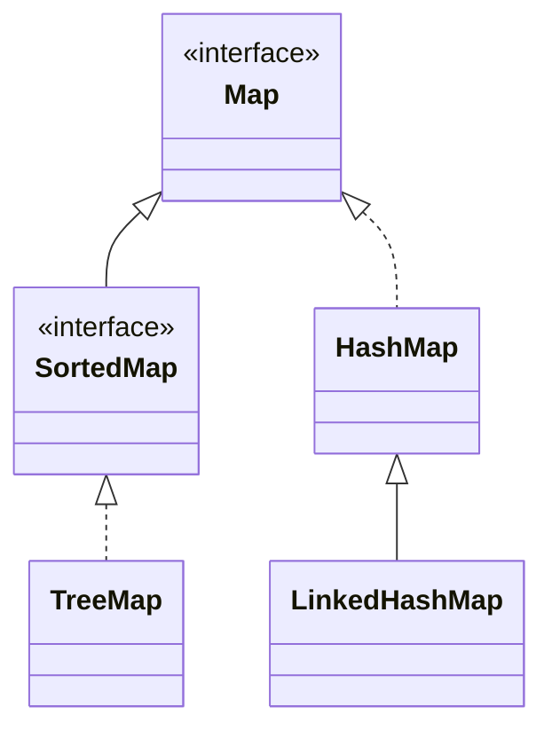

키 (Key)와 값 (Value)을 하나의 쌍으로 묶어 저장하는 자료 구조로, 키를 통해 값을 빠르게 탐색하는 데 최적화되어 있다.

```mermaid
classDiagram
    class Map {
        <<interface>>
    }
    class SortedMap {
        <<interface>>
    }
    class HashMap
    class TreeMap
    class LinkedHashMap

    Map <|-- SortedMap
    Map <|.. HashMap
    SortedMap <|.. TreeMap
    HashMap <|-- LinkedHashMap
```

## Map Interface

`Map` 인터페이스는 `List`나 `Set`과는 달리 `Collection` 인터페이스를 상속받지 않는다.

- 하나의 쌍 (pair)을 `엔트리(Entry)`라고 부르며, `Map`은 이 `Entry` 객체들을 관리
- 키 (Key)는 `Map` 내에서 유일해야 하며 (중복 불가), 값 (Value)은 중복 가능
- `Map` 자체는 순회 (iteration)를 직접 지원하지 않으므로, 키나 값의 집합을 얻어와 순회해야 함
    - `keySet()`: `Map`의 모든 키를 `Set` 형태로 반환
    - `values()`: `Map`의 모든 값을 `Collection` 형태로 반환
    - `entrySet()`: `Map`의 모든 `Entry`(키-값 쌍)를 `Set` 형태로 반환

## Map 하위 Class 특징

|     Class     | Base Class  | Base Interface | 순서 보장 | 탐색 시간 |
|:-------------:|:-----------:|:--------------:|:---------:|:---------:|
|    HashMap    | AbstractMap |      Map       |     X     |   O(1)    |
|    TreeMap    | AbstractMap |  NavigableMap  |     O     | O(log n)  |
| LinkedHashMap |   HashMap   |      Map       |     O     |   O(1)    |

### HashMap

`HashMap`은 내부적으로 배열 (해시 버킷)을 사용하여 데이터를 저장하며, 덕분에 $O (1)$의 압도적인 탐색 성능을 제공한다.

- `put(key, value)` 호출 시, `key` 객체의 `hashCode()`를 기반으로 특정 산술 연산을 거쳐 고유한 해시 값을 계산하고 이를 배열의 인덱스로 사용하여 값을 저장
- 사용자 정의 객체를 키로 사용할 경우, `equals()`와 `hashCode()` 메서드를 반드시 올바르게 재정의 (override) 필요

#### 해시 충돌 (Hash Collision)과 성능 방어

서로 다른 키 값이 동일한 해시 값을 가리키게 되는 현상을 해시 충돌이라고 하며, 데이터가 쌓일수록 자료구조를 동적으로 변경하여 성능 저하를 해결한다.

- 연결 리스트 (기본 충돌 해결)
    - 초기 충돌 시, 같은 인덱스에 할당된 데이터를 연결 리스트 (Linked List)로 이어 붙임
    - 이 경우 탐색 성능은 $O (1)$에서 선형 탐색인 $O (n)$으로 악화됨
- Red-Black Tree 전환 (성능 최적화)
    - Java 8부터는 하나의 해시 버킷 (인덱스)에 데이터가 8개 이상 (`TREEIFY_THRESHOLD`) 충돌하면, 연결 리스트를 Red-Black 트리 (균형 이진 탐색 트리)로 변환
    - 이를 통해 최악의 경우에도 탐색 성능이 $O (n)$이 아닌 $O (\log n)$을 보장하도록 성능 하락 방지
    - 반대로 데이터가 지워져서 6개 이하 (`UNTREEIFY_THRESHOLD`)로 떨어지면, 다시 오버헤드가 적은 연결 리스트로 복귀

### TreeMap

`TreeMap`은 `Red-Black Tree`라는 균형 이진 탐색 트리 (Binary Search Tree)를 기반으로 구현되었다.

- 데이터를 저장할 때 키 (Key) 값을 기준으로 자동으로 정렬 (정렬된 상태 유지)
- 객체는 `Comparable` 인터페이스를 구현 (자연 정렬)하거나, `TreeMap` 생성 시 `Comparator` 구현 필요

### LinkedHashMap

`LinkedHashMap`은 `HashMap`을 상속받아, 해시 테이블의 탐색 속도와 연결 리스트의 순서 유지 장점을 결합한 자료구조다.

- `HashMap`과 동일하게 해시 테이블을 기반으로 동작
- 내부에서 `양방향 연결 리스트`를 사용하여 모든 `Entry`를 연결하여 데이터가 삽입된 순서를 유지
    - 삽입된 순서 (Insertion Order)대로 순회 가능
- 생성자 옵션을 통해 최근 접근 순서 (Access Order)로 순서를 유지하도록 설정 가능
    - LRU (Least Recently Used) 캐시 구현에 유용
