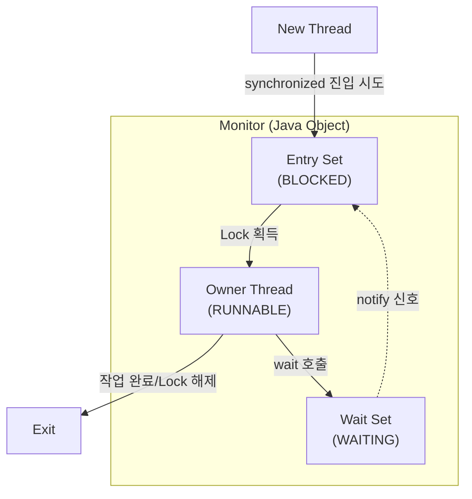

모니터는 다중 스레드 환경에서 공유 자원에 대한 안전한 접근을 보장하고 스레드 간의 실행 순서를 제어하기 위한 고수준 동기화 구조다.

- 운영체제의 세마포어(Semaphore)보다 사용하기 쉬운 고수준 추상화 개념
- Java의 모든 객체(`Object`)는 내부에 자신과 연결된 모니터를 가지며, `synchronized` 키워드를 통해 이를 제어

모니터는 다음과 같은 두 가지 주요 기능을 제공한다.

- 상호 배제(Mutual Exclusion)
    - 모니터 내의 임계 영역에는 한 번에 하나의 스레드만 접근하도록 보장
    - 이미 다른 스레드가 모니터를 점유 중이라면, 후속 스레드는 락이 해제될 때까지 대기
- 스레드 간 협력(Thread Coordination)
    - 특정 조건이 충족될 때까지 스레드를 대기시키거나, 조건이 충족되었을 때 대기 중인 스레드에게 알림
    - 해당 기능을 통해 스레드 간의 실행 순서를 제어

## 모니터의 핵심 구성 요소

모니터는 내부적으로 다음과 같은 요소들로 구성되어 동기화를 관리한다.

### 뮤텍스(Mutex)와 소유자(Owner)

- 상호 배제를 구현하기 위한 잠금 장치이자 소유권 개념
- 모니터는 고유한 락을 하나를 가짐
- 모니터는 한 시점에 단 하나의 스레드만을 소유자(Owner)로 가질 수 있음
- 스레드가 임계 영역에 진입하기 위해서는 반드시 해당 객체 모니터의 락 획득 필요
- 락을 획득한 소유자만이 코드를 실행할 수 있으며, 실행 종료 또는 wait() 호출 시 락 반납

### 엔트리 셋(Entry Set)

- 모니터의 락을 획득하기 위해 대기하는 스레드들이 머무는 공간
- 특정 스레드가 이미 락을 점유하고 있을 때, 다른 스레드들이 임계 영역에 진입하려고 시도하면 이 큐에 추가되어 `BLOCKED` 상태로 대기
- 락이 반납되면 JVM 스케줄러가 이곳의 스레드 중 하나를 선택하여 락을 부여

### 웨이트 셋(Wait Queue)

- 락을 획득했으나 조건 변수에 의해 대기 상태로 전환된 스레드들이 머무는 공간
- 스레드가 `wait()` 메서드를 호출하면, 획득했던 락을 반납하고 이 큐로 이동하여 `WAITING` 상태로 대기
- 다른 스레드가 `notify()`를 호출해주기 전까지 대기
- 알림을 받으면 즉시 실행되는 것이 아니라, 엔트리 셋으로 이동하여 다시 락 획득 경쟁에 참여

## 모니터 동작 과정 시나리오

| 단계 |     이벤트/호출     | Thread-1 상태/위치                                                             | Thread-2 상태/위치               |
|:--:|:--------------:|:---------------------------------------------------------------------------|:-----------------------------|
| 1  |    락 획득 시도     | 임계 영역 진입 시도 -> 락 획득 -> 임계영역 실행                                             | 진입 시도 -> 이미 점유 되어 엔트리 큐에서 대기 |
| 2  | 조건 대기 (`wait`) | 임계 영역 실행 중, 특정 조건 미충족 -> `wait()` 호출 -> 락 반납 -> 웨이트 셋 이동                   | 계속 엔트리 셋에서 대기                |
| 3  | 락 재획득 및 조건 충족  | 계속 대기 큐에서 대기                                                               | 락 획득 -> 임계영역 실행              |
| 4  |  알림(`notify`)  | 계속 대기 큐에서 대기                                                               | 임계 영역 실행 중 `notify()` 호출     |
| 5  |     실행 재개      | `notify`로 깨움 -> 엔트리 큐 이동 -> 다른 스레드와 경쟁하여 락 획득 -> `wait()`를 호출했던 지점부터 실행 재개 | 작업 완료 후 락 반납                 |
