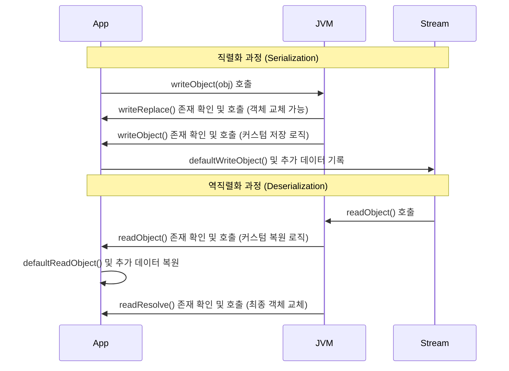
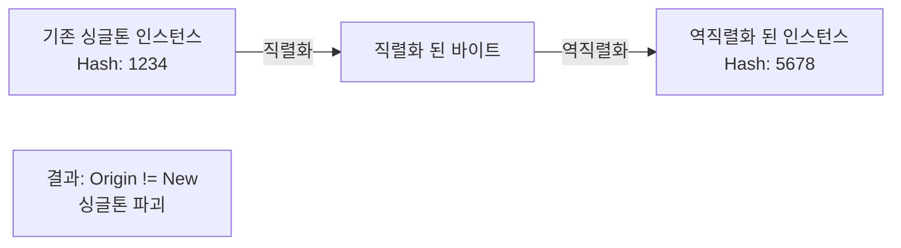

자바 시스템 내부에서 사용되는 객체 또는 데이터를 외부의 자바 시스템에서도 사용할 수 있도록 바이트(Byte) 형태로 변환하는 기술이다.

## 핵심 구성 요소

### ObjectOutputStream & ObjectInputStream

`java.io` 패키지의 각각 객체의 직렬화와 역직렬화를 처리하는 스트림 클래스로, 기본적인 직렬화/역직렬화 메커니즘을 제공한다.

- ObjectOutputStream: 객체를 직렬화하여 출력 스트림에 기록하는 역할
    - `writeObject(Object obj)` 메서드를 통해 객체를 직렬화
    - 직렬화 시 객체의 메타데이터와 데이터 필드들을 모두 바이트 스트림으로 변환
- ObjectInputStream: 스트림으로부터 바이트를 읽어 객체로 복원하는 역할
    - `readObject()` 메서드를 통해 역직렬화 수행
    - 역직렬화 시 직렬화된 클래스의 바이트코드가 CLASSPATH에 존재해야 함

### Serializable 인터페이스

직렬화를 허용할 클래스는 반드시 `java.io.Serializable` 인터페이스를 구현해야 한다.

- 마커 인터페이스(Marker Interface)
    - 구현해야 할 메서드가 없는 빈 인터페이스
    - JVM에게 해당 객체는 직렬화가 가능하다는 것을 알리는 역할
- 구현하지 않은 경우
    - 직렬화 시도 시 `java.io.NotSerializableException` 예외 발생

### transient 키워드

transient 키워드는 직렬화 과정에서 특정 필드를 제외하고 싶을 때 사용된다.

- 패스워드 등 보안상 민감한 데이터나 스트림으로 전송할 필요가 없는 임시 데이터 제외
- 역직렬화 결과: 해당 필드는 `null`이나 `0`과 같은 기본값(Default Value)으로 복원

### serialVersionUID

직렬화된 객체와 역직렬화할 클래스의 버전 일치 여부를 확인하기 위한 고유 식별자(ID)이다.

- 동작 원리
    - 명시하지 않으면 컴파일러가 클래스 구조를 기반으로 해시값을 생성하여 자동 할당
    - 클래스에 필드가 추가되거나 변경되면 이 ID 값이 변하게 됨
- 실무 권장사항
    - 클래스 변경(필드 추가/삭제) 시 역직렬화 실패(`InvalidClassException`)를 방지하기 위해 반드시 `static final long`으로 명시할 것을 권장함
    - 예: `private static final long serialVersionUID = 1L;`

## 커스텀 직렬화 메서드

`Serializable` 인터페이스를 구현한 클래스 내부에 특정 메서드를 정의하면, JVM이 직렬화 프로세스 중에 이를 자동으로 호출하여 로직을 가로챌 수 있게 해준다.



|      메서드       |   시점    |                    역할 및 특징                     |
|:--------------:|:-------:|:----------------------------------------------:|
| `writeReplace` | 직렬화 직전  | 본래의 객체 대신 다른 객체를 직렬화하도록 교체 가능 (프록시 패턴 구현 시 사용) |
| `writeObject`  |  직렬화 중  |       스트림에 데이터를 쓰는 방식을 커스터마이징 (암호화 등 수행)       |
|  `readObject`  | 역직렬화 중  |  스트림에서 데이터를 읽는 방식을 커스터마이징 (복호화, 유효성 검사 등 수행)   |
| `readResolve`  | 역직렬화 직후 |      역직렬화된 객체를 다른 객체로 대체 (싱글톤 보장 시 필수 사용)      |

## Serializable 인터페이스 구현 예시

아래는 `Serializable` 인터페이스를 구현한 예시 코드로, 수행되는 순서는 다음과 같다.

1. `writeReplace`: 직렬화 전, 직렬화될 인스턴스를 대체하거나 변경
2. `writeObject`: 직렬화 과정 중 객체 데이터를 직접 쓰는 방법을 정의
3. `readObject`: 역직렬화 과정 중 객체 데이터를 직접 읽는 방법을 정의
4. `readResolve`: 역직렬화 후, 반환할 인스턴스를 대체하거나 변경

```java
class Person implements Serializable {

    private static final long serialVersionUID = 1L;

    private String name;
    private int age;
    private transient String password; // 직렬화 제외 필드

    public Person(String name, int age, String password) {
        this.name = name;
        this.age = age;
        this.password = password;
    }

    // 1. 직렬화 대상 객체 교체 (선택적)
    private Object writeReplace() throws ObjectStreamException {
        System.out.println("1. writeReplace 호출");
        return this; // 교체하지 않고 그대로 진행
    }

    // 2. 직렬화 커스터마이징
    private void writeObject(ObjectOutputStream out) throws IOException {
        System.out.println("2. writeObject 호출");
        out.defaultWriteObject(); // 기본 필드(name, age) 저장
        // password 필드는 transient이므로 직접 암호화하여 저장
        String encoded = Base64.getEncoder().encodeToString(password.getBytes());
        out.writeObject(encoded);
    }

    // 3. 역직렬화 커스터마이징
    private void readObject(ObjectInputStream in) throws IOException, ClassNotFoundException {
        System.out.println("3. readObject 호출");
        in.defaultReadObject(); // 기본 필드 복원
        // 암호화된 비밀번호 복원
        String encoded = (String) in.readObject();
        this.password = new String(Base64.getDecoder().decode(encoded));
    }

    // 4. 역직렬화 객체 교체 (싱글톤 유지 등에 사용)
    private Object readResolve() throws ObjectStreamException {
        System.out.println("4. readResolve 호출");
        return this; // 로직에 따라 기존 인스턴스로 교체 가능
    }

    @Override
    public String toString() {
        return "Person{name='" + name + "', age=" + age + ", password='" + password + "'}";
    }
}

class SerializationExample {

    public static void main(String[] args) {
        Person person = new Person("Ogu", 59, "secretPassword");

        // 직렬화
        try (ObjectOutputStream out = new ObjectOutputStream(new FileOutputStream("person.ser"))) {
            out.writeObject(person);
        } catch (IOException e) {
            e.printStackTrace();
        }

        // 역직렬화
        try (ObjectInputStream in = new ObjectInputStream(new FileInputStream("person.ser"))) {
            Person deserializedPerson = (Person) in.readObject();
            System.out.println("Deserialized Person: " + deserializedPerson);
        } catch (IOException | ClassNotFoundException e) {
            e.printStackTrace();
        }
    }
}
```

## 실무적 고려사항과 대안

자바 직렬화는 편리하지만 실무에서는 다음과 같은 이유로 사용을 지양하거나 주의해서 사용한다.

- 보안 이슈
    - 역직렬화 과정에서 공격자가 조작한 바이트 스트림을 보내 원격 코드 실행(RCE) 등의 심각한 보안 취약점을 유발할 수 있음
- 유지보수성
    - 클래스 구조가 변경되면 역직렬화가 불가능해지는 등 장기적인 데이터 저장 포맷으로 적합하지 않음
- 대안 기술 사용 권장
    - 데이터 교환 목적: JSON (Jackson, Gson), XML
    - 성능 목적: Protocol Buffers, Avro 등 이식성과 성능이 뛰어난 포맷 사용

### 싱글톤 패턴과 readResolve

일반적으로 싱글톤(Singleton) 패턴은 애플리케이션 내에서 단 하나의 인스턴스만 존재함을 보장해야 하지만, 직렬화와 역직렬화를 거치면 이 원칙이 깨질 수 있다.

- 기본적으로 역직렬화(ObjectInputStream.readObject)는 생성자를 호출하지 않고 힙 메모리에 새로운 객체를 생성하는 방식으로 동작
- 싱글톤 객체를 직렬화한 후 다시 역직렬화하면, 기존의 싱글톤 인스턴스와는 별개의 새로운 인스턴스가 생성



이를 방지하기 위해 `readResolve` 메서드를 사용하여 역직렬화된 객체 대신 기존에 생성된 싱글톤 인스턴스를 반환하도록 구현해야 한다.

```java
public class Singleton implements Serializable {

    private static final long serialVersionUID = 1L;

    // 단일 인스턴스 생성
    private static final Singleton INSTANCE = new Singleton();

    private Singleton() {
    }

    public static Singleton getInstance() {
        return INSTANCE;
    }

    // 역직렬화 시 호출되는 메서드
    private Object readResolve() {
        // 역직렬화로 만들어진 새로운 객체는 무시하고, 기존 INSTANCE를 반환
        return INSTANCE;
    }
}
```

이 외에도 [Enum 타입 사용](/docs/java/effective-java/item3/)을 통해 싱글톤을 구현하는 방법도 직렬화 문제를 자연스럽게 해결할 수 있는 대안으로 권장된다.
