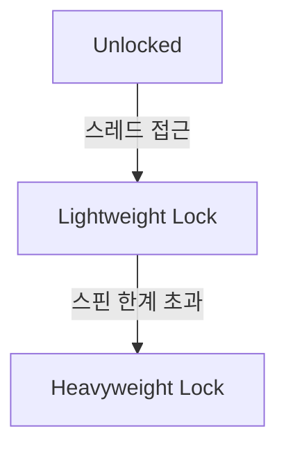

멀티 스레드 환경에서는 여러 스레드가 하나의 공유 자원에 동시에 접근할 때 데이터의 무결성이 깨지는 경쟁 상태(Race Condition)가 발생할 수 있다.

## `synchronized`를 이용한 동기화

Java는 `synchronized` 키워드를 통해 객체의 모니터를 이용하여, 가장 사용하기 쉽고 안전한 기본적인 동기화 메커니즘을 제공한다.

### 사용 방법 및 범위

Java는 `synchronized` 키워드를 통해 임계 영역을 손쉽게 설정할 수 있다.

1. 해당 코드 영역을 임계 영역으로 지정
2. 공유 데이터(객체)가 가지고 있는 잠금을 획득한 단 하나의 스레드만 이 영역 내의 코드를 수행할 수 있게 함
3. 임계 영역을 점유한 A 스레드가 코드 실행 중인 경우, B 스레드는 잠금 해제될 때까지 대기
4. A 스레드가 임계 영역 실행 완료 후 락을 반납하면, B 스레드가 락을 획득하여 코드를 수행

```java
// 1. 메서드 전체를 임계 영역 지정
public synchronized void method() {
    // ...
}

public void method() {
    // 2. 메서드 내의 특정 영역을 임계 영역 지정
    synchronized (this) { // 해당 객체(this)를 잠금의 대상으로 지정
        // ...
    }
}
```

### 한계

`synchronized`는 임계 영역을 손쉽게 지정할 수 있는 장점이 있지만 다음과 같은 단점이 있다.

- 락 획득 대기 시간을 설정할 수 없어 무한 대기 가능성 존재
- 대기 중인 스레드에 인터럽트를 걸 수 없음
- 읽기/쓰기를 구분하는 등 세밀한 제어가 불가능

### JVM 레벨 동작

`synchronized` 블록은 자바 컴파일러가 `monitorenter`/`monitorexit` 바이트코드로 변환하며, JVM이 객체 헤더의 락 상태를 직접 조작하여 동기화를 구현한다.

- `monitorenter`: 임계 영역 진입 시점에 객체 모니터 락 획득 시도
- `monitorexit`: 정상 종료 시 락 반납
- 예외 발생 경로에도 락이 반납되도록 컴파일러가 암묵적 `try-finally`를 삽입

#### Object Header와 Mark Word

HotSpot JVM에서 모든 객체는 헤더에 Mark Word 영역을 가지며, 이곳에 락 상태가 기록된다.

- 크기: 64비트 JVM 기준 64비트 (32비트 JVM은 32비트)
- 포함 정보: 락 상태 태그, 소유 스레드 식별자, GC 에이지, 해시코드 등 상태에 따라 의미 가변
- 태그 비트로 다음 상태 구분: 편향 가능, 경량 락, 중량 락, GC 마킹

#### 락 에스컬레이션(Lock Escalation)

락은 Unlocked → Lightweight → Heavyweight 3단계로 승급되며 각 전이는 특정 상황을 트리거로 한다.(JDK 15에서 Biased Locking이 제거)



##### Lightweight Lock (경량 락)

다른 스레드가 진입하지만 선행 스레드가 곧 락을 놓을 것으로 기대되는 짧은 경쟁 상황에 사용된다.

- 획득 방식: CAS(Compare-And-Swap) 원자 연산으로 Mark Word를 교체 시도
- 실패 시 대기: 루프 안에서 CAS를 반복하며 락이 풀리기를 기다리는 busy-waiting
- 핵심 특징: 사용자 모드에서 CPU 사이클만 소모, OS 커널 진입·컨텍스트 스위칭 없음
- 이유: 짧은 경쟁이라면 커널 호출 비용(수 μs)보다 몇 사이클 헛도는 편이 저렴

##### Heavyweight Lock (중량 락)

스핀을 반복해도 락을 얻지 못할 만큼 경쟁이 길어지면 JVM이 정한 스핀 한계를 넘는 시점에 승급된다.

- 승급 과정: Mark Word를 힙에 새로 할당한 `ObjectMonitor` 포인터로 교체
- 대기 방식: OS 뮤텍스로 스레드를 `BLOCKED` 상태로 전환하여 CPU 스케줄링에서 제외
- 핵심 특징: 커널이 스레드를 재우고 락 해제 시점에 깨워줌 → CPU 낭비 없음, 대신 깨어날 때 커널 개입 비용 발생
- 이유: 대기가 길어지면 CPU를 헛돌리는 비용이 커널 호출 비용을 초과

## 조건 변수(Condition Variable)

단순히 접근을 막는 것을 넘어 스레드 간에 특정 조건을 기다리고, 조건이 만족되었음을 알려주는 협력 매커니즘이 필요할 땐 Java 모니터의 조건 변수 기능을 사용할 수 있다.

- `wait()`
    - 임계 영역을 실행하던 스레드가 특정 조건을 만족하지 못했을 때 호출
    - 스레드는 락을 반납하고 `WAITING` 상태로 전환되어 대기 셋(Wait Set)으로 이동
- `notify()`
    - 다른 스레드가 특정 조건을 만족시키는 작업을 완료했을 때 호출
    - 대기 셋에 있는 스레드 중 임의의 하나를 깨워 엔트리 셋(락 획득 대기 상태)로 이동
- `notifyAll()`
    - 대기 셋에 있는 모든 스레드를 깨워 엔트리 셋으로 이동

### wait()와 notify() 동작 과정

1. 스레드 A가 락을 획득하고 임계 영역을 실행
2. 조건이 만족되지 않아 스레드 A가 `wait()`를 호출
3. 스레드 A는 락을 반납하고 대기 셋으로 이동
4. 다른 스레드 B가 락을 획득하고 임계 영역을 실행하여 조건을 만족시킴
5. 스레드 B가 `notify()`를 호출하고 자신의 작업을 마친 뒤 락을 반납
6. `notify()` 호출로 깨어난 스레드 A는 대기 셋에서 엔트리 셋으로 이동
7. 스레드 A는 엔트리 셋에서 락 획득을 다시 시도하고, 성공하면 `wait()`가 호출됐던 지점부터 실행을 재개

### `synchronized` + `wait()`/`notify()` 사용 예시

스레드가 깨어났을 때 조건이 여전히 유효한지 재검사해야 하므로 `while` 문을 사용해야 한다.

```java
class SharedBuffer {

    private final Queue<String> queue = new LinkedList<>();
    private final int CAPACITY = 5;

    public synchronized void produce(String data) throws InterruptedException {
        // 버퍼가 가득 찼으면 대기 (while 루프 사용 필수)
        while (queue.size() == CAPACITY) {
            wait();
        }
        queue.add(data);
        notifyAll(); // 대기 중인 소비자들을 모두 깨움
    }

    public synchronized String consume() throws InterruptedException {
        // 버퍼가 비었으면 대기 (while 루프 사용 필수)
        while (queue.isEmpty()) {
            wait();
        }
        String data = queue.poll();
        notifyAll(); // 대기 중인 생산자들을 모두 깨움
        return data;
    }
}
```

또한 특정 스레드만 계속 대기하는 기아 현상을 막기 위해 일반적으로 `notifyAll` 사용이 권장된다.

## `ReentrantLock`를 이용한 동기화

JDK 1.5부터 제공되는 `java.util.concurrent.locks.ReentrantLock`은 `synchronized`의 단점을 보완하고 더 강력한 기능을 제공한다.

### 주요 기능 및 장점

1. 락 획득 타임아웃 설정 가능
    - `tryLock(long timeout, TimeUnit unit)` 메서드를 사용하여 락 획득 시도 시간 설정 가능
    - 락 획득 실패 시 다른 로직을 수행하거나 재시도를 하여 데드락을 방지
2. 인터럽트 처리 가능
    - `lockInterruptibly()` 메서드를 사용하여 락 대기 중에 인터럽트 신호를 감지하여 대기 취소 가능
3. Condition 객체 분리
    - `Wait Set`을 여러 개로 분리하여 관리 가능
    - 생산자 스레드와 소비자 스레드를 구분하여 깨우는 등 정교한 신호 전달 가능

기존 `synchronized`와는 다르게 모니터 락이 아닌 직접적인 락 객체를 사용하는 방식으로 동작한다.

|    특징    |           `synchronized`           |              `ReentrantLock`              |
|:--------:|:----------------------------------:|:-----------------------------------------:|
|   락 타입   |           모니터 락(JVM 관리)            |              객체 기반 락 (직접 관리)              |
|  JVM 구현  | Object Header Mark Word + 락 에스컬레이션 | AQS(`state` + CLH 큐) + `LockSupport.park` |
| 타임아웃 지원  |                미지원                 |              지원 (`tryLock`)               |
| 인터럽트 지원  |                미지원                 |         지원 (`lockInterruptibly`)          |
|  락 세분화   |                불가능                 |    가능 (여러 개의 `ReentrantLock` 인스턴스 사용)     |
| 대기/알림 제어 | `wait()` / `notify()` 메서드로 제한적 제어  |       `Condition` 객체를 통한 세부적 제어 가능        |

### `ReentrantLock` 동작 방식

`synchronized` 키워드와 유사하게 두 가지 대기 상태를 관리한다.

- `ReentrantLock` 객체 대기 큐: 락을 획득하려는 스레드 대기 공간
- `Condition` 객체 스레드 대기 공간: `await()` 메서드에 의해 대기 중인 스레드 대기 공간

동작 과정은 아래와 같다.

1. 스레드에서 `lock()` 메서드를 호출하여 락을 획득하려 시도
2. 이미 사용 중인 경우 대기 큐로 이동하여 락을 획득할 때까지 대기
3. `unlock()` 메서드를 호출하여 락을 반납하면 대기 큐에서 대기 중인 스레드 중 하나가 락을 획득
4. `await()` 메서드를 호출하면 스레드 대기 공간으로 이동하고 락을 반납
5. 다른 스레드에서 `signal()` 메서드를 호출하면 스레드 대기 공간에 있는 대기 중인 스레드 중 하나를 깨움
6. 깨어난 스레드는 대기 큐로 이동
7. 락 획득을 시도
8. 성공하면 `await()`를 호출한 부분부터 다시 실행

### `ReentrantLock` 사용 예시

```java

class PrinterQueue {

    private final Lock lock = new ReentrantLock();
    private final Condition notFullCondition = lock.newCondition();
    private final Condition notEmptyCondition = lock.newCondition();

    private final Queue<String> queue = new LinkedList<>();
    private final int maxCapacity;

    public PrinterQueue(int maxCapacity) {
        this.maxCapacity = maxCapacity;
    }

    // 프린트 작업 추가
    public void addPrintJob(String job) {
        lock.lock();
        try {
            while (queue.size() == maxCapacity) {
                System.out.println(Thread.currentThread().getName() + " is waiting to add print job: " + job);
                notFullCondition.await(); // 큐가 가득 찬 경우 대기
            }
            queue.offer(job);
            System.out.println(Thread.currentThread().getName() + " added print job: " + job);
            notEmptyCondition.signal(); // 큐에 데이터가 추가되었으므로 소비자 알림
        } catch (InterruptedException e) {
            Thread.currentThread().interrupt();
            System.out.println(Thread.currentThread().getName() + " was interrupted while adding a print job.");
        } finally {
            lock.unlock();
        }
    }

    // 프린트 작업 처리
    public void processPrintJob() {
        lock.lock();
        try {
            while (queue.isEmpty()) {
                System.out.println(Thread.currentThread().getName() + " is waiting for a print job to process.");
                notEmptyCondition.await(); // 큐가 비어 있는 경우 대기
            }
            String job = queue.poll();
            System.out.println(Thread.currentThread().getName() + " is processing print job: " + job);
            notFullCondition.signal(); // 큐에 공간이 생겼으므로 생산자 알림
        } catch (InterruptedException e) {
            Thread.currentThread().interrupt();
            System.out.println(Thread.currentThread().getName() + " was interrupted while processing a print job.");
        } finally {
            lock.unlock();
        }
    }
}
```

### JVM 레벨 동작

`ReentrantLock`은 JVM 내장 모니터가 아닌 `java.util.concurrent.locks.AbstractQueuedSynchronizer`(AQS) 위에 구현된 사용자 레벨 락이다.

- 락 상태를 하나의 `int state` 필드로 표현하여 CAS로 원자적 전이
- 대기 스레드를 CLH(Craig, Landin, Hagersten) 기반의 양방향 큐로 관리
- 실제 블로킹은 `LockSupport.park()`로 수행되어, JVM 내부에서 OS 스레드 스케줄링과 연결

#### 락 획득·해제 흐름

1. `lock()` 호출 시 `state`가 0이면 CAS로 1로 전이하여 즉시 획득
2. CAS 실패 시 현재 스레드를 노드로 감싸 AQS 큐 꼬리에 추가
3. 선행 노드가 소유자가 아니면 `LockSupport.park()`로 중단 (OS 레벨 대기)
4. `unlock()`은 `state`를 감소시키고 0이 되면 큐의 다음 노드에 `LockSupport.unpark()` 전달
5. 깨어난 스레드는 재시도하여 CAS 성공 시 획득

#### 재진입(Reentrancy)과 공정성

- 재진입: 소유 스레드가 다시 `lock()` 호출 시 `state`를 1 증가, `unlock()`마다 감소하여 0에서 해제
- 비공정 모드 (기본값): 획득 시도 시 큐를 건너뛰고 CAS 선점 허용하여 처리량 우선
- 공정 모드: 생성자에 `true` 지정 시 반드시 큐 순서대로 획득하여 기아 방지 우선

`ReentrantLock`이 `synchronized`보다 세밀한 제어를 제공할 수 있는 근거는, 대기·해제 로직이 JVM 고정 모니터가 아닌 자바 코드 수준의 AQS로 구현되어 확장 가능하다는 점에 있다.

## 가상 스레드 환경에서의 선택

Java 21의 가상 스레드는 블로킹 호출 시 캐리어 스레드에서 언마운트되어 자원을 양보하도록 설계되었으나, `synchronized`는 이 메커니즘과 충돌한다.

- 피닝(Pinning) 원인
    - `synchronized` 블록 내부에서 블로킹 호출 발생 시, JVM 모니터 락이 캐리어 스레드에 종속되어 언마운트 불가
    - 해당 캐리어 스레드는 가상 스레드가 깨어날 때까지 점유되어, `ForkJoinPool`의 캐리어 수가 고갈되면 처리량이 플랫폼 스레드 수준으로 하락
- `ReentrantLock`의 이점
    - AQS 기반 락은 `LockSupport.park()`로 대기하며, 이는 가상 스레드 스케줄러와 통합되어 언마운트 경로 확보
    - 가상 스레드 도입 초기(JDK 21~23)에는 기존 `synchronized` 코드를 `ReentrantLock`으로 전환하는 것이 권장 사항
- JEP 491 (Synchronize Virtual Threads without Pinning, JDK 24)
    - 모니터 획득 및 `Object.wait()` 구간에서도 가상 스레드가 언마운트 가능하도록 JVM 내부가 수정
    - 대부분의 레거시 `synchronized` 코드가 코드 수정 없이 가상 스레드 환경과 호환되는 수준으로 완화

가상 스레드의 피닝과 컨티뉴에이션 메커니즘 상세는 [Virtual Thread 문서](/docs/java/virtual-thread/)에서 다룬다.

###### 참고자료

- [Java의 정석](https://kobic.net/book/bookInfo/view.do?isbn=9788994492032)
