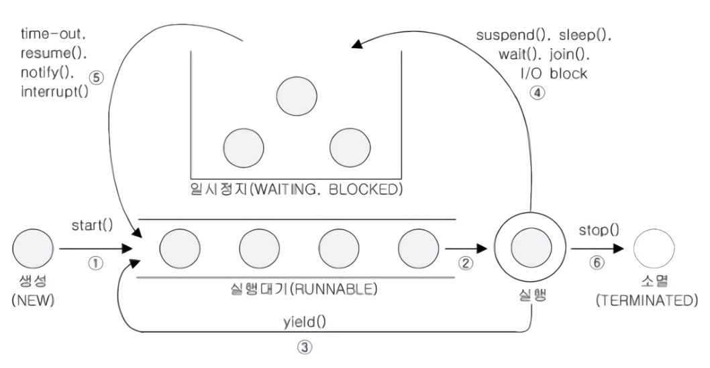

프로세스 내에서 실제로 작업을 수행하는 실행 단위로, 모든 프로세스는 최소 하나 이상의 스레드를 가지고 있다.

- 프로세스: 운영체제로부터 자원을 할당받는 작업의 단위(Code, Data, Heap, Stack 영역 독립)
- 스레드: 프로세스가 할당받은 자원을 이용하는 실행 단위(Stack, PC Register만 독립, 나머지 영역은 공유)

## 스레드 구현

구현 방법으로는 아래 두 개의 방법이 있으며 큰 차이는 없으나 Thread 클래스를 상속 받으면 다른 클래스를 상속 받을 수 없기 떄문에 Runnable 방법을 권장한다.

### Thread 클래스를 상속받아 구현

`Thread` 클래스를 직접 상속받아 `run()` 메서드를 오버라이딩한다.

```java
public class MyThread extends Thread {

    @Override
    public void run() {
        // Do something
    }
}
```

Java는 다중 상속을 지원하지 않으므로, 다른 클래스를 상속받을 수 없다는 단점이 있다.

### Runnable 인터페이스를 구현

`Runnable` 인터페이스는 `run()` 메서드 하나만 정의되어 있는 함수형 인터페이스다.

```java
public class MyThread implements Runnable {

    @Override
    public void run() {
        // Do Something
    }
}
```

다른 클래스를 상속받을 수 있으며, Java 8부터는 람다식으로도 구현할 수 있다.

## 스레드 실행

스레드를 실행할 때는 `run()`이 아닌 `start()` 메서드를 호출해야 한다.

```java
public static void main(String[] args) {
    // Runnable 인터페이스 구현체 실행
    Runnable r = new MyRunnable();
    Thread t1 = new Thread(r); // 생성자: Thread(Runnable target)

    // 람다식 활용
    Thread t2 = new Thread(() -> System.out.println("Lambda Thread"));

    t1.start();
    t2.start();
}
```

`start()` 메서드가 호출되어도 해당 스레드에서 바로 실행 되는 것이 아니기 때문에, 스레드 스케줄러에 의해 대기 상태가 되고 대기 상태에 있는 스레드는 스레드 스케줄러에 의해 실행된다.

- 한 번 실행된 스레드는 다시 실행 불가능
- 두 번 이상 실행하게 되면 `IllegalThreadStateException` 예외 발생

### `start()` vs `run()`

- `run()`: 생성된 스레드를 실행시키는 것이 아니라 단순히 클래스에 선언된 메서드를 호출
- `start()`: 새로운 스레드를 생성하기 위한 준비 작업 수행
    1. 새로운 실행 흐름을 위한 호출 스택(Call Stack) 생성
    2. OS 스케줄러에게 실행 요청
    3. 새로 생성된 호출 스택에 `run()` 메서드를 올리고 실행

호출 스택을 강제로 출력하는 코드 사용하여 결과를 확인해보면 `start()` 메서드를 호출한 경우 main 스레드와 별도의 스레드가 생성되어 실행되는 것을 확인할 수 있다.

## 스레드 우선순위

스레드는 `priority`라는 속성(멤버변수)를 가지고 있으며 이 속성은 스레드의 우선순위를 나타낸다.

- 스레드의 우선순위는 1 ~ 10 사이의 값을 가짐(기본값 5)
- 우선순위는 JVM이 OS 스케줄러에게 주는 힌트일 뿐이며, 실제 실행 순서를 보장하지 않음

## 스케줄링 메서드

|         메서드          |  역할   |                                           설명                                           |
|:--------------------:|:-----:|:--------------------------------------------------------------------------------------:|
| `sleep(long millis)` | 일시 정지 |                               지정된 시간 동안 스레드 일시 정지 상태로 만듬                               |
|       `join()`       |  대기   |                                 다른 스레드의 작업이 끝날 때까지 대기                                  |
|    `interrupt()`     |  깨움   | 일시 정지 상태(`sleep`, `join`, `wait`)인 스레드에게 예외(`InterruptedException`)를 발생시켜 실행 대기 상태로 만듬 |
|      `yield()`       |  양보   |                  실행 중에 자신에게 주어진 실행 시간을 다른 스레드에게 양보하고 자신은 실행 대기 상태로 변경                  |

이 외에 `suspend()`, `resume()`, `stop()`은 교착 상태(Deadlock)를 유발할 가능성이 있어 `deprecated` 되었다.

## 스레드의 상태

|       상태       |                         설명                          |
|:--------------:|:---------------------------------------------------:|
|      NEW       |         스레드가 생성되고 아직 `start()`가 호출되지 않은 상태          |
|    RUNNABLE    |                  실행 중 또는 실행 가능한 상태                  |
|    BLOCKED     |     동기화 블럭에 의해 일시정지된 상태(`lock`이 풀릴 때까지 기다리는 상태)     |
|    WAITING     |      다른 스레드가 통지(notify)하거나 작업이 완료될 때까지 기다리는 상태      |
| TIMED\_WAITING | 주어진 시간 동안 기다리는 상태 (`sleep`, `timeout`이 있는 `join` 등) |
|   TERMINATED   |                   스레드의 작업이 종료된 상태                   |

### 스레드 라이프사이클



1. 스레드 생성하고 `start()` 호출하여 실행 대기열에 저장되어 실행 대기 상태로 만듬
    - 실행대기열은 큐(queue)와 같은 구조로 먼저 실행대기열에 들어온 스레드가 먼저 실행됨
2. 실행 대기열에 있다가 차례가 되면 실행상태로 변경
3. 주어진 실행시간이 다되거나 `yield()`를 만나면 실행대기상태가 되고 다시 실행대기열에 들어감
4. 실행 중 `suspend()`, `sleep()`, `join()`, `wait()`, `I/O block` 의해 일시정지 상태가 될 수 있음
5. 지정된 일시정지시간이 다 되거나 `time-out()`, `notify()`, `resume()`, `interrupt()` 등의 메서드를 호출하면 다시 실행대기상태가 됨
6. 실행을 모두 마치거나 `stop()`을 호출하면 종료상태가 됨

###### 참고자료

- [Java의 정석](https://kobic.net/book/bookInfo/view.do?isbn=9788994492032)
