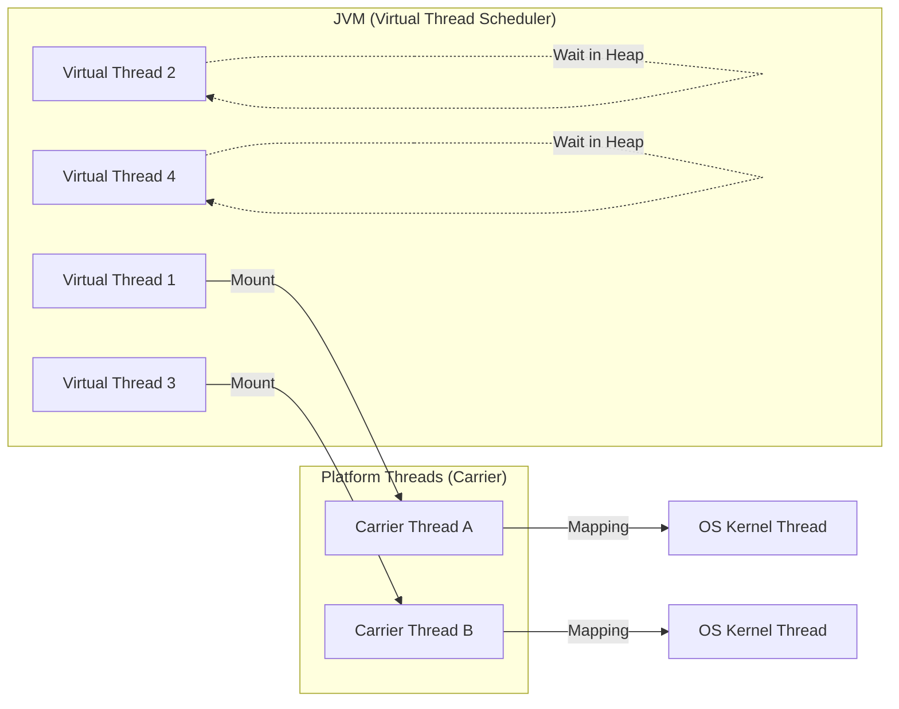

가상 스레드는 Java 21에서 정식 도입된 경량 스레드 모델로, 기존의 플랫폼 스레드가 가진 리소스 종속성 문제를 해결하고, 단순한 동기식 코드로 높은 처리량을 달성하기 위해 설계되었다.

- OS 스레드에 1:1로 매핑되지 않고 JVM 스케줄러를 통해 관리되는 논리적 실행 단위
- 수백만 개의 스레드를 동시에 생성하더라도 메모리와 CPU 오버헤드가 극히 적음
- 비동기 프로그래밍의 복잡성 없이 기존 서블릿 기반의 Thread-per-request 모델 유지 가능
- 블로킹 I/O 작업이 발생해도 OS 스레드 점유 없이 효율적으로 대기할 수 있도록 설계

## 도입 배경 및 한계 극복

전통적인 자바 동기화 모델은 운영체제의 커널 스레드를 래핑한 플랫폼 스레드를 사용했는데, 이 방식은 확장성 측면에서 명확한 한계를 지닌다.

- 플랫폼 스레드의 비용 문제
    - 메모리 점유: 플랫폼 스레드는 생성 시 약 1MB의 고정된 스택 메모리를 할당
    - 생성 비용: OS 커널이 직접 개입하여 스레드를 생성하므로 시간 소모가 큼
    - 컨텍스트 스위칭: 스레드 간 전환 시 커널 모드 권한 변경이 필요하여 CPU 사이클 낭비 발생
- 데이터 처리 모델의 변화
    - 현대의 웹 애플리케이션은 CPU 연산보다 I/O(DB 호출, API 연동) 대기 시간이 더 큼
    - 플랫폼 스레드는 I/O 블로킹 발생 시 해당 스레드가 아무 일도 하지 못하고 자원을 점유하는 낭비 발생
    - 가상 스레드는 이러한 대기 시간에 자원을 반납하도록 설계되어 자원 효율성 극대화

## 내부 동작 원리와 스케줄링

가상 스레드는 JDK 내부의 ForkJoinPool을 스케줄러로 사용하며, 실제 연산을 수행하는 플랫폼 스레드인 캐리어 스레드(Carrier Thread) 위에서 실행된다.



### 마운트(Mount)와 언마운트(Unmount)

가상 스레드가 실행될 때 스케줄러에 의해 캐리어 스레드에 할당되는 과정을 마운트라고 하며, 그 과정은 다음과 같다.

1. Mount: 스케줄러가 가상 스레드를 캐리어 스레드에 할당하여 실행 상태로 전환
2. Execution: 코드 실행
3. Unmount (Yield): I/O 작업이나 `Sleep` 등 블로킹이 발생하면, 가상 스레드는 캐리어 스레드에서 내려와 언마운트 상태로 전환
    - 현재까지의 스택 상태를 Heap 영역에 저장
4. Wait: 가상 스레드가 쉬는 동안 캐리어 스레드는 다른 가상 스레드를 처리
5. Remount: I/O가 완료되면 다시 캐리어 스레드에 마운트되어 Heap에 저장했던 상태를 복구하고 실행 재개

### 컨티뉴에이션(Continuation)

- 가상 스레드의 핵심 매커니즘으로, 실행 중인 지점의 상태를 보존하고 나중에 해당 지점부터 재개할 수 있게 하는 기능
- JVM은 언마운트 시점에 CPU 레지스터와 스택의 데이터를 힙으로 복사하고, 재개 시점에 다시 복구

## 플랫폼 스레드와 가상 스레드 비교

|    구분    | 플랫폼 스레드 (Platform Thread) | 가상 스레드 (Virtual Thread) |
|:--------:|:-------------------------:|:-----------------------:|
|  관리 주체   |           OS 커널           |           JVM           |
| 기본 스택 크기 |        약 1MB (고정적)        |   수백 바이트 ~ 수 KB (가변적)   |
|  생성 비용   |       매우 높음 (풀링 필수)       |     매우 낮음 (필요 시 생성)     |
| 컨텍스트 스위칭 |      OS 커널 스위칭 (무거움)      |     JVM 내 스위칭 (가벼움)     |
|   확장성    |          수천 개 수준          |        수백만 개 수준         |

### 가상 스레드 vs 리액티브 프로그래밍(WebFlux) 상세 비교

가상 스레드와 리액티브 모델은 모두 높은 처리량을 목적으로 하지만, 근본적으로 다른 철학과 프로그래밍 모델을 가지고 있다.

|        구분         |                가상 스레드 (Virtual Thread)                 |          리액티브 (Spring WebFlux)          |
|:-----------------:|:------------------------------------------------------:|:---------------------------------------:|
|      동작 메커니즘      |                   컨티뉴에이션 및 마운트 전략 활용                   |            이벤트 루프 및 콜백 기반 처리            |
|     I/O 처리 방식     |                      기존 블로킹 코드 방식                      |              논블로킹 매커니즘 필요               |
| 배압 (Backpressure) |                  별도의 제어 메커니즘이 존재하지 않음                  |       리액티브 스트림즈 표준을 통한 강력한 흐름 제어        |
|    메모리 관리 및 위험    | 수백만 개 생성 시 힙 메모리 사용량이 급증하거나 ThreadLocal 남용 시 OOM 위험 존재 |  고정된 수의 스레드만 사용하므로 메모리 사용량이 일정하고 예측 가능  |
|      자원 효율성       |       수백만 개의 스레드를 생성할 수 있으나 개별 스레드의 상태 저장 비용 발생        |   적은 수의 스레드로 대규모 동시 연결을 처리하는 고밀도 효율성    |
|      에러 핸들링       |             표준적인 try-catch 및 명령형 예외 처리 활용              |      연산자 체인 내 전용 핸들러를 통한 비동기 예외 처리      |
|     주요 사용 사례      |      일반적인 CRUD API, JDBC 기반 레거시 시스템 전환, 단순 병렬 작업       | 실시간 스트리밍, 게이트웨이, 정교한 흐름 제어 / 배압 필요한 시스템 |

## 사용 시 주의사항

가상 스레드는 기존 `Thread` API를 계승하지만, 내부 동작 방식의 차이로 인해 기존의 스레드 사용 패턴이 그대로 적용되지 않는 경우가 많다.

- 스레드 풀 미사용
    - 가상 스레드는 재사용을 목적으로 설계되지 않음
    - 생성 비용이 매우 저렴하므로 `ExecutorService`를 통해 풀링하기보다 작업마다 새 스레드를 생성하는 방식 권장
- 피닝(Pinning) 현상
    - `synchronized` 블록 내에서 I/O 작업이 발생하면 가상 스레드가 캐리어 스레드에 고정되어 언마운트되지 않음
    - 이로 인해 다른 가상 스레드들이 실행 기회를 잃는 성능 저하 발생
    - 해결책: `synchronized` 대신 `ReentrantLock` 사용하여 피닝 방지
- ThreadLocal 메모리 관리
    - 가상 스레드가 언마운트될 때 `ThreadLocal`에 저장된 데이터는 힙으로 이동하여 관리
    - 대용량 데이터를 `ThreadLocal`에 저장할 경우, 수백만 개의 가상 스레드가 동시에 존재하면 힙 메모리 부족 현상 발생 가능
    - 가상 스레드 환경에서는 `ThreadLocal` 사용을 최소화하거나, 가벼운 데이터 위주로 구성하는 것이 좋음

## 성능적 측면에서의 고려사항

- 처리량(Throughput) vs 응답 속도(Latency): 가상 스레드는 개별 작업의 속도를 빠르게 만드는 것이 아니라, 단위 시간당 처리할 수 있는 작업의 양을 늘려주는 도구
- CPU Bound 작업: 복잡한 연산이 주를 이루는 작업에서는 가상 스레드의 이점이 없으며, 오히려 스케줄링 오버헤드로 인해 성능이 하락 가능성 존재
- I/O Bound 작업: 대규모 트래픽을 처리하는 API 서버나 마이크로서비스 환경에서 리소스 효율성을 극대화하는 데 최적

## 가상 스레드 생성 및 실행 예제

Java 21부터 추가된 `Executors.newVirtualThreadPerTaskExecutor()`를 사용하면, 제출되는 모든 태스크에 대해 새로운 가상 스레드를 생성하여 실행한다.

### 프레임워크 지원(Spring Boot 3.2+)

Spring Boot 3.2 버전부터는 복잡한 설정 없이 프로퍼티 하나로 모든 서블릿 처리 스레드를 가상 스레드로 전환할 수 있다.

- Tomcat이나 Jetty 같은 내장 웹 서버가 가상 스레드를 사용하여 요청 처리
- 기존의 `@Async` 처리나 스케줄러 등도 가상 스레드 기반으로 동작

```yaml
spring:
  threads:
    virtual:
      enabled: true
```

### 가상 스레드 기반 Executor 사용

```java
public class ThreadComparison {

    public static void main(String[] args) {
        int taskCount = 10_000;

        // 1. 플랫폼 스레드 (Fixed Thread Pool) 방식
        System.out.println("=== 플랫폼 스레드 시작 ===");
        long startPlatform = System.currentTimeMillis();
        // 실제 운영 환경에서 10,000개를 동시에 띄우는 것은 불가능하므로 풀링 사용
        try (ExecutorService platformExecutor = Executors.newFixedThreadPool(100)) {
            runTasks(platformExecutor, taskCount);
        }
        System.out.println("플랫폼 스레드 소요 시간: " + (System.currentTimeMillis() - startPlatform) + "ms");

        // 2. 가상 스레드 (Virtual Thread) 방식
        System.out.println("\n=== 가상 스레드 시작 ===");
        long startVirtual = System.currentTimeMillis();
        try (ExecutorService virtualExecutor = Executors.newVirtualThreadPerTaskExecutor()) {
            runTasks(virtualExecutor, taskCount);
        }
        System.out.println("가상 스레드 소요 시간: " + (System.currentTimeMillis() - startVirtual) + "ms");
    }

    private static void runTasks(ExecutorService executor, int count) {
        IntStream.range(0, count).forEach(i -> {
            executor.submit(() -> {
                try {
                    Thread.sleep(Duration.ofSeconds(1)); // I/O 블로킹 시뮬레이션
                } catch (InterruptedException e) {
                    Thread.currentThread().interrupt();
                }
                return i;
            });
        });
    }
}

/*
=== 플랫폼 스레드 시작 ===
플랫폼 스레드 소요 시간: 100387ms

=== 가상 스레드 시작 ===
가상 스레드 소요 시간: 1098ms
 */
```

가상 스레드 방식 사용 시, 메모리 부족(OOM)이나 성능 저하 없이 작업 수행하는 것을 확인할 수 있다.

### 가상 스레드 직접 생성 (Thread Builder)

특정 작업 하나를 가상 스레드로 즉시 실행하고 싶을 때는 `Thread.ofVirtual()` 빌더를 사용하여 간단히 생성할 수 있다.

```java
public static void main(String[] args) {
    // 가상 스레드 빌더를 통한 생성 및 실행
    Thread vThread = Thread.ofVirtual()
            .name("my-virtual-thread")
            .start(() -> {
                System.out.println("가상 스레드 실행 중: " + Thread.currentThread().getName());
            });
    // 가상 스레드가 종료될 때까지 대기
    vThread.join();
}
```
