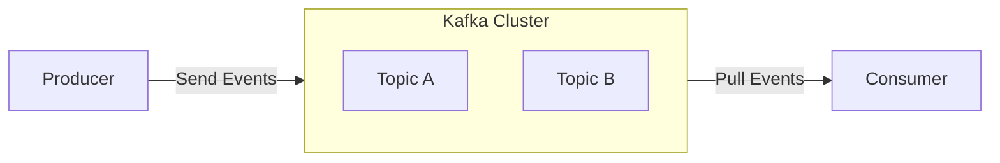
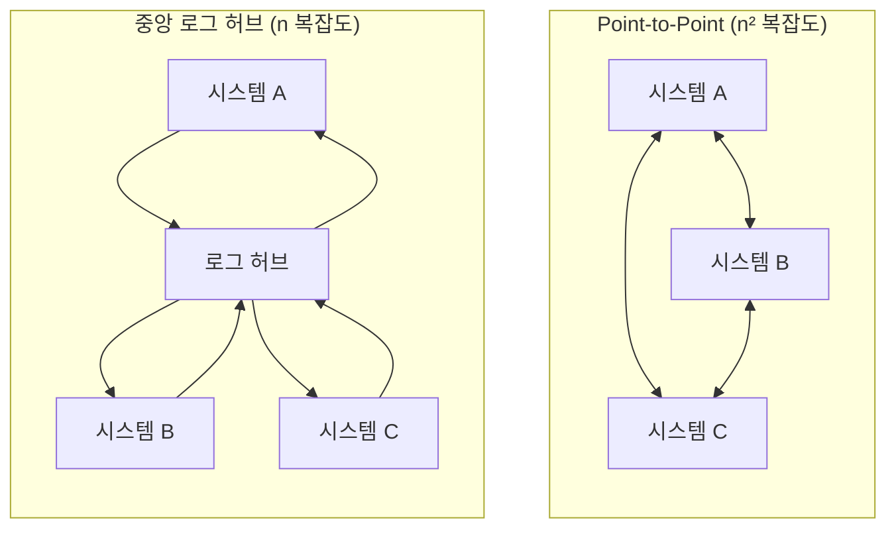

현대의 분산 시스템 환경에서 서비스 간의 데이터 연동 복잡성은 기하급수적으로 증가하는데, 카프카는 시스템 간의 결합도를 낮추고 데이터 흐름을 체계적으로 관리해준다.

## 카프카 핵심 개념

카프카는 분산 커밋 로그 (Distributed Commit Log)이자 이벤트 스트리밍 플랫폼으로, 이벤트, 스트림, 그리고 분산 커밋 로그를 핵심 개념으로 한다.

1. 이벤트 (Event): 과거에 발생한 사건에 대한 불변 (Immutable)의 사실 기록으로, 비즈니스 혹은 시스템의 상태 변화
2. 스트림 (Stream): 시간에 따라 순서대로 발생하는 이벤트의 연속적인 흐름
3. 분산 커밋 로그 (Distributed Commit Log): 데이터베이스의 커밋 로그처럼, 데이터는 추가만 가능한 (Append-only) 형태로 순서대로 기록하며 불변성 유지

## 분산 시스템의 핵심 - 로그 (Log)

카프카가 '메시지 큐'가 아닌 '분산 커밋 로그'로 불리는 이유는 로그 자체가 분산 시스템의 일관성을 보장하는 핵심 메커니즘이기 때문이다.

- 로그의 정의: 시간 순서대로 정렬된, Append-only 방식의 불변 레코드 배열
- 논리적 타임스탬프로서의 순번: 분산 환경에서는 각 노드의 물리적 시계 (Clock)가 동기화되지 않아 오차가 발생하므로, 물리적 시간 대신 로그의 순번 (오프셋)이 일관성의 절대적 근거가 됨
- 로그의 진화: 과거 데이터베이스의 충돌 복구 용도 (WAL, Write-Ahead Log)로 사용되던 로그가 데이터 복제와 범용 구독 메커니즘으로 확장

### 로그와 테이블의 이중성

로그가 원본이고 테이블이 그 파생물이라는 개념으로, 이벤트 소싱 (Event Sourcing)과 CQRS의 근간이 되는 핵심 원리다.

- 로그 → 테이블: 로그의 변경 이벤트를 순서대로 재생 (replay)하면 특정 시점의 테이블 (상태) 복원 가능
- 테이블 → 로그: 테이블의 모든 변경을 이벤트로 캡처 (CDC)하면 로그 재구성 가능
- 아키텍처적 이점
    - 최종 상태만 저장하는 시스템과 달리, 이벤트를 로그로 보존하면 과거 어느 시점의 상태도 재연 가능
    - 감사 추적 (Audit Trail) 자동화

## 데이터 통합 - 중앙 로그 허브

시스템 간 데이터를 직접 연결 (Point-to-Point)하면 파이프라인 수가 시스템 수의 제곱에 비례하여 증가하지만, 중앙 로그 허브를 도입하면 각 시스템은 허브와의 연결만 관리하므로 복잡도가 n으로 감소한다.

- 완충 (Buffer) 역할: 컨슈머가 각자의 속도에 맞게 데이터를 소비할 수 있어 시스템 간 속도 차이를 흡수
- 데이터 정제 책임 분산: 생산자가 표준화된 형식으로 데이터를 발행하면, 소비자 측의 변환 부담이 줄어 조직 전체의 확장성 확보
- 의존성 제거: 생산자와 소비자가 서로를 직접 알 필요 없이 독립적으로 배포·확장 가능

## 카프카의 설계 철학

카프카는 메시지 큐가 아닌 '로그를 독립 서비스로 (Log as a standalone service)' 구현한 시스템이다.

- 영구 보존 전제: 메시지를 소비 후 삭제하지 않고 보존 정책 (retention)에 따라 영구적으로 저장하는 것을 기본 설계로 채택
- 로그 컴팩션 (Log Compaction): 키별 최신 값만 보존하여 카프카를 단순한 전달 도구가 아닌 키별 최신 상태를 보장하는 저장소로 활용 가능
- 배치와 스트림의 통합: 배치 처리는 윈도우 크기가 큰 스트림 처리의 한 형태로, 데이터가 연속적으로 발생하는 환경에서 실시간 스트림 처리가 자연스러운 기본 모델

## 기본 용어

카프카 생태계를 구성하는 가장 기본적인 물리적·논리적 요소다.

- 프로듀서 (Producer): 이벤트를 생성하여 카프카 토픽으로 발행하는 클라이언트 애플리케이션
- 컨슈머 (Consumer): 토픽의 이벤트를 구독하고 읽어서 처리하는 클라이언트 애플리케이션
- 브로커 (Broker): 카프카 애플리케이션이 설치된 서버를 의미하며, 메시지 저장 및 전달 전반을 담당
- 토픽 (Topic): 데이터가 저장되는 논리적인 단위로, 데이터베이스의 테이블과 유사한 개념
- 파티션 (Partition): 토픽을 물리적으로 나눈 단위로, 하나의 토픽은 여러 파티션으로 분산되어 병렬 처리를 지원
- 오프셋 (Offset): 파티션 내에서 각 메시지가 가지는 고유한 순차 번호로, 컨슈머가 어디까지 읽었는지 파악하는 기준

## 핵심 아키텍처 원칙

1. 높은 처리량 (High Throughput)
    - OS 레벨의 최적화를 통해 높은 처리량을 달성
    - 데이터를 기록할 때, 임의의 위치에 쓰는 랜덤 I/O가 아닌 디스크의 끝에 순차적으로 쓰는 시퀀셜 I/O (Sequential I/O) 방식 사용
    - 컨슈머에게 데이터를 전달 시 커널에서 네트워크 카드로 직접 데이터를 전송하는 제로 카피 (Zero-Copy) 기술을 사용하여 전송 성능을 극대화
2. 확장성과 병렬처리 (Scalability & Parallelism)
    - 하나의 토픽은 여러 개의 파티션으로 나뉠 수 있으며, 이 파티션이 병렬처리의 기본 단위
    - 프로듀서는 여러 파티션에 동시에 데이터를 쓸 수 있고, 컨슈머 그룹 내의 컨슈머들은 각기 다른 파티션을 할당받아 동시에 데이터를 읽음
    - 처리량을 높이고 싶을 때 파티션 수를 늘리고 그에 맞춰 컨슈머 수를 조절하는 방식으로 수평적 확장 가능
3. 내구성과 고가용성 (Durability & Fault Tolerance)
    - 리플리케이션 (Replication)을 통해 내구성 보장
    - 각 파티션은 리더 (Leader)와 여러 팔로워 (Follower) 리플리카로 구성되며, 팔로워는 리더의 데이터를 비동기적으로 복제
    - 프로듀서가 `acks=all` 옵션으로 메시지를 전송하면, 리더뿐만 아니라 팔로워까지 데이터 저장을 완료했음을 확인한 후에야 전송 성공 간주

## 기존 메시징 시스템과의 패러다임 차이

카프카는 기존 메시징 시스템 (예: RabbitMQ)과 근본적인 패러다임의 차이를 가진다.

- 기존 메시징 시스템은 브로커가 메시지를 컨슈머에게 능동적으로 전달 (Push)하고, 소비된 메시지는 큐에서 제거하는 구조
- 카프카는 브로커가 데이터를 저장만 하고, 컨슈머가 필요할 때 데이터를 가져가는 (Pull) 구조
    - 브로커는 단순히 데이터를 커밋 로그에 저장하는 역할만 수행하며, 메시지를 삭제하지 않음 (정책에 따라 다름)
    - 컨슈머가 자신의 필요에 따라 데이터를 가져가고, 어디까지 읽었는지를 나타내는 오프셋 (Offset)을 스스로 관리하고 커밋
