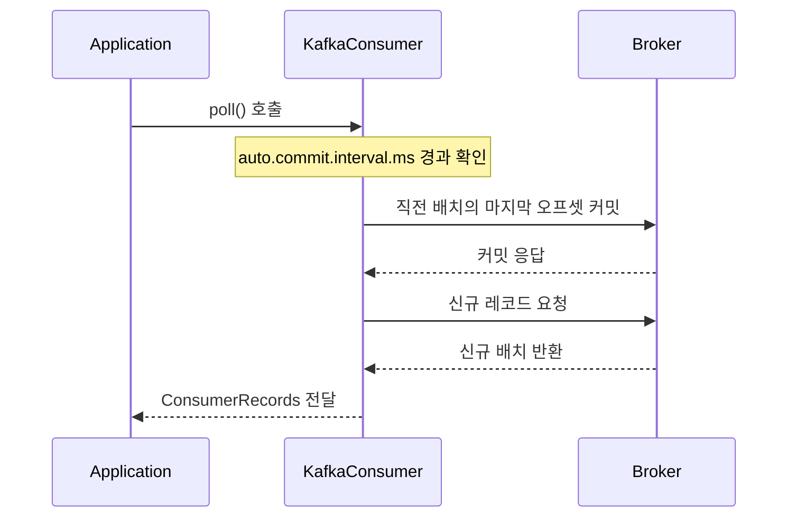
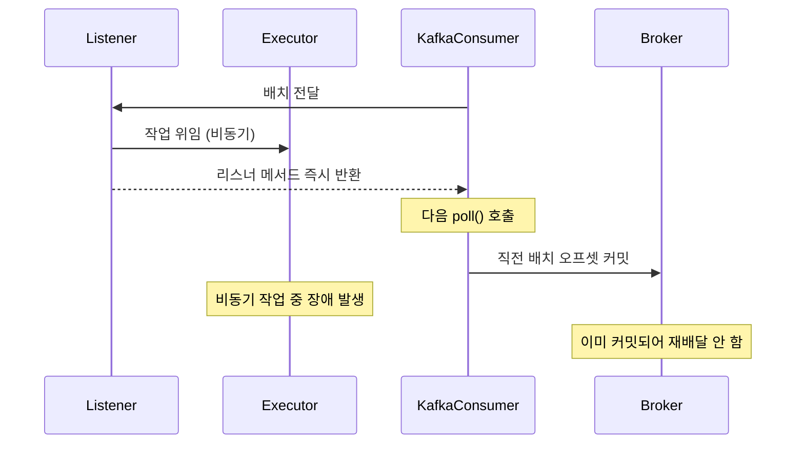
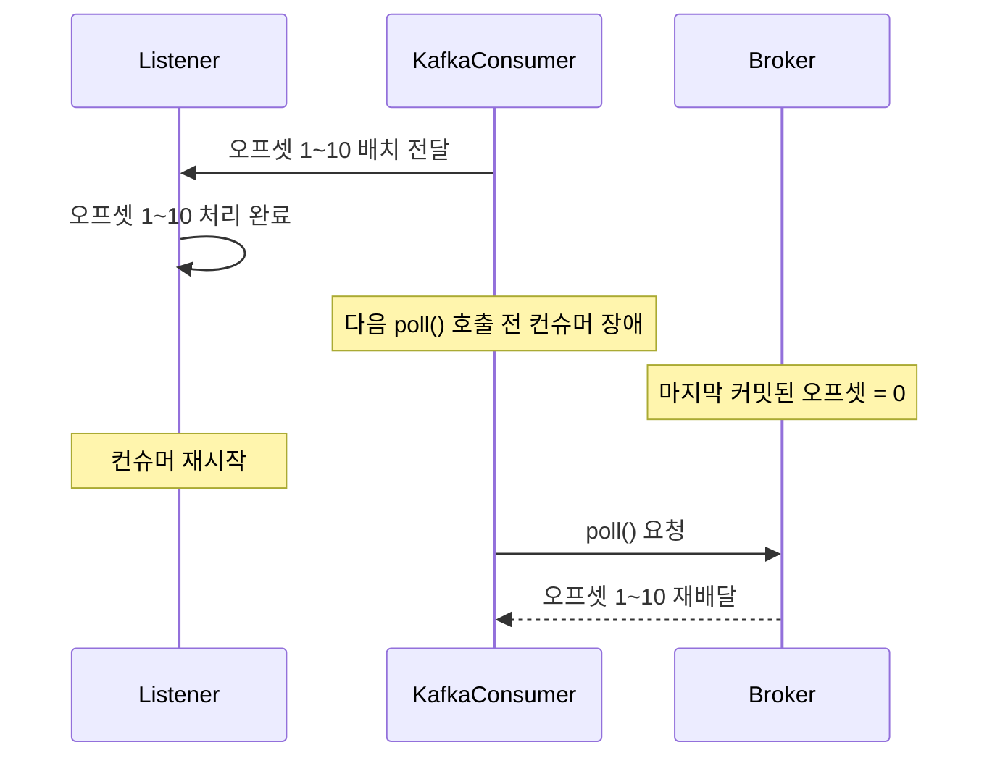
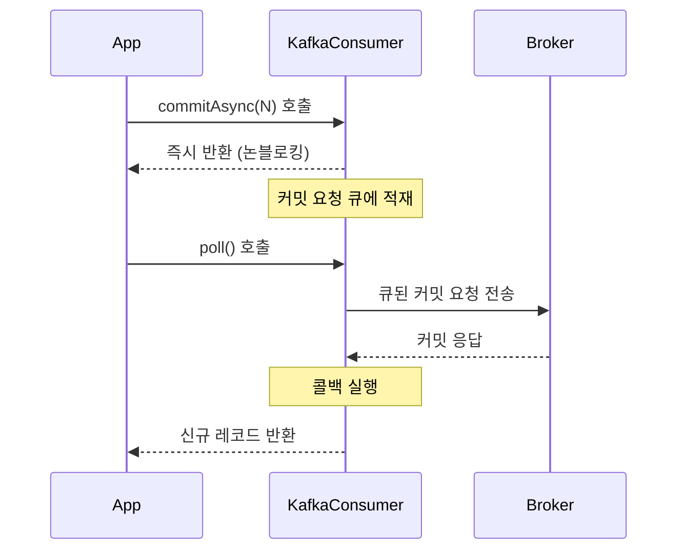

오프셋 커밋은 컨슈머가 어디까지 메시지를 처리했는지 브로커에 기록하는 행위로, 커밋된 오프셋이 곧 재시작 시점의 시작 위치가 되며 자동·수동 두 가지 전략이 존재한다.

## 자동 커밋과 수동 커밋의 본질적 차이

두 전략의 실질적인 차이는 커밋 결정의 주체가 누구이며 처리 결과를 반영할 수 있는가에서 갈린다.

- 자동 커밋: 프레임워크(KafkaConsumer)가 결정
    - 트리거: `poll()` 호출 + `auto.commit.interval.ms` 경과
    - 다음 `poll()` 호출 = 직전 배치 처리 완료라는 단순 가정에 기반
    - 처리 결과(성공/실패)를 커밋 결정에 반영 불가
- 수동 커밋: 애플리케이션이 결정
    - 트리거: `commitSync()`·`commitAsync()` 또는 `Acknowledgment.acknowledge()` 명시 호출
    - 처리 코드 흐름 안에서 여기까지 안전하게 처리됨을 직접 신호
    - 처리 실패 시 재처리 보장 가능

|     측면     |      자동 커밋       |     수동 커밋      |
|:----------:|:----------------:|:--------------:|
|   결정 주체    |      프레임워크       |     애플리케이션     |
|   커밋 트리거   |  다음 `poll()` 호출  |     명시적 호출     |
|  처리 결과 반영  |       불가능        |       가능       |
| 처리 실패 시 동작 | 커밋 진행 (처리 유실 위험) | 커밋 생략 (재처리 보장) |

## 메시지 유실의 두 정의

유실은 단계에 따라 의미가 달라지므로 시나리오 분석 전에 구분이 필요하다.

- 전송 유실 (Transport Loss): 브로커에서 컨슈머로 메시지 자체가 전달되지 못한 경우
    - 원인: 프로듀서 `acks=0`, 복제 실패, 토픽 삭제 등
    - 커밋 전략과 무관
- 처리 유실 (Processing Loss): 컨슈머에 도달했으나 비즈니스 처리가 실패한 채 오프셋이 커밋되어 영구 손실된 경우
    - 원인: 처리 완료 전에 커밋이 일어나는 패턴
    - 자동 커밋이 가지는 고유 위험

이 문서에서 유실은 별도 명시가 없는 한 처리 유실을 의미한다.

## 자동 커밋

`enable.auto.commit=true` 설정으로 활성화되며, 사용자 코드 없이 KafkaConsumer가 직접 커밋을 수행한다.

### poll() 시점 커밋 메커니즘

자동 커밋은 컨슈머가 새 메시지를 가져오기 위해 `poll()`을 호출할 때 내부적으로 실행되는 부속 로직이다.

- 실행 순서: `poll()` 진입 → `auto.commit.interval.ms` 경과 시 직전 배치 마지막 오프셋 + 1 커밋 → 신규 레코드 페치
- 별도 스레드·타이머 없음 → 인터벌이 지나도 `poll()`이 호출되지 않으면 커밋 미발생



### 처리 결과와 커밋 결정의 분리

자동 커밋은 처리 결과를 알 방법이 없으므로 "다음 `poll()` 호출 = 직전 배치 처리 완료"라는 단순 추론으로 작동한다.

- 동기 처리: 추론과 사실 일치 → 안전
- 비동기 위임·멀티스레드: 추론이 깨짐 → 처리 유실 발생 가능
- 처리 완료 후 `poll()` 호출 전 컨슈머 종료: 커밋 누락 → 중복 발생

### 처리 유실 시나리오 — 비동기 위임

리스너에서 작업을 별도 스레드 풀로 위임하고 즉시 반환하면 처리 완료 전에 다음 `poll()`이 호출된다.



- 컨슈머는 리스너 반환을 처리 완료 신호로 인식
- 위임된 작업의 성공 여부와 무관하게 커밋 진행
- 비동기 작업 실패 시 커밋된 메시지가 영구 손실

### 중복 시나리오 — 다음 poll() 직전 장애

배치 처리는 완료했으나 커밋이 일어날 다음 `poll()` 호출 전에 컨슈머가 종료되는 경우다.



- 처리 성공했으나 커밋 누락 → 재시작 시 마지막 커밋 지점부터 재처리

## 수동 커밋

`enable.auto.commit=false` 설정으로 활성화되며, 애플리케이션이 처리 결과를 보고 명시적으로 커밋 시점을 제어한다.

### commitSync — 동기 커밋

브로커로부터 커밋 성공 응답을 받을 때까지 호출 스레드를 블로킹한다.

- 동작
    - `Consumer.commitSync()` 호출 시 브로커에 커밋 요청 전송
    - 재시도 가능 오류(`RetriableCommitFailedException`) 발생 시 자동 재시도
    - 비재시도 오류 발생 시 예외 throw
- 장점: 커밋 성공 여부 확실히 확인, 신뢰성 최고 수준
- 단점: 블로킹으로 처리량 저하, 매 호출마다 네트워크 RTT 누적

### commitAsync — 비동기 커밋

커밋 요청을 큐에 적재만 하고 즉시 반환하며, 실제 송수신과 콜백 처리는 다음 `poll()` 호출 안에서 수행된다.



- 동작
    - `Consumer.commitAsync(callback)` 호출 시 요청을 큐에 넣고 즉시 반환
    - 실제 브로커 송수신·콜백 실행은 다음 `poll()` 호출 시점에 함께 수행 (KafkaConsumer 단일 스레드 모델이므로 콜백 타이밍이 `poll()` 호출 빈도에 의존)
    - 자동 재시도 미수행 (순서 역전 위험 때문)
- 장점: 블로킹 제거로 처리량 최고 수준
- 단점: 커밋 실패 시 자동 재시도 없음 → 중복 위험
    - 재시도 위험: 실패한 커밋 A를 재전송하는 사이 더 큰 오프셋 커밋 B가 성공하면, 뒤늦게 도착한 A가 브로커의 마지막 커밋 포인터를 작은 값으로 되돌릴 수 있음 → 재시작 시 A~B 구간 중복 처리
- 처리 유실은 발생하지 않음 (처리 완료 후에만 호출되므로 처리 자체는 안전)

#### 두 번 커밋해도 안전한 이유

마지막 `commitAsync`와 `finally`의 `commitSync`가 같은 오프셋을 중복 커밋해도 부작용이 없다.

- 오프셋 커밋은 멱등 연산: 같은 값을 다시 써도 결과 동일
- `commitSync`는 종료 직전 한 번만 호출되므로 더 작은 오프셋이 뒤늦게 끼어들 위험 없음
- 마지막 `commitAsync`가 실패했거나 in-flight 상태로 끝나도 `commitSync`가 최종 확정 보장

### Spring Kafka AckMode

Spring Kafka는 `AckMode` 설정으로 컨테이너가 사용자 대신 commit 호출을 수행하며, `enable.auto.commit=false`가 전제 조건이다.

|      AckMode       |              커밋 시점               |       특징       |
|:------------------:|:--------------------------------:|:--------------:|
|      `RECORD`      |           레코드 1건 처리 후            | 정확성 최고, 처리량 최저 |
|    `BATCH` (기본)    |             배치 처리 후              |   균형 잡힌 신뢰성    |
|       `TIME`       |             지정 시간 경과             |  `ackTime` 설정  |
|      `COUNT`       |            지정 개수 처리 후            | `ackCount` 설정  |
|    `COUNT_TIME`    |          시간 또는 개수 도달 시           |   둘 중 빠른 시점    |
|      `MANUAL`      | acknowledge() 호출 후 다음 `poll()` 시 |  배치 단위로 묶어 커밋  |
| `MANUAL_IMMEDIATE` |       acknowledge() 호출 즉시        |  레코드 단위 즉시 커밋  |

`MANUAL`과 `MANUAL_IMMEDIATE` 사용 시 리스너 시그니처에 `Acknowledgment` 파라미터를 추가하고 처리 완료 후 `acknowledge()`를 호출한다.

```java

@KafkaListener(topics = "test-topic")
public void consume(ConsumerRecord<String, String> record, Acknowledgment ack) {
    process(record);
    ack.acknowledge();
}
```

- `acknowledge()`는 실제 commit RPC가 아니라 컨테이너에 처리 완료 플래그를 세팅하는 신호이며, 블로킹·네트워크 호출·예외 throw 없음
- 실제 commit은 컨테이너가 대신 호출 — `MANUAL`은 다음 `poll()` 경계에서 일괄 처리, `MANUAL_IMMEDIATE`는 같은 폴링 스레드에서 즉시 처리
- 사용자는 `commitSync`·`commitAsync`를 직접 호출하지 않음

### 트랜잭션 결합

비즈니스 처리와 오프셋 커밋을 동일 트랜잭션으로 묶으면 부분 성공 상태를 제거할 수 있다.

- DB 트랜잭션 내에서 처리 결과와 처리 이력(또는 오프셋)을 함께 기록
- Spring Kafka의 `KafkaTransactionManager`로 카프카 트랜잭션 관리
- Producer와 Consumer를 하나의 트랜잭션으로 묶는 read-process-write 패턴 지원
- Exactly-once 의미를 가장 강하게 보장하는 방식

```java

@Bean
public KafkaTransactionManager<String, String> kafkaTransactionManager(
        ProducerFactory<String, String> producerFactory) {
    return new KafkaTransactionManager<>(producerFactory);
}

@KafkaListener(topics = "input-topic")
@Transactional("kafkaTransactionManager")
public void process(ConsumerRecord<String, String> record) {
    String result = transform(record.value());
    kafkaTemplate.send("output-topic", result);
    // 메서드 정상 반환 → 컨슈머 오프셋 커밋 + 프로듀서 메시지 발행이 원자적으로 처리
    // 예외 발생 → 둘 다 롤백되어 메시지 재처리
}
```

이 기능을 사용하기 위한 전제 조건은 다음과 같다.

- Producer: `transactional.id` 설정 (Idempotent Producer 자동 활성화)
- Consumer: `isolation.level=read_committed` (커밋된 트랜잭션 메시지만 읽음)

이 트랜잭션의 범위는 Kafka 내부(컨슈머 오프셋 + 프로듀서 메시지)로 한정되며 DB 트랜잭션과는 독립적이다.

- DB 작업은 `KafkaTransactionManager` 트랜잭션에 포함되지 않음 → 메서드 안에서 DB save가 성공해도 Kafka 트랜잭션 롤백이 DB를 되돌리지 않음
- DB 작업과 Kafka 발행을 원자적으로 묶으려면 Outbox 패턴 등 별도 전략 필요

## 전략 선택 기준

워크로드 특성에 따라 적합한 커밋 전략이 다르다.

|          시나리오          |          적합 전략          | 이유                                  |
|:----------------------:|:-----------------------:|:------------------------------------|
|      로그 수집·메트릭 적재      |          자동 커밋          | 일부 중복 허용, 단순함 우선                    |
| Read-process-write 정합성 |   수동 커밋 + Kafka 트랜잭션    | 오프셋 커밋과 메시지 발행 원자 결합 (Exactly-once) |
|    Consume-only 정합성    | 수동 커밋 + 멱등성 (또는 Outbox) | 트랜잭션 결합 의미 없음 → 멱등성으로 중복 차단         |
|    비동기·멀티스레드·장기 처리     |          수동 커밋          | 처리 전 커밋되는 처리 유실 차단                  |
|      고처리량 + 멱등 보장      |      `commitAsync`      | 블로킹 제거로 처리량 우선                      |

## 멱등성 설계

어떤 커밋 전략을 선택하든 At-least-once를 사용하는 한 컨슈머 측 멱등성 확보가 필수다.

- 고유 식별자 기반 중복 차단: 메시지에 포함된 도메인 키(주문 ID, 이벤트 ID 등)를 DB Unique Key로 활용
- 버전 비교 기반 갱신: `UPDATE ... WHERE version < ?` 형태로 낮은 버전의 메시지 적용 무시
- 처리 이력 저장: 처리 완료된 메시지 ID를 Redis 등에 기록하고 처리 전 존재 여부 확인
- 트랜잭션 결합: 비즈니스 처리와 처리 이력 기록을 동일 트랜잭션으로 묶어 부분 성공 제거
