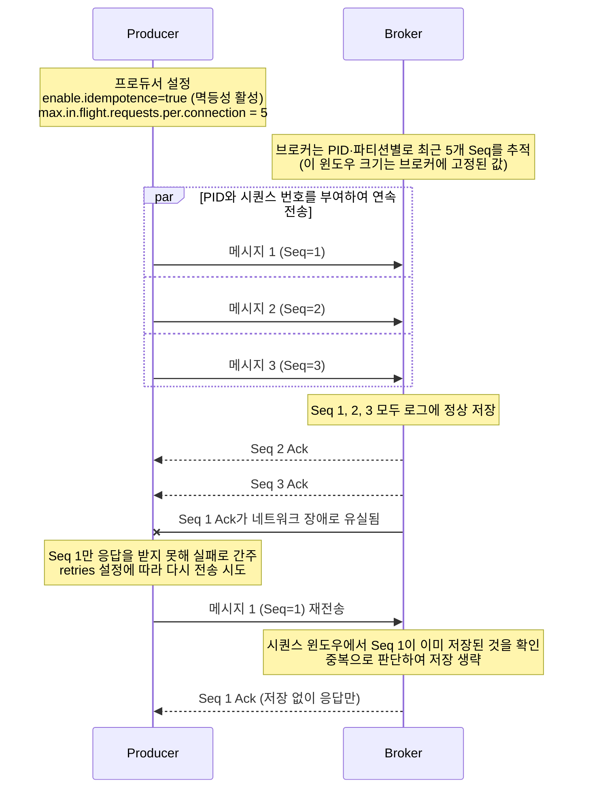
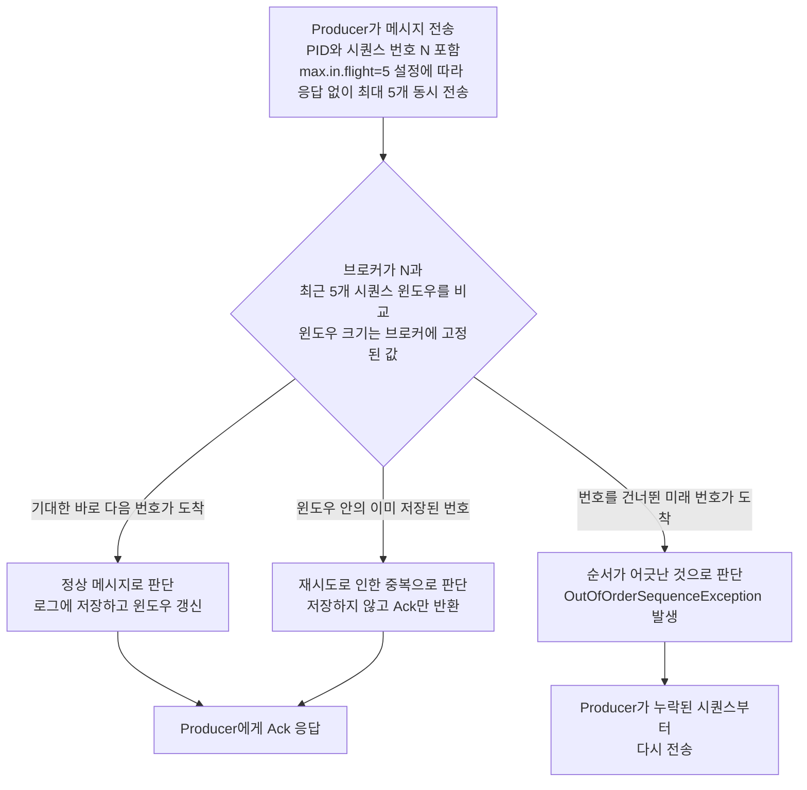

## 프로듀서의 메시지 전송 과정

프로듀서가 `send()` 메소드를 호출하면 메시지는 즉시 네트워크를 통해 전송되는 것이 아닌, 내부 버퍼에 저장된 후 별도의 스레드에 의해 브로커로 전송되는 비동기 구조를 가진다.

- 메인 스레드(애플리케이션 스레드)
    - `ProducerRecord` 객체를 생성하고 `send()` 메소드를 호출
    - 메시지는 직렬화(Serialize)되고, 파티셔너(Partitioner)에 의해 대상 파티션이 결정
    - 결정된 파티션에 해당하는 버퍼(RecordAccumulator 내부의 Deque)에 메시지가 저장
- Sender 스레드
    - 프로듀서 내부에 존재하는 별도의 백그라운드 스레드
    - `RecordAccumulator`에서 전송할 준비가 된 메시지 배치(Batch)를 가져옴
    - 해당 배치를 대상 브로커로 전송하고, 응답(Acknowledgement)을 처리
- 전송 결과 확인
    - `send()` 메소드는 `Future` 객체 반환
    - `future.get()`을 호출하면, Sender 스레드가 브로커로부터 응답을 받을 때까지 메인 스레드는 블로킹
    - `send()` 메소드에 콜백(Callback) 함수를 전달하여 응답을 받았을 때 비동기적으로 결과 처리 가능
        - 일반적으로 비동기 방식을 사용해 높은 처리량을 확보

## 파티셔닝 전략

메시지가 토픽의 여러 파티션 중 어느 곳으로 전송될지 결정하는 방법은 다음과 같다.

```
                                { TopicA [ P0 | P1 | P2 ] }
Producer ---> Partitioner --->  { TopicB [ P0 | P1 | P2 ] }
                                { TopicC [ P0 | P1 | P2 ] }
```

### 1. `ProducerRecord`에 파티션 번호가 명시된 경우

가장 높은 우선순위를 가지며, 무조건 해당 파티션으로 메시지가 전송된다.

### 2. 키가 있는 경우

메시지에 특정 키를 할당하면, 프로듀서는 키의 해시값(Hash Value)을 계산하여 데이터를 보낼 파티션을 일관되게 결정한다.

- 동작 원리: 동일한 키를 가진 메시지들은 항상 같은 해시 값을 가지므로, 반드시 동일한 파티션으로 전송
- 주요 목적: 특정 식별자(예: 사용자 ID, 주문 번호)를 기준으로 데이터의 처리 순서를 보장해야 할 때 사용

### 3. 키가 없는 경우: 처리량 극대화

메시지에 키가 없으면, 프로듀서는 순서를 보장할 필요가 없다고 판단하고 처리량을 극대화하는 방향으로 동작한다.

- 과거 방식 (Round-Robin): 메시지를 파티션별로 하나씩 순차 분배
    - 부하는 균등해지지만, 각 파티션으로 보내는 배치가 작게 형성되어 네트워크 오버헤드가 증가하고 전체 처리량이 저하될 수 있음
- 최신 방식 (Sticky Partitioner): 하나의 파티션에 메시지를 집중적으로 보내 배치를 최대화
    - 이 방식은 메시지를 최대한 큰 배치(Batch)로 묶어 전송하므로 네트워크 오버헤드를 최소화하고 전체 처리량을 극대화함
    - 동작 방식
        1. 하나의 파티션을 임의로 선택
        2. 배치 버퍼가 가득 차거나 `linger.ms` 시간이 초과될 때까지 해당 파티션에만 메시지를 계속 전송
        3. 배치가 전송되면, 다음 파티션을 선택하여 위 과정을 반복

## 배치 처리와 압축

프로듀서는 네트워크 효율성과 브로커 부하를 줄이기 위해 메시지를 압축하고 배치 단위로 묶어 전송하는 방식을 사용한다.

- `batch.size`
    - 하나의 배치에 담을 수 있는 메시지의 최대 크기(byte)
    - 이 크기에 도달하면 Sender 스레드는 즉시 메시지 배치를 전송
    - 너무 작으면 배치 효율이 떨어지고, 너무 크면 메모리 사용량이 증가
- `linger.ms`
    - 배치가 `batch.size`에 도달하지 않더라도, Sender 스레드가 메시지를 보내기 전까지 대기하는 최대 시간(ms)
    - 이 값을 늘리면 지연 시간은 증가하지만, 더 많은 메시지를 하나의 배치로 묶을 수 있어 처리량 향상
- `compression.type`
    - 메시지 배치를 브로커로 보내기 전에 압축하여 네트워크 대역폭 사용량 감소
    - `snappy`, `lz4`, `gzip`, `zstd` 등의 옵션
    - 압축은 개별 메시지가 아닌 배치 단위로 수행
    - 네트워크 오버헤드를 줄여 처리량을 높이는 데 효과적이지만, 압축/해제 과정에서 Producer / Consumer CPU 사용량이 증가할 수 있음

## 전송 보장을 위한 Ack 메커니즘

전송 보장을 위해 프로듀서는 브로커로부터 메시지 전송 성공 여부를 확인하는 메커니즘으로, `acks` 설정에 따라 다음 세 가지 모드가 제공된다.

| acks 모드  |        동작         |        장점         |        단점         |
|:--------:|:-----------------:|:-----------------:|:-----------------:|
|  acks=0  |  브로커 응답 없이 성공 처리  |     빠른 전송 속도      |   데이터 손실 가능성 높음   |
|  acks=1  |  리더가 메시지 수신 시 성공  |  적절한 성능과 신뢰성 균형   | 리더 장애 시 데이터 손실 가능 |
| acks=all | 모든 ISR 복제 완료 시 성공 | 강력한 내구성 및 데이터 무결성 | 처리 지연 및 성능 저하 가능  |

## 재시도와 멱등성 관련 설정

네트워크 일시 오류 등으로 전송 실패 시 프로듀서는 재시도를 수행할 수 있는 옵션을 제공하며, 재시도 중 중복 전송이나 순서 역전을 방지하기 위한 멱등성 기능도 제공된다.

- retries: 전송 실패 시 프로듀서가 자동으로 재시도 수행 횟수 지정
    - 재시도 과정에서 메시지 중복 발생 가능
        1. 프로듀서가 메시지를 보냈고 리더가 성공적으로 저장
        2. 프로듀서에게 Ack을 보내기 직전 네트워크 문제 발생
        3. 프로듀서는 실패로 간주하고 재시도하여 동일한 메시지를 다시 전송
- enable.idempotence: 멱등성 활성화 여부
    - true 설정 시 프로듀서는 동일 메시지를 중복으로 저장하지 않도록 보장
    - 필요 조건
        - acks=all
        - retries > 0
        - max.in.flight.requests.per.connection <= 5 (브로커가 PID·파티션별로 최근 5개 Seq만 추적하므로 그 이상은 검증 불가)
- max.in.flight.requests.per.connection: 브로커로부터 응답을 받지 않은 상태에서 한 번에 보낼 수 있는 최대 요청 수



### 시퀀스 기반 중복 및 순서 검증

멱등적 프로듀서는 각 메시지에 PID(Producer ID)와 시퀀스 번호를 부여하고, 브로커가 이를 대조하여 중복과 순서를 판단한다.

- 중복 방지: 브로커는 파티션별로 마지막으로 저장된 시퀀스 번호를 기록
    - 새로 들어온 번호가 기존보다 작거나 같으면 이미 저장된 것으로 판단하여 기록을 건너뛰고 Ack만 반환
- 순서 검증: 브로커는 시퀀스 번호를 통해 메시지가 탐지된 순서대로 기록되도록 검사
    - 시퀀스가 증가하지 않고 예상된 순서가 아닐 경우 해당 요청은 정상 처리하지 않음



### In-flight 요청과 재전송 순서 보장

`max.in.flight.requests.per.connection`은 프로듀서가 응답을 기다리지 않고 동시에 보낼 수 있는 요청 수이며, 값이 클수록 처리량은 늘지만 재시도가 끼어들 때 순서가 어긋날 위험도 함께
커진다.

- 순서가 어긋나는 주요 원인은 재시도
    - TCP 단일 connection은 보낸 순서대로 도착을 보장하므로, 첫 전송만 놓고 보면 도착 순서가 어긋나지 않음
    - 일부 요청이 일시 실패하여 재시도되면, 그 사이 다른 요청은 이미 브로커에 가 있어 도착 순서가 어긋남
- 브로커는 두 방향으로 시퀀스를 검증
    - 앞 방향(Gap 검증): 기대값보다 미래 Seq가 도착하면 `OutOfOrderSequenceException`으로 거절하여 프로듀서가 누락분을 다시 보내도록 유도
        - 이 검증에는 마지막 저장 Seq 하나만 알면 충분
    - 뒤 방향(중복 검증): 이미 저장한 Seq가 다시 도착하면(주로 재시도) 저장 없이 같은 Ack을 그대로 반환
        - 이를 위해 브로커는 (PID, 파티션) 단위로 최근 배치들의 메타데이터(첫·마지막 Seq, 오프셋)를 인메모리 큐에 보관 → 어떤 재전송이든 즉시 식별 가능
- 멱등성 활성 시 in-flight 값이 5 이하로 제한되는 이유
    - 브로커의 추적 윈도우 크기가 `NUM_BATCHES_TO_RETAIN = 5`로 고정되어 있어, 그 이상의 in-flight는 재시도 식별 불가
    - 6 이상으로 설정하면 가장 오래된 배치가 윈도우 밖으로 밀려나므로 클라이언트가 `ConfigException`으로 거부
