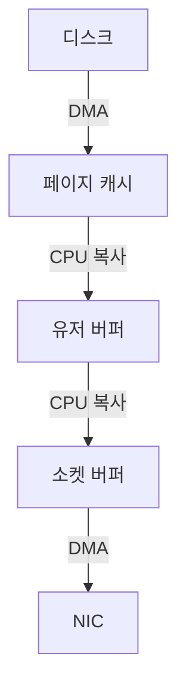
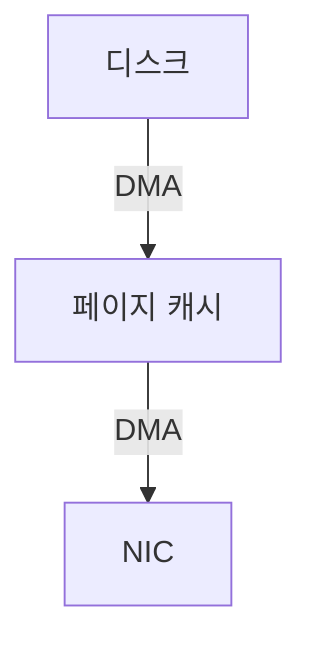

파티션은 하나의 거대한 파일이 아닌, 로그 세그먼트(Log Segment) 라는 여러 파일들의 집합으로 구성된 디렉터리이며, 이 설계가 카프카의 빠른 입출력과 효율적인 데이터 관리를 가능하게 한다.

## 파티션의 물리적 구조

하나의 파티션은 브로커의 파일 시스템 내에서 `토픽명-파티션번호` 형태의 디렉터리로 표현되며, 내부에는 파티션의 전체 데이터를 조각내어 저장하는 다수의 로그 세그먼트 파일들이 존재한다.

- 경로 예시: Kafka 데이터 디렉터리 내 `/my-topic-0`, `/my-topic-1` 등
- 구성: 각 디렉터리 안에는 `00000000000000000000.log`, `00000000000000000000.index` 와 같은 파일들이 쌍으로 존재
    - 이 파일 이름의 숫자는 해당 세그먼트의 시작 오프셋을 의미

## 로그 세그먼트의 구성

세그먼트는 데이터 관리의 기본 단위로, 현재 쓰기 작업이 일어나는 단 하나의 활성 세그먼트와, 읽기만 가능한 이전 세그먼트들로 구성되며, 각 세그먼트는 다음 파일들로 이루어져 있다.

- `.log` 파일(데이터 파일)
    - 실제 메시지 데이터(키, 값, 타임스탬프, 헤더 등)가 저장되는 파일
    - 데이터는 파일의 끝에만 추가되는 Append-Only 방식으로 기록
        - 디스크 헤드의 움직임을 최소화하는 순차 쓰기(Sequential I/O)를 유발하여 매우 빠른 쓰기 성능 보장
- `.index` 파일(오프셋 인덱스)
    - `.log` 파일에서 특정 오프셋의 위치를 빠르게 찾기 위한 인덱스 파일
    - 모든 메시지의 오프셋을 저장하는 것이 아니라, 일정 간격마다 (상대 오프셋, 물리적 파일 위치) 쌍을 저장하는 구조
    - 컨슈머가 특정 오프셋을 요청하면, 카프카는 이 인덱스를 통해 대략적인 위치를 신속하게 찾은 후 해당 위치부터 순차적으로 스캔하여 메시지 조회
        - 전체 파일을 스캔하는 비효율을 방지
- `.timeindex` 파일(타임스탬프 인덱스)
    - 오프셋 인덱스와 유사하게, (타임스탬프, 상대 오프셋) 쌍을 저장하여 시간 기반의 데이터 검색을 효율적으로 처리할 수 있도록 지원

## 고성능의 원리

위와 같은 내부 구조 덕분에 카프카의 고성능을 이끌어내는 여러 최적화가 가능하다.

- 쓰기 성능: 순차 I/O
    - 모든 쓰기 작업은 활성 세그먼트의 끝에 데이터를 추가하는 단순한 작업
    - 디스크에 가해지는 부하가 가장 적은 순차 I/O이므로, 카프카는 높은 쓰기 처리량을 유지 가능
- 읽기 성능: 페이지 캐시 / 제로 카피
    - 데이터 캐싱을 애플리케이션(JVM) 레벨이 아닌, 운영체제(OS)의 페이지 캐시(Page Cache)를 활용
        - 조회한 데이터는 메모리(RAM)의 페이지 캐시에 저장되어, 이후 동일 데이터에 대한 요청은 디스크를 거치지 않고 메모리에서 직접 처리
    - 페이지 캐시에 있는 데이터를 컨슈머에게 전송할 때 제로 카피(Zero-Copy) 기술 사용
        - 이는 커널 영역에서 애플리케이션 영역으로 데이터를 복사하는 과정을 생략하고, 커널 버퍼에서 네트워크 버퍼로 데이터를 직접 전송하는 방식
        - 데이터 복사와 CPU 컨텍스트 스위칭을 줄여 읽기 성능 향상

## 제로 카피 동작 과정

카프카는 컨슈머에게 로그를 전송할 때 데이터를 유저 공간(User Space)으로 끌어올리지 않고 커널 공간(Kernel Space) 안에서 곧장 네트워크로 흘려보낸다.

- 데이터가 거치는 주요 레이어
    - 유저 공간: 유저 버퍼(User Buffer)
    - 커널 공간: 페이지 캐시(Page Cache), 소켓 버퍼(Socket Buffer)
    - 하드웨어: 디스크, NIC(Network Interface Card)

보통은 위의 공간들을 거치게 되지만, Java NIO의 `FileChannel.transferTo()`(내부적으로 OS의 `sendfile` 계열 시스템 콜)를 사용해 이를 구현한다.

### 전통적인 전송 흐름

`read()` + `write()` 조합으로 파일을 네트워크에 보낼 때 데이터는 유저 공간을 한 번 왕복하며, 4회 복사와 4회 컨텍스트 스위칭이 발생한다.

- 디스크 → 페이지 캐시: DMA(Direct Memory Access) 복사
- 페이지 캐시 → 유저 버퍼: CPU 복사
- 유저 버퍼 → 소켓 버퍼: CPU 복사
- 소켓 버퍼 → NIC: DMA 복사
- 시스템 콜 2회로 인해 유저/커널 모드 전환이 4회 발생

### 제로 카피 적용 흐름

시스템 콜 한 번으로 디스크의 데이터가 커널 안에서 곧장 NIC로 전달되며, 데이터 본체는 유저 공간으로 올라오지 않는다.

- 디스크 → 페이지 캐시: DMA 복사 (이미 캐시에 있다면 생략)
- 페이지 캐시 → NIC: DMA 복사
    - 페이지 캐시의 위치 정보만 소켓 버퍼에 전달되고, NIC가 페이지 캐시에서 직접 데이터를 가져감
- 시스템 콜 1회로 컨텍스트 스위칭은 2회로 감소
- CPU가 바이트를 직접 옮기지 않아 CPU 사용률과 메모리 대역폭 소모도 함께 감소

### 카프카에서 제로 카피가 동작하기 위한 조건

제로 카피는 디스크의 바이트를 가공 없이 NIC로 흘려보낼 수 있을 때만 성립한다.

- 메시지 포맷 변환이 필요 없을 것
    - 브로커에서 다운컨버전(Down-Conversion) 등 변환이 필요하면 유저 공간 처리가 강제되어 일반 read/write 경로로 전환
- TLS/SSL 암호화 미사용
    - 암호화는 유저 공간에서 평문 → 암호문 변환을 거쳐야 하므로 일반 소켓 쓰기 경로 사용
- 메시지 압축 해제 불필요
    - 카프카는 압축된 메시지를 그대로 저장·전송하고 압축 해제는 컨슈머가 담당

## 로그 관리의 효율성

세그먼트 단위의 구조는 대용량 로그를 관리에도 큰 이점을 제공한다.

- 로그 보존(Log Retention)
    - 오래된 데이터를 삭제할 때, 특정 레코드를 찾아 지우는 복잡한 과정 대신 보존 기간(`retention.ms`)이나 용량(`retention.bytes`)이 지난 로그 세그먼트 파일 자체 삭제
    - 파일 단위의 삭제는 OS에서 빠르게 처리할 수 있는 작업
- 로그 압축(Log Compaction)
    - 시간이 아닌 메시지의 키(Key)를 기준으로 데이터를 보존하는 정책
    - 로그 압축은 각 키에 대해 가장 최신 버전의 값만 남기고 이전 버전의 값들을 제거
    - 특정 키의 최신 상태를 추적해야 하는 경우(예: 사용자의 마지막 프로필 정보, 상품의 현재 가격)에 유용

## 멱등 프로듀서를 위한 상태 추적

브로커는 파티션 로그 외에도 각 프로듀서에 대한 최근 배치 메타데이터를 (PID, 파티션) 단위로 유지하여, 멱등성 활성화 시 중복 전송과 순서 어긋남을 검증한다.

- 상태 저장 파일: 파티션 디렉터리 내 `*.snapshot`
    - PID(Producer ID), 프로듀서 에포크, 마지막 시퀀스 번호, 마지막 오프셋 등 프로듀서 상태가 직렬화되어 보관
    - 브로커 재시작 시 스냅샷에서 상태를 복원하여 멱등성 보장이 끊기지 않도록 함
- 배치 보존 한도: `NUM_BATCHES_TO_RETAIN = 5`
    - Apache Kafka 코드(`ProducerStateEntry`)에 고정된 상수로, (PID, 파티션) 단위 큐에 최근 5개 배치 메타데이터까지만 보관
    - 새 배치가 도착하면 큐의 가장 오래된 항목을 제거하여 길이를 5로 유지
    - 이 윈도우 안에 시퀀스 번호가 남아 있는 동안에만 중복·순서 검증 가능
- 프로듀서의 `max.in.flight.requests.per.connection <= 5` 제약 근거
    - 브로커 추적 윈도우 크기가 5이므로, 프로듀서가 6개 이상의 요청을 동시에 보내면 가장 오래된 배치가 윈도우 밖으로 밀려남
    - 윈도우 밖으로 밀려난 배치가 재전송되면 브로커는 처리 이력을 더 이상 보관하지 않아 중복 여부를 판단할 수 없음
