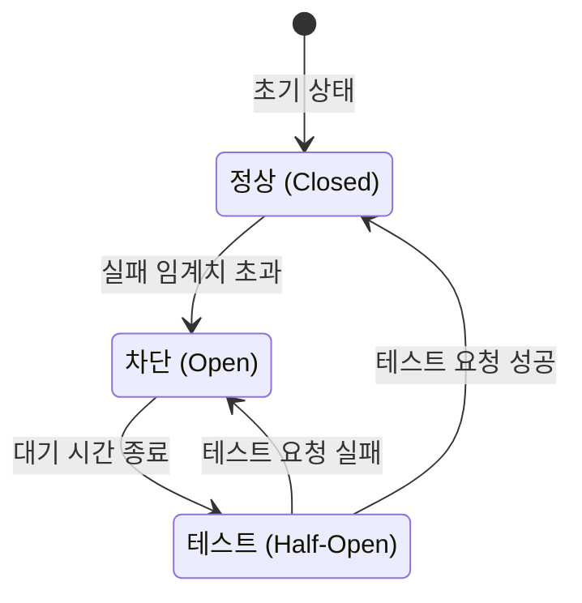
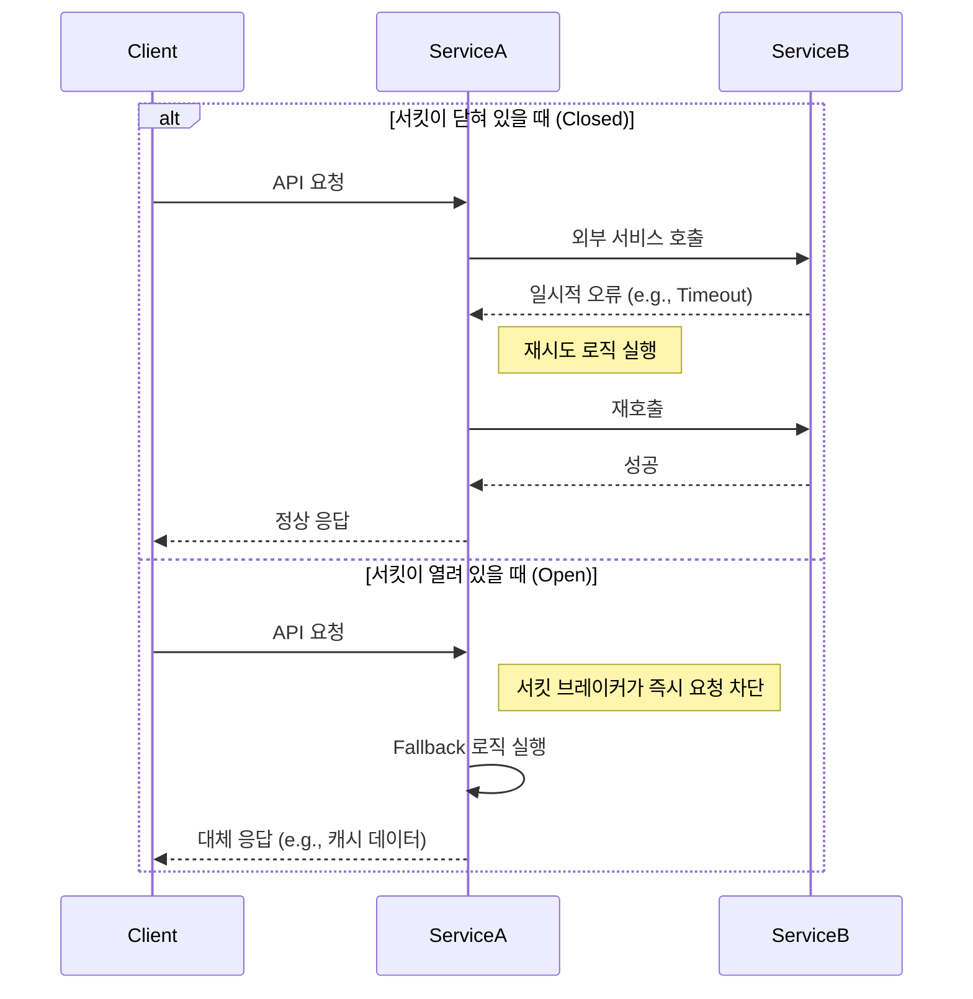
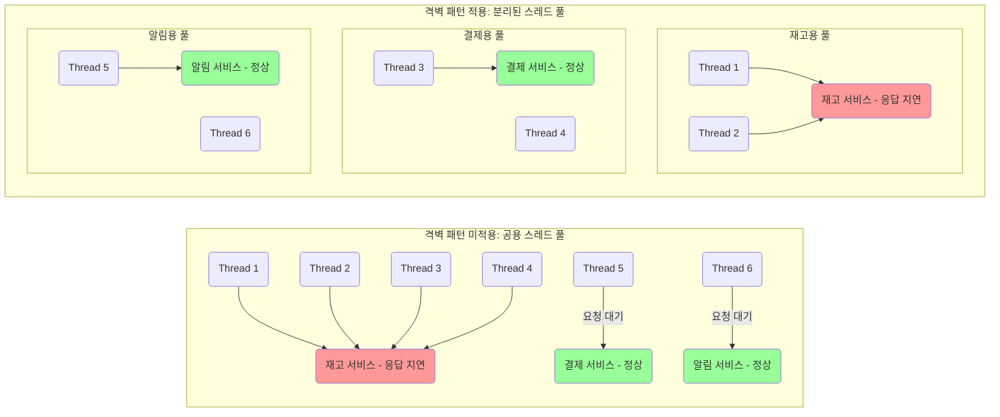

마이크로서비스 아키텍처에서 하나의 서비스 장애가 연쇄적으로 다른 서비스에 전파되어 전체 시스템의 장애로 이어지는 연쇄적 실패를 방지하기 위해 서킷 브레이커(Circuit Breaker) 패턴을 사용한다.

## 핵심 원리 - 상태 머신

서킷 브레이커는 내부적으로 세 가지 상태를 가지는 유한 상태 머신(Finite State Machine)으로 동작한다.



|          상태           | 설명                                            | 상태 전이 조건                                  |
|:---------------------:|:----------------------------------------------|:------------------------------------------|
|     Closed(정상 상태)     | 모든 요청은 실제 서비스를 호출하며, 실패를 모니터링                 | 실패율 또는 실패 횟수가 임계치를 초과하면 Open 상태로 전이       |
|    Open(회로 차단 상태)     | 모든 요청을 즉시 실패 처리(Fail-fast)하며, 실제 서비스를 호출하지 않음 | 설정된 타임아웃 시간이 지나면 Half-Open 상태로 전이         |
| Half-Open(제한적 테스트 상태) | 소수의 테스트 요청만 실제 서비스로 보내 응답을 확인                 | 테스트 요청이 성공하면 Closed로, 실패하면 다시 Open 상태로 전이 |

## 정밀한 장애 판단 전략

서킷 브레이커의 효율성은 '장애'를 얼마나 정밀하게 정의하느냐에 달려있다.

- 오류 유형의 구분
    - 일반적으로 네트워크 타임아웃, `5xx` 서버 오류와 같은 시스템 오류(System Errors)만을 서킷 브레이커의 실패 횟수에 포함
    - `4xx` 클라이언트 오류나 같은 비즈니스 로직 오류는 서비스 자체의 불안정성이 아니므로, 서킷을 여는 조건에서 제외하는 것이 일반적
- 복합적인 임계치 설정
    - 단일 지표에만 의존하면 오작동의 원인이 될 수 있어, 복수의 조건을 결합하여 장애 판단
    - 최소 요청 횟수(Minimum Number of Calls): 실패율을 계산하기 전에, 먼저 일정량의 요청이 발생해야 한다는 전제 조건(예: 10초 동안 최소 20회 요청)
    - 느린 호출 비율(Slow Call Rate): 단순 실패뿐만 아니라, 응답 시간이 지나치게 긴 요청 또한 서비스 불안정의 전조 증상으로 판단(예: 1초 이상 소요된 요청의 비율이 `n%`를 초과)

## 다른 복원성 패턴과의 상호작용

서킷 브레이커는 단독으로 사용되기보다, 다른 패턴들과 결합하여 다층적인 방어 체계를 구축할 때 더 큰 효과를 발휘한다.

- 재시도(Retry) 패턴과의 관계
    - 재시도는 일시적인 네트워크 불안정과 같은 일시적 장애(Transient Faults)에 효과적
    - 서킷 브레이커는 서비스 다운과 같이 즉시 해결되기 어려운 지속적인 장애(Long-lasting Faults)에 대응
    - 지속적인 장애 상태에 빠진 서비스에 무분별한 재시도를 하는 것은 오히려 장애 서비스의 부하를 가중시킬 수 있음



- 격벽(Bulkhead) 패턴
    - 격벽 패턴은 자원을 격리하여 하나의 서비스 문제가 전체 시스템의 자원을 고갈시키는 것을 방지
    - 협력적 방어: 격벽 패턴은 여러 다른 외부 서비스를 호출하기 위한 스레드 풀이나 커넥션 풀 같은 자원을 각각 격리
        - 하나의 서비스에 대한 서킷 브레이커가 열리더라도, 다른 정상 서비스들을 호출하는 데 필요한 자원은 영향을 받지 않음



## Spring Framework 기반 구현(Resilience4j)

Spring 생태계에서는 Netflix Hystrix가 초기에 널리 사용되었으나, 현재는 유지보수 모드로 전환되었으며 Resilience4j가 사실상의 표준으로 자리 잡았다.

- 핵심 동작 원리: AOP(관점 지향 프로그래밍)
    - Resilience4j는 Spring Boot와 결합하여 AOP를 기반으로 동작
    - 개발자가 `@CircuitBreaker` 어노테이션을 특정 메소드에 붙이면, 서킷 브레이커 로직(상태 확인, 실패 카운팅, Fallback 호출 등)실행

### 구현 예시

아래 코드는 `externalApiService`라는 이름의 서킷 브레이커를 `callApi` 메소드에 적용한 예시이다.

```java
// ExternalApiService.java
@Service
public class ExternalApiService {

    // "externalApiService" 라는 이름의 서킷 브레이커를 적용
    @CircuitBreaker(name = "externalApiService", fallbackMethod = "fallback")
    public String callApi() {
        // 외부 API를 호출하는 로직
        // RestTemplate, WebClient 등 사용
        return new RestTemplate().getForObject("http://example.com/api", String.class);
    }

    // Fallback 메소드: 원본 메소드와 동일한 반환 타입을 가져야 함
    // Throwable을 파라미터로 받아 예외 로깅 가능
    private String fallback(Throwable t) {
        log.warn("Fallback 실행: {}, 에러 메시지: {}", t.getClass(), t.getMessage());
        return "캐시된 데이터 또는 기본 응답";
    }
}
```

만약 서킷이 열리거나 메서드 실행 중 예외가 발생하면 `fallback` 메소드가 대신 호출된다.

### 설정 예시 (`application.yml`)

서킷 브레이커의 구체적인 동작 방식은 `application.yml` 파일을 통해 코드 변경 없이 유연하게 제어할 수 있다.

```yaml
resilience4j:
circuitbreaker:
  instances:
    externalApiService: # @CircuitBreaker 어노테이션의 name과 일치
      register-health-indicator: true # Actuator 상태 표시에 포함
      sliding-window-type: COUNT_BASED # 카운트 기반으로 실패율 측정
      sliding-window-size: 10 # 최근 10번의 호출을 기준으로
      failure-rate-threshold: 50 # 실패율이 50% 이상이면 서킷을 Open
      minimum-number-of-calls: 5 # 최소 5번의 호출이 있어야 실패율 계산 시작
      wait-duration-in-open-state: 10s # Open 상태를 10초간 유지
      permitted-number-of-calls-in-half-open-state: 2 # Half-Open 상태에서 2번의 테스트 호출 허용
      record-exceptions: # 실패로 간주할 예외 목록
        - org.springframework.web.client.HttpServerErrorException
        - java.io.IOException
```

### 모니터링 통합

- Spring Boot Actuator와 통합하면 서킷 브레이커의 현재 상태(CLOSED, OPEN 등)와 설정값, 실패율 같은 상세 지표를 실시간으로 확인 가능
- 이러한 지표는 Prometheus와 같은 모니터링 시스템으로 수집되어 Grafana 대시보드를 통해 시각화되고, 장애 발생 시 슬랙(Slack) 등으로 알람을 보내는 체계를 구축하는 데 활용
