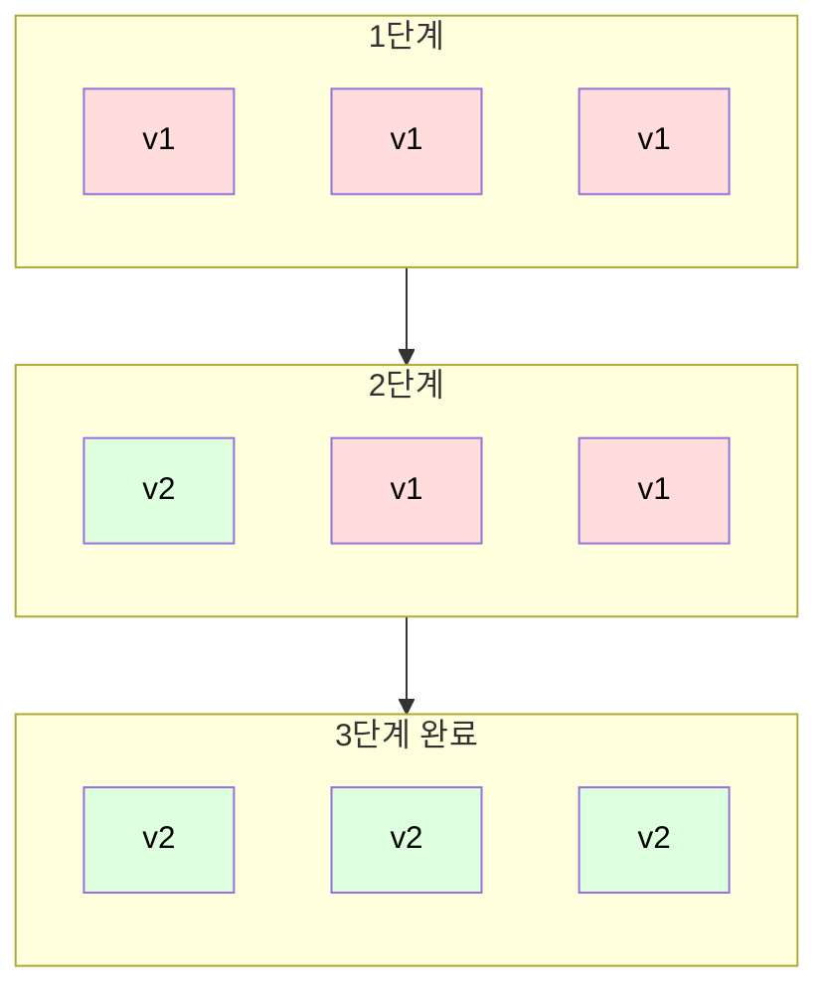
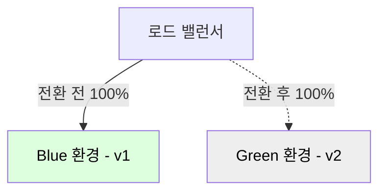
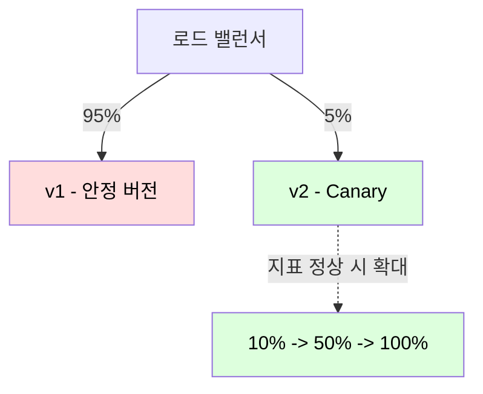

배포는 운영 중인 서비스에 변경을 가하는 작업이라 장애 위험이 따르며, 배포 전략은 그 과정에서 가용성을 유지하고 문제 발생 시 영향 범위와 복구 시간을 줄이기 위한 선택이다.

## 전략 비교

대표적인 배포 전략은 트래픽 전환 방식과 자원 비용에 따라 구분된다.

|       전략       |              방식              |          장점           |           단점           |
|:--------------:|:----------------------------:|:---------------------:|:----------------------:|
|    Recreate    |      구버전 전체 종료 후 신버전 배포      |       단순, 자원 절약       |      배포 중 다운타임 발생      |
| Rolling Update |      인스턴스를 하나씩 순차적으로 교체      |    추가 자원 최소화, 무중단     | 배포 중 신·구 버전 공존, 롤백이 느림 |
|   Blue-Green   | 동일 규모의 두 환경 구성 후 100% 트래픽 전환 |    즉시 롤백, 다운타임 제로     |      인프라 비용 2배 발생      |
|     Canary     |   일부 사용자에게 우선 배포 후 점진적 확대    | 실서비스 영향 최소화, 지표 기반 검증 |     라우팅·관측 복잡성 증가      |

Recreate는 다운타임을 허용하는 내부 도구나 단일 인스턴스 환경에서나 쓰이며, 실서비스 무중단 배포에서는 Rolling, Blue-Green, Canary 중에서 선택한다.

## 무중단 배포의 전제

어떤 무중단 전략이든, 인스턴스를 교체하는 순간 처리 중이던 요청이 끊기지 않아야 성립한다.

- 준비 상태 확인(Readiness Probe): 새 인스턴스가 트래픽을 받을 준비를 마친 뒤에만 로드 밸런서에 편입
- 우아한 종료(Graceful Shutdown): 종료 신호를 받은 인스턴스는 새 요청을 거부하되, 진행 중인 요청은 끝까지 처리한 후 종료
- 연결 드레이닝(Connection Draining): 로드 밸런서가 종료 대상으로의 신규 라우팅을 멈추고 기존 연결만 소진
- 상태 비저장(Stateless): 세션을 인스턴스가 들고 있지 않아야 임의 교체가 가능하므로, 세션은 외부 저장소로 분리

이 전제가 깨지면 배포 전략과 무관하게 교체 시점마다 요청 실패가 발생한다.

## Rolling Update

Rolling Update는 운영 중인 인스턴스를 한 번에 하나씩(또는 일정 비율씩) 신버전으로 교체하는 방식이다.

- 추가 자원 최소화: 전체 환경을 복제하지 않고 기존 인스턴스 풀 안에서 점진적으로 교체
- 무중단: 교체되지 않은 인스턴스가 트래픽을 받는 동안 일부만 순차 갱신

### 교체 속도 제어

Kubernetes 등 오케스트레이터는 교체 과정을 두 파라미터로 제어한다.

- maxSurge: 원하는 인스턴스 수를 초과하여 추가로 띄울 수 있는 한도
- maxUnavailable: 교체 중 동시에 내려갈 수 있는 인스턴스의 한도

두 값으로 가용 용량을 유지하면서 교체 속도와 자원 사용량의 균형을 맞춘다.

### 한계

Rolling Update는 자원 효율이 높지만 배포 과정 자체에 약점이 있다.

- 신·구 버전 공존: 교체가 진행되는 동안 두 버전이 동시에 트래픽을 처리하여, 버전 간 호환성이 깨지면 일부 요청이 실패
- 느린 롤백: 문제 발견 시 다시 순차 교체로 되돌려야 하므로 복구에 시간 소요

## Blue-Green

Blue-Green은 현재 운영 환경(Blue)과 동일한 규모의 신버전 환경(Green)을 별도로 구성하고, 검증 후 트래픽을 한 번에 전환하는 방식이다.

- 다운타임 제로: Green을 미리 띄우고 헬스체크까지 마친 뒤 라우팅만 전환
- 즉시 롤백: 문제 발생 시 트래픽을 Blue로 되돌리기만 하면 되어 복구가 가장 빠름
- 인프라 비용: 두 환경을 동시에 유지해야 하므로 전환 기간 동안 자원이 두 배로 필요

전환은 보통 로드 밸런서의 대상 그룹 교체나 DNS 전환으로 수행하며, DNS 방식은 TTL 캐싱으로 인해 전환 지연이 생길 수 있다.

## Canary

Canary는 신버전을 소수의 사용자(예: 5~10%)에게만 우선 노출하고, 지표를 관측하며 점진적으로 비율을 확대하는 방식이다.

- 영향 최소화: 문제가 있어도 소수 사용자에게만 노출되어 전체 장애로 번지지 않음
- 지표 기반 검증: 에러율·지연·자원 사용량 등을 신·구 버전 간 비교하여 확대 여부를 자동/수동으로 결정
- 라우팅·관측 복잡성: 트래픽 분배 제어와 버전별 지표 분리 관측 인프라가 필요

### Canary와 A/B 테스트의 차이

트래픽을 분할한다는 점만 공통점이 있으며, 두 기법은 측정하려는 대상이 다르다.

- Canary: 신버전의 안정성(에러율·지연·자원)을 검증하여 배포를 안전하게 확대하는 릴리스 기법
- A/B 테스트: 두 버전의 비즈니스 지표(전환율·체류 시간 등)를 비교하는 실험 기법으로, 사용자를 특정 기준으로 나눠 노출

## 배포와 릴리스의 분리

위 전략들이 코드를 어떻게 배포할 것인가를 다룬다면, 기능 플래그(Feature Flag)는 기능을 언제 제공하는 것인가를 분리하는 보완 기법이다.

- 배포(Deploy)와 릴리스(Release)를 분리하여, 신버전 코드를 배포하되 기능은 플래그로 꺼둔 상태로 내보냄
- 배포 리스크와 무관하게, 운영 중 플래그만 켜서 특정 사용자 그룹에 점진적으로 기능 노출
- 문제 발생 시 재배포 없이 플래그를 끄는 것만으로 즉시 비활성화(Kill Switch)

이 분리를 통해 코드 배포의 주기와 기능 노출의 시점을 독립적으로 운영할 수 있다.

## 스키마 호환 마이그레이션

무중단 배포의 가장 까다로운 지점은 데이터베이스 스키마 변경이며, 신·구 버전이 같은 DB를 공존하여 사용하는 동안 양쪽 모두 동작해야 한다.

컬럼 이름 변경처럼 파괴적인 변경을 한 번에 적용하면 배포 중인 구버전이 즉시 깨지므로, 변경을 여러 단계로 쪼개는 확장-수축(Expand-Contract) 패턴을 사용한다.

1. 확장(Expand)
    - 새 컬럼·테이블을 추가하되 기존 구조는 그대로 유지하여 구버전과 신버전이 모두 동작
2. 마이그레이션(Migrate)
    - 신버전이 양쪽 구조에 동시에 쓰도록 하며, 기존 데이터를 새 구조로 이전
3. 수축(Contract)
    - 모든 인스턴스가 신버전으로 교체되고 안정화된 뒤, 더 이상 쓰이지 않는 기존 구조 제거

각 단계가 하위 호환성을 유지하므로, 어느 시점에 롤백하더라도 데이터 정합성이 깨지지 않는다.

## 롤백과 롤포워드

배포 후 문제가 발견되면 대응은 이전 버전으로 되돌리는 롤백과, 수정본을 빠르게 다시 배포하는 롤포워드로 나뉜다.

- 롤백: 이전 버전이 그대로 살아있는 Blue-Green 환경에서 가장 빠르고 안전
- 롤포워드: 스키마 수축(Contract)이 이미 진행되어 되돌리기 어려운 경우처럼, 앞으로 고쳐 배포하는 편이 현실적인 상황에 적용

되돌릴 수 없는 변경(파괴적 마이그레이션 등)을 배포에 포함했는지가 두 선택을 가른다.

## 선택 기준

전략은 허용 가능한 리스크, 인프라 비용, 롤백 속도 요구 수준에 따라 선택한다.

|           상황           |     권장 전략      |           근거            |
|:----------------------:|:--------------:|:-----------------------:|
|  다운타임 허용, 자원 최소화가 중요   |    Recreate    | 내부 도구·배치 등 무중단이 불필요한 경우 |
|   자원 효율을 유지하며 무중단 배포   | Rolling Update | 추가 환경 없이 점진 교체, 일반적 기본값 |
|  빠른 롤백과 다운타임 제로가 최우선   |   Blue-Green   |     라우팅 전환만으로 즉시 복구     |
| 변경 리스크가 크고 실사용자 검증이 필요 |     Canary     |  지표 기반 점진 확대로 영향 범위 통제  |
