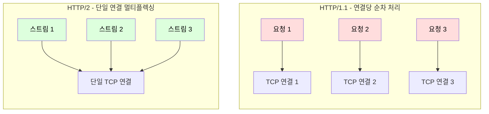
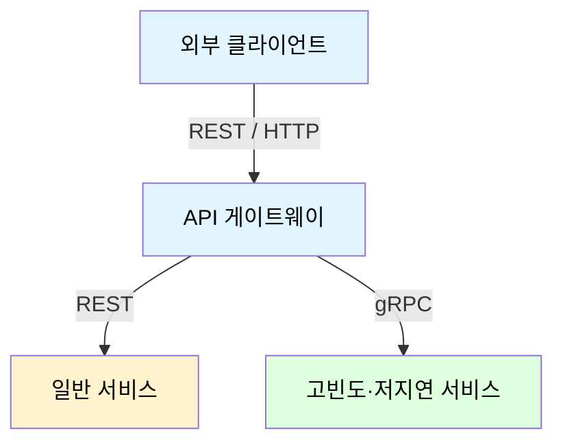

마이크로서비스에서 서비스 간 호출은 프로세스 경계를 넘는 네트워크 통신이며, 어떤 프로토콜을 쓰는지에 따라 성능·결합도·운영 방식이 달라진다.

## 프로토콜 비교

서비스 간 통신에서 가장 널리 쓰이는 세 가지 방식은 다음과 같으며, 하나의 시스템 안에서 호출의 성격에 따라 혼용하는 것이 일반적이다.

|     프로토콜      |      전송 방식      |          직렬화           | 브라우저 지원 |  성능   |        적합한 유스케이스         |
|:-------------:|:---------------:|:----------------------:|:-------:|:-----:|:------------------------:|
|     REST      | HTTP/1.1 (Text) |       JSON (텍스트)       |   우수    |  보통   | 공용 API, 프론트엔드, 일반 내부 호출  |
|     gRPC      | HTTP/2 (Binary) |    Protobuf (바이너리)     |   제한적   | 매우 높음 |      고성능·스트리밍 내부 통신      |
| Message Queue |  브로커 경유 (비동기)   | JSON / Avro / Protobuf |   N/A   |  높음   | 이벤트 기반 처리, 비동기 작업, 부하 완충 |

## REST (Representational State Transfer)

REST는 HTTP의 메서드(`GET`, `POST` 등)와 URI를 자원 중심으로 사용하는 아키텍처 스타일로, 사실상 서비스 통신의 기본값으로 자리 잡았다.

- 무상태성(Stateless): 각 요청이 처리에 필요한 모든 정보를 포함하여 서버가 세션 상태를 보관하지 않음
- 캐시 용이성: HTTP 표준 캐싱(`Cache-Control`, `ETag`)을 그대로 활용하여 중간 계층에서 응답 재사용 가능
- 풍부한 생태계: 브라우저·프록시·게이트웨이·디버깅 도구 등 HTTP 인프라를 그대로 사용

### 한계

REST는 단순한 만큼 텍스트 기반 프로토콜과 자원 중심 모델에서 오는 비용도 따른다.

- 직렬화 오버헤드: JSON은 사람이 읽을 수 있는 텍스트 형식이라 파싱 비용과 페이로드 크기가 상대적으로 큼
- 계약의 모호성: 스키마가 강제되지 않아, 필드 추가·삭제 시 클라이언트·서버 간 암묵적 합의에 의존
- 오버페칭/언더페칭: 자원 단위 응답 구조상 화면에 필요한 데이터보다 많거나 적게 받는 문제가 발생
    - 클라이언트별 응답 최적화가 필요하면 BFF(Backend For Frontend)나 GraphQL 같은 대안 고려

## gRPC (gRPC Remote Procedure Call)

gRPC는 HTTP/2 위에서 Protocol Buffers로 메시지를 주고받는 RPC 프레임워크로, 내부 마이크로서비스 간 고성능 통신에 적합하다.

### Protocol Buffers (Protobuf)

Protobuf는 인터페이스 정의 언어(IDL)로 메시지 구조를 먼저 정의하고, 이를 각 언어의 코드로 컴파일하는 스키마 우선(Schema-first) 직렬화 방식이다.

```protobuf
syntax = "proto3";

message OrderRequest {
  string order_id = 1;   // 필드 번호로 식별
  int64 amount = 2;
}
```

- 바이너리 직렬화: 필드명을 문자열로 전송하는 대신 필드 번호(태그)로 인코딩하여 페이로드 크기와 파싱 비용을 줄임
- 강한 계약: `.proto` 파일이 서비스 간 계약 역할을 하여, 컴파일 시점에 타입 불일치를 검출
- 스키마 진화: 필드 번호를 기준으로 식별하므로, 번호를 재사용하지 않는 한 필드 추가·삭제 시에도 하위 호환성 유지

#### 와이어 포맷

Protobuf가 작은 페이로드를 만드는 이유는 필드를 "태그 + 값" 쌍의 바이너리로 인코딩하기 때문이다.

- 태그 인코딩: 태그는 `(필드 번호 << 3) | 와이어 타입`으로, 필드명 문자열 대신 필드 번호와 3비트 타입 정보만 전송
- Varint: 정수를 7비트씩 끊어 가변 길이로 인코딩하여, 작은 값일수록 적은 바이트를 사용
- 스키마 의존: 수신 측이 `.proto`로 구조를 이미 알고 있어, 필드명·구분자 없이 값만 보내고도 역직렬화 가능

JSON이 필드명과 구분자를 매 메시지에 텍스트로 싣는 것과 달리, 이 구조 덕분에 페이로드 크기와 파싱 비용이 줄어든다.

### 4가지 호출 방식

gRPC는 HTTP/2의 스트리밍을 활용하여 단순 요청-응답을 넘어선 통신 패턴을 지원한다.

|        방식        |           설명           |       유스케이스       |
|:----------------:|:----------------------:|:-----------------:|
|    Unary (단항)    |    일반적인 1요청-1응답 호출     |    대부분의 RPC 호출    |
| Server Streaming | 1요청에 대해 서버가 다수 응답을 스트림 | 대용량 조회 결과, 실시간 피드 |
| Client Streaming | 클라이언트가 다수 요청을 보낸 뒤 1응답 | 파일 업로드, 메트릭 일괄 전송 |
|  Bidirectional   | 양방향으로 독립적으로 메시지를 주고받음  |    채팅, 실시간 동기화    |

### HTTP/2와 멀티플렉싱

gRPC가 높은 성능을 내는 것은 기반 프로토콜인 HTTP/2 덕분이다.

- 멀티플렉싱: 단일 TCP 연결에서 여러 스트림을 동시에 주고받아, HTTP/1.1의 연결당 한 요청 제약과 응용 계층 HOLB(Head-of-Line Blocking)를 해소
- 헤더 압축(HPACK): 반복되는 헤더를 인덱스 테이블로 압축하여 매 요청의 헤더 오버헤드 감소
- 바이너리 프레이밍: 메시지를 프레임 단위 바이너리로 다뤄 파싱이 빠르고 멀티플렉싱이 가능



## Message Queue

Message Queue는 송신자와 수신자 사이에 브로커를 두어 비동기로 메시지를 전달하는 방식으로, 통신 흐름 자체를 끊어 결합도를 낮춘다.

- 느슨한 결합: 송신자는 브로커에 발행만 할 뿐, 수신자의 가용성이나 처리 속도를 알 필요 없음
- 부하 완충(Buffering): 순간 트래픽 폭증 시 브로커가 메시지를 적재하고, 컨슈머가 감당 가능한 속도로 처리
- 배압(Back-pressure) 조절: 컨슈머의 처리 속도에 맞춰 소비량을 조절하여 다운스트림 과부하 방지
- 내구성: 메시지를 디스크에 저장하여 컨슈머 장애 시에도 유실 없이 재처리 가능

전달 보장 수준(At-most-once / At-least-once / Exactly-once)과 멱등성 보장 여부를 고려하는 것이 중요하다.

## 내부 통신의 선택

내부 서비스 간 통신도 REST/HTTP를 쓰는 경우가 가장 많으며, 단순함과 익숙한 도구 덕분에 사실상 기본 선택지다.

gRPC는 모든 내부 통신을 대체하기보다, 호출이 잦고 지연·페이로드 크기에 민감한 경로에 선택적으로 도입한다.



- 외부 경계는 REST로 노출하여 범용성·캐싱·디버깅 도구 생태계를 확보
- 내부도 대부분 REST로 충분하며, 직렬화 비용과 지연이 병목이 되는 구간에 한해 gRPC로 전환
- gRPC 트랜스코딩(gRPC-Gateway 등)을 쓰면 하나의 `.proto` 정의에서 REST와 gRPC 인터페이스를 동시에 생성

## 선택 기준

프로토콜은 호출의 위치(내부/외부)와 응답 시점(동기/비동기)을 기준으로 선택한다.

|         상황          |    권장 프로토콜    |           근거            |
|:-------------------:|:-------------:|:-----------------------:|
|  브라우저·모바일 등 외부 노출   |     REST      |   범용성, 캐싱, 디버깅 도구 생태계   |
| 내부 서비스 간 고빈도 동기 호출  |     gRPC      | 바이너리 직렬화와 멀티플렉싱으로 낮은 지연 |
|  즉각 응답이 불필요한 후속 처리  | Message Queue |   장애 격리, 부하 완충, 독립 확장   |
| 실시간 양방향/스트리밍 데이터 교환 |     gRPC      |     양방향 스트리밍 기본 지원      |
