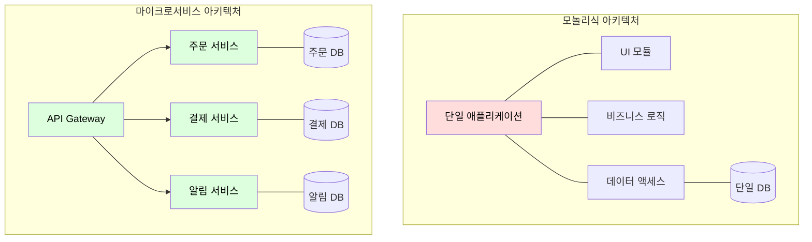

시스템을 구축하는 방식은 크게 모놀리식 아키텍처와 마이크로서비스 아키텍처(Microservice Architecture, MSA)로 나눌 수 있다.

## 모놀리식 아키텍처(Monolithic Architecture)

모놀리식 아키텍처는 시스템의 모든 기능이 하나의 애플리케이션에 통합된 구조로, 모든 로직이 단일 프로세스 내에서 실행되며 배포 단위도 하나다.

- 초기 개발 속도가 빠름
- 모든 코드가 한곳에 있어 로직 추적과 통합 테스트 용이

시스템 규모가 커지고 비즈니스가 복잡해지면 모놀리식 구조는 여러 한계에 부딪힌다.

- 배포의 경직성: 작은 코드 수정으로 전체 시스템의 빌드, 테스트, 배포를 다시 유발
- 비효율적인 확장성: 특정 기능(예: 검색)에만 트래픽이 몰려도 시스템 전체를 복제하여 확장(Scale-out) 필요
- 기술 스택의 종속성: 한번 정해진 기술 스택 변경 및 새로운 기술 도입의 어려움
- 개발 병목: 여러 팀이 하나의 거대한 코드베이스를 동시에 수정으로 인한 충돌과 조정 비용 증가

## 마이크로서비스 아키텍처(Microservice Architecture, MSA)

마이크로서비스 아키텍처는 하나의 큰 애플리케이션을 여러 개의 작은 서비스로 분리하는 접근 방식이다.

### 핵심 원칙

- 단일 책임 원칙: 각 서비스는 고유한 비즈니스 영역(도메인)에 대한 책임을 가짐
    - 도메인 주도 설계(DDD)의 바운디드 컨텍스트(Bounded Context) 개념과 유사
- 독립적인 배포: 서비스는 서로 독립적으로 개발, 테스트, 배포 가능
- 데이터베이스 분리: 각 서비스는 자신만의 데이터베이스를 소유하는 것을 지향(서비스 간 강한 결합 방지)
- 기술 다양성: 각 서비스에 가장 적합한 프로그래밍 언어, 프레임워크, 데이터베이스를 자유롭게 선택 가능

### 장점

- 선택적 확장성: 트래픽이 몰리는 특정 서비스(예: 결제)만 선택적으로 확장할 수 있어 자원 효율성 극대화
- 빠른 배포 주기: 각 팀이 맡은 서비스를 독립적으로 빠르게 배포 가능
- 장애 격리: 하나의 서비스에 장애가 발생하더라도, 해당 장애가 시스템 전체의 중단으로 이어지는 것을 방지 가능
- 팀의 자율성: 작은 팀이 특정 서비스의 전체 라이프사이클을 책임지며, 의사결정 속도 향상

## 모놀리식 vs MSA 구조 비교

|  비교 항목   |      모놀리식       |          MSA          |
|:--------:|:---------------:|:---------------------:|
|  배포 단위   | 전체 애플리케이션 단일 배포 |      서비스별 독립 배포       |
|  확장 방식   |    전체 시스템 복제    |    필요한 서비스만 선택적 확장    |
|  장애 범위   | 하나의 오류가 전체에 영향  |    장애가 해당 서비스에 격리     |
|  기술 스택   |   단일 기술 스택 고정   |   서비스별 최적 기술 선택 가능    |
|  데이터 관리  | 단일 DB, 트랜잭션 용이  | DB 분리, 분산 트랜잭션 복잡성 증가 |
|   팀 구조   |   전체 코드베이스 공유   |   서비스별 소규모 팀 자율 운영    |
|  운영 복잡도  |       단순        |  배포·모니터링·로깅 분산으로 복잡   |
| 초기 개발 비용 |       낮음        |     인프라 구축 비용 높음      |

## MSA 도입 시 문제

MSA가 모놀리식의 문제를 해결하지만, 분산 시스템 고유의 복잡성을 새롭게 만들어낸다.

### 분산 트랜잭션과 데이터 일관성

서비스마다 데이터베이스가 분리되면, 여러 서비스에 걸친 데이터 변경을 하나의 트랜잭션으로 묶을 수 없다.

- SAGA 패턴을 사용해 보상 트랜잭션 기반의 최종 일관성(Eventual Consistency) 확보
- 트랜잭셔널 아웃박스 패턴으로 DB 변경과 이벤트 발행의 원자성 보장

### 네트워크 통신과 장애 전파

REST API나 gRPC 같은 동기식 호출은 하나의 서비스 지연이나 장애가 호출한 서비스에 연쇄적으로 전파될 수 있다.

- 장애가 발생한 서비스를 일시적으로 차단하는 서킷 브레이커 패턴 도입 필요
- 비동기 메시지 기반 통신으로 서비스 간 결합도를 낮추는 전략도 병행

### 서비스 탐색 (Service Discovery)

수많은 서비스가 동적으로 생성되고 소멸하는 환경에서 각 서비스의 위치(IP, Port)를 관리하는 메커니즘이 필요하다.

- Eureka와 같은 서비스 레지스트리를 통해 동적 인스턴스 등록과 조회 자동화
- 클라이언트 사이드 로드 밸런싱과 결합하여 중앙 장비 없이 분산 라우팅 수행

### 운영 및 모니터링의 복잡성

배포, 모니터링, 로깅, 설정 관리가 모두 분산되어 복잡도가 기하급수적으로 증가한다.

- 하나의 요청을 추적하기 위해 여러 서비스의 로그를 연결하는 분산 추적 시스템 필요
- API Gateway를 통한 인증·인가·라우팅의 중앙 집중화로 공통 관심사 파편화 방지

## 전환 시점의 판단 기준

MSA 도입은 분산 시스템의 복잡성이라는 비용을 수반하므로, 아키텍처 전환의 시점과 조건을 신중히 판단해야 한다.

### 콘웨이의 법칙(Conway's Law)

시스템의 아키텍처는 해당 시스템을 만드는 조직의 소통 구조를 반영한다.

- 소규모 팀(2~3명)이 하나의 코드베이스를 관리하는 단계에서는 모놀리식이 효율적
- 팀이 분리되고 각 팀이 독립된 비즈니스 도메인을 책임지게 되면 MSA가 조직 구조와 자연스럽게 정렬

### 도입 검토 신호

MSA 전환을 고려해야 하는 시점을 판단하는 주요 신호다.

- 배포 주기: 단일 코드베이스의 배포 주기가 팀 간 조율 비용으로 인해 주 단위 이상으로 느려질 때
- 확장 요구: 특정 기능에만 트래픽이 집중되어 전체 시스템 복제가 비효율적일 때
- 장애 범위: 사소한 코드 변경이 시스템 전체에 영향을 미치는 빈도가 증가할 때
- 팀 규모: 10명 이상의 개발자가 동일 코드베이스에서 작업하며 머지 충돌이 빈번할 때

### 점진적 전환 전략

빅뱅(Big Bang) 방식의 전면 전환보다는 점진적 마이그레이션이 리스크를 최소화한다.

- Strangler Fig 패턴: 모놀리식 시스템 앞에 프록시를 배치하고, 새로운 기능부터 마이크로서비스로 개발하여 기존 기능을 점진적으로 교체
- 도메인 경계 우선 정의: DDD의 바운디드 컨텍스트를 먼저 식별한 후, 경계가 명확한 도메인부터 분리
