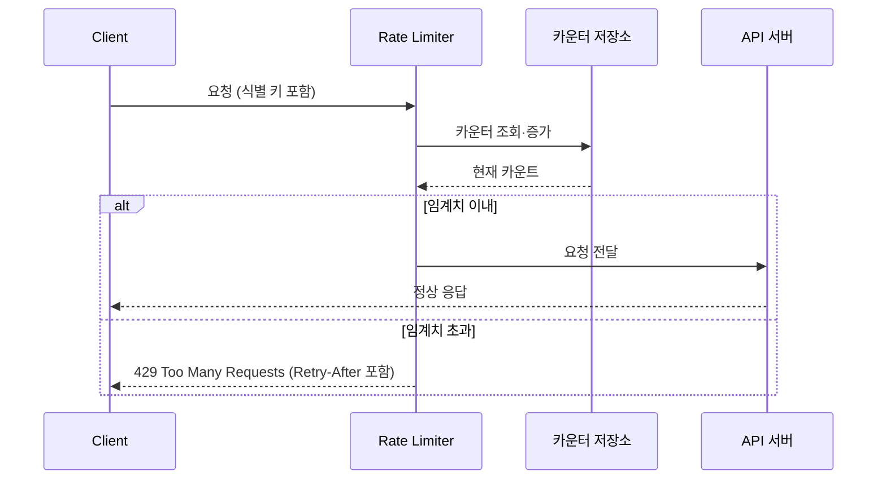
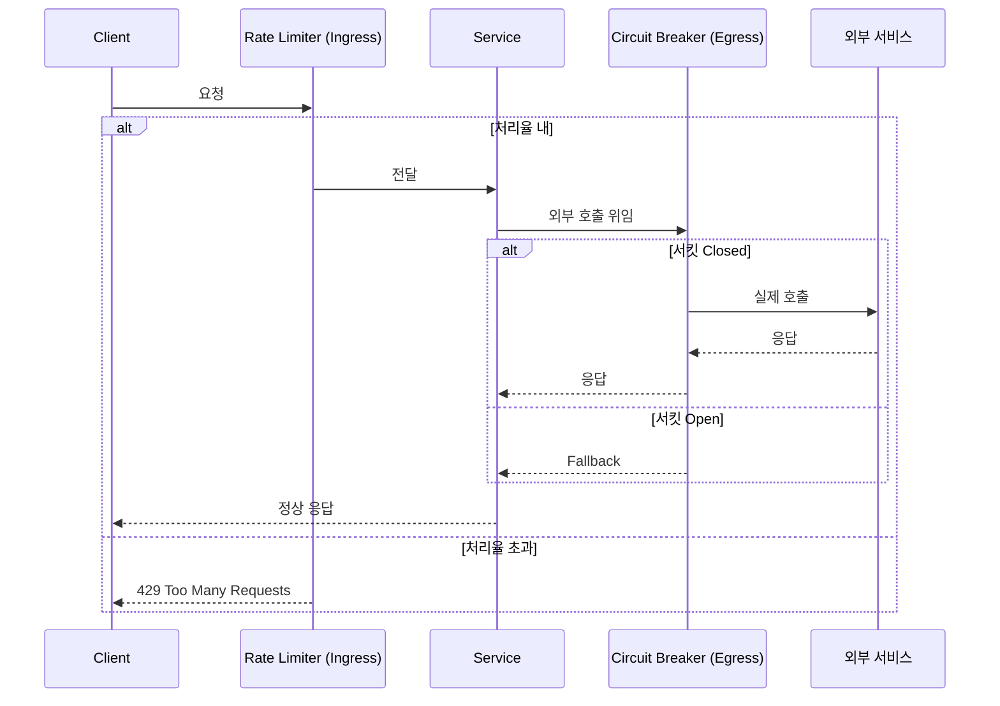

마이크로서비스 아키텍처에서 과도한 요청이 서비스의 자원을 고갈시키거나 공정한 분배를 해치는 것을 방지하기 위해 처리율 제한(Rate Limiting) 패턴을 사용한다.

- 진입 방어선(Ingress): 자신이 받는 트래픽의 양을 제어하여 과부하로 인한 자기 장애 예방
- 회복 체계의 한 축: 서킷 브레이커가 호출 대상 서비스의 장애로부터 자신을 보호하는 이탈 방어선이라면, 처리율 제한은 클라이언트로부터 자신을 보호하는 진입 방어선

## 핵심 원리 - 허용/거부 결정 모델

처리율 제한 장치는 모든 요청에 대해 `식별 키 × 시간 창 × 카운터 × 임계치`라는 공식을 실시간으로 평가하여 허용 여부를 결정한다.



알고리즘별로 버스트 허용 여부와 메모리 비용, 경계 처리 방식이 달라 상황에 맞게 선택한다.

|                알고리즘                | 버스트 허용 | 메모리 비용 |          특징          |
|:----------------------------------:|:------:|:------:|:--------------------:|
|        토큰 버킷 (Token Bucket)        |   O    |   낮음   |  단기 버스트 허용, API 표준   |
|        누출 버킷 (Leaky Bucket)        |   △    |   낮음   | 큐 용량까지 입력 흡수, 출력률 고정 |
|        고정 윈도 (Fixed Window)        |   O    | 매우 낮음  | 구현 단순, 경계 트래픽 폭주 취약  |
|   이동 윈도 로깅 (Sliding Window Log)    |   O    |   높음   |   정확도 최상, 타임스탬프 저장   |
| 이동 윈도 카운터 (Sliding Window Counter) |   O    |   낮음   |     정확도와 비용의 균형      |

## 정밀한 제한 전략

처리율 제한의 효율성은 무엇을 기준으로(key), 누구에게 얼마나(limit) 허용할지를 얼마나 정밀하게 설계하느냐에 달려있다.

### 식별 키 전략

식별 키는 제한의 단위를 결정하며, 도메인 요구에 따라 조합하여 사용한다.

|        식별 키         |     보호 대상     |     주요 사용처      |
|:-------------------:|:-------------:|:---------------:|
|        IP 주소        |   DoS, 스크래핑   | 공개 API, 로그인 경로  |
|       User ID       |  특정 사용자의 오남용  |    인증 이후 API    |
|       API Key       | 외부 파트너 과금·쿼터  |   B2B 공개 API    |
|      Tenant ID      | 특정 테넌트의 자원 독점 |   멀티테넌트 SaaS    |
| 조합키 (user:endpoint) | 엔드포인트별 세밀 제어  | 쓰기·검색 등 고비용 API |

### 계층화(Tiered) 제한

단일 제한값은 모든 사용자에게 동일한 제약을 강제하여 현실의 요구를 반영하지 못한다.

- 플랜별 차등: Free / Pro / Enterprise 등급에 따라 동일 식별 키에 서로 다른 버킷 할당
- 자원별 차등: 조회 API는 느슨하게, 쓰기·검색 API는 엄격하게 개별 버킷 할당
- 동적 조정(Adaptive): 시스템 부하 지표(CPU 사용률·대기열 길이)에 따라 실시간으로 버킷 용량을 축소·확장

### Soft Limit과 Shadow Mode

제한을 즉시 강제하는 것(Hard Limit)이 항상 최선은 아니기 때문에, 다음과 같은 완화된 접근법도 고려할 수 있다.

- Soft Limit: 임계치 초과 시 차단 대신 경고 헤더만 내려 사용자가 사전에 대응하도록 유도
- Shadow Mode: 실제 차단 없이 차단 대상 요청만 로깅하여, 임계치를 프로덕션 트래픽으로 검증한 후 정식 배포

### 429 응답 설계

클라이언트가 올바르게 대응할 수 있도록 응답에 제한 상태를 충분히 노출한다.

- `429 Too Many Requests` 상태 코드 반환
- `Retry-After`: 다음 요청까지 대기해야 하는 시간(초 단위 또는 HTTP-date)
- `X-RateLimit-Limit`: 해당 윈도에서 허용되는 총 요청 수
- `X-RateLimit-Remaining`: 윈도 내 남은 요청 수
- `X-RateLimit-Reset`: 카운터가 초기화되는 시각

## 다른 복원성 패턴과의 상호작용

처리율 제한은 단독으로도 기능하지만, 다른 복원성 패턴과 파이프라인으로 결합할 때 다층 방어 체계를 완성한다.

### 서킷 브레이커와의 배치

두 패턴은 보호하는 방향이 정반대이며, 요청 경로의 앞뒤에 각각 배치된다.



- Rate Limiter: 자신이 받는 트래픽을 제어하는 Ingress 방어선
- Circuit Breaker: 자신이 호출하는 외부 서비스의 장애로부터 자신을 격리하는 Egress 방어선

### 재시도·백오프와의 관계

429 응답을 받은 클라이언트의 즉시 재시도는 장애를 증폭시킬 수 있기 때문에, 재시도 패턴과의 연계가 중요하다.

- Thundering Herd 문제: 동시에 차단당한 다수의 클라이언트가 일제히 재시도하면 카운터 리셋 직후 트래픽이 원래보다 더 극심하게 증가
- 완화 전략: `Retry-After` 값을 기준으로 대기하되, 지수 백오프(Exponential Backoff)에 무작위성(Jitter)을 결합하여 재시도 시점을 분산

## Spring Framework 기반 구현

Spring 생태계에서는 처리 계층에 따라 두 가지 구현 옵션을 일반적으로 사용하며, 둘을 함께 적용하기도 한다.

### 애플리케이션 계층 - Resilience4j RateLimiter

애플리케이션 내부에서 특정 메서드 단위로 제한을 적용할 때 사용하며, AOP 기반으로 동작한다.

```java
// PaymentQueryService.java
@Service
public class PaymentQueryService {

    // "paymentQueryService" 라는 이름의 Rate Limiter를 적용
    @RateLimiter(name = "paymentQueryService", fallbackMethod = "fallback")
    public PaymentInfo getPayment(String paymentId) {
        return paymentClient.fetch(paymentId);
    }

    // Fallback 메서드: 제한 초과 시 RequestNotPermitted 예외가 전달됨
    private PaymentInfo fallback(String paymentId, RequestNotPermitted e) {
        log.warn("Rate limit 초과: paymentId={}, cause={}", paymentId, e.getMessage());
        return PaymentInfo.unavailable(paymentId);
    }
}
```

```yaml
resilience4j:
  ratelimiter:
    instances:
      paymentQueryService: # @RateLimiter 어노테이션의 name과 일치
        register-health-indicator: true # Actuator 상태 표시에 포함
        limit-for-period: 100 # 한 주기당 허용 요청 수
        limit-refresh-period: 1s # 주기 길이 (1초마다 허가 수 리셋)
        timeout-duration: 100ms # 허가를 기다릴 최대 시간
```

- 단일 인스턴스 내부의 허가(Permission)를 `AtomicReference` 기반으로 관리하여 오버헤드가 매우 낮음
- 분산 환경에서는 각 인스턴스가 독립된 카운터를 가지므로, 전체 클러스터 기준의 엄격한 제한이 필요하면 게이트웨이 계층과 함께 사용

### 게이트웨이 계층 - Spring Cloud Gateway RequestRateLimiter

모든 인스턴스에 걸친 전역 제한이 필요하거나, 조기에 차단하여 내부 네트워크 자원을 절약하고자 할 때 사용한다.

```java
// RateLimiterConfig.java
@Configuration
public class RateLimiterConfig {

    // 사용자 ID 헤더를 식별 키로 사용
    @Bean
    public KeyResolver userKeyResolver() {
        return exchange -> Mono.justOrEmpty(
                exchange.getRequest().getHeaders().getFirst("X-User-Id")
        ).defaultIfEmpty("anonymous");
    }
}
```

```yaml
spring:
  cloud:
    gateway:
      routes:
        - id: payment-service
          uri: lb://payment-service
          predicates:
            - Path=/api/payment/**
          filters:
            - name: RequestRateLimiter
              args:
                redis-rate-limiter.replenish-rate: 50   # 초당 토큰 보충량 (정상 처리율)
                redis-rate-limiter.burst-capacity: 100  # 버킷 최대 용량 (버스트 허용치)
                redis-rate-limiter.requested-tokens: 1  # 요청당 소비 토큰 수
                key-resolver: "#{@userKeyResolver}"     # SpEL로 KeyResolver 빈 참조
```

- Redis와 Lua 스크립트를 조합하여 분산 환경에서도 카운터의 원자성을 보장
- 토큰 버킷 알고리즘을 기본 채택하여 `burst-capacity`와 `replenish-rate`로 버스트 허용치와 정상 처리율을 각각 제어

### 계층 선택 기준

두 계층은 서로 대체재가 아니라 보완재이며, 제한이 필요한 이유에 따라 선택하거나 병행한다.

|   기준    | 애플리케이션 계층 (Resilience4j) | 게이트웨이 계층 (Spring Cloud Gateway) |
|:-------:|:------------------------:|:-------------------------------:|
|  제한 범위  |      단일 인스턴스 내 메서드       |           전체 서비스 클러스터           |
| 카운터 저장소 |     인메모리 (인스턴스별 독립)      |          Redis (중앙 집중)          |
|  차단 시점  |     애플리케이션 로직 진입 직전      |          엣지 (서비스 진입 전)          |
|  주요 목적  |      특정 메서드의 자원 보호       |      엣지에서 악성·과도 트래픽 조기 차단       |
| 도메인 문맥  |  활용 가능 (User/Tenant 등)   |        제한적 (헤더·쿠키·IP 등)         |

### 모니터링 통합

- Spring Boot Actuator를 통해 현재 허용 가능한 토큰 수와 대기 중인 요청 수를 실시간으로 노출
- Prometheus로 `resilience4j_ratelimiter_available_permissions`, `spring_cloud_gateway_requests_seconds` 등을 수집하여 시각화
- 차단율(429 응답 비율)이 특정 임계치를 넘으면 알람을 발송하여 임계치 조정 또는 용량 증설 의사결정의 근거로 활용
