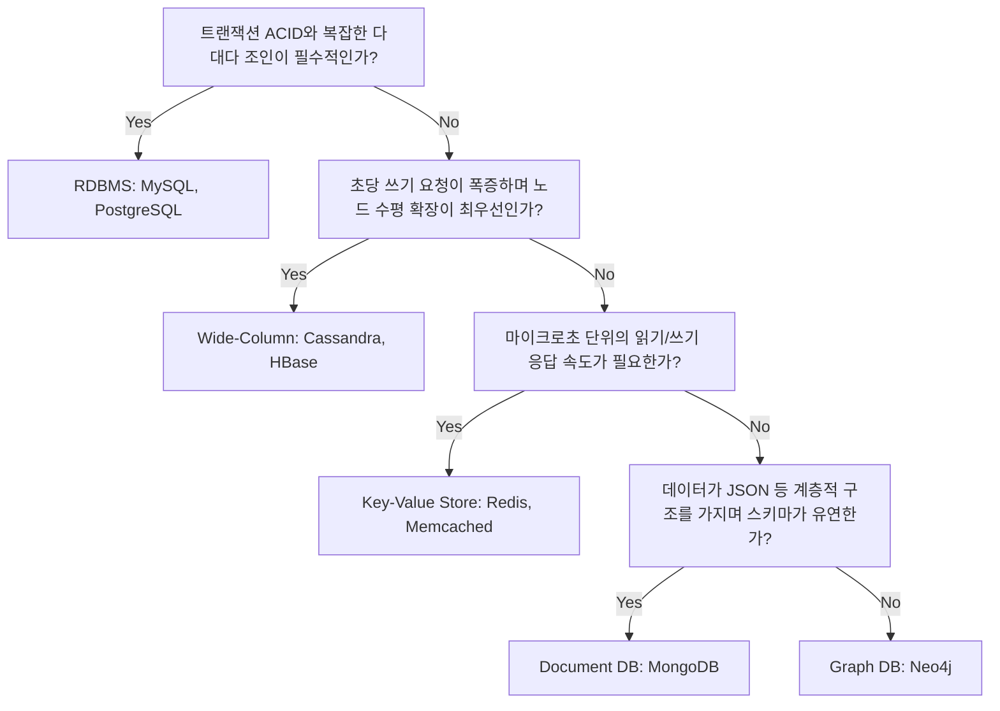

## 데이터베이스 의사결정의 본질: 트레이드오프

대규모 분산 시스템에서 완벽한 단일 데이터베이스는 존재하지 않으며, 데이터의 접근 패턴과 비즈니스 요구사항에 따른 전략적 의사결정이 필요하다.

- CAP / PACELC 정리 적용: 네트워크 파티션 (P) 상황에서 시스템의 가용성 (A)과 데이터 정합성 (C) 중 무엇을 희생할 것인지에 대한 설계적 결단 필요
- 읽기/쓰기 비대칭성 고려: 워크로드가 읽기 위주 (Read-heavy)인지 쓰기 위주 (Write-heavy)인지에 따라 내부 저장소 엔진 (B-Tree vs LSM-Tree) 스펙 선택
- 데이터 모델링 접근법: 데이터 구조가 정적이면서 관계가 복잡한지, 혹은 유연하고 루트 엔티티 (Aggregate) 단위로 자가 완결성을 가지는지에 따라 스키마 모델 결정

## 관계형 데이터베이스 (RDBMS) - 정합성 우선

데이터의 무결성과 복잡한 관계 처리가 최우선일 때 선택하는 가장 방어적이고 보수적인 아키텍처다.

- 강한 트랜잭션 (ACID): 여러 테이블에 걸친 다중 레코드 변경 시 데이터의 상태를 100% 일관되게 보장
- 정규화와 조인: 데이터 중복을 최소화하여 갱신 이상 (Update Anomaly)을 방지하고 복잡한 다대다 (N:M) 관계를 유연하게 쿼리
- 의사결정 시 감수할 비용 (Trade-off): 스키마 변경이 경직되어 있으며, 데이터 용량 증가 시 수직적 확장 (Scale-up)의 한계와 샤딩 (Sharding) 적용 시 크로스 노드 조인 성능 급감
- 핵심 도입 사례: 결제, 송금, 재고 관리 등 금융 및 커머스 코어 시스템

### 객체-관계 패러다임 불일치 (Impedance Mismatch)

RDBMS는 애플리케이션의 아키텍처적 유연성을 저해하는 근본적인 제약을 가지고 있다.

- 객체 모델 분해: 애플리케이션의 계층적·중첩적 객체 구조를 2차원 평면 테이블로 분해하기 위해 무거운 ORM (JPA, Hibernate) 변환 계층 도입 고려 필요
- 쿼리 복잡도 증가: 비즈니스 로직의 복잡도보다 데이터를 조합하기 위한 영속성 계층의 매핑 복잡도가 더 커지는 주객전도 현상 발생

## 다큐멘트 스토어 (Document DB) - 지역성과 유연성

객체 모델과 1:1로 매핑되는 JSON 형식을 사용하여 패러다임 불일치를 해소하고 개발 생산성을 극대화하는 결정이다.

- 데이터 지역성 (Data Locality): 연관된 하위 데이터를 하나의 BSON 문서 안에 중첩 (Nested)하여, 한 번의 디스크 읽기로 조인 없이 전체 상태 조회 완료
- 스키마-온-리드 (Schema-on-read): 쓰기 시점의 엄격한 검사를 생략하여 비정형 데이터나 잦은 필드 변경에 유연하게 대처
- 의사결정 시 감수할 비용 (Trade-off): 다대다 관계 모델링 시 데이터 중복이 불가피하며, 배열 크기가 끝없이 늘어나는 안티패턴 발생 시 16MB 크기 제한 위반 및 파편화로 인한 디스크 I/O 저하 발생
- 핵심 도입 사례: 상품 카탈로그, 사용자 프로필, 블로그 포스트 등 루트 엔티티 단위로 라이프사이클이 완결되는 도메인

```json
// 다큐멘트 모델의 데이터 지역성 예시 (한 번의 물리적 I/O로 연관 데이터 전체 조회)
{
  "id": "post_123",
  "title": "NoSQL Architecture",
  "author": {
    "id": "u_45",
    "name": "Alice"
  },
  "comments": [
    {
      "id": "c_1",
      "text": "Great post!",
      "author_id": "u_99"
    }
  ]
}
```

## 와이드 컬럼 스토어 (Wide-Column) - 압도적 쓰기 성능

관계형 모델의 한계를 넘어 단일 장애점 (SPOF) 없이 무한한 수평 확장이 필요할 때 선택하는 분산 아키텍처다.

- 쿼리 기반 데이터 모델링 (Query-driven): RDBMS처럼 엔티티 간의 관계를 먼저 설계하는 것이 아니라, 애플리케이션이 수행할 쿼리를 미리 정의하고 이에 맞춰 파티션 키와 클러스터링 키 설계
- LSM-Tree 쓰기 최적화: 커밋 로그 (Commit Log)와 멤테이블 (MemTable)을 활용한 100% 순차 I/O (Sequential I/O) 방식으로 디스크 탐색 지연 원천 제거
- 의사결정 시 감수할 비용 (Trade-off): 2차 인덱스 생성이 제한적이고 조인을 지원하지 않으므로, 데이터 중복 저장을 감수하면서 읽기 패턴마다 별도의 테이블 생성 필수
- 핵심 도입 사례: 시스템 중단이 허용되지 않으며 초당 수백만 건의 쓰기가 발생하는 글로벌 메신저, 로깅, 시계열 및 IoT 센서 데이터 수집

## 키-값 스토어 (Key-Value DB) - 극단적인 단순성과 속도

데이터의 구조적 의미를 버리고 마이크로초 (ms 이하) 단위의 응답 속도에 모든 것을 올인하는 결정이다.

- O (1) 시간 복잡도: 복잡한 파싱이나 조인 로직 없이 해시 테이블 기반으로 메모리에서 즉시 데이터 반환
- 캐시 및 부하 분산: 메인 데이터베이스 앞단에 배치되어 읽기 (Look-Aside) 및 쓰기 (Write-Through) 트래픽의 병목 완충
- 의사결정 시 감수할 비용 (Trade-off): Key를 통해서만 접근 가능하므로 Value 내부 속성을 조건으로 하는 쿼리가 불가능하며, 메모리 기반이므로 휘발성 리스크 관리 필요
- 핵심 도입 사례: 글로벌 세션 저장소, 실시간 리더보드, API Rate Limiting, 단기 사용자 인증 토큰

## 의사결정 트리 (Decision Tree)

워크로드 특성에 따른 아키텍처 의사결정 흐름을 요약한다.



| 저장소 타입 |          핵심 강점 (Strength)           |          감수할 비용 (Trade-off)          |    핵심 도입 사례 (Use Case)     |
|:-----------:|:---------------------------------------:|:-----------------------------------------:|:--------------------------------:|
|    RDBMS    |   강한 트랜잭션(ACID) 및 복잡한 조인    |     분산 확장성 한계 및 스키마 경직성     |      금융, 결제, 재고 관리       |
| Document DB |     스키마 유연성 및 데이터 지역성      | 잦은 갱신 시 이상 현상 및 문서 크기 제한  |   상품 카탈로그, 사용자 프로필   |
| Wide-Column |   압도적 쓰기 성능 및 무한 수평 확장    | 조인 불가 및 쿼리 기반 데이터 모델링 강제 |  대규모 로깅, 시계열, IoT 센서   |
|  Key-Value  | 마이크로초 단위의 극단적 읽기/쓰기 속도 |  값 내부 속성 검색 불가 및 휘발성 리스크  | 세션 관리, 실시간 리더보드, 캐시 |
