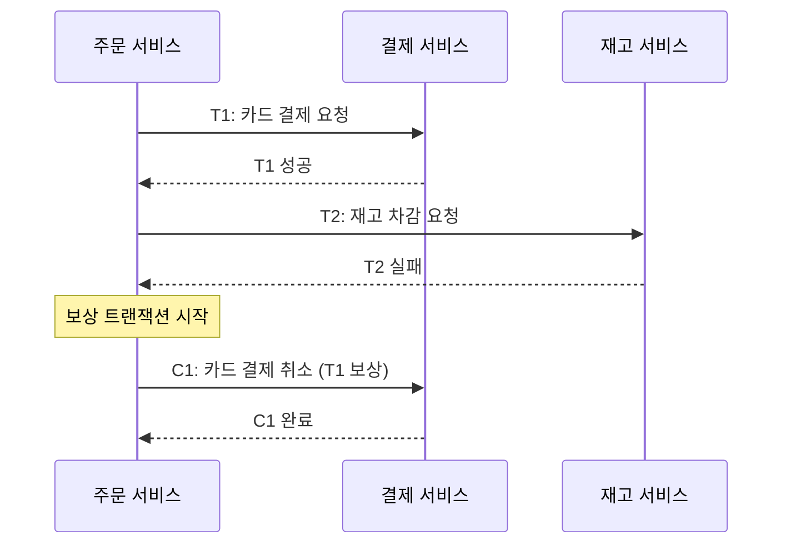
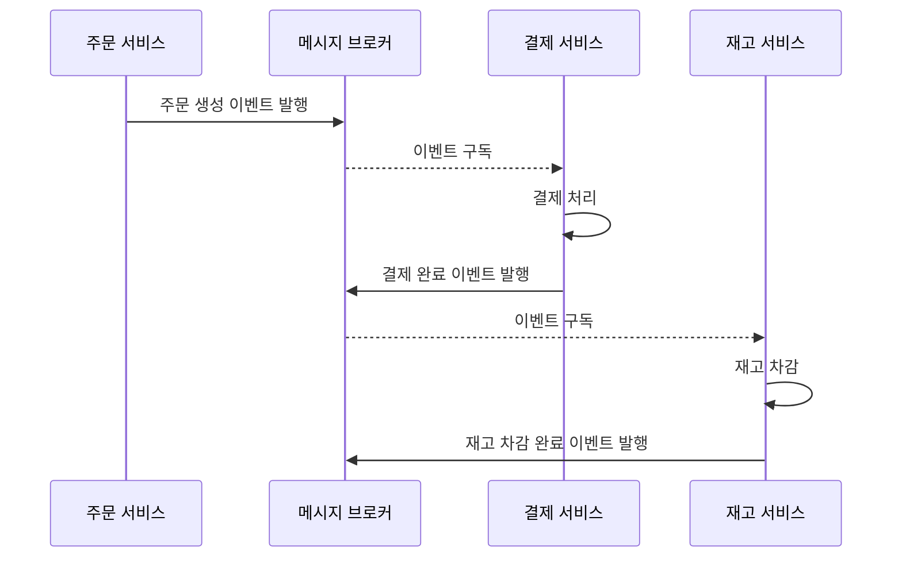
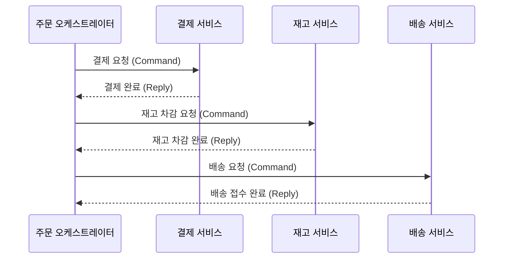

마이크로서비스 아키텍처에서 여러 서비스에 걸쳐있는 비즈니스 트랜잭션의 원자성 문제를 해결하기 위한 대안으로 SAGA 패턴이 널리 사용된다.

- SAGA는 하나의 긴 비즈니스 트랜잭션을 여러 개의 로컬 트랜잭션의 연속으로 나누어 처리하는 패턴
- 각 로컬 트랜잭션이 성공하면, 다음 트랜잭션을 호출하는 이벤트를 발행하는 방식으로 전체 흐름 진행

## 핵심 원리 - 보상 트랜잭션

SAGA 패턴의 핵심은 로컬 트랜잭션 중 하나가 실패하면, 이미 성공적으로 완료된 이전 트랜잭션들을 취소하는 보상 트랜잭션이 역순으로 실행되는 것이다.

이러한 보상 트랜잭션의 실행을 통해, 전체 시스템은 최종적으로 일관된 상태를 유지하게 된다.

## 두 가지 구현 방식

SAGA 패턴은 제어 방식에 따라 두 가지 방식으로 구현할 수 있다.

|  구분   |      코레오그래피 (Choreography)       |      오케스트레이션 (Orchestration)      |
|:-----:|:--------------------------------:|:---------------------------------:|
| 제어 방식 |  각 서비스가 이벤트를 발행하고 구독하며 자율적으로 동작  | 중앙의 오케스트레이터가 각 서비스의 트랜잭션을 지시 및 제어 |
|  장점   |     서비스 간 결합도가 낮고 구조가 비교적 단순     |   전체 흐름을 중앙에서 관리하여 추적 및 디버깅 용이    |
|  단점   | 전체 흐름을 파악하기 어렵고, 서비스 간 순환 의존성 위험 |           오케스트레이터의 SPoF           |

### 코레오그래피(Choreography) 방식

각 서비스가 이벤트를 발행하고 다른 서비스가 이를 구독하여 자율적으로 다음 단계를 수행한다.

- 서비스 간 직접 의존성이 없어 새로운 서비스를 추가하거나 제거하기 용이
- 참여 서비스가 많아지면 이벤트 체인이 복잡해져 전체 흐름을 추적하기 어려움

### 오케스트레이션(Orchestration) 방식

중앙의 오케스트레이터가 각 서비스에 명령을 보내고 응답을 받아 다음 단계를 결정한다.

- 전체 비즈니스 흐름이 오케스트레이터에 명시적으로 정의되어 디버깅과 모니터링 용이
- 오케스트레이터가 단일 장애점(SPoF)이 될 수 있으므로 고가용성 설계 필요

## 심층적 고려사항

SAGA 패턴을 적용할 때는 ACID 속성 중 일부를 포기하는 트레이드오프를 이해해야 한다.

### 격리 수준(Isolation)의 부재

SAGA는 ACD(원자성, 일관성, 지속성)는 보장하지만, 격리성(Isolation)은 보장하지 않는다.

- 중간 상태 노출: 성공(T1)과 실패(T2) 사이의 짧은 시간 동안, 일부 서비스는 중간 상태를 볼 수 있음
- 보상 트랜잭션(C1)이 실행되기 전까지 일시적으로 데이터가 불일치하는 상태가 외부에 노출

### 보상 트랜잭션의 멱등성 보장

네트워크 오류 등으로 인해 보상 트랜잭션 요청이 여러 번 전달될 수 있다.

- 보상 트랜잭션이 여러 번 실행되더라도 시스템 상태에 영향을 주지 않도록 멱등성(idempotency)을 반드시 보장
- 고유한 트랜잭션 ID를 기반으로 중복 처리 여부를 판별하는 방식이 일반적

### 최종적 일관성

SAGA는 모든 참여 서비스가 즉시 일관된 상태를 유지하는 강한 일관성(Strong Consistency)을 보장하지 않는다.

- 실패가 발생하더라도 보상 트랜잭션을 통해 결국에는 모든 데이터가 일관된 상태에 도달하는 최종적 일관성을 목표
- 일시적인 데이터 불일치를 허용할 수 있는 비즈니스 요구사항인지 검토 필요
