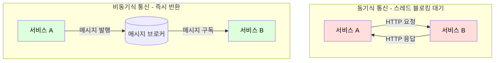

통신 방식은 크게 동기식(Synchronous)과 비동기식(Asynchronous)으로 나뉘며, 이 둘의 선택은 시스템 전체의 성능, 결합도, 그리고 장애 대응 방식에 결정적인 영향을 미친다.

## 동기식 vs 비동기식 비교

|  비교 항목  |     동기식 (Synchronous)     |     비동기식 (Asynchronous)      |
|:-------:|:-------------------------:|:----------------------------:|
|  통신 흐름  |  요청 → 대기(Blocking) → 응답   |   요청 → 즉시 반환, 결과는 이벤트로 수신    |
|   결합도   |   강한 결합 (호출 대상 가용성에 의존)   |    느슨한 결합 (브로커를 통한 간접 통신)    |
|  장애 전파  | 호출 대상의 지연/장애가 호출자에게 직접 전파 |       브로커가 완충하여 장애 격리        |
| 데이터 일관성 |   즉시 응답으로 강한 일관성 확보 용이    | 최종 일관성(Eventual Consistency) |
| 구현 복잡도  |      단순 (HTTP/gRPC)       |      메시지 브로커 도입 및 운영 필요      |
| 적합한 작업  |    즉각적인 응답이 필요한 조회/명령     |     후속 처리, 알림 발송, 이벤트 전파     |

## 동기식 통신(Synchronous Communication)

동기식 통신은 요청을 보낸 서비스가 응답을 받을 때까지 기다리는(Blocking) 방식이다.

- 강한 결합(Tight Coupling): 요청 서비스(A)는 피호출 서비스(B)가 정상적으로 동작하고 있다는 사실에 강한 의존성을 가짐
- 장애 전파(Cascading Failures): 서비스 B가 느려지거나 장애가 발생하면, 서비스 B를 기다리는 서비스 A 역시 함께 느려지거나 장애 발생
- 자원 대기: 서비스 A는 응답을 기다리는 동안 스레드와 같은 자원을 계속 점유

### 동기 호출 고려사항

동기 호출 자체는 단순하지만, 분산 환경에서는 다음 두 가지에 대한 고려가 반드시 필요하다.

#### 타임아웃(Timeout) 설정

- Connection Timeout: 서비스 B와 연결을 시도할 때까지 기다리는 최대 시간
- Read Timeout: 연결은 성공했으나, 서비스 B가 데이터를 반환할 때까지 기다리는 최대 시간
    - 이 설정이 없거나 너무 길면, 서비스 B의 지연이 그대로 서비스 A의 스레드 고갈로 이어져 전체 시스템 장애로 확산

#### 재시도(Retry) 정책

- 서비스 B가 이미 과부하 상태라 응답이 느린 것이라면, 재시도는 오히려 부하를 가중시켜 장애 악화 가능
- 이러한 동기식 통신의 한계와 장애 전파를 막기 위해 서킷 브레이커 패턴과 같은 복원성 패턴 도입 필요

## 비동기식 통신(Asynchronous Communication)

비동기식 통신은 요청을 보낸 서비스가 응답을 기다리지 않고 즉시 자신의 다음 작업을 수행하는 방식으로, 중간 매개체(메시지 브로커)를 두는 것이 일반적이다.

- 느슨한 결합(Loose Coupling): 서비스 A는 메시지 브로커에 메시지를 발행(Publish)만 할 뿐, 서비스 B가 정상 동작하는지 전혀 알 필요 없음
- 장애 격리(Isolation): 서비스 B에 장애가 발생해도 서비스 A는 영향을 받지 않고 메시지 발행 가능
- 유연한 확장성: 특정 작업(예: 알림 발송)을 처리하는 컨슈머 서비스만 독립적으로 확장 가능
- 부하 완충(Buffering): 순간적인 트래픽 폭증 시, 요청을 브로커가 받아 저장해두고 컨슈머가 처리 가능한 속도로 순차 처리하여 시스템 전체의 안정성 향상

### 비동기식 통신의 한계

느슨한 결합과 장애 격리라는 이점이 있지만, 분산 시스템 고유의 복잡성이 수반된다.

- 복잡성 증가: 중간에 메시지 브로커라는 별도의 시스템을 도입 및 운영 필요
- 결과 확인의 어려움: 요청을 보낸 쪽에서 해당 작업이 언제 성공적으로 처리되었는지 알기 어려움
- 최종 일관성(Eventual Consistency): 서비스 A가 데이터를 변경하고 이벤트를 발행해도, 서비스 B가 이를 처리하여 데이터 일관성을 맞추기까지 시간 지연(Latency) 발생

### 전달 보장(Delivery Guarantees)

비동기 시스템을 설계할 때 가장 중요한 것은 메시지 유실 방지와 중복 처리 방지다.

|        전달 보장 수준        |         동작 방식         |           특성            |          적합한 상황           |
|:----------------------:|:---------------------:|:-----------------------:|:-------------------------:|
| At-most-once (최대 한 번)  | 메시지를 최대 한 번 전달, 유실 가능 |    성능 최적, 데이터 유실 허용     |  로그 수집, 통계 이벤트 등 유실 허용 시  |
| At-least-once (최소 한 번) | 메시지를 최소 한 번 전달, 중복 가능 |   대부분의 메시징 시스템이 기본 채택   | 일반적인 비즈니스 이벤트 처리 (멱등성 필수) |
| Exactly-once (정확히 한 번) |      정확히 한 번만 처리      | 구현 매우 어렵고 큰 비용/성능 저하 유발 | 금융 거래 등 중복 처리가 절대 불가한 경우  |

### 멱등성(Idempotency)

At-least-once 전달 방식에서는 동일한 메시지가 여러 번 처리되더라도 시스템 상태에 영향을 주지 않도록 설계해야 한다.

- 중복 처리를 방지하기 위해 '요청 ID'나 '트랜잭션 ID'를 기준으로 이미 처리된 작업인지 확인하는 로직을 컨슈머에 구현 필요
- DB 변경과 이벤트 발행의 원자성 보장은 트랜잭셔널 아웃박스 패턴을 고려할 수 있음
