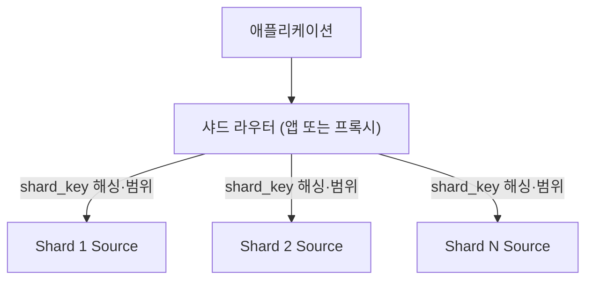
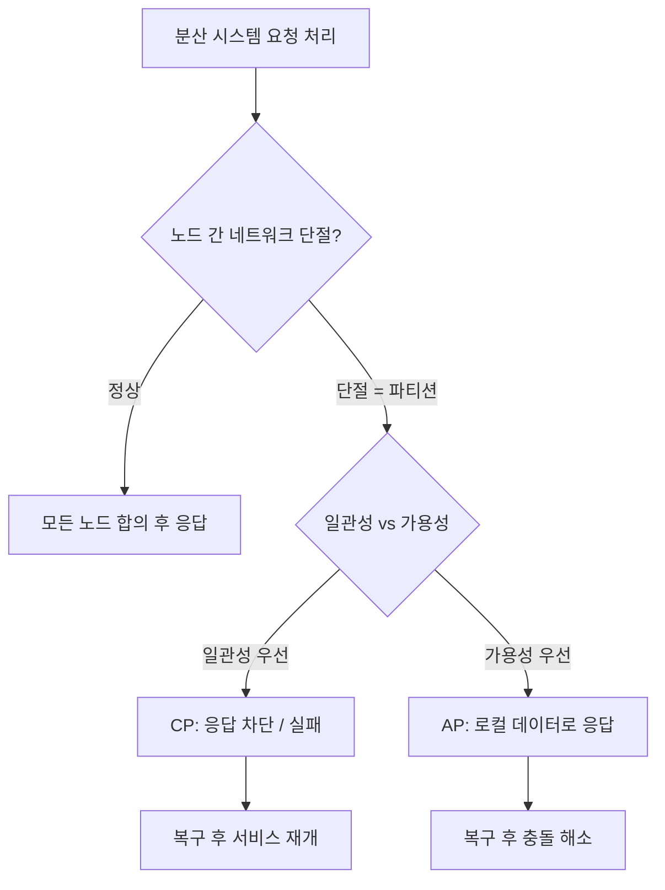

## 수평적 규모 확장(Scale Out)

규모 확장은 크게 수직적 규모 확장과 수평적 규모 확장으로 나뉜다.

- 수직적 규모 확장: 단일 서버의 성능을 향상시키는 방법(CPU / RAM / SSD 등 업그레이드)
- 수평적 규모 확장: 여러 서버로 분산하여 처리하는 방법

만약 서버로 유입되는 트래픽 양이 적거나 서버의 성능이 충분하다면 수직적 규모 확장이 유리하지만 다음과 같은 문제가 존재한다.

- 하나의 서버로 트래픽을 처리할 수 있는 절대적인 성능적 한계 존재
- SPOF(Single Point of Failure)로 인한 위험성이 존재
- 자동복구 방안이나 다중화 방안이 존재하지 않아 장애 발생 시 복구가 어려움

위와 같은 문제로 인해 보통 대규모 애플리케이션을 설계할 때는 수평적 규모 확장을 고려하지만, 상태 관리 · 데이터 일관성 · 노드 간 통신 오버헤드 등 분산 환경 특유의 복잡도를 동반한다.

## 로드밸런서

로드밸런서는 부하 분산 집합에 속한 웹 서버에 트래픽 부하를 고르게 분산하는 역할 뿐만 아니라 다음과 같은 기능을 제공할 수 있다.

- 자동복구: 장애가 발생한 서버로의 트래픽을 차단하고 다른 서버로 분산
    - Amazon Elastic Load Balancer(ELB)는 등록된 대상을 주기적으로 헬스 체크하여 문제가 있는 인스턴스를 트래픽에서 자동 제외
- 확장성: 트래픽에 따라 서버 추가·제거 가능

### 동작 계층

동작 계층에 따라 L4 / L7 로드밸런서로 구분된다.

- L4: TCP/UDP 레벨의 IP · 포트 기반 분산, 처리 속도가 빠르나 애플리케이션 프로토콜 인지는 불가
- L7: HTTP 헤더 · URL · 쿠키 기반 분산, 세밀한 라우팅 가능하나 처리 오버헤드 존재

### 분산 알고리즘

- Round Robin: 서버를 순차적으로 돌아가며 요청 분배
- Least Connection: 현재 활성 연결 수가 가장 적은 서버로 분배
- IP Hash / Consistent Hashing: 동일 클라이언트를 같은 서버로 매핑(세션 고정), 노드 변경 시 재배치 최소화
- Weighted: 서버 사양에 따라 가중치를 두어 분배

## 데이터베이스 다중화

많은 데이터베이스가 다중화를 지원하며, 보통은 마스터-슬레이브 구조로 구성된다.

- master: 쓰기 작업을 처리하는 서버
- slave: 읽기 작업을 처리하는 서버. 읽기 빈도가 높은 만큼 여러 대를 두어 부하 분산

데이터베이스를 다중화하면 다음과 같은 장점을 얻을 수 있다.

- 성능 향상: 읽기 작업을 분산하여 처리하기 때문에 성능 향상
- 안정성: 데이터베이스 일부가 손상되더라도 데이터 보존 가능
- 가용성: 하나의 데이터베이스 서버에 장애가 발생하더라도 다른 서버에 있는 데이터 사용 가능

### 복제 방식

복제 전파 시점에 따라 일관성과 쓰기 성능 사이의 트레이드오프가 결정된다.

- 동기 복제: 마스터가 슬레이브 반영까지 기다린 뒤 응답. 강한 일관성, 쓰기 지연 증가
- 비동기 복제: 마스터 쓰기 완료 후 슬레이브로 전파. 쓰기 빠름, 마스터 장애 시 미전파 데이터 손실 가능

마스터 장애 시엔 슬레이브 중 하나를 새 마스터로 승격(Failover)하며, 복제 지연이 큰 상태에서 전환되면 일부 쓰기가 유실될 수 있다.

## 데이터베이스 수평적 확장(=Sharding)

대규모 데이터베이스를 샤드라고 부르는 작은 단위로 분할하는 기술로, 각 샤드는 같은 스키마를 가지고 있지만 서로 다른 데이터를 저장한다.

- 단일 DB 다중화(Replication)는 읽기 확장만 해결, 쓰기 TPS 한계는 그대로
- 샤딩은 데이터 자체를 여러 서버로 나눠 쓰기 처리량을 수평 분산
- 분산 환경 특유의 복잡도(라우팅·재샤딩·핫 샤드)를 동반

MySQL 같은 RDBMS는 자체 샤딩 기능이 없으므로 외부 계층에서 라우팅을 구현한다.

- 애플리케이션 레이어: 앱 코드에서 샤드 매핑·라우팅 직접 구현
- 미들웨어 레이어: Vitess, ProxySQL, ShardingSphere 등 프록시가 라우팅 담당

### 샤드 키 선정 기준

샤드 키는 모든 쿼리가 어느 샤드로 갈지 결정하는 기준이며, 한 번 정하면 재샤딩 없이는 변경할 수 없다.

- 높은 카디널리티: `user_id`처럼 분포가 넓은 컬럼 적합, `country`처럼 값이 적으면 소수 샤드 쏠림 위험
- 균등한 분포: 특정 사용자가 트래픽 대부분을 차지하면 핫 샤드 발생 (= 유명인사 문제)
- 쿼리 패턴 일치: 가장 자주 쓰이는 WHERE 조건이 샤드 키와 같아야 단일 샤드 조회 성립

### 샤딩 전략

|    전략     |           방식            |             특징             |
|:---------:|:-----------------------:|:--------------------------:|
|   Range   | 키 범위로 분할 (예: ID 1~1000) | 범위 질의 효율적, 최신 데이터에 핫 샤드 쏠림 |
|   Hash    |       키 해시값으로 분할        |  쓰기 균등 분산, 범위 질의는 전 샤드 스캔  |
| Directory |   별도 룩업 서비스로 샤드 매핑 관리   |   매핑 유연, 룩업 서비스가 병목·SPOF   |

Hash와 Range는 정반대의 트레이드오프를 가진다.

- Hash: `user_id % N` 또는 해시 함수로 샤드 결정. 쓰기는 자연스럽게 분산되지만, `created_at BETWEEN ...` 같은 범위 쿼리는 모든 샤드를 스캔 필요
- Range: `user_id 1~100만 → 샤드1, 100만~200만 → 샤드2`처럼 구간 분할. 범위 쿼리는 특정 샤드로 국한되지만, 최신 데이터가 마지막 샤드에 몰려 핫 샤드 발생

Consistent Hashing은 Hash 방식의 확장으로, 노드 추가·제거 시 이동되는 데이터 양을 전체가 아닌 인접 구간으로 최소화한다.

## 캐시(Cache)

값 비싼 연산 결과나 자주 참조되는 데이터를 메모리에 저장하여 빠르게 접근할 수 있도록 하는 저장소로, 데이터베이스 쿼리를 줄여 애플리케이션 성능을 향상시킨다.

### 캐시 전략 비교

읽기·쓰기 패턴과 일관성 요구 수준에 따라 여러 전략을 선택·조합한다.

- Cache-aside: 앱이 캐시 확인 후 miss 시 DB 조회·적재. 구현 단순해 가장 널리 사용
- Write-through: 쓰기를 캐시와 DB에 동기 반영. 일관성 강함, 쓰기 지연 증가
- Write-back: 쓰기를 캐시에만 반영하고 DB는 비동기 기록. 쓰기 빠르나 장애 시 데이터 손실 위험

데이터 갱신 시 발생하는 캐시와 DB 간 불일치는 캐시 무효화(invalidation) 또는 TTL로 완화한다.

### 캐시 사용 시 고려사항

캐시 적용 시엔 갱신 빈도 / 참조 빈도 / 만료 시간을 고려해야 하며, 그 외에도 다음과 같은 사항을 고려할 수 있다.

- 캐시 메모리: 크기가 너무 작으면 데이터가 캐시에서 자주 밀려나 성능 저하 발생 가능(과할당하여 방지 필요)
- 데이터 방출 정책: 캐시가 꽉 찼을 때 어떤 데이터를 밀어낼지 결정하는 정책. LRU / LFU / FIFO 등 존재

## 콘텐츠 전송 네트워크(CDN)

물리적으로 분산된 서버 네트워크로, 이미지 / 비디오 / CSS / JavaScript 파일 등 정적 콘텐츠를 캐시해 사용자에게 빠르게 전송한다.

사용자가 특정 이미지 URL에 접근하는 경우 아래와 같이 동작한다.

1. 사용자가 이미지 URL에 접근
2. CDN 서버에 요청
3. CDN 서버에 해당 이미지가 존재하면 CDN 서버에서 이미지 조회
    1. CDN 서버에 해당 이미지가 존재하지 않으면 원본 서버에 요청
    2. 원본 서버에서 조회한 이미지를 CDN 서버에 저장
4. CDN 서버에서 이미지 반환

CDN 적재 방식은 크게 두 가지로 구분된다.

- Pull CDN: 사용자 요청 시 원본에서 가져와 캐시. 가장 흔한 방식, 초기 요청은 느림
- Push CDN: 원본 변경 시 미리 CDN에 업로드. 트래픽이 많은 대용량·갱신 빈도 낮은 콘텐츠에 적합

각 콘텐츠는 TTL(Time To Live) 기준으로 만료되며, 만료 전 갱신이 필요하면 캐시 무효화(purge)를 통해 강제로 원본 재조회를 유도할 수 있다.

## 무상태(Stateless) 웹 계층

웹 계층의 수평적 확장을 위해선 상태 정보를 웹 계층에서 제거하고, RDBMS / 캐시 시스템 / NoSQL 데이터베이스 등 외부 저장소로 분리해야 한다.

## 다중 데이터 센터

여러 데이터 센터를 운영하면 가용성을 높이고 전 세계 사용자에게 빠른 응답 시간을 제공할 수 있다.

- 지리적 라우팅(geo-routing)으로 사용자를 가장 가까운 데이터 센터로 연결
- 특정 데이터 센터 장애 시 장애가 없는 데이터 센터로 트래픽 전환

다중 데이터 센터 아키텍처 설계 시 고려할 사항은 다음과 같다.

- 트래픽 우회: 올바른 데이터 센터로 트래픽을 보내는 방법 필요
- 데이터 동기화: 데이터 센터 간 데이터 동기화 방법 필요
- 테스트와 배포: 다중 데이터 센터 아키텍처를 테스트·배포하는 방법 필요

운영 방식은 크게 두 가지로 나뉘며, 가용성 요구 수준과 인프라 비용 사이에서 선택한다.

- Active-Active: 모든 데이터 센터가 동시에 트래픽 처리. 가용성·처리량 우수, 양방향 동기화로 인한 복잡도 증가
- Active-Passive: 평시엔 Active만 처리하고 장애 시 Passive로 전환(Failover). 구현 단순, 평시 자원 유휴

## 메시지 큐

메시지의 무손실을 보장하는 비동기 통신 컴포넌트로, 버퍼 역할을 하며 생산자와 소비자 사이에서 메시지를 전달한다.

1. 생산자 또는 발행자(producer/publisher)라고 불리는 입력 서비스가 메시지를 큐에 발행(publish)
2. 소비자 또는 구독자(consumer/subscriber)라고 불리는 서버가 메시지를 받아 그에 맞는 동작 수행

메시지 큐를 통해 서비스 간 결합을 느슨하게 하면, 규모 확장성과 가용성이 높은 아키텍처를 구성할 수 있다.

### 전달 보장 방식

장애·재시도 상황에서 메시지가 어떻게 처리되는지에 따라 구분된다.

- At-most-once: 최대 한 번 전달, 메시지 손실 가능
- At-least-once: 최소 한 번 전달, 중복 수신 가능하므로 소비자 측 멱등성 처리 필요
- Exactly-once: 정확히 한 번 전달, 구현 비용이 크며 보통 At-least-once + 멱등성으로 대체

대표 시스템으로는 분산 로그 기반 고처리량 스트리밍에 적합한 Apache Kafka, AMQP 기반 범용 브로커인 RabbitMQ, AWS 완전 관리형 큐인 Amazon SQS 등이 있다.

## 로그 / 메트릭 / 자동화

시스템 규모가 커질수록 관측 가능성(Observability)과 자동화의 중요성이 커지며, 관측 가능성은 흔히 세 가지 축으로 구성된다.

- Logs: 이벤트 단위 기록으로 근본 원인 추적 (ELK 스택, Loki 등)
- Metrics: 수치 지표의 시계열 집계로 상태·추세·알림 (Prometheus + Grafana 등)
- Traces: 분산 시스템 요청 흐름 추적으로 병목·지연 파악 (Jaeger, Zipkin, OpenTelemetry 등)

자동화는 인프라를 코드로 관리(IaC)하고 배포·테스트를 CI/CD 파이프라인으로 연결하여 반복 가능한 운영을 구성한다.

## 설계 시 고려사항

- 구체적인 기능 목록과 핵심 기능
- 사용자 수
- 규모가 커질 경우를 대비한 확장성(얼마나 빨리 커지는지)
- 현재 사용 가능한 기술 스택
- 활용할 수 있는 기존 서비스 및 시스템

## CAP

CAP 정리는 분산 시스템이 일관성(Consistency), 가용성(Availability), 파티션 감내(Partition Tolerance) 세 속성 중 두 가지만 동시에 보장할 수 있다는 이론이다.

- 일관성(Consistency): 모든 클라이언트가 어느 노드에 접속하든 동일한 최신 데이터를 조회
- 가용성(Availability): 장애가 없는 노드에 도달한 모든 요청이 에러 없이 응답을 반환
- 파티션 감내(Partition Tolerance): 노드 간 네트워크 통신이 끊어져도(=파티션) 시스템 전체가 계속 동작

### 왜 세 속성이 동시에 성립할 수 없는가

네트워크 파티션이 발생하면 양쪽으로 분리된 노드 그룹은 서로의 쓰기 결과를 즉시 동기화할 수 없으므로, 시스템은 두 가지 중 하나를 선택해야 한다.

- 다른 노드와의 합의가 불가능하므로 응답을 보류·거부 → 일관성 유지, 가용성 포기(CP)
- 로컬 상태로 즉시 응답하고 이후 동기화 → 가용성 유지, 일관성 포기(AP)
- 분산 환경에서 네트워크 장애는 회피 불가능한 현실이므로 P는 사실상 필수 요건

즉 CAP의 본질은 "네트워크 파티션 상황에서 C와 A 중 무엇을 우선할지"에 관한 선택 문제다.

### CP vs AP 시스템

파티션 발생 시의 선택에 따라 분산 시스템은 CP 또는 AP로 분류된다.

- CP: 일관성 유지를 위해 쓰기·읽기 연산 차단. 정족수(Quorum) 기반 합의 프로토콜(Paxos, Raft 등)로 과반 노드 도달 불가 시 요청 거부
- AP: 각 노드가 로컬 데이터로 응답하고 복구 후 벡터 클록 / LWW(Last-Write-Wins) / CRDT 등을 이용한 충돌 해소(Conflict Resolution)로 상태 수렴

|    구분    |            CP             |            AP             |
|:--------:|:-------------------------:|:-------------------------:|
| 파티션 시 동작 |        요청 차단 / 실패         |         로컬 응답 반환          |
|  일관성 모델  |          강한 일관성           |          최종적 일관성          |
|    대가    |          가용성 하락           |        일시적 데이터 불일치        |
|  예시 시스템  | HBase, MongoDB, ZooKeeper | Cassandra, DynamoDB, Riak |
|  적합 도메인  |      금융 / 재고 / 분산 락       |     피드 / 카탈로그 / 장바구니      |

### PACELC — CAP의 확장

CAP는 파티션 발생 시의 선택만 다루기 때문에, 정상 상태의 트레이드오프까지 포함한 PACELC 정리가 함께 사용된다.

- Partition 발생 시: Availability vs Consistency 중 선택 (CAP와 동일)
- Else(정상 상태): Latency vs Consistency 중 선택

정상 상태에서도 강한 일관성을 위해 다수 노드의 동기 복제를 기다리면 지연 시간이 늘어나고, 지연을 줄이려면 일관성을 완화해야 한다.

|         시스템         |  파티션 시 (P)   |  정상 시 (E)   |  분류   |
|:-------------------:|:------------:|:-----------:|:-----:|
| Cassandra, DynamoDB | Availability |   Latency   | PA/EL |
|   MongoDB, HBase    | Consistency  | Consistency | PC/EC |

###### 참고자료

- [가상 면접 사례로 배우는 대규모 시스템 설계 기초](https://kobic.net/book/bookInfo/view.do?isbn=9788966263158)

