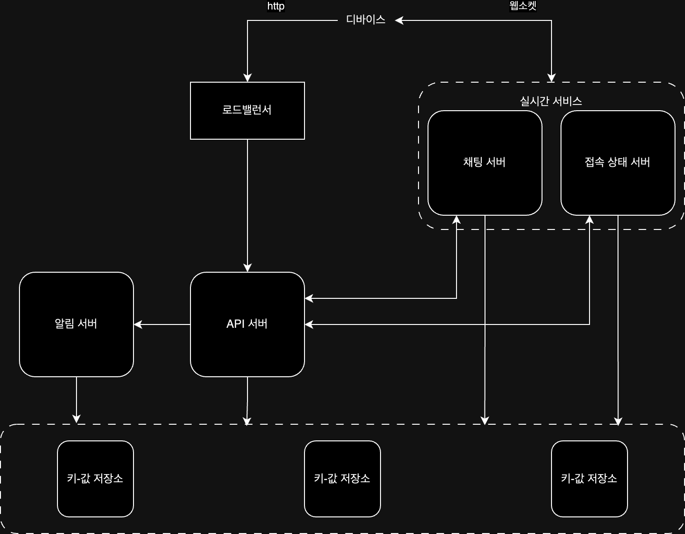

## 요구 사항

- 다양한 플랫폼 지원
- 1:1 / 그룹 채팅(최대 100명) 지원
- 사용자 접속상태 표시 지원
- 텍스트 메시지만 지원(100,000자 이내)
- DAU 5,000만명
- 채팅 히스토리 영구 저장
- 하나의 계정으로 여러 디바이스 동시 접속 가능
- 푸시 알림 지원

## 기능 정의

위와 같은 요구사항을 만족하기 위해 아래의 기능을 구현해야 한다.

- 클라이언트들로부터 메시지 수신
- 메시지 수신자 결정 및 전달
- 수신자가 접속 상태가 아닌 경우 접속할 때까지 메시지 보관

### 메시지 송/수신 방식

메시지 수신 방식으론 크게 아래 세 가지 방식을 고려할 수 있다.

- 폴링: 클라이언트에서 서버에 주기적으로 요청을 보내는 방식
    - 장점: 구현이 쉽고, 서버에서 클라이언트로 푸시 알림을 보내는 것보다 빠르게 구현 가능
    - 단점: 폴링을 자주할 수록 비용이 증가하고, 실시간성이 떨어짐
- 롱 폴링: 클라이언트가 서버에 연결을 유지하고 있지만, 서버가 응답을 보내거나 타임아웃이 발생할 때까지 연결을 유지하는 방식
    - 장점: 폴링보다 실시간성이 높음
    - 단점: 메시지를 보내는 클라이언트와 수신하는 클라이언트가 같은 서버에 연결되어 있어야 하며, 서버에서 클라이언트의 연결 상태를 알 수 없음
- 웹소켓: 클라이언트와 서버 간 양방향 통신을 지원하는 프로토콜로
    - 장점: 실시간성이 높고, 서버에서 클라이언트로 비동기적으로 메시지를 보낼 수 있음
    - 단점: 구현이 다소 복잡함

폴링과 폴링 기반은 서버에 부하를 줄 수 있고, 웹소켓에서 비동기적으로 메시지를 보낼 수 있기 때문에 웹소켓을 사용하는 것이 좋다.  
송신은 HTTP 프로토콜을 사용할 순 있지만, 웹소켓에서 송신도 가능하므로 송/수신 동일한 프로토콜을 사용하기 위해 송신도 웹소켓을 사용하는 것이 좋다.

### 기능 분리

메시지 송/수신은 웹소켓을 사용하기로 하였으나, 다른 대부분의 기능은 HTTP 프로토콜을 이용하여 구현할 수 있다.  
때문에 설계를 진행할 때 무상태 서비스 / 상태유지 서비스로 구분하고, 추가적으로 서드파티 서비스 연동 세 부분으로 나누어 설계할 수 있다.

- 무상태 서비스: 웹사이트와 앱이 보편적으로 제공하는 기능들에 해당(회원가입 / 로그딩 등)
    - 요청을 알맞게 분배해주는 로드밸런서 뒤에 위치하여, 서버의 확장성을 높이기 위해 무상태로 구현
- 상태 유지 서비스: 채팅 서비스와 같이 상태를 유지해야 하는 서비스에 해당
    - 트래픽이 많지 않은 경우 하나의 서버로 처리할 수 있음
    - 하지만 대규모 트래픽 처리엔 문제가 있고, SPOF(Single Point of Failure)가 발생할 수 있으므로 여러 서버로 분산하여 처리 필요
- 제3자 서비스 연동: 푸시알림과 같이 외부 서비스와 연동해야 하는 서비스에 해당

## 채팅 시스템 설계

위의 기능과 확장성을 고려하여 채팅 시스템을 설계하면 다음과 같다.

각 컴포넌트는 다음과 같은 역할을 수행한다.

- 채팅 서버: 클라이언트 사이에 메시지를 중계
- 접속상태 서버: 사용자의 접속 여부 관리
- API 서버: 로그인 / 회원가입 등 일반적인 기능을 API로 제공
- 알림 서버: 푸시 알림 전송
- 키-값 저장소: 채팅 이력 저장

### 저장소

채팅 서비스를 제공하기 위해서 다루는 데이터는 크게 두 가지로 나눌 수 있다.

- 일반적인 데이터: 사용자 정보 / 설정 / 친구 목록과 같은 데이터
- 채팅 이력: 채팅 메시지와 같은 데이터
    - 읽기/쓰기 둘 다 빈번하게 발생
    - 최근 메시지가 빈번하게 조회됨
    - 검색 기능 / 멘션 / 특정 메시지로 점프 등 무작위적인 데이터 접근 발생

일반적인 데이터는 안정성을 보장하는 관계형 데이터베이스를 사용할 수 있고, 채팅 이력은 키-값 저장소를 사용하여 구현할 수 있다.  
키-값 저장소를 사용하는 근거는 다음과 같다.

- 데이터 접근 지연시간 낮음
- 관계형 데이터베이스는 인덱스가 커지면 데이터 무작위 접근 처리 속도가 느려짐
- 많은 안정적인 시스템이 키-값 저장소를 사용하고 있음

### 데이터 모델

채팅 시스템의 데이터 모델은 다음과 같이 구성할 수 있다.

- 1:1 채팅
    - `message_id`: 메시지 식별자, 메시지 순서를 보장하기 위한 역할도 담당
    - `message_from`: 메시지 발신자
    - `message_to`: 메시지 수신자
    - `content`: 메시지 내용
    - `created_at`: 메시지 생성 시간, 메시지 순서를 정하지 않음(동시에 생성된 메시지가 있을 수 있음)
- 그룹 채팅
    - `message_id`: 메시지 식별자
    - `channel_id`: 그룹 식별자, `message_id` + `channel_id` 복합 키를 기본 키로 사용
    - `message_from`: 메시지 발신자
    - `content`: 메시지 내용
    - `created_at`: 메시지 생성 시간

여기서 `message_id`는 고유해야하면서, 메시지 순서를 보장해야하는 것을 고려해야 한다.

## 상세 설계

### 서비스 탐색 과정

서비스 탐색이란 클라이언트에게 가장 적합한 채팅 서버를 추천해주는 것인데, 사용되는 기준에는 물리적인 위치나 서버의 부하 등이 있다.  
가장 널리 쓰이는 오픈 소스 솔루션으로는 아파치 주키퍼 같은 것이 있으며, 이를 통해 기준에 따라 최적의 채팅 서버를 추천해줄 수 있다.

1. 사용자가 로그인 시도
2. 로드밸런서에서 로그인 요청을 API 서버로 전달
3. API 서버는 로그인을 처리
4. 서비스 탐색 기능을 동작해 해당 사용자에게 최적의 채팅 서버 조회
5. 사용자는 웹소켓을 통해 채팅 서버에 연결

### 여러 디바이스 간 메시지 동기화

하나의 채팅 서비스에 여러 디바이스로 동시 접속할 수 있기 때문에, 메시지를 동기화하는 과정이 필요하다.  
각 단말은 `cur_max_message_id` 변수를 유지하여 가장 최신 메시지의 ID를 추적하고, 이를 통해 서버에 저장된 메시지 중 큰 메시지만 받아온다.

### 1:1 메시지 흐름

사용자 A가 B에게 메시지를 전송한다고 했을 때, 메시지 처리 흐름은 다음과 같다.

1. 사용자가 채팅 서버로 메시지 전송
2. 채팅 서버는 ID 생성기를 통해 메시지 ID 생성
3. 채팅 서버는 해당 메시지를 메시지 동기화 큐로 전송
4. 메시지가 키-값 저장소에 저장
5. 메시지 전달
    - 사용자 B가 접속 중인 경우: 사용자 B가 접속 중인 해당 채팅 서버로 메시지 전송 후 사용자 B에게 전달
    - 사용자 B가 접속 중이지 않은 경우: 푸시 알림 서버로 메시지 전송

### 그룹 채팅에서의 메시지 흐름

소규모 그룹 채팅의 경우 1:1 채팅을 조금 변형해서 다음과 같은 방식으로 처리할 수 있다.

- 사용자 A가 메시지 전송
- 보낸 메시지를 다른 사용자들의 메시지 동기화 큐에 복사되어 전달
- 각 사용자는 해당 큐를 통해 새로운 메시지 확인 가능

방 규모가 커지는 경우, 수신자별로 복사해서 큐에 넣는 비용이 커지기 때문에 방의 크기를 제한하는 것이 좋다.

### 접속상태 표시

접속상태 또한 웹소켓으로 통신하는 실시간 서비스의 일부이므로, 사용자의 상태가 바뀌는 시나리오에 따라 다음과 같이 처리할 수 있다.

- 사용자 로그인: 클라이언트와 웹소켓 연결이 맺어지게 되면, 접속상태 서버는 해당 사용자의 상태와 최근 접속 시간을 업데이트
- 로그아웃: 클라이언트가 로그아웃 API 요청을 하게 되면 해당 API 서버에서 접속상태 서버로 로그아웃 요청을 전달하여 사용자의 상태 업데이트
- 접속 장애: 항상 안정적인 연결을 보장할 수 없기 때문에 해당 상황에 대응할 수 있는 시나리오 고려 필요
    - 온라인 상태의 클라이언트는 박동 이벤트(heartbeat event)를 접속상태 서버로 전송하여 해당 사용자의 상태를 업데이트
    - 일정 시간동안 박동 이벤트가 없으면 해당 사용자의 상태를 오프라인으로 변경

### 상태 정보 전송

각 친구 관계마다 채널을 하나 씩 둔 발행-구독 모델 방식을 사용해 상태를 전송할 수 있다.(A-D 사용자가 있을 때, A의 접속상태를 위한 A-B/A-C/A-D 채널 존재)  
이 방법 또한 그룹 크기가 커지면 그 인원 수 만큼 이벤트 메시지를 전송해야 하기 때문에, 그룹 크기를 제한하는 것이 좋다.  
만약 큰 그룹을 위한 채널을 만들어야 한다면, 다음과 같은 방법으로 성능 문제를 회피할 수 있다.

- 사용자가 그룹 채팅에 입장하는 순간에만 상태 정보 조회
- 수동으로 상태 정보 조회

###### 참고자료

- [가상 면접 사례로 배우는 대규모 시스템 설계 기초](https://kobic.net/book/bookInfo/view.do?isbn=9788966263158)
