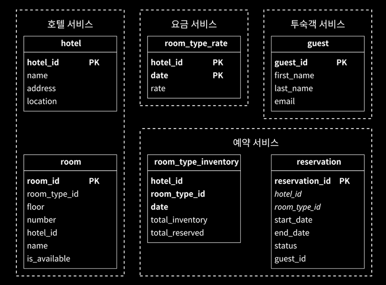

## 요구사항

- 대금은 예약시 지불
- 웹/앱에서만 예약 가능
- 예약 취소 가능
- 예약 취소를 예상하여 초과 예약 가능
- 유동적인 객실 가격

5000개의 호텔 / 100만 개 객실 / 평균적으로 70% 예약 / 평균 투숙 기간 3일이라고 가정하면 다음과 같이 추정할 수 있다.

- 일일 예상 예약 건수: 100만 * 0.7 / 3일 = 233,333
- 초당 예약 건수: 233,333 / 86400 = 2.7

초당 예약 트랜잭션 수가 높지 않다는 것을 알 수 있으며, 사용자가 예약하기까지 호텔 정보 조회, 예약 상세 정보 조회, 객실 예약 페이지 세 단계로 나눌 수 있다.

1. 호텔/객실 상세 페이지: 사용자가 호텔/객실 정보 조회
2. 예약 상세 정보 페이지: 사용자가 날짜 / 투숙 인원 / 결제 방법 등 상세 정보 조회
3. 객실 에약 페이지: 예약 트랜잭션 발생

대략 10%의 사용자가 다음 단계로 진행한다고 가정했을 때, 초당 조회 트랜잭션 수는 다음과 같이 추정할 수 있다.

- 예약 상세 페이지 조회: 2.7 * 10 = 27
- 객실 예약 페이지 조회: 27 * 10 = 270

## API 설계

예약 시스템에 필요한 필수적인 API는 다음과 같이 정리해 볼 수 있다.

- 호텔 관련 API
    - 호텔 상세 정보 반환
    - 신규 호텔 추가
    - 호텔 정보 갱신
    - 호텔 정보 삭제
- 객실 관련 API
    - 객실 상세 정보 반환
    - 신규 객실 추가
    - 객실 정보 갱신
    - 객실 정보 삭제
- 예약 관련 API
    - 사용자 예약 이력 반환
    - 특정 예약 상세 정보 반환
    - 신규 예약
    - 예약 취소

## 데이터 모델

예약 시스템에서는 다음 질의를 지원해야 한다.

1. 호텔 상세 정보 확인
2. 지정된 날짜 범위에 사용 가능한 객실 확인
3. 예약 정보 기록
4. 예약 내역 또는 과거 예약 이력 정보 조회

종합적으로 고려했을 때 관계형 데이터베이스를 선택할 수 있는데, 그 이유는 다음과 같다.

- 읽기 빈도가 쓰기 연산에 비해 높은 작업 흐름 지원
- ACID 속성을 지원하여 이중 예약과 같은 문제 방지
- 비즈니스 데이터의 구조를 명확하게 표현 가능하면서 데이터 쉽게 모델링 가능

관계형데이터 베이스의 스키마는 단순하게 다음과 같이 구성할 수 있다.

여기서 예약 테이블에 `roomId`가 아닌 `roomTypeId`를 사용한 이유는 호텔 예약 특성 상 특정 객실이 아닌 특정한 객실 유형을 예약하기 때문이다.

## 동시성 문제

예약 시스템에서 동시성 문제는 다음과 같이 발생할 수 있다.

1. 같은 사용자가 하나의 객실을 여러 번 예약하는 경우(여러 번 누르는 경우)
2. 여러 사용자가 동시에 같은 객실을 예약하는 경우

### 멱등 API

그 중 첫 번째 문제는 클라이언트 측에서 방지할 수 있지만 안정적인 방법이 아니기 때문에 멱등성을 보장하는 방법을 사용하는 것이 좋다.  
멱등성을 보장하는 API는 동일한 요청을 여러 번 호출하더라도 동일한 결과를 반환하는 API를 의미하며, 멱등 키를 포함한 API 요청은 다음과 같이 수행하게 된다.

1. 고객이 예약 세부 정보를 입력하여 예약 주문서 생성
2. 생성된 주문서를 검토할 수 있도록 예약 주문서를 반환
    - 이 때 반환 결과에 멱등키 역할을 하는 `reservation_key`를 포함하여 반환
3. 검토가 끝난 뒤 `reservation_key`를 포함한 예약 요청 정보 전송하면 서버는 해당 `reservation_key`를 사용하여 예약을 수행
4. 다시 한 번 같은 `reservation_key`를 사용하여 예약 요청을 전송하더라도 동일한 예약이 수행되지 않음

### 동시성 제어

여러 사용자가 동시에 같은 객실을 예약하면 하나의 재고가 남은 상태임에도 여러 예약이 수행될 수 있다.  
이를 해결하기 위해 락을 활용해볼 수 있으며, 장단점은 다음과 같다.

|      기술      | 장점                             | 단점                                                           |
|:------------:|:-------------------------------|:-------------------------------------------------------------|
|    비관적 락     | 구현이 쉽고 모든 갱신 연산을 직렬화하여 충돌 방지   | 여러 레코드에 락을 걸면 교착 상태 발생 및 성능 저하가 생기며 확장성이 떨어짐                 |
|    낙관적 락     | 락을 걸지 않기 때문에 확장성이 좋고 성능이 높음    | 충돌이 발생할 경우 롤백이나 재시도가 필요하며, 경쟁이 치열한 상황에선 성능 저하가 커짐            |
| 데이터베이스 제약 조건 | 구현이 쉬우며, 경쟁이 심하지 않을 때 정상적으로 동작 | 경쟁이 심한 상황에서는 성능 저하가 발생하며, 애플리케이션 코드에서 동작하는 것이 아니라 버전 통제가 어려움 |

## 시스템 규모 확장

호텔 예약 시스템의 평균적인 QPS는 높지 않으나, 이벤트가 발생하거나 외부 예약 웹사이트와 연동되면 급격히 증가할 수 있다.  
애플리케이션 서버는 무상태 서비스기 때문에 단순히 서버 추가로 해결할 수 있다.

### 데이터베이스 샤딩

데이터베이스는 단순히 늘리는 것으로 해결할 수 없기 때문에, 샤딩을 적용하여 해결해볼 수 있다.  
대부분의 질의는 `hotel_id`를 조건으로 사용하기 때문에 작연스럽게 `hotel_id`에 대해 샤딩 조건으로 쓰면 된다.

### 캐시

호텔 잔여 객실 데이터는 특성상 과거 데이터보다는 현재 혹은 미래의 데이터가 중요하다.  
따라서 데이터를 보관할 때는 낡은 데이터는 자동적으로 소멸되도록하는 TTL을 설정하면 효율적으로 데이터를 질의할 수 있다.

- 캐시 데이터: 잔여 객실 확인 및 객실 예약 로직에서 사용
- 잔여 객실 데이터베이스: 최종 확인 및 과거 예약 이력 조회 로직에서 사용

실제로 예약을 수행하게 되면, 각 컴포넌트는 다음과 같이 수행하게 된다.

- 예약 서비스
    - 잔여 객실 캐시에 지정된 호텔 / 개실 유형 / 주어진 날짜 범위에 이용 가능한 객실 수 질의
    - 객실을 예약하고 잔여 객실 데이터베이스에 예약 정보 저장(예약 취소 시에도 갱신)
- 잔여 객실 캐시
    - `hotelId_roomTypeId_{date}` - `잔여 객실 수`로 구성된 키-값 쌍 저장
- 잔여 객실 데이터베이스
    - 잔여 객실 수에 대한 신뢰성 있는 데이터 보관
    - 캐시 데이터 비동기적으로 갱신

캐시 계층을 추가하게 되면 시스템 확장성과 처리량이 증가하기 되지만,  
데이터베이스와 캐시 간의 데이터 불일치 문제가 발생할 수 있기 때문에 최종적으로 데이터베이스에 확인을 한 번 확인하는 것이 중요하다.

## 서비스 간 데이터 일관성

서비스 별로 데이터베이스를 두게 되면 하나의 트랜잭션으로 데이터 일관성을 보장하기 어렵기 때문에, 업계에서 널리 사용되는 방법은 다음과 같다.

- 2단계 커밋(2-phase commit): 여러 노드에 걸친 원자적 트랜잭션 실행을 보증하는 데이터베이스 프로토콜
- 사가(Saga): 각 노드에 발생하는 트랜잭션을 하나로 엮은 것
    - 각각의 트랜잭션이 완료되면 다음 트랜잭션을 시작하는 메시지 전송
    - 그 중 하나의 트랜잭션이라도 실패하면 그 이전 트랜잭션의 결과롤 되돌리는 트랜잭션들을 순차적으로 실행

###### 참고자료

- [가상 면접 사례로 배우는 대규모 시스템 설계 기초 2](https://kobic.net/book/bookInfo/view.do?isbn=9788966264254)
