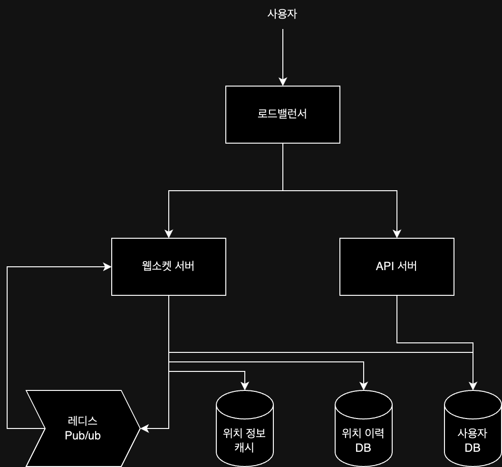

> 서비스 이용자 가운데 본인 위치 정보 접근 권한을 허락한 사용자에 한해 서로 근접한 위치에 있는 친구를 찾아주는 서비스

근접성 서비스와 비슷하다고 생각할 수도 있지만, 핵심 도메인인 "위치"가 정적인 노드에서 동적인 사용자로 변경되었다는 점에서 큰 차이가 있다.  
이러한 변경으로 인해 사용자의 위치 정보를 실시간으로 업데이트하고, 이를 기반으로 근접한 친구를 찾아주는 서비스가 필요하다.

## 요구 사항

- 주변 친구 조회 시, 거리 / 갱신된 시각 정보를 함께 제공
- 5km 이내 친구 목록 조회(수치는 변경 가능)
- 친구 목록은 30초마다 한 번씩 갱신
- 사용자 이동 이력 보관
- 두 사용자 사이의 거리는 직선거리로 계산
- 10분 이상 비활성 시 반경 조회 시 제외
- 평균적으로 한 사용자는 400명의 친구를 가짐

또한 이러한 기능을 지원하기 위해 아래의 사항들을 추가적으로 고려해야 한다.

- 낮은 지연시간: 주변 친구를 빠르게 조회할 수 있어야 함
- 안정성: 전반적으로 안정적으로 제공하되, 약간의 데이터 유실은 허용
- 결과적 일관성: 위치 데이터를 저장하기 위해 강한 일관성을 요구하지 않음

### 개략적 규모 추정

1억명 이상의 활성 사용자, 동시 접속 사용자 10%, 평균적으로 400명의 친구를 가진다고 가정했을 때 다음과 같은 규모를 가정할 수 있다.

- 동시 접속 사용자: 1억 * 10% = 1천만명
- QPS: 1천만 / 30초 = 333,333QPS

## 개략적 설계

단말기끼리 P2P 통신을 생각해볼 수도 있지만, 각 모바일 단말은 연결 상태가 좋지 앟은 경우가 많고, 이로 인해 서버를 통한 중계가 필요하다.  
백엔드 서버는 기능을 제공하기 위해 아래의 컴포넌트들로 구성해볼 수 있다.

- 로드밸런서: 유입 트래픽을 자동으로 알맞은 서버로 분배
- API 서버: 통상적인 요청/응답 트래픽 처리
- 웹소켓 서버: 친구 위치 정보 변경을 실시간 처리하는 유상태 서버 클러스터
- 레디스 위치 정보 캐시: 활성 상태 사용자의 최근 위치 정보 캐싱
- 사용자 데이터베이스: 사용자 및 친구 관계 정보 저장
- 위치 이동 이력 데이터베이스: 사용자의 위치 변동 이력 저장
- 레디스 Pub/Sub 서버: 위치 정보가 갱신(Pub)되면, 해당 사용자의 친구 채널에 메시지 전달(Sub)

각 컴포넌트들로 주기적 위치 갱신을 처리하는 절차는 다음과 같다.

1. 모바일 클라이언트가 위치가 변경된 사실을 로드밸런서에 전송
2. 로드밸런서는 위치 변경 내역을 웹소켓 서버로 전달(3~5번 과정 병렬로 수행)
3. 웹소켓 서버는 해당 이벤트를 위치 이동 이력 데이터베이스에 저장
4. 웹소켓 서버는 새 위치를 위치 정보 캐시에 보관(TTL도 갱신) + 사용자의 위치 정보 저장
5. 웹소켓 서버는 레디스 Pub/Sub 서버의 해당 사용자 채널에 새 위치를 발행
6. 레디스 Pub/Sub 채널에 발행된 새로운 위치 변경 이벤트는 모든 구독자(사용자의 활성 친구들)에게 브로드캐스트
7. 메시지를 받은 웹소켓 서버는 새 위치를 보낸 사용자와 메시지를 받은 사용자 사이의 거리를 새로 계산

## 데이터 모델

각각의 데이터는 설계와 그 목적에 맞게 관계형 데이터베이스 또는 Redis와 같은 캐시 시스템에 저장할 수 있다.

- 사용자 정보
    - 관계형 데이터베이스에 저장
    - 많은 양의 데이터를 저장해야하기 때문에 샤딩 필요
- 현재 위치 정보
    - Redis 캐시에 저장
    - 사용자 id - {위도, 경도, 시각} 쌍으로 저장
    - Redis의 TTL 활용(활성 상태가 아닌 사용자 정보를 자동으로 삭제)
    - 사용자가 늘어나는 경우 샤딩을 통해 확장 가능
- 위치 이동 이력
    - 관계형 데이터베이스에 저장
    - 많은 양의 데이터를 저장해야하기 때문에 샤딩 필요

## 상세 설계

### 클라이언트 초기화

모바일 클라이언트가 기동되면 웹소켓 클러스터 내 서버 중 하나와 지속성 웹소켓 연결을 맺게된다.  
웹소켓 연결이 초기화되면 클라이언트는 해당 단말의 위치 정보를 전송하게되고, 그 정보를 받은 웹소켓 연결 핸들러는 다음 작업을 수행한다.

1. 위치 정보 캐시에 보관된 해당 사용자의 위치 갱신
2. 해당 위치 정보는 계산 과정에 이용되므로, 연결 핸들러 내 변수에 저장
3. 사용자 데이터베이스에 저장된 해당 사용자의 모든 친구 정보 조회
4. 위치 정보 캐시에 저장된 모든 친구의 위치를 한 번에 조회(만료된 데이터는 TTL에 의해 자동 삭제)
5. 모든 친구의 위치 정보를 받은 후, 해당 사용자와 친구 사이의 거리를 계산하여 클라이언트에 반환
6. 또한 웹소켓 서버는 각 친구의 레디스 Pub/Sub 채널을 구독하여, 사용자의 현재 위치를 전용 채널을 통해 모든 친구에게 전달

### 레디스 Pub/Sub 서버

친구의 위치 정보가 갱신되면 레디스 Pub/Sub을 통해 해당 사용자의 친구 채널에 메시지를 발행하게 된다.

1. 주변 친구 기능을 활용하는 모든 사용자에게 채널 하나씩 부여
2. 해당 기능을 사용하는 사용자가 서비스 시작(초기화) 시에 친구 상태와 관계 없이 모든 친구의 채널과 구독 관계 설정
    - 활성화 여부에 따라 구독 추가 및 중단의 작업을 할 필요가 없음
    - 모든 친구에 대해 채널을 생성하고 메시지를 전송하더라도, 소량의 메모리만 사용하기 때문에 부담이 적음(아키텍처 단순화)
    - 하지만 Pub/Sub 구독자에게 전송해야하는 메시지가 많아질 경우 CPU 부하가 증가할 수 있음

메모리는 큰 문제가 없지만, CPU 자원 문제가 발생할 수 있으므로, 이를 해결하기 위해 안정 해시를 사용하여 구독자를 여러 서버로 분산시키는 방법을 사용할 수 있다.

###### 참고자료

- [가상 면접 사례로 배우는 대규모 시스템 설계 기초 2](https://kobic.net/book/bookInfo/view.do?isbn=9788966264254)
