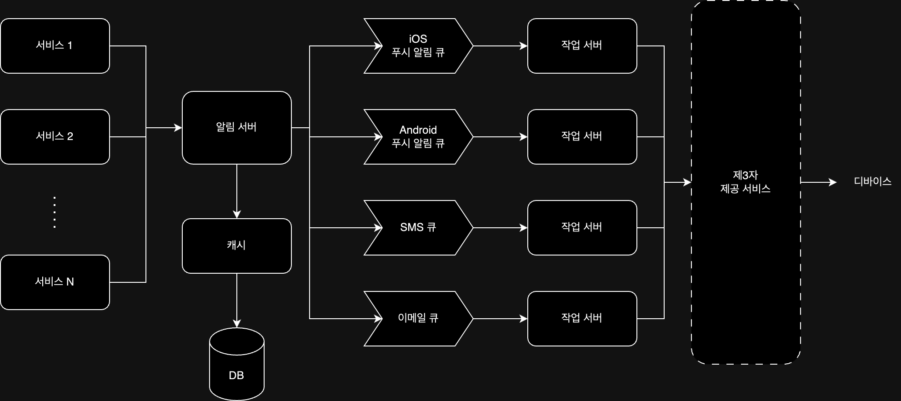

알림 시스템은 클라이언트에게 정보를 전달하는 시스템으로, 현대 서비스에서는 중요한 부분으로 자리 잡았다.  
알림 시스템은 모바일 푸시 알림 / SMS 메시지 / 이메일 세 가지로 분류해볼 수 있다.

## 요구 사항

- 푸시 알림 / SMS 메시지 / 이메일 알림 지원
- 가능한 빨리 전달되어야 하지만 높은 부하 시 약간의 지연은 무방한 연성 실시간(soft realtime) 시스템
- iOS / android / 웹 등 다양한 플랫폼 지원
- 서버 측 스케줄링과 클라이언트 애플리케이션에서 알림 생성
- 알림 수신 거부 기능
- 하루 1,000만 건의 푸시 알림 / 100만 건의 SMS 메시지 / 500만 건의 이메일 알림 전송

## 알림 유형별 지원 방안

- iOS 푸시 알림 / Android 푸시 알림: iOS와 Android 푸시 알림은 각각 APNS와 FCM을 사용한다.
    - `알림 제공자 -> APNS / FCM -> 디바이스` 순으로 전달하게 된다.
- SMS 메시지: 트윌리오 / 넥스모 같은 제 3사업자의 서비스를 많이 이용
- 이메일: 고유 이메일 서버를 구축할 수도 있지만, 안정성과 데이터분석 서비스를 위해 Sendgrid / Mailchimp 같은 서비스도 많이 이용

## 연락처 정보 수집 절차

알림을 전송하기 위해선 모바일 단말 토큰 / 전화번호 / 이메일 등의 정보가 필요하다.  
해당 정보를 수집하기 위해서 사용자가 앱을 설치하거나 계정을 등록하면 API 서버에서 해당 정보를 데이터베이스에 저장한다.

## 알림 전송 및 수신 절차

개략적인 플로우는 `알림 생성 서비스 -> 알림 시스템 -> 서드파티 서비스 -> 디바이스` 순으로 전달될 수 있다.

- 알림 생성 서비스(여러 개일 수 있음): 마이크로서비스 형태거나, 크론잡 등등 알림을 생성하는 서비스
- 알림 시스템: 알림 생성 서비스에서 생성된 알림을 받아서 전송하는 서비스
- 서드파티 서비스: 알림을 실제로 전달하는 역할을 하는 서비스(APNS / FCM / 트윌리오 / 넥스모 / Sendgrid / Mailchimp 등)
- 디바이스: 알림을 받는 디바이스

여기서 알림 시스템을 하나의 서비스로 구현할 수도 있지만, 아래의 이유로 분리하는 것이 좋다.

- SPOF(Single Point of Failure): 알림 시스템이 다운되면 알림 전송 중단 가능성 존재
- 성능 병목: 알림 처리 시 리소스가 많이 필요한 경우, 시스템 과부하 가능성 존재
- 규모 확장성: 한 대의 서비스로 모든 트래픽을 처리하기 힘들어 지는 것을 대비하여, 데이터베이스나 캐시 등 중요 컴포넌트 규모 확장 방법 고려

## 알림 시스템 설계

위의 문제점을 해결하기 위해 다음과 같은 방향으로 개선해 볼 수 있다.

- 데이터베이스와 캐시를 알림 시스템의 주 서버에서 분리
- 알림 서버를 증설하고 자동으로 수평적 규모 확장이 가능하도록 설계
- 메시지 큐를 이용해 시스템 컴포넌트 사이 강한 결함을 줄임(de-coupling)

각 컴포넌트는 다음과 같은 역할을 수행한다.

- 알림 서버
    - 알림 전송 API 제공: 서비스에서 알림을 생성하고 전송할 수 있도록 API 제공
    - 알림 검증: 이메일 / 전화번호 등 기본적인 검증 수행
    - 데이터베이스 or 캐시 질의: 알림에 포함시킬 데이터 조회
    - 알림 전송: 알림 데이터를 메시지 큐에 전달
- 캐시: 사용자 정보 / 단말 정보 / 알림 템플릿 등 캐싱
- 데이터베이스: 사용자 정보 / 알림 / 설정 등 다양한 정보 저장
- 메시지 큐: 시스템 컴포넌트 간 의존성 제거를 위해 사용, 대량 알림이 전송되어야 하는 경우 대비한 버퍼 역할도 수행
- 작업 서버: 메시지 큐에서 전송할 알림을 꺼내 서드파티 서비스로 전달하는 역할 수행

결과적으로 알림 시스템은 다음과 같이 동작하게 된다.

1. API를 호출하여 알림 서버로 알림 전송
2. 알림 서버는 사용자 정보 / 단말 토큰 / 알림 설정 같은 메타데이터를 캐시나 데이터베이스에서 조회
3. 알림 서버는 전송할 알림에 맞는 이벤트를 생성해 해당 이벤트를 위한 큐에 전달
4. 작업 서버는 메시지 큐에서 알림 이벤트를 꺼내 서드파티 서비스로 전달
5. 서드파티 서비스에서 디바이스로 실제 알림 전송

### 안정성

- 데이터 손실 방지
    - 알림이 지연되거나 순서가 뒤바뀌는 것은 큰 문제가 되지 않을 수 있지만, 알림이 전송되지 않는 것은 큰 문제가 될 수 있음
    - 이를 위해 알림 데이터를 데이터베이스에 보관하고 재시도 메커니즘 필요
- 알림 중복 전송 방지
    - 완벽하게 중복을 방지하는 것은 불가능하는 것에 가깝지만, 중복 전송을 최소화 해야 함
    - 이벤트 ID 검사하는 방식 등 중복 방지 로직 추가 필요

## 추가 고려 사항

- 알림 템플릿: 대부분 형식이 비슷하기 때문에 템플릿을 사용해 알림을 생성하는 것이 효율적일 수 있음
- 알림 설정: 사용자의 알림 설정을 보관하기 위해 알림 설정 테이블을 두어 사용자가 알림을 받을지 여부를 설정할 수 있도록 함
- 재시도 방법: 서드파티 서비스에서 알림 전송 실패 시 해당 알림을 재시도 전용 큐에 넣어 재시도하는 방법을 사용
- 보안: iOS / Android 경우 특정 키를 사용해 승인된 클라이언트만 알림을 보낼 수 있는데, 다른 클라이언트(SMS / 이메일)도 같은 방법으로 보안을 강화할 수 있음
- 큐 모니터링: 특정 큐에 쌓인 이벤트가 너무 많아지면(빠르게 처리 못하고 있음) 시스템에 영향을 줄 수 있으므로 큐 모니터링이 필요

###### 참고자료

- [가상 면접 사례로 배우는 대규모 시스템 설계 기초](https://kobic.net/book/bookInfo/view.do?isbn=9788966263158)
